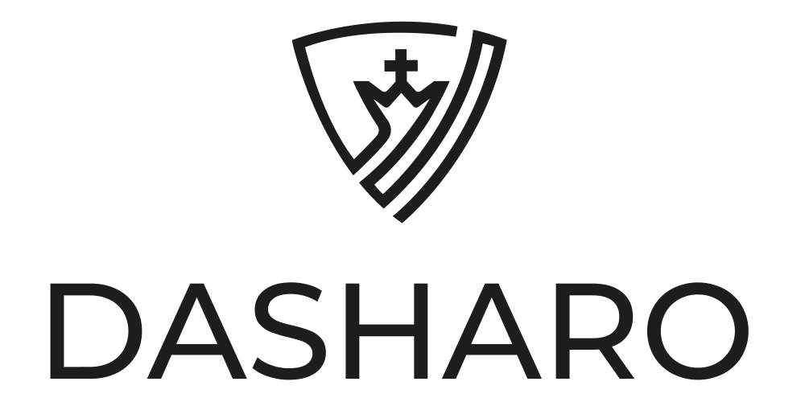

## About

A new kind of BIOS firmware that will solve the problems of ownership, security
and compatibility allowing you create secure, efficient images that are fully
customizable to your tastes and needs.

[Dasharo homepage](https://dasharo.com/)

## Variants

* [Dasharo Workstation](variants/workstation.md)
* [Dasharo Secure Firewall](variants/secure-firewall.md)
* [Dasharo Trustworthy Server](variants/trustworthy-server.md)
