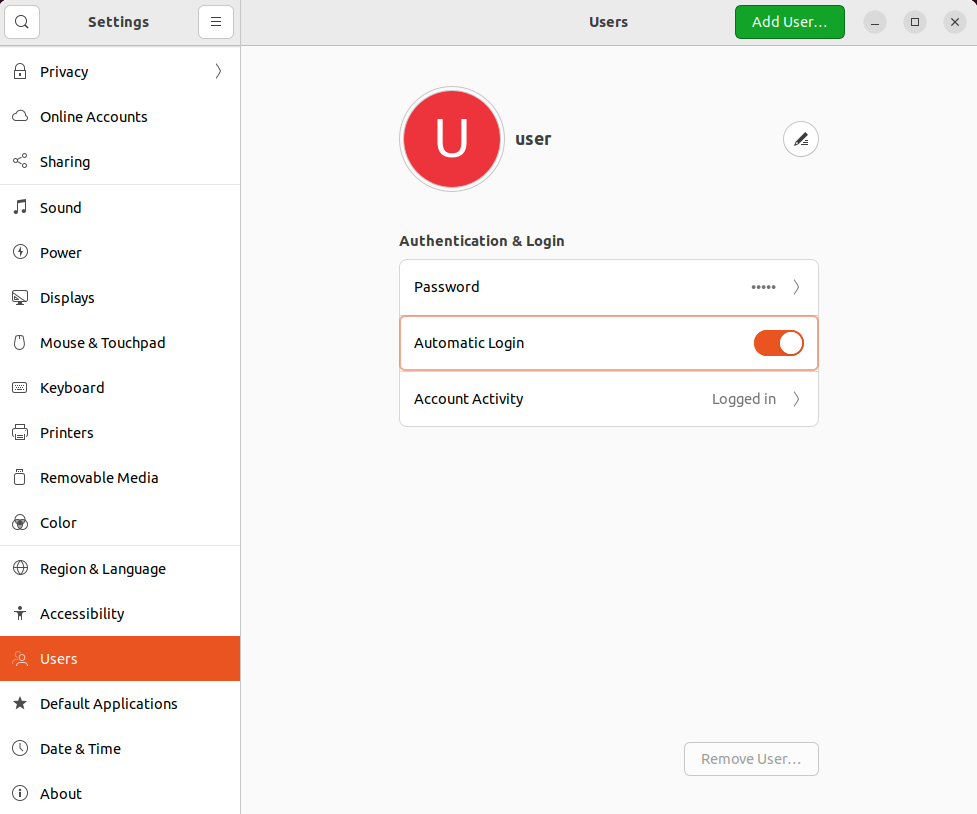

# Checkbox usage (Ubuntu 22.04)

## Introduction

[Checkbox](https://checkbox.readthedocs.io/en/latest/) is a flexible test 
automation software. It’s the main tool used in Ubuntu Certification program.
This document describes the usage of Checkbox on Ubuntu 22.04, but it can work
on older versions of Ubuntu as well.

## Prerequisites

To run the maximum number of tests, it is advised to connect as many peripheral
devices as possible. Before running the checkbox, connect peripherals to
available connectors, such as:

External:

* card reader
* USB ports
* display ports
* Ethernet ports
* headphone and microphone jacks
* Thunderbolt ports
* power supply and battery
* PCMCIA or ExpressCard slot

Internal:

* DIMM/RAM slots
* SATA ports
* PCI/PCIe slots
* M.2 slots
* TPM header
* other slots

## Set up the testing environment

For the tests that don't require any interference after their startup,
perform the following steps:

To stop the screen from being locked on suspend, open the terminal and run the
following command:

```bash
 gsettings set org.gnome.desktop.lockdown disable-lock-screen 'true'
```

To execute all `sudo` commands without a password, open the terminal and
run the following command for a user:

```bash
echo "user ALL=(ALL:ALL) NOPASSWD: ALL" | sudo tee /etc/sudoers.d/user
```

To set up automatic login so that a password is not required during testing
reboot, power off etc.:

1. Press the `SUPER_KEY`, type in `Users` and click Enter. A window with 
    options to change should appear.
1. Click the user name you want to enable automatic login for.
1. On the top right side of the window, click `Unlock`...` button.
1. You will be asked to enter your user password to continue.
1. You should now be able to toggle the `Automatic Login` button to enable it.
1. Restart your system for changes to take effect.



## Download and install Checkbox

1. Disable Secure Boot. To do this you can follow the steps described in
   [Secure Boot test](https://docs.dasharo.com/unified-test-documentation/dasharo-security/206-secure-boot/).

    > Disable Secure boot is required to properly download packages.

1. Open the terminal and type in the below commands to install Checkbox and all
    its dependencies:

    ```bash
    sudo add-apt-repository ppa:hardware-certification/public
    sudo apt-get update
    sudo apt-get install checkbox-ng plainbox-provider-resource-generic \
    plainbox-provider-certification-client plainbox-provider-checkbox \
    canonical-certification-client
    ```

## Run automatic validation

1. Start checkbox. To do this, open the terminal and run the following command:

    ```bash
    sudo checkbox-cli
    ```

    After using the above-mentioned command, the following menu should appear:

    ```bash
    ┌──────────────────────────────────────────────────────────────────────────────┐
    │    (X) (Deprecated) Fully Automatic Client Certification Tests               │
    │    ( ) After suspend Dock Cert blocker tests                                 │
    │    ( ) After suspend Dock Cert tests                                         │
    │    ( ) After suspend Dock Hot-plug Cert tests                                │
    │    ( ) After suspend Dock Hot-plug tests                                     │
    │    ( ) After suspend LED and oops tests (using special sleep key)            │
    │    ( ) After suspend LED and oops tests (using special sleep key, cert.      │
    │        blockers only)                                                        │
    │    ( ) After suspend automated USB 3 write/read/compare tests on storage     │
    │        devices                                                               │
    │    ( ) After suspend automated USB write/read/compare tests on storage       │
    │        devices                                                               │
    │    ( ) After suspend reference tests                                         │
    │    ( ) After suspend reference tests (automated)                             │
    │    ( ) After suspend reference tests (certification blockers only)           │
    │    ( ) After suspend tests (discrete GPU automated)                          │
    │    ( ) After suspend tests (discrete GPU manual)                             │
    │    ( ) After suspend tests (discrete GPU)                                    │
    │    ( ) After suspend tests (discrete GPU, certification blockers only)       |
            .
            .
            . etc.
    └──────────────────────────────────────────────────────────────────────────────┘
    ```

    > Marking the first option starts the full automate check.

1. Select test suites (`SPACE` - select, `ARROWS` - navigation, `Enter` -
go to the next test suite), which you want to run. Marking the first option
starts the full automated check. After selecting the first option, all modules
should be displayed and you can manually uncheck some modules, which you don't
want to test.

    ```bash
    ┌──────────────────────────────────────────────────────────────────────────────┐
    │[X] + Audio tests                                                             │
    │[X] + Benchmarks tests                                                        │
    │[X] + Bluetooth tests                                                         │
    │[X] + CPU tests                                                               │
    │[X] + Camera tests                                                            │
    │[X] + Disk tests                                                              │
    │[X] + Ethernet Device tests                                                   │
    │[X] + Firmware tests                                                          │
    │[X] + Graphics tests                                                          │
    │[X] + Informational tests                                                     │
    │[X] + Input Devices tests                                                     │
    │[X] + Memory tests                                                            │
    │[X] + Miscellaneous tests                                                     │
    │[X] + Mobile broadband tests                                                  │
    │[X] + Non-device specific networking tests                                    │
    │[X] + Optical Drive tests                                                     │
    │[X] + Power Management tests                                                  │
    │[X] + Suspend tests                                                           │
    │[X] + TPM 2.0 (Trusted Platform Module)                                       │
    │[X] + Touchpad tests                                                          │
            .
            .
            . etc.
    └──────────────────────────────────────────────────────────────────────────────┘
    ```

1. Press `T` to start the testing procedure.
1. You might be asked about the hardware in your machine. Just tick it 
    truthfully and press `T` again.

    ```bash
    ┌──────────────────────────────────────────────────────────────────────────────┐
    │Does this machine have this piece of hardware?                                │
    │    An Ethernet Port                              (X) YES  ( ) NO             │
    │    Camera/Capture Device                         (X) YES  ( ) NO             │
    │    USB Storage Device Connected                  (X) YES  ( ) NO             │
    └──────────────────────────────────────────────────────────────────────────────┘
    ```

1. When testing ends, a menu with test results should appear. Press `R` to rerun
test cases, or `F` to finish.

1. After all, paths to the test results should be displayed in the terminal.
By default, they are placed in `/home/user/.local/share/checkbox-ng`.

## Additional options

1. `run` lets you run a particular test plan or a set of jobs, but it does save
any results. Example of running one test plan:

    ```bash
    sudo checkbox-cli run com.canonical.certification::smoke
    ```

2. `launcher` command lets you customize the checkbox experience. To use it, you
   need to create `config_file.ini` and start running the checkbox like below:

    ```bash
    checkbox-cli launcher config_file.ini
    ```

For more details about these (and others) commands visit
[checkbox-cli](https://checkbox.readthedocs.io/en/latest/using.html#).

## Troubleshooting

When somehow the checkbox stop working you can resume the previous session.
To do this, open the terminal and run the following command:

```bash
sudo checkbox-cli
```

If at least one incomplete session is present on the machine, you should see:

```bash
 Do you want to resume session 'session_title-2022-07-06T13.09.22'?
  r => resume this session
  n => next session
  c => create new session
  d => delete old sessions
[rncd]:
```

Type in `r` to resume the stopped session. You can also create a new session or
delete an old session by typing the appropriate letter.

```bash
What do you want to do with that job?
  s => skip that job
  p => mark it as passed and continue
  f => mark it as failed and continue
  r => run it
[spfr]:
```

Decide what you want to do with the last test and type the appropriate letter.
After this, your checkbox session will be resumed.
