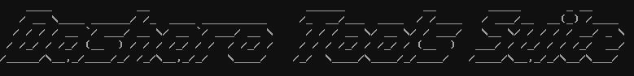
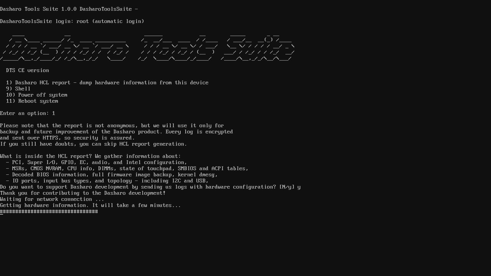

# Dasharo Tools Suite



## Introduction

Dasharo Tools Suite (DTS) is a set of tools running in a minimal Linux
environment, with a goal of deploying, updating and maintaining firmware on
Dasharo supported devices. For example, it can be used to update the firmware
on a device, even when no OS is currently installed.

## Flavors

There is a common base, but there might be multiple flavors of the DTS images.
Currently, there are:

* CE - Community Edition
    - `Dasharo HCL Report` - generates a package with logs containing hardware
      information
    - flashrom, fwupd, and many more useful tools
    - can drop to shell to update the firmware manually
* OEM
    - on top of that, provides tools for automatic firmware deployment and
      rollback (switching to Dasharo back and forth)

## Releases

This section provide links and changelogs of DTS CE version started from release
v1.0.0.

### v1.0.0

#### Images

* [USB bootable DTS CE v1.0.0 image](https://3mdeb.com/open-source-firmware/DTS/v1.0.0/dts-base-image-ce-v1.0.0.wic.gz)
* [sha256](https://3mdeb.com/open-source-firmware/DTS/v1.0.0/dts-base-image-ce-v1.0.0.wic.gz.sha256)

  ```bash
  # assuming all files have been downloaded to the same directory without
  # changing names
  sha256sum -c [sha256 file]
  ```

#### Changelog

* Auto-login functionality
* User menu
* [Dasharo HCL Report](#dasharo-hcl-report) - the ability to automatically dump
  device information and send it to 3mdeb servers
* Possibility to manually [update the Dasharo firmware](#dasharo-firmware-update)
* [Bootable via iPXE](#bootable-over-network)
* [Bootable via USB](#bootable-usb-stick)
* Tested on NovaCustom NV4x, Dell OptiPlex 7010/9010

## Distribution methods

It can be distributed in various ways. Currently, there are two distribution
options:

* bootable USB stick image,
* bootable over network (iPXE).

## Bootable USB stick

This section describes how to boot DTS using USB stick.

### Requirements

* USB stick (at least 2GB)
* Wired network connection
* [Secure Boot disabled](#common-requirements-disabling-secure-boot)
* Latest image from [releases](#releases) section

### Launching DTS

To access Dasharo Tools Suite:

* flash the downloaded image onto USB stick,
    - you can use cross-platform GUI installer - [Etcher](https://www.balena.io/etcher/)
    - you can also use `dd` to flash from command line

```bash
gzip -cdk dts-base-image-ce-v1.0.0.wic.gz | \
sudo dd of=/dev/sdX bs=16M status=progress conv=fdatasync
```

> Note: this is an example for v1.0.0 image.

* insert the USB stick to a USB in your device,
* boot from the USB stick,
* the DTS menu will now appear.

## Bootable over network

This section describes how to boot DTS using iPXE.

### Requirements

* Dasharo device with DTS functionality integrated
* Wired network connection
* [Secure Boot disabled](#common-requirements-disabling-secure-boot)

### Launching DTS

To access Dasharo Tools Suite:

* attach a wired network cable to the device's Ethernet port,
* power on the device, holding down the Boot Menu entry key,
* in the Boot Menu, select the `iPXE Network Boot` option,
* in the Network Boot menu, select the `Dasharo Tools Suite` option,
* the DTS menu will now appear.

## Common requirements - disabling Secure Boot

Any procedure which affects the firmware should be preceded by controlling
the Secure Boot status and if it is turned on, turning it off. The enabled
Secure Boot will not only prevent you from operating on the firmware, but
you will also not be able to launch DTS.

To check the Secure Boot state:

1. Turn off the station, on which you want to test the Dasharo firmware.
1. Turn the station on and go to the next step immediately.
1. Hold the `BIOS SETUP KEY` to enter the `BIOS MENU`.
1. Localize and enter the `Secure Boot` menu using the arrow keys and Enter.
1. Verify that the `Secure Boot Status` field says `Disabled` - if not,
  deselect the `Enforce Secure Boot` option using the arrow keys and Enter.
1. Change the setting of Secure Boot to `Disabled` and press Enter.
1. Press the `F10` key to open the dialog box.
1. Press `Enter` to confirm changes and exit from the menu.

After completing the steps described above, Secure Boot should be disabled.
You could confirm that by repeating steps 3 - 5.

## DTS CE functionality

This section describes functionality of Dasharo Tools Suite in Community
Edition. These are:

* Dasharo HCL Report,
* Dasharo firmware update.

## Dasharo HCL Report

DTS allows to generate a package with logs containing hardware information. To
create one, choose option number 1 and check out the disclaimer. If you would
like to send the report to our servers, please remember about connecting the
ethernet cable.



## Dasharo firmware update

Within DTS, you may use the `flashrom` and `fwupdmgr` utilities to update,
downgrade, or reinstall your firmware.

To update your firmware to the latest version first choose option number 9 to
drop to Shell and run:

```bash
fwupdmgr refresh
fwupdmgr update
```

## Reporting issues

Thank you for using Dasharo Tools Suite Community Edition. If you have
encountered any problems with this version, or would like to provide feedback
for us - please open an issue on [Dasharo
issues](https://github.com/Dasharo/dasharo-issues).
