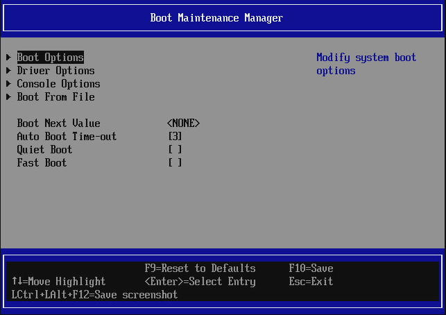
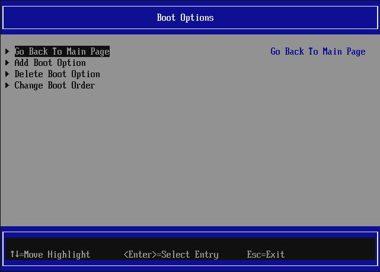
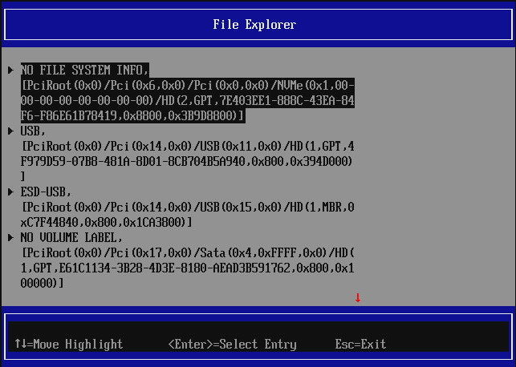
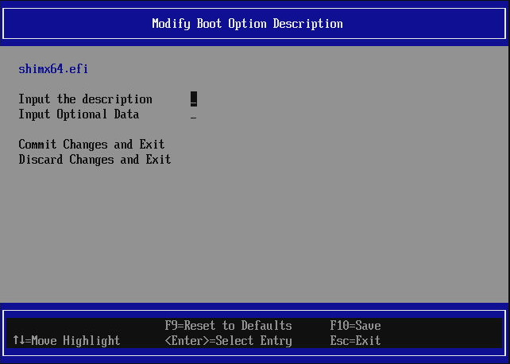
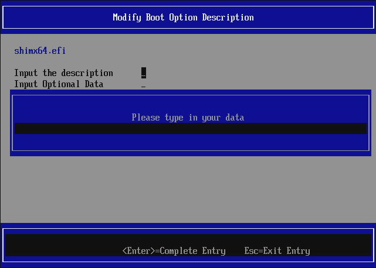
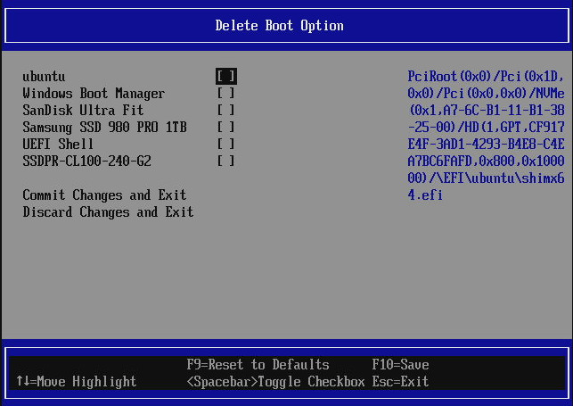
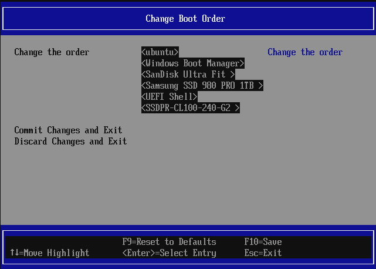
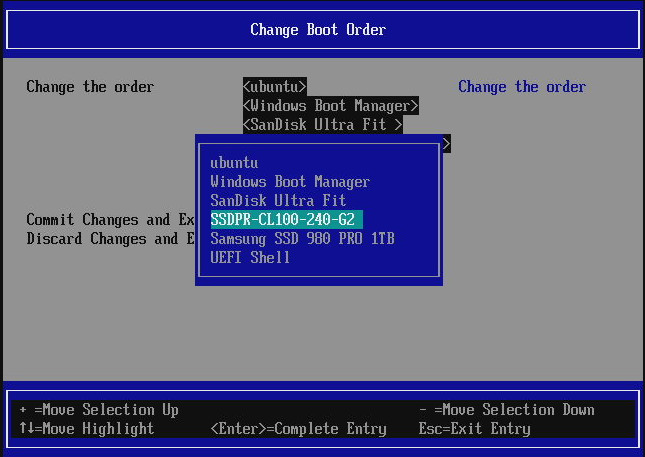
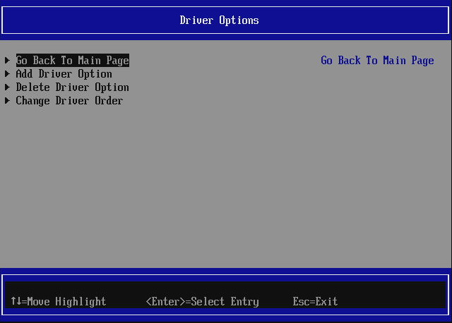
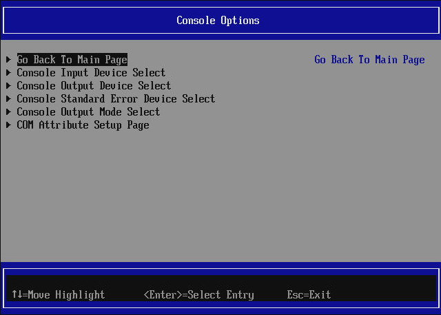

# Boot Maintenance Manager

Boot Maintenance Manager is mainly used to manage boot options, boot timeout,
next boot variable, console inputs and outputs. It also provides a way to add
driver options, but it is rather rarely used.

{ class="center" }

* `Boot Next Value` is used to set which boot options should be booted after a
  reboot. This setting is not permanent and works only after the first reboot,
  then it defaults back to `None`.
* `Auto Boot Time-out` is used to specify the timeout in seconds how long the
  firmware should wait for hotkey to enter setup menu or [Boot Manager Menu](overview.md#boot-manager-menu)
  before booting the first priority according to boot order or
  `Boot Next Value` (if it was set before reset)
* `Quiet Boot` - suppresses the boot prompt and progress bar from being
  printed on the screen resulting in a smooth graphical experience during boot
  by displaying the logo only.
* `Fast Boot` - limits the hardware initialization to necessary minimum to
  improve the boot time performance. Input consoles become available only on
  demand (e.g. when entering setup or OS bootloader or any EFI application
  which attempts to read key strokes), meaning it will not be possible to
  enter setup or boot manager menu using hotkeys. The auto boot timeout
  becomes 0 seconds. Only VGA OptionROMs are being executed (if OptionROMs are
  enabled). Only FAT filesystem driver is available. Making screenshots is not
  possible. Also behaves like quiet boot. The only ways to disable fast boot
  are:
    - changing the fast boot EFI variable from OS to 0/false (on Linux using
      `efivarfs` or PowerShell on Windows with [3rd party PowerShell
      modules](https://www.powershellgallery.com/packages/UEFIv2))
    - requesting to enter the Setup from OS
        * Linux: using `UEFI Firmware Settings` entry in GRUB menu, or setting
         `Boot Next` to enter Setup on next boot using `efibootmgr`, then
         disabling the option in the setup
        * Windows: through [Windows Recovery
          Environment](https://support.microsoft.com/en-us/windows/windows-recovery-environment-0eb14733-6301-41cb-8d26-06a12b42770b)
          -> `Troubleshooting` -> `UEFI Firmware Settings` or Windows Power
          Shell command `shutdown /r /fw` as admin, then disabling the
          option in the setup

## Boot Options

This submenu allows to manipulate the boot order and boot options in general:

{ class="center" }

## Add Boot Option

When selecting to add a boot option, file explorer appears where one has to
navigate to the desired disk, partition and file which shall be executed if the
boot options is selected:

{ class="center" }

NOTE: only EFI files may be used. If the file is already selected a window to
set the boot option name appears:

{ class="center" }

To set the name press `ENTER` to activate the prompt:

{ class="center" }

Confirm the name (it must not be too short) with `ENTER` and then
`Commit Changes and Exit`. From now on the boot options should appear on the
boot options list in the [Boot Manager Menu](overview.md#boot-manager-menu)
and [One Time Boot](overview.md#one-time-boot) menu.

## Delete Boot Option

To delete boot options, enter `Delete Boot Option` submenu.

{ class="center" }

Select the checkboxes which options should be removed and then
`Commit Changes and Exit`. From now on the deleted boot options should not
appear on the boot options list in the [Boot Manager Menu](overview.md#boot-manager-menu)
and [One Time Boot](overview.md#one-time-boot) menu. Note that some boot
options are auto-registered during boot, e.g. UEFI Shell, iPXE, or
disks that contains `/EFI/BOOT/BOOTX64.EFI` file on their FAT32 partitions.
To disable iPXE auto-registering, disable [Network Boot](dasharo-system-features.md#networking-options)
in [Dasharo System Features](dasharo-system-features.md) menu.

## Change Boot Order

Boot Maintenance Manage also allows to change the boot order of the devices.
PLease note that the boot order may be changed only for currently detected and
registered boot options and devices. Dasharo does not yet provide fixed boot
order options per interface, e.g. prioritize USB over NVMe or SATA, etc.

{ class="center" }

To move the boot options priority, press `ENTER` when selecting the boot
options list. A popup windows with the entries should show up. Use `+` and `-`
on the hovered item to move it up and down, use arrows to change hovered item.

{ class="center" }

If you are satisfied with the order you set, press `ENTER` to confirm it and
then `Commit Changes and Exit`. The boot order should be immediately applied,
it can be checked on the boot options list in the [Boot Manager Menu](overview.md#boot-manager-menu)
and [One Time Boot](overview.md#one-time-boot) menu.

## Driver Options

This menu is used to load additional drivers. It is used very rarely so it is
not described in detail.

{ class="center" }

## Console Options

This menu is used to manipulate EFI console variable. Typically there is no need
to use it.

{ class="center" }

Here one may enable/disable input and output devices. Please note that most
output and input devices devices are registered automatically during boot.
Changes made here will only last till next reboot. To permanently disable
certain inputs one may use different setup options:

* USB keyboard input may be disabled by [disabling whole USB stack](dasharo-system-features.md#usb-configuration)
* PS/2 keyboard input may be disabled by [disabling PS/2 controller](dasharo-system-features.md#chipset-configuration)

**WARNING**: Dasharo does not yet implement any check if at least one keyboard
is plugged and working. If you disable both USB stack and PS/2 controller you
will not be able to control firmware boot flow (so unable to enter setup or
choose boot option via Boot Manager or even enable back the keyboard inputs).

## Boot From File

This submenu allows one to boot an arbitrary EFI file from one of the disk
partitions. Selecting the entry will open the File Explorer (similarly like
when adding a boot option) and one has to navigate to the file desired to be
executed and press ENTER.
