# Dasharo System Features

When entering the `Dasharo System Features` menu, one may see the following
submenus to appear:

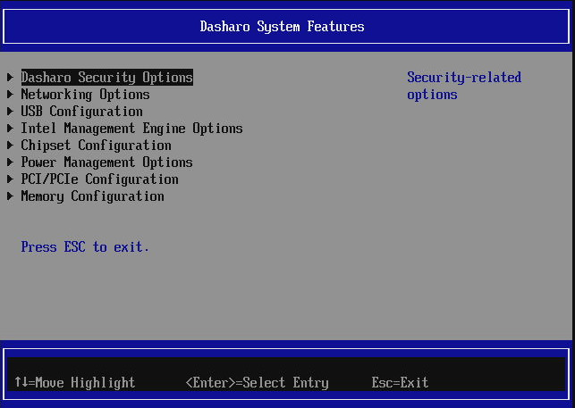{ class="center" }

## Dasharo Security Options

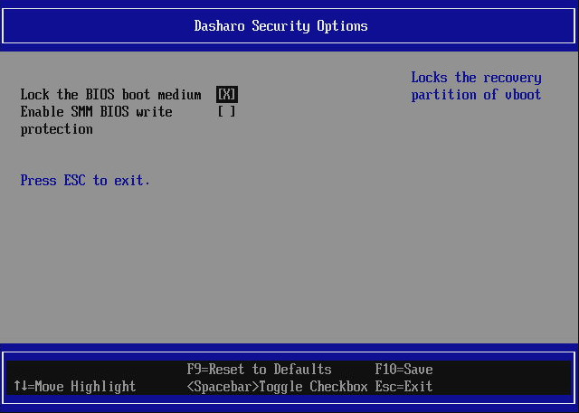{ class="center" }

This menu offers security-sensitive options like:

- `BIOS boot medium lock` - enables/disables flash protection on the vboot
  recovery firmware partition. Disable it if you need access to whole flash
  with flashrom.
- `Enable SMM BIOS write protection` - when enabled, allows only SMM code (the
  privileged code installed by the firmware in the system memory) to write to
  BIOS flash. Recommended to be enabled if [Firmware setup password](overview.md#user-password-management)
  is set. Disable the protection if you need access to flash with flashrom.
- `Boot menu enabled` - enables/disables ability to enter boot manager menu.
  Enabled by default. Can be disabled, to prevent from booting from non-default
  boot media.
- `Early boot DMA Protection` - Enables IOMMU DMA protection early during POST.
  DMA protection is a feature that utilizes the IOMMU early in the boot process
  to prevent rogue DMA-capable devices such as PCIe add-in cards,
  USB4/thunderbolt devices from access to memory. This prevents a class of DMA
  attacks that allow for exfiltration of secrets and installation of malware
  early in the boot process.
- `Keep IOMMU enabled when transfer control to OS` - (only available when
  `Early boot DMA Protection` is selected) Keeps IOMMU DMA protection enabled
  during ExitBootServices when control is passed to the OS. If unsure or see any
  problems with DMA/IOMMU during OS boot, keep it disabled.
  NOTE: Windows may not boot if the option is enabled.
- `Enter Firmware Update Mode` - when selected, causes the platform to reset
  and disable all firmware protections, including UEFI Secure Boot, for the
  duration of one boot. The goal of the option is to simplify the update
  process for the end user. Unsetting multiple security options and then
  setting them back can be tiresome.
- `Enable Wi-Fi + BT radios` - (applicable to laptops) - Enables or disables
  radios for Wi-Fi and Bluetooth. When disabled, the slot is unconfigured and
  power to the wireless module is disconnected.
- `Enable Camera` - (applicable to laptops) - Enables or disables the integrated
  camera. When disabled, power to the camera is disconnected and the camera can
  not be enabled using the keyboard camera hotkey from the OS.

## Networking Options

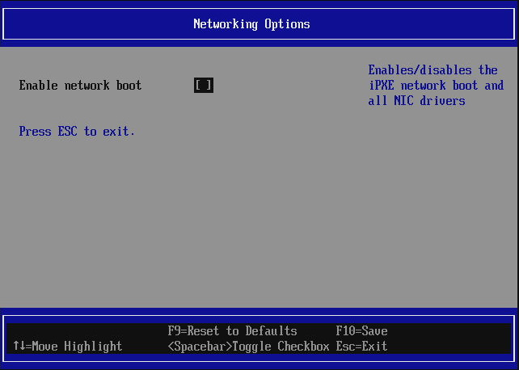{ class="center" }

- `Enable network boot` - the option controls if the network boot should be
  enabled or not. This option is disabled by default on most Dasharo supported
  devices. When disabled, it prevents loading network controller drivers and
  unregisters iPXE as boot option (iPXE disappears from
  [Boot Manager](overview.md#boot-manager-menu) and
  [One Time Boot](overview.md#one-time-boot) menus)

## USB Configuration

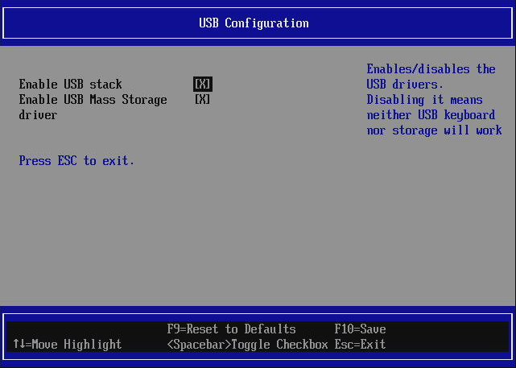{ class="center" }

- `Enable USB stack` - controls loading of UEFI USB drivers, when enabled all
  USB drivers are loaded making USB keyboards and mass storage drives
  functional in the firmware (to browse setup, press hotkeys or move around
  bootloaders like GRUB). If disabled no USB device will work before OS is
  loaded (firmware will not communicate with USB devices).
- `Enable USB Mass Storage driver` - this option is blocked if USB stack is
  disabled. If disabled, UEFI USB Mass Storage driver is not loaded and one
  cannot boot from USB drives. Essentially this option controls the USB boot
  capability. It does not affect other devices, like USB keyboards.

## Intel Management Engine Options

This submenu is used to access Intel Management Engine related options.
Currently the only option available is `Intel ME mode` which allows to enable
or disable Management Engine:

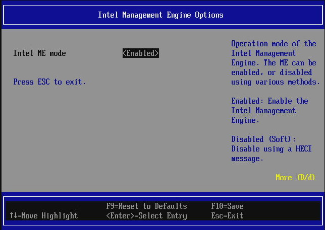{ class="center" }

On the right side of the window there is a help section describing the option
meaning. If the window is too small, the help section may be divided and not
fully shown on the screen. To scroll the help section use `D` or `d` keys to
scroll down and `U` or `u` to scroll up.

Intel ME can be disabled in two ways:

- `Disabled (Soft)` - when set, causes the Dasharo firmware to send
  `ME_DISABLE` command via MEI/HECI. MEI/HECI interface is being hidden from OS
  when ME is disabled.
- `Disabled (HAP)` - when set, causes the Dasharo firmware to set HAP bit in
  the flash descriptor. MEI/HECI interface is being hidden from OS when ME is
  disabled. HAP method is much more efficient as it halts the ME firmware
  execution even earlier than Soft Disable described above

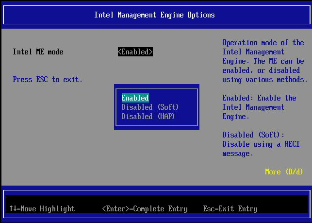{ class="center" }

When the mode is set to `Enabled`, Dasharo enables the Intel Management engine
by either sending `ME_ENABLE` command via MEI/HECI or clearing the HAP bit in
flash descriptor, depending on the previously active ME mode. MEI/HECI device
should be functional in OS when ME is enabled.

Any change in the Dasharo firmware setup requires saving the changes and a
platform reset (unless specified otherwise).

For more information about neutering and disabling ME see also
[me_cleaner](https://github.com/corna/me_cleaner).

NOTE: [me_cleaner](https://github.com/corna/me_cleaner) is not supported on all
platforms! If a platform supports [me_cleaner](https://github.com/corna/me_cleaner)
(i.e. ME version is lower or equal 11.x) it is recommended to set HAP bit and
clean the ME region with `me_cleaner` script permanently.

## Chipset Configuration

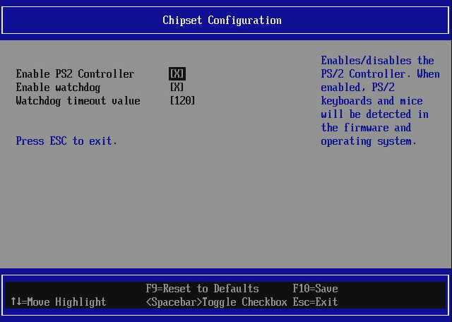{ class="center" }

The submenu contains general chipset options. Currently available options:

- `Enable PS/2 controller` - enables/disables PS/2 controller on the platform.
  When disabled PS/2 keyboards and mice will stop working in firmware and OS.
  PS/2 controller will not be functional in OS. This option is not available on
  laptops where PS/2 is used for the integrated keyboard and possibly touchpad.
- `Enable watchdog` - controls the chipset watchdog functionality. The watchdog
  is useful when a platform hangs and needs to be reset automatically, which
  will happen if watchdog timer expires. Minimum timeout is 5 minutes to let the
  OS take control over the watchdog (e.g. wdat_wdt watchdog driver for Linux)
  and keep reloading it to avoid resets.

  > Earlier firmware versions kick the watchdog automatically. Releases after
  > 15.03.2024 expose the watchdog to the OS to update it instead.

- `Watchdog timeout value` - watchdog timeout in seconds. Allowed range is
  300-1024 seconds. Once the OS takes control of the watchdog, the timeout can
  be configured as low as 1 second. The option is only visible if watchdog is
  set to enabled.

## Power Management Options

The submenu contains general power management options.

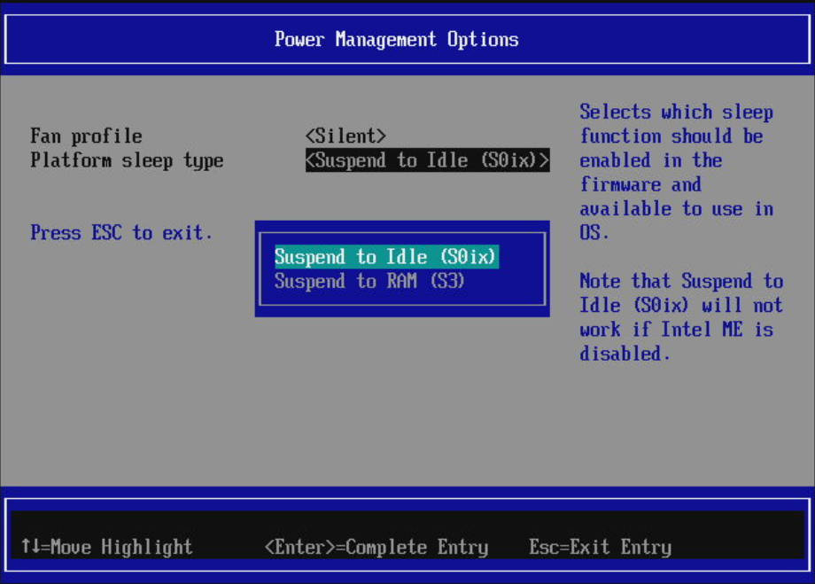{ class="center" }

Currently available options:

- `Fan profile` - Sets of the fan operation modes (defaults to `Silent`):
    + `Silent` - the fan will operate at lower speeds to reduce noise,
    + `Performance` - the fan will operate at higher speeds, to allow for
       increased performance.
- `Platform sleep type` - sets the active sleep mode to be available for OS
    + `Suspend to Idle (S0ix)` (default) - also known as modern standby. Select
      this option if using Windows. S3 sleep mode may not be working well with
      Windows for machines newer than 11th generation Intel Core processors.
      S0ix will not work properly if ME is disabled.
    + `Suspend to RAM (S3)` - standard sleep mode that suspends the machine
      state to RAM, supported on most operating systems (except Windows on 11th
      generation Intel Core processors or newer).
      > Note: On some devices, S3 support is considered experimental. On these
      > devices, the option will be marked as such.
- `Battery Start Threshold` - The value set by this option represents the
percentage of battery power; if it is above this value, the DUT won't start
charging. If the DUT has started charging before this level, it will not stop
until the battery stop threshold is reached.
- `Battery Stop Threshold` - the value set by this option represents the
percentage of battery power that the device will never exceed - it will
stop charging.

Flow chart for the two settings mentioned above:

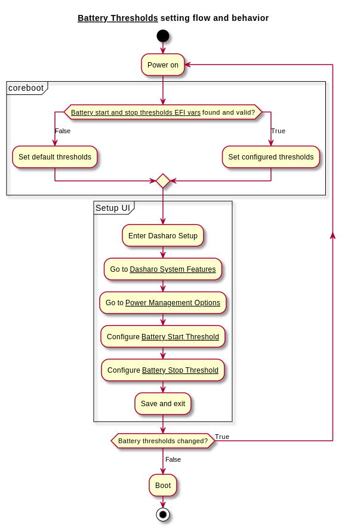{class="center"}

- `Power state after power/AC loss` - controls
 what power state the platform
  should switch to when the main AC power is restored. Default value is
  platform-dependent.

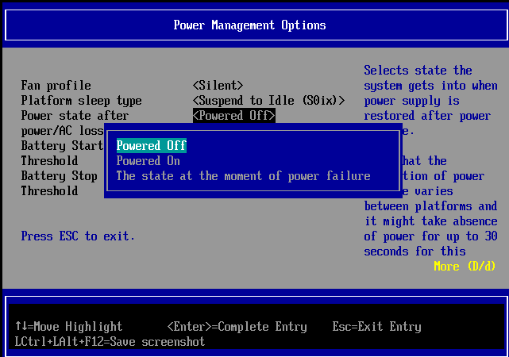{ class="center" }

- `CPU Throttling Temperature Offset` - The temperature offset from TjMax
  (maximum CPU temperature) above which the CPU will start throttling itself.
  Also known the TCC offset. The current absolute throttling threshold
  temperature is displayed in `Current CPU Throttling Threshold Temperature`
  checkbox.
- `USB ports power and charging` - Controls whether power is supplied to USB
  ports while the platform is off. The available options are:
    + `While System Is On` - The USB ports will be powered only while the device
      is turned on or in sleep mode.
    + `Always On` - The USB ports will remain powered even while the device is
      turned off. This may cause a reduction in standby battery life in battery
      powered devices. Availability of ports that are powered in this mode
      depends on your specific device, check your mainboard's Hardware
      Configuration Matrix on docs.dasharo.com for a detailed specification.

## PCI/PCIe Configuration

The submenu contains options related to the PCI and PCI Express devices and
subsystem.

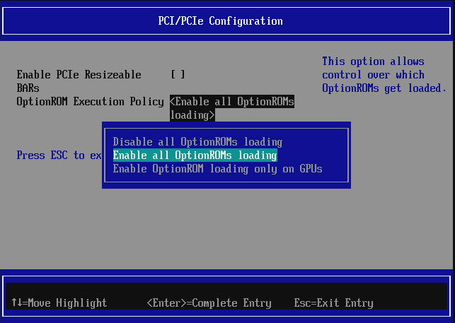{ class="center" }

- `Enable PCIe Resizable BARs` - enables/disables the PCIe Resizable BARs
  during PCI enumeration process. If enabled, the PCI Express devices
  advertising more suitable memory resources, will be configured to use those
  resources (that typically means bigger memory resources assigned to the
  device). By default this option is disabled for compatibility reasons.

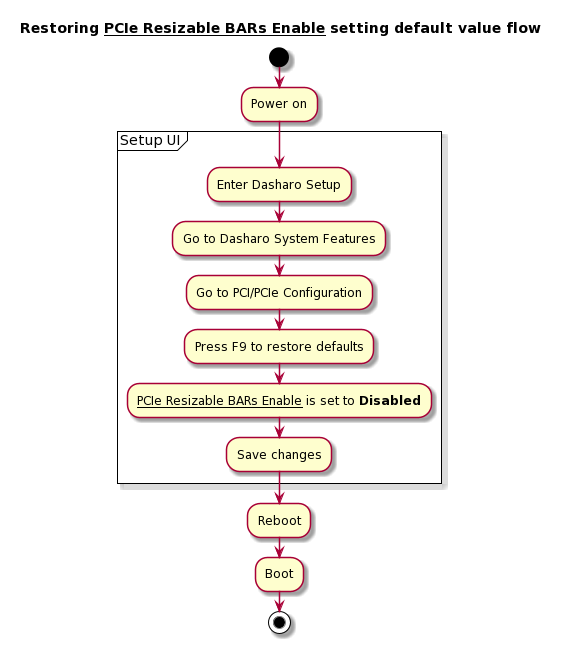{ class="center" }

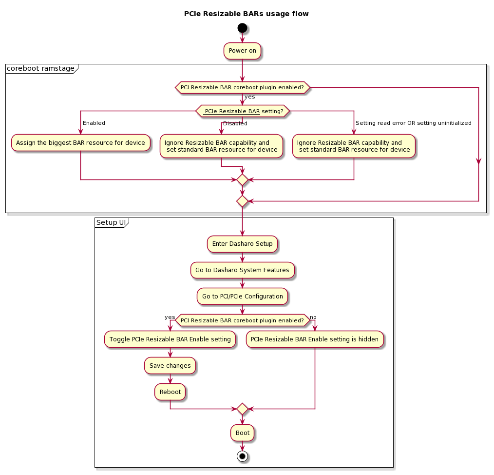{ class="center" }

- `OptionROM Execution Policy` - controls which OptionROMs are allowed to be
  loaded and run. Default value may depend on platform (either `Disable all`
  or `Enable All`)

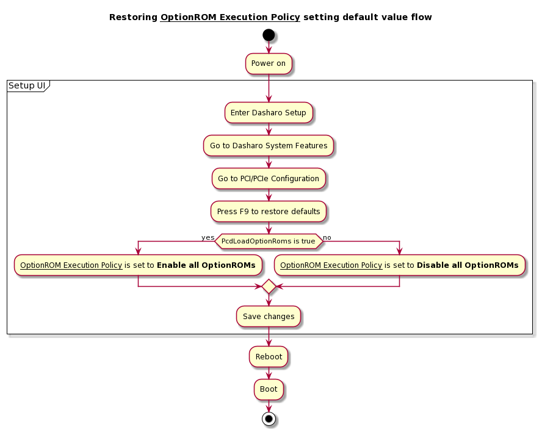{ class="center" }

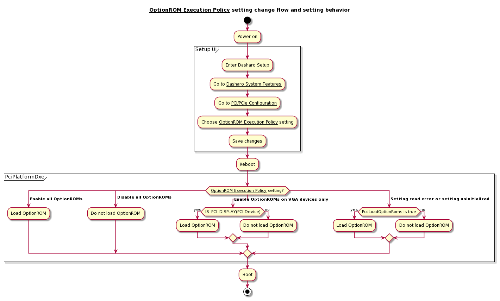{ class="center" }

## Memory Configuration

The submenu contains options related to the RAM memory configuration.

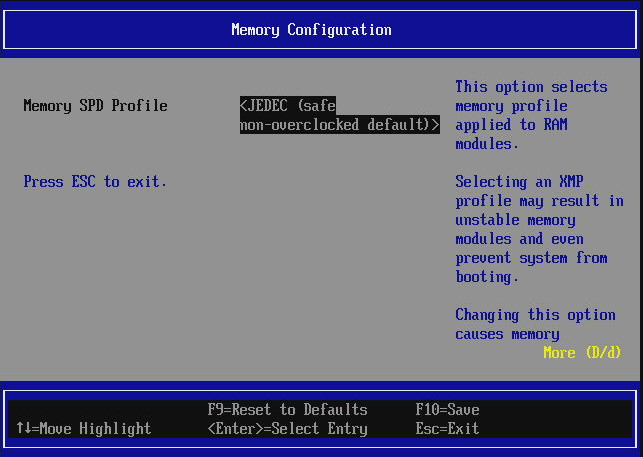{ class="center" }
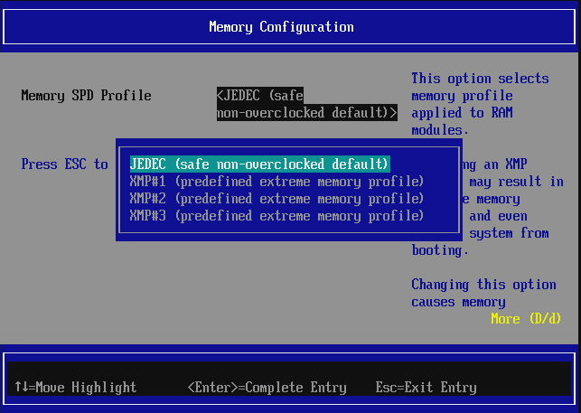{ class="center" }

- `Memory SPD profile` - chooses the memory overclocking profile to use when
  training the memory. Custom profiles are not yet supported. Currently, there
  is no detection between DDR4 and DDR5 memory, so `XMP#3` profile is only
  eligible for DDR5.

**WARNING**: Changing this value may brick your system. Be sure to have a
recovery method before modifying this setting. You have been warned.

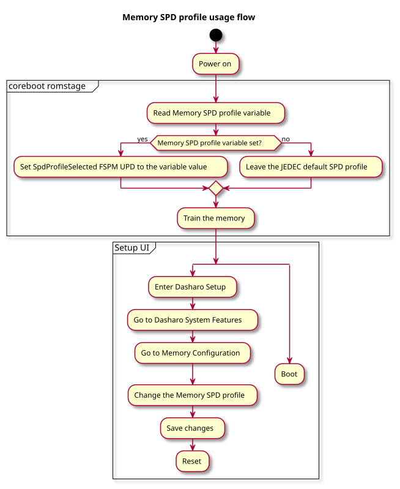{ class="center" }

## Serial Port Configuration

The submenu contains options related to the serial port configuration.

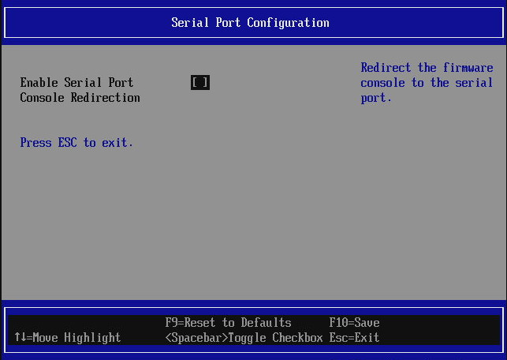{ class="center" }

- `Enable Serial Port Console Redirection` - when enabled, the firmware will
  output also on the serial port specific to the platform. Default value is
  platform-dependent.

NOTE: If Serial Port Console Redirection is enabled, the setup application and
strings printed on the screen will not be stretched to the full screen size.
It is due to the serial console working in 80x25 mode. Thus the console
splitter must choose the highest resolution supported by all consoles.

## CPU Configuration

The submenu contains options related to the CPU.

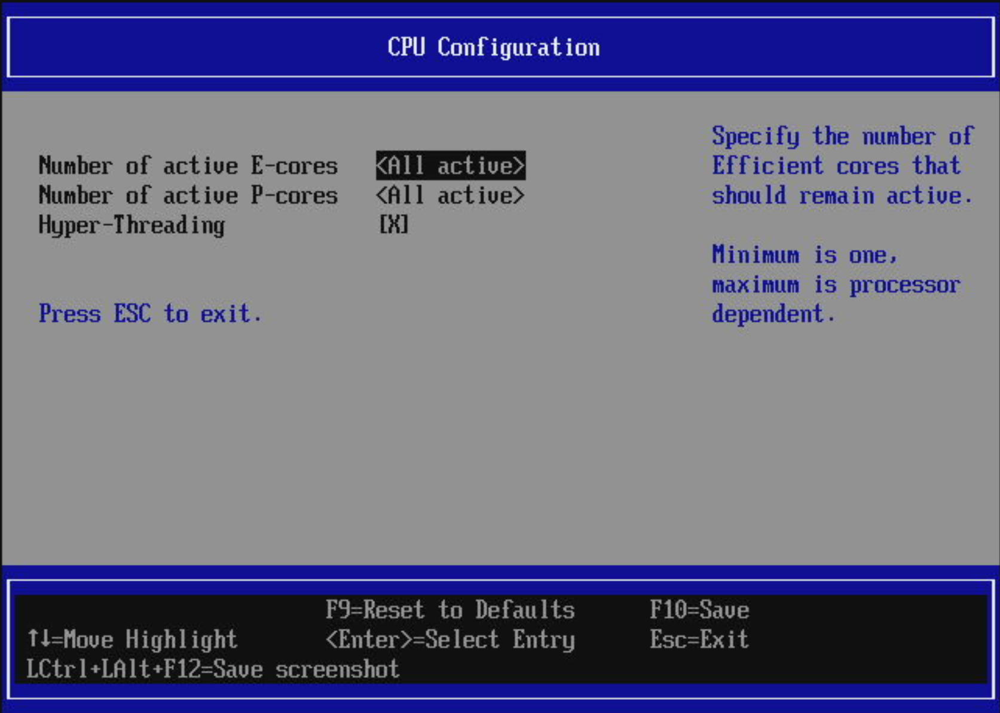{ class="center" }

- `Number of active P-cores` - sets the number of active Performance cores on
  a hybrid CPU architecture system, such as 12th generation Intel Core or
  later. By specifying a lower number of cores, the cores are getting
  disabled. By default all cores are active, and there always must be one
  P-core active in the system, unless the CPU has no P-cores.
- `Number of active E-cores` - sets the number of active Efficient cores on a
  hybrid CPU architecture system, such as 12th generation Intel Core or later.
  By specifying a lower number of cores, the cores are getting disabled. By
  default all cores are active, and there always must be one E-core active in
  the system if the CPU has no P-cores, otherwise all E-cores may be disabled.
- `Hyper-Threading` - enables/disables Hyper-Threading feature. By default
  Hyper-Threading is enabled. Unchecking the option will cause all the
  secondary threads on hyper-threading supported cores to be disabled. On
  hybrid CPU architecture, only P-cores support Hyper-Threading.

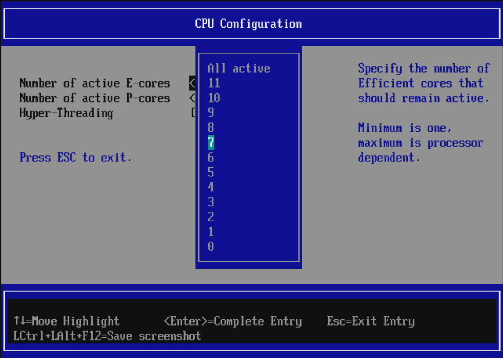{ class="center" }

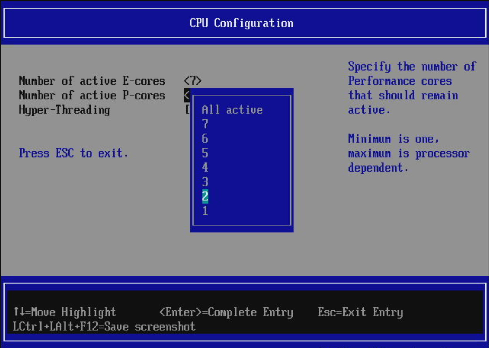{ class="center" }

## Additional information

NOTE: Pressing F9 to reset to defaults resets **all settings**, not only the one
that is currently selected.
