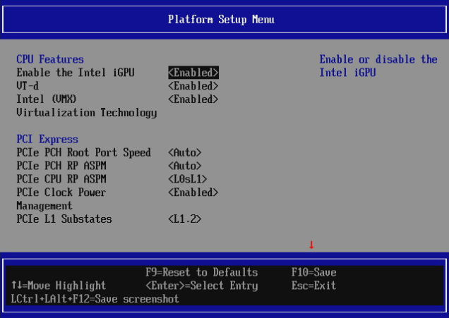
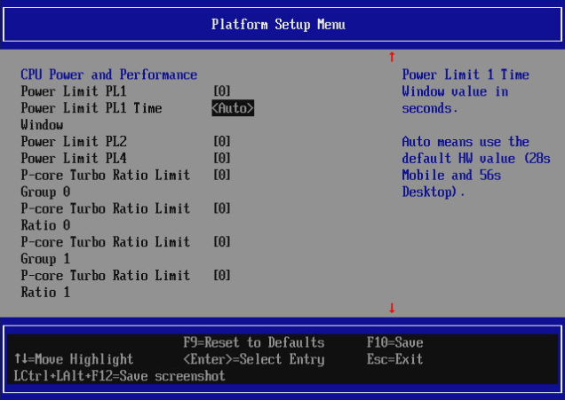
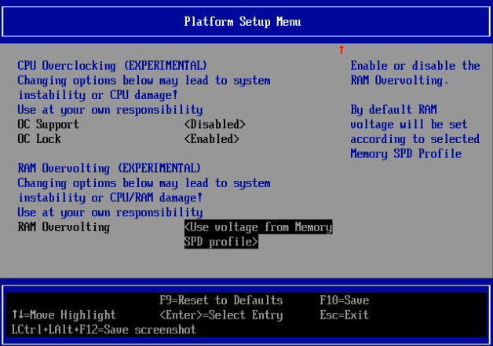
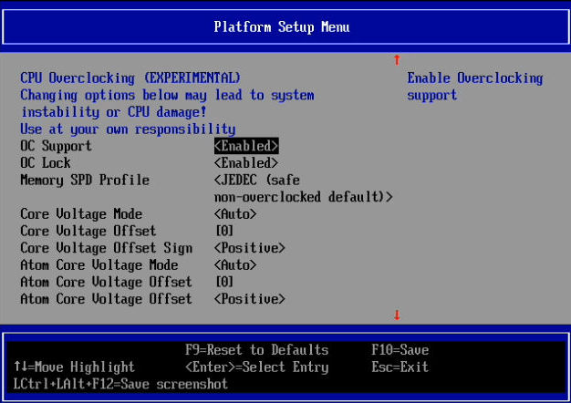
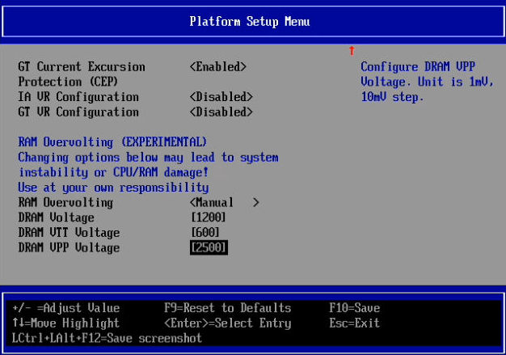
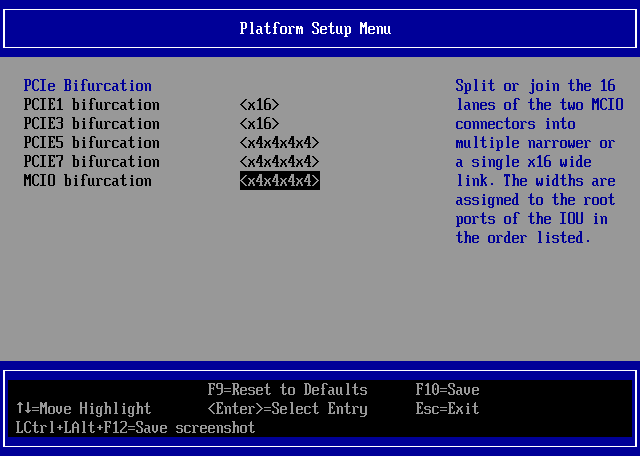

# Platform Setup Menu

This menu contains platform-specific options. The contents of the menu depends
on platform and may vary across boards and firmware versions.

Example view of the menu options:

{ class="center" }

{ class="center" }

{ class="center" }

The available settings vary by platform:

=== "MSI Intel desktops"

    ## Overclocking menu

    Overclocking options may appear only on overclocking capable platforms such as
    Intel-based MSI PRO Z690-A/Z790-P boards. Enabling the overclocking causes
    more options to appear.

    !!! Danger

        **These options are EXPERIMENTAL!** Be sure to have a recovery method before
        changing any of these options. THey may cause system instability or
        hardware damage. Use them at your own responsibility. Warranty claims due
        to damage caused by changing this optiosn will not be accepted and support
        is not provided.

    { class="center" }

    Feel free to contribute documentation and tips how to modify these options or
    to explain their meaning based on your experiments.

    ## RAM overvolting menu

    RAM overvolting options are specific to DDR4 variants of Intel-based MSI PRO
    Z690-A/Z790-P boards. Changing the RAM overvolting option to manual causes
    more options to appear.

    !!! Danger

        **These options are EXPERIMENTAL!** Be sure to have a recovery method before
        changing any of these options. THey may cause system instability or
        hardware damage. Use them at your own responsibility. Warranty claims due
        to damage caused by changing this optiosn will not be accepted and support
        is not provided.

    { class="center" }

    Feel free to contribute documentation and tips how to modify these options or
    to explain their meaning based on your experiments.

=== "ASRock SPC741D8"

    ## PCIe Bifurcation

    These settings enable bifurcation (splitting) of physical PCIe links into
    several narrower links. For example, a physical x16 slot may be bifurcated into
    four x4 links, allowing the use of 4 PCIe devices in a single slot (an
    appropriate riser module is required).

    { class="center" }

    Available values:

    * x16
    * x8x8
    * x4x4x8
    * x8x4x4
    * x4x4x4x4

    These settings require a reboot to take effect.
