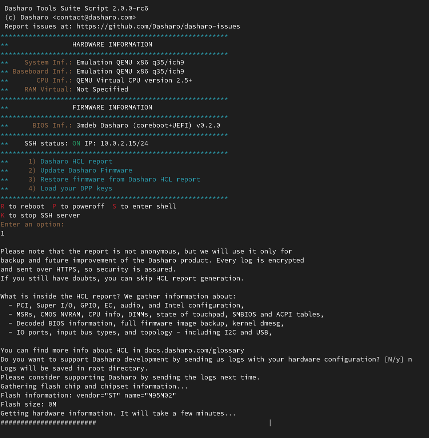
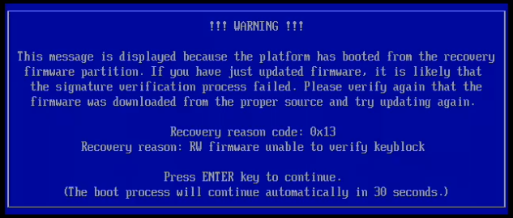

# Documentation

## Supported hardware

Dasharo Tools Suite was prepared to run on x86 platforms, but we can confirm
that it boots on the following platforms:

* ASUS KGPE-D16,
* Dell OptiPlex 7010/9010,
* MSI PRO Z690-A DDR4 ([test
  report](https://docs.google.com/spreadsheets/d/16wokQYhtS7XA1DQC3Om7FY-IImG6SZisGK7NnzyRGVY/edit#gid=0&range=A75)),
* MSI PRO Z690-A DDR5 ([test
  report](https://docs.google.com/spreadsheets/d/16wokQYhtS7XA1DQC3Om7FY-IImG6SZisGK7NnzyRGVY/edit#gid=777478871&range=A81)),
* MSI PRO Z790-P DDR4,
* MSI PRO Z790-P DDR5 ([test
  report](https://docs.google.com/spreadsheets/d/16wokQYhtS7XA1DQC3Om7FY-IImG6SZisGK7NnzyRGVY/edit#gid=1609693601&range=A92)),
* NovaCustom NV4x ([test
  report](https://docs.google.com/spreadsheets/d/1LOXY9HCu-fMitkYwX08iLsQdSNenzyU0LnMdVbZB5Do/edit#gid=536764189&range=A161)),
* NovaCustom NS5x/7x ([test
  report](https://docs.google.com/spreadsheets/d/1LOXY9HCu-fMitkYwX08iLsQdSNenzyU0LnMdVbZB5Do/edit#gid=38447675&range=A174)),
* NovaCustom V54x/56x ([test
  report](https://docs.google.com/spreadsheets/d/1wSE6xA3K3nXewwLn5lV39_2wZL1kg5AkGb4mvmG3bwE/edit?gid=382389731#gid=382389731))
* PC Engines apu2/3/4/6.

## Running

The Dasharo Tools Suite can be started in various ways. Currently, there are
two options:

* bootable over a network (iPXE),
* bootable USB stick image.

The first one should always be preferred if possible, as it is the easiest one
to use.

### Bootable over a network

This section describes how to boot DTS using iPXE.

#### Requirements

Below are the requirements that must be met to run DTS over a network on the
platform:

* Dasharo device with DTS functionality integrated,
* wired network connection,
* [Secure Boot disabled](../dasharo-menu-docs/device-manager.md#secure-boot-configuration),
* If device if flashed with Dasharo and support following functionality
    + disabled BIOS lock feature,
    + disabled SMM BIOS write protection feature.

#### Launching DTS

To access Dasharo Tools Suite:

* attach a wired network cable to the device's Ethernet port,
* power on the device, holding down the Boot Menu entry key,
* in the Boot Menu, select the `iPXE Network Boot` option,
* in the Network Boot menu, select the `Dasharo Tools Suite` option, or enter
  iPXE shell and type by hand:

    ```bash
    dhcp net0
    chain https://boot.dasharo.com/dts/dts.ipxe
    ```

    !!! warning

        Because of misconfigured iPXE on some firmware releases, booting over
        HTTPS is impossible, and the above command will fail. In that case, we
        recommend downloading the DTS image to USB. If you feel there is no
        risk of an MITM attack, you can proceed with
        `http://boot.dasharo.com/dts/dts.ipxe` at your own risk.

* the DTS menu will now appear.

### Bootable USB stick

This section describes how to boot DTS using a USB stick.

#### Requirements

Below are the requirements that must be met to run DTS from a USB device on the
platform:

* USB stick (at least 2GB),
* Latest image from [releases](https://github.com/Dasharo/meta-dts/releases)
  section.
  with Dasharo).
* Wired network connection,
* [Secure Boot disabled](../dasharo-menu-docs/device-manager.md#secure-boot-configuration),
* If device if flashed with Dasharo and support following functionality
    + disabled BIOS lock feature,
    + disabled SMM BIOS write protection feature.

#### Launching DTS

To access Dasharo Tools Suite:

* flash the downloaded image onto USB stick,
    + you can use a cross-platform GUI installer - [Etcher](https://www.balena.io/etcher/)
    + you can also use `dd` to flash from the command line

```bash
gzip -cdk dts-base-image-v1.1.0.wic.gz | \
sudo dd of=/dev/sdX bs=16M status=progress conv=fdatasync
```

!!! note "Notes"

    * this is an example done on the v1.1.0 image.
    * replace "sdX" with the letter of your USB disk device. For example: sda,
      sdb, sdc. It should not be partition number (for example, not sda1
      or sda2).

* insert the USB stick into a USB in your device,
* boot from the USB stick,
* the DTS menu will now appear.

## Building

We choose [Yocto Project](https://www.yoctoproject.org/) to prepare Dasharo
Tools Suite system. DTS image can be built using publicly available sources.
Thanks to publishing the build cache on
[cache.dasharo.com](https://cache.dasharo.com/yocto/dts/) the time needed to
finish the process should be significantly decreased.

### Prerequisites

The following must be met to build DTS:

* Linux PC (tested on `Ubuntu 20.04 LTS`),
* [docker](https://docs.docker.com/install/linux/docker-ce/ubuntu/) installed,
* [kas-container 3.0.2](https://raw.githubusercontent.com/siemens/kas/3.0.2/kas-container)
  script downloaded and available in [PATH](https://en.wikipedia.org/wiki/PATH_(variable)),

```bash
wget -O ~/bin/kas-container https://raw.githubusercontent.com/siemens/kas/3.0.2/kas-container
```

```bash
chmod +x ~/bin/kas-container
```

* `meta-dts` repository cloned.

```bash
mkdir yocto && cd yocto
```

```bash
git clone https://github.com/Dasharo/meta-dts.git
```

### Build

From `yocto` directory, run:

```shell
SHELL=/bin/bash kas-container build meta-dts/kas.yml
```

Image build takes time, so be patient, and the build's finished, you should see
something similar to (tasks number may differ):

```shell
Initialising tasks: 100% |###########################################################################################| Time: 0:00:01
Sstate summary: Wanted 2 Found 0 Missed 2 Current 931 (0% match, 99% complete)
NOTE: Executing Tasks
NOTE: Tasks Summary: Attempted 2532 tasks of which 2524 didn't need to be rerun and all succeeded.
```

Using the cache is enabled in `kas/cache.yml` file and can be disabled by
removing content of that file.

```bash
cat kas/cache.yml
```

output:

```bash
---
header:
  version: 11

local_conf_header:
  yocto-cache: |
    SSTATE_MIRRORS ?= "file://.* http://${LOCAL_PREMIRROR_SERVER}/${PROJECT_NAME}/sstate-cache/PATH"
    SOURCE_MIRROR_URL ?= "http://${LOCAL_PREMIRROR_SERVER}/${PROJECT_NAME}/downloads"
    INHERIT += "own-mirrors"
    LOCAL_PREMIRROR_SERVER ?= "cache.dasharo.com"
    PROJECT_NAME ?= "yocto/dts"
```

#### Build image with UEFI Secure Boot support

From `yocto` directory run:

```shell
SHELL=/bin/bash kas-container build meta-dts/kas-uefi-sb.yml
```

Image build takes time, so be patient and after build's finish you should see
something similar to (the exact tasks numbers may differ):

```shell
Initialising tasks: 100% |###########################################################################################| Time: 0:00:04
Checking sstate mirror object availability: 100% |###################################################################| Time: 0:00:03
Sstate summary: Wanted 892 Local 672 Mirrors 212 Missed 8 Current 1560 (99% match, 99% complete)
NOTE: Executing Tasks
NOTE: Tasks Summary: Attempted 5860 tasks of which 5841 didn't need to be rerun and all succeeded.
```

Image created with `kas-uefi-sb.yml` configuration file enable integration of
UEFI Secure Boot into DTS using
[meta-secure-core](https://github.com/jiazhang0/meta-secure-core/). Building the
image allow to prepare a PoC version with [uses sample
keys](https://github.com/jiazhang0/meta-secure-core/tree/master/meta-efi-secure-boot#sample-keys)
which by no mean should used in production. For user keys the script
[create-user-key-store.sh](https://github.com/jiazhang0/meta-secure-core/blob/master/meta-signing-key/scripts/create-user-key-store.sh)
can be used but it was not tested yet. Quick start with instructions on how to
use image are described in
[meta-efi-secure-boot](https://github.com/jiazhang0/meta-secure-core/tree/master/meta-efi-secure-boot#quick-start-for-the-first-boot).

### Flash

* Find out your device name.

```shell
fdisk -l
```

output:

```shell
(...)
Device     Boot  Start    End Sectors  Size Id Type
/dev/sdx1  *      8192 131433  123242 60,2M  c W95 FAT32 (LBA)
/dev/sdx2       139264 186667   47404 23,2M 83 Linux
```

In this case the device name is `/dev/sdx`, **but be aware, in the next steps,
replace `/dev/sdx` with the right device name on your platform, or else you can
damage your system!**

* From where you ran image build type.

```shell
sudo umount /dev/sdx*
```

```shell
cd build/tmp/deploy/images/genericx86-64
```

Here the file `dts-base-image-genericx86-64.wic.gz` should be available, which
is the image of DTS. To flash image, you can use the same command shown in
[running section](#launching-dts_1). Just change the file name.

* Boot the platform.

## Features

This section describes the functionality of the Dasharo Tools Suite. These are:

* [Dasharo zero-touch initial deployment](#dasharo-zero-touch-initial-deployment),
* [HCL Report](#hcl-report),
* [Firmware update](#firmware-update),
    + [Local firmware update](#local-firmware-update),
* [EC transition](#ec-transition),
* [EC update](#ec-update),
* [additional features](#additional-features),
    + [run commands from iPXE shell automatically](#run-commands-from-ipxe-shell-automatically),
    + [run DTS using VentoyOS](#run-dts-using-ventoyos).

### Dasharo zero-touch initial deployment

DTS can be used to flash Dasharo firmware on your hardware. To achieve this,
boot DTS, choose option number `2`. After creating
[report](../glossary.md#dasharo-hardware-compatibility-list-report) with
firmware dump as backup, type `d` or `c` to confirm the installation of Dasharo
firmware. Option `c` stands for community release which is available for anyone
using Dasharo Tools Suite, option `d` stands for
[DES](https://docs.dasharo.com/ways-you-can-help-us/#become-a-dasharo-entry-subscription-subscriber)
release and it is only available to Dasharo Entry Subscription subscribers.

Next you will be asked two questions to confirm flashing. The first will be
displayed with the detected information about the device you are using DTS on.
The second will also provide the hash of Dasharo components which will then be
used for flashing. You can compare them with the values listed in the supported
hardware section on docs.dasharo.com. Both these questions can be accepted by
typing `Y`.

Procedure execution ends automatically on the reboot of the platform (unless it
requires otherwise). After restarting the device, you can enjoy the basic
version of Dasharo, which we provide for given hardware.

This feature is supported on the following platforms:

* ASUS KGPE-D16,
* Dell OptiPlex 7010/9010,
* MSI PRO Z690-A DDR4,
* MSI PRO Z690-A DDR5,
* MSI PRO Z790-P DDR4,
* MSI PRO Z790-P DDR5,
* NovaCustom NV4x,
* NovaCustom NS5x/7x.

And partially (only EC firmware flashing) on:

* NovaCustom V54x/56x.

### HCL Report

DTS allows the generation of a package with logs containing hardware
information. To create one, choose option number 1 and check out the disclaimer.
If you would like to send the report to our servers, please remember about
connecting the ethernet cable. More information can be found in
[glossary](../glossary.md#dasharo-hardware-compatibility-list-report).



#### HCL Report correctness

Please note DTS HCL Report assumes that your chipset is already supported by
flashrom. There are also other false negative errors and unknowns, which we
trying to fix to improve user experience.

Always check `results` file to confirm the quality of your HCL report. Sample
content of such file may look as follows:

```text
[OK]    PCI configuration space and topology
[UNKNOWN] USB devices and topology
[OK]    Super I/O configuration
[UNKNOWN] EC configuration
[ERROR]   MSRs
[OK]    SMBIOS tables
[OK]    BIOS information
[OK]    CMOS NVRAM
[UNKNOWN] Intel configuration registers
[OK]    GPIO configuration C header files
[OK]    kernel dmesg
[OK]    ACPI tables
[UNKNOWN] Audio devices configuration
[OK]    CPU info
[OK]    I/O ports
[OK]    Input bus types
[OK]    Firmware image
[OK]    I2C bus
[UNKNOWN] ACPI tables
[OK]    Touchpad information
[OK]    DIMMs information
[ERROR]   CBMEM table information
[ERROR]   TPM information
[ERROR]   AMT information
[OK]    ME information
Results of getting data:

Legend:
[OK]     Data get successfully
[UNKNOWN]  Result is unknown
[ERROR]    Error during getting data
```

Please report all errors experienced while performing a dump to
[dasharo-issues](https://github.com/Dasharo/dasharo-issues) repository.

#### BIOS backup

One of the key components of HCL Report is your BIOS backup. To prepare BIOS
backup of your platform, simply run HCL Report and decide if you would like to
contribute information about your hardware configuration.

Please consider the following options depending on your situation:

* **YES** - If you decide to contribute, you can always [get back to
  us](https://www.dasharo.com/pages/contact/) and ask about BIOS backup, which
  we will provide after simple verification that you are the owner of the
  hardware.
* **NO (default)** - If you decide to not contribute, your situation depends on
  the boot method you used to execute DTS:
    + **Network Boot** - please note that Dasharo booted over iPXE assumes no
      storage available, so the report, and your BIOS backup are stored in
      temporary memory and will not be available after reboot. Please make sure
      to move HCL Report to not volatile storage. This can be done using option
      `S to enter shell`,
    + **USB Boot** - HCL Report and BIOS backup are saved to USB storage root
      directory.

### Firmware update

DTS can be used to update Dasharo firmware. To achieve this, boot it on platform
with flashed Dasharo and choose option number `2`. You may see additional
information about available updates if you are not [Dasharo Entry
Subscription](https://docs.dasharo.com/ways-you-can-help-us/#become-a-dasharo-entry-subscription-subscriber)
subscriber.

Next you will be asked two questions to confirm flashing. The first will be
displayed with the detected information about the device you are using DTS on.
The second will also provide the hash of Dasharo components which will then be
used for flashing. You can compare them with the values listed in the supported
hardware section on docs.dasharo.com. Both these questions can be accepted by
typing `Y`.

If you see the following warning during the process, you do not need to worry
about it:

```text
Warning: Setting BIOS Control at 0xdc from 0x8b to 0x89 failed.
New value is 0x8b.
```

Procedure execution ends automatically on the reboot of the platform (unless it
requires otherwise). After restarting the device, you can enjoy the updated
version of Dasharo, which we provide for given hardware.

Below we provide an example of updating Dasharo firmware from version v1.1.0 to
v1.1.1 on MSI PRO Z690-A DDR4.

```bash
 Dasharo Tools Suite Script 2.0.0-rc1
 (c) Dasharo <contact@dasharo.com>
 Report issues at: https://github.com/Dasharo/dasharo-issues
*********************************************************
**                HARDWARE INFORMATION
*********************************************************
**    System Inf.: Micro-Star International Co., Ltd. MS-7D25
** Baseboard Inf.: Micro-Star International Co., Ltd. PRO Z690-A WIFI DDR4(MS-7D25)
**       CPU Inf.: 12th Gen Intel(R) Core(TM) i5-12600K
**    RAM Channel-0-DIMM-0: KF3600C17D4/8GX
**    RAM Channel-0-DIMM-1: KF3600C17D4/8GX
**    RAM Channel-0-DIMM-0: KF3600C17D4/8GX
**    RAM Channel-0-DIMM-1: KF3600C17D4/8GX
*********************************************************
**                FIRMWARE INFORMATION
*********************************************************
**      BIOS Inf.: 3mdeb Dasharo (coreboot+UEFI) v1.1.0
*********************************************************
**     1) Dasharo HCL report
**     2) Update Dasharo Firmware
**     3) Restore firmware from Dasharo HCL report
**     4) Load your DES keys
*********************************************************
Select a menu option or
R to reboot  P to poweroff  S to enter shell
K to launch SSH server
2

Waiting for network connection ...
Network connection established.
Checking if board is Dasharo compatible.
Gathering flash chip and chipset information...
Flash information: vendor="Programmer" name="Opaque flash chip"
Flash size: 32M
Getting platform specific GPG key... Done
Waiting for system clock to be synced ...
Checking for the latest Dasharo update available...

Current Dasharo version: 1.1.0
Latest available Dasharo version: 1.1.1

Are you sure you want to proceed with update? (Y|n) y

Downloading Dasharo firmware...Done

Please verify detected hardware!

Board vendor: Micro-Star International Co., Ltd.
System model: MS-7D25
Board model: PRO Z690-A WIFI DDR4(MS-7D25)

Does it match your actual specification? (Y|n) y

Following firmware will be used to install Dasharo
Dasharo BIOS firmware:
  - link: https://3mdeb.com/(...)/msi_ms7d25_v1.1.1_ddr4.rom
  - hash: 3b438422338cf4c13abdb25823a9b2a2ad6e82fabbe0d9ed41a16a6eae1f15ff

You can learn more about this release on: https://docs.dasharo.com/

Do you want to update Dasharo firmware on your hardware? (Y|n) y

Checking Dasharo firmware checksum... Verified.
Checking Dasharo firmware signature... Verified.

Backing up firmware configuration... Done.
Found file config at 0xc24c0, type raw, compressed 5418, size 19725
Checking flash layout.
Checking vboot keys.
Updating Dasharo firmware...
This may take several minutes. Please be patient and do not power off your
computer or touch the keyboard!
Successfully updated Dasharo firmware
Syncing disks... Done.
The computer will reboot automatically in 5 seconds
Rebooting in 5s:
5...
4...
3...
2...
1...
Rebooting
```

#### Local firmware update

To flash a local BIOS image (e.g. mounted from a USB stick), you can drop to the
shell (option `S`) and use the `flashrom` binary provided inside DTS directly.

**DANGER**: Failure to use `flashrom` correctly **_may result in an unbootable
device_**. For example, never flash an image that does not contain an Intel
Firmware Descriptor (IFD) region and/or Management Engine (ME) region to the
whole chip.

You can use `flashrom -p internal` without additional parameters to double check
if `flashrom` detects your chipset. This will not write anything.

The following `flashrom` command will only rewrite the BIOS region:

```bash
sudo flashrom -p internal --ifd -i bios -w [path/to/your/coreboot.rom]
```

If `flashrom` outputs the following, you do not need to worry about it:

```text
Enabling flash write... Warning: Setting BIOS Control at 0xdc from 0x8b to 0x89 failed.
New value is 0x8b.
SPI Configuration is locked down
```

#### Update issues

If you see the following pop-ups during the first boot after the update:




You probably performed an update using a deprecated version of Dasharo Tools
Suite and have not disabled BIOS lock. Do not worry, nothing bad has happened.
If you backed up your old firmware, do the following steps:

1. Reboot your device and turn off BIOS lock (you can find this option in
[Dasharo Security
Options](../dasharo-menu-docs/dasharo-system-features.md#dasharo-security-options)
as `BIOS boot medium lock`).
1. Boot the DTS you backed up your old firmware with and choose option 3, which
will restore it.
1. After restoring the firmware, perform another update, but make sure you are
using the [latest Dasharo Tools Suite
version](https://github.com/Dasharo/meta-dts/releases/latest) (new DTS has tools
to protect you from such issues).

If you used `flashrom` as described in [Local firmware
update](#local-firmware-update), flash the firmware again, but make sure the
BIOS lock is turned off this time.

### EC transition

DTS allows performing full Embedded Controller firmware transition from the
proprietary vendor EC firmware to the Dasharo EC firmware. Currently, this
functionality is supported on the
[NovaCustom NS5x/NS7x](/variants/novacustom_ns5x_tgl/releases/),
[NovaCustom NV4x](/variants/novacustom_nv4x_tgl/releases/),
[NovaCustom V54x](/variants/novacustom_v540tu/releases/) and
[NovaCustom V56x](/variants/novacustom_v560tu/releases/) only.

Starting from DTS v1.2.0 to perform EC transition please run
[firmware update](#firmware-update) on the platform with proprietary vendor EC
firmware.

### EC update

!!! note

    This section only applies to NovaCustom releases earlier than v2.0.0 and is
    replaced by the new automatic EC firmware sync feature.

DTS allows to update open-source Embedded Controller firmware to the newer
version. This is how we can achieve that.

* Retrieve information about your current EC.

  ```bash
  dasharo_ectool info
  ```

  The output of the above-described command should contain information about
  the version of flashed firmware:

  ```bash
  board: clevo/ns50mu
  version: 2022-08-16_c12ff1a
  ```

* Download the newest version of Embedded Controller firmware.
* Plug in power supply, without it, flashing EC is not possible as losing power
  may cause in damaged firmware.
* Flash Embedded Controller firmware internally.

  ```bash
  dasharo_ectool flash ec_file.rom
  ```

  The output of the above-described command should look as follows:

  ```bash
  file board: Ok("clevo/ns50mu")
  file version: Ok("2022-08-16_c12ff1a")
  ec board: Ok("clevo/ns50mu")
  ec version: Ok("2022-08-31_cbff21b")
  Waiting 5 seconds for all keys to be released
  Sync
  SPI Read 128K
  Saving ROM to backup.rom
  SPI Write 128K
  SPI Read 128K
  Successfully programmed SPI ROM
  Result: Ok(())
  Sync
  System will shut off in 5 seconds
  Sync
  ```

  > Note: this is example output, versions may differ

* Computer will shut down automatically.
* Power on your computer. Booting process may take a while.
* After boot, choose option number 9 to drop to Shell.
* Retrieve information about your updated EC.

  ```bash
  dasharo_ectool info
  ```

  The output of the above-described command should contain information about
  the version of flashed firmware:

  ```bash
  board: clevo/ns50mu
  version: 2022-08-31_cbff21b
  ```

### Additional features

The section below presents a list of functionalities added to DTS, which were
developed at the community's request and which do not necessarily relate
strictly to Dasharo.

#### Run commands from iPXE shell automatically

It is possible to automatically execute your chosen commands after iPXE boot.
You can use the
[local-ipxe-server.sh](https://github.com/Dasharo/meta-dts/blob/main/scripts/local-ipxe-server.sh)
script for that. What it does is:

* automatically download the latest version of DTS artifacts needed for iPXE
  boot,
* creates a `dts.ipxe` bootchain file, which will boot DTS and also run your
  custom script,
* creates a simple, python-based HTTP server, from which you will be able to
  boot DTS.

> Note: This functionality is available from version 1.2.19.

To use this functionality, please follow the steps presented below.

Firstly, please clone [meta-dts](https://github.com/Dasharo/meta-dts/)
repository.

```bash
git clone https://github.com/Dasharo/meta-dts.git && cd meta-dts
```

Then, start the script with the following command.

```bash
./scripts/local-ipxe-server.sh
```

Once you run the script, you will be prompted for the port of the server, like
this.

```bash
--------------------------------------------------------------------------------
This script by default sets the server up on port 9000. If you want to use a
different port, for example 9001, then run the script like this:
    ./meta-dts/scripts/ipxe-dts.sh 9001
Do you want to continue? [y/n]
```

If you proceed, at the end the script will tell you how you can boot DTS through
iPXE.

```bash
--------------------------------------------------------------------------------
you can now boot dts v1.2.18 through iPXE on another machine by running:
    dhcp
    chain http://192.168.4.158:9000/dts.ipxe
on that machine in the iPXE shell. It will also execute a simple "commands.sh"
script after booting. If you want to change its contents, just change the
"scripts/commands.sh" file, and rerun this script.

This script by default sets the server up on port 9000. If you want to use a
different port, for example 9001, then run the script like this:
    ./meta-dts/scripts/ipxe-dts.sh 9001
--------------------------------------------------------------------------------
Serving HTTP on 0.0.0.0 port 9000 (http://0.0.0.0:9000/) ...
```

#### Run DTS using VentoyOS

VentoyOS allows operating systems to be booted from ISO files. Unfortunately,
the ISO-formatted DTS image we've provided so far mounted the main file system
in read-only mode, which, combined with the fact that most of DTS' functionality
is strictly tied to the ability to write files there, made the system unusable.
Consequently, we have stopped including ISO images in DTS releases since
v1.2.20, pending the resolution of this issue. We will reintroduce them once we
determine the appropriate action to address this dependency. Progress on this
matter is being monitored through issue
[288](https://github.com/Dasharo/dasharo-issues/issues/288).
