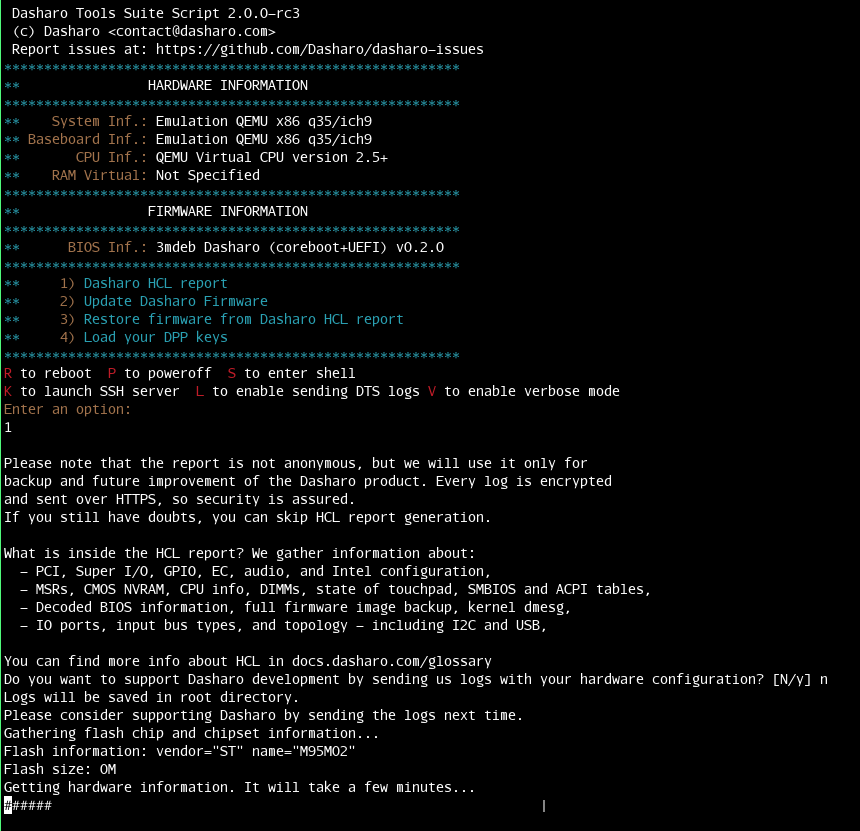
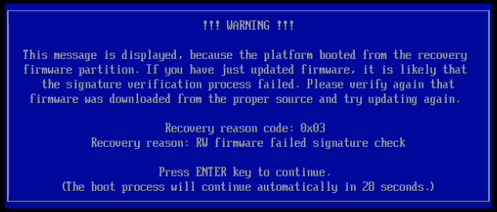
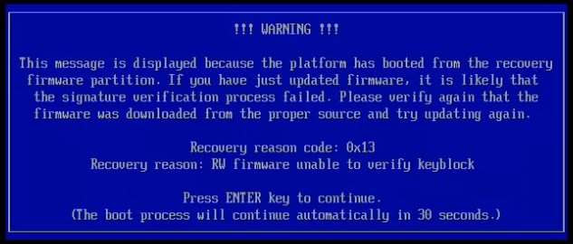
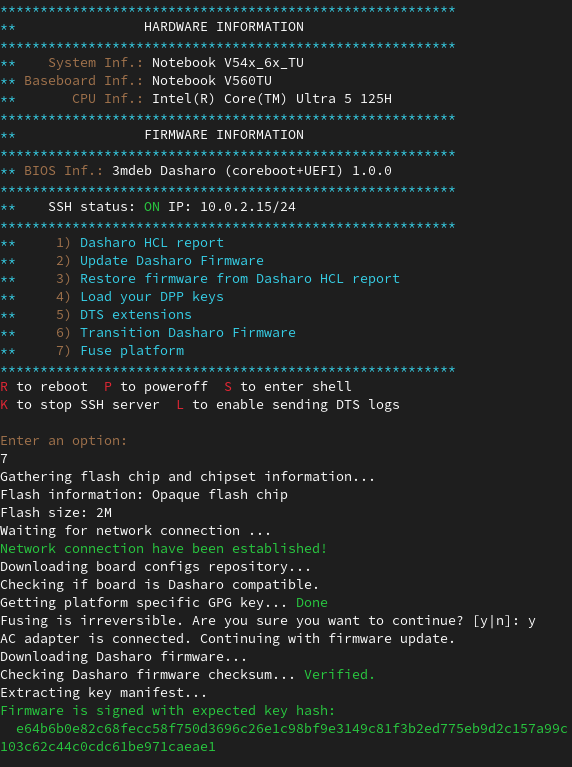
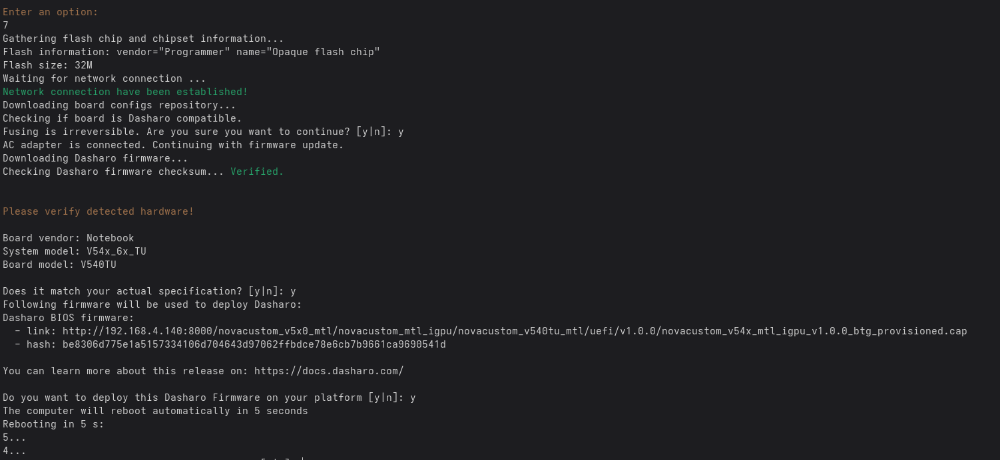

# Features

This section describes the functionality of the Dasharo Tools Suite. These are:

- [Features](#features)
    + [Available Commands](#available-commands)
    + [Dasharo zero-touch initial deployment (i.e. DZTID)](#dasharo-zero-touch-initial-deployment-ie-dztid)
    + [HCL Report](#hcl-report)
        - [HCL Report correctness](#hcl-report-correctness)
        - [HCL Report Using an External Firmware Binary](#hcl-report-using-an-external-firmware-binary)
        - [BIOS backup](#bios-backup)
    + [Firmware update](#firmware-update)
        - [Firmware Update Mode](#firmware-update-mode)
        - [Local firmware update](#local-firmware-update)
        - [Update issues](#update-issues)
    + [EC transition](#ec-transition)
    + [EC update](#ec-update)
    + [Fuse Platform (Dasharo TrustRoot)](#fuse-platform-dasharo-trustroot)
    + [Verify Intel Boot Guard key](#verify-intel-boot-guard-key)
    + [Additional features](#additional-features)
        - [Run commands from iPXE shell automatically](#run-commands-from-ipxe-shell-automatically)
        - [Run DTS using VentoyOS](#run-dts-using-ventoyos)

## Available Commands

When DTS is started, it has following options for the user to choose from:

- **1)** [Dasharo HCL Report](#hcl-report) - generate Hardware
  Compatibility List Report
- **2)** [Update Dasharo Firmware](#firmware-update) or [Install Dasharo
  Firmware](#dasharo-zero-touch-initial-deployment)
- **3)** Restore Firmware from Dasharo HCL Report (Deprecated)
- **4)** [Load your DPP
    keys](../../osf-trivia-list/dts.md#how-can-i-use-my-dasharo-pro-package-credentials)
    \- Load your Dasharo Pro Package (DPP) keys
- **R** Reboot
- **P** Poweroff
- **S** Enter shell
- **K** Launch SSH Server
- **L** [Enable sending DTS
  logs](../../osf-trivia-list/dts.md#how-can-i-help-the-support-team-diagnose-my-problem-faster)

## Dasharo zero-touch initial deployment (i.e. DZTID)

DTS can be used to flash Dasharo firmware on your hardware. To achieve this,
boot DTS, choose option number `2`. After creating
[report](../../glossary.md#dasharo-hardware-compatibility-list-report) with
firmware dump as backup, type `d` or `c` to confirm the installation of Dasharo
firmware. Option `c` stands for community release which is available for anyone
using Dasharo Tools Suite, option `d` stands for
[DPP](../../ways-you-can-help-us.md#become-a-dasharo-pro-package-subscriber)
release and it is only available to Dasharo Entry Subscription subscribers.
If you have DPP subscription then do steps in
[How can I use my Dasharo Pro Package credentials](
../../osf-trivia-list/dts.md#how-can-i-use-my-dasharo-pro-package-credentials)
section first.

Next you will be asked two questions to confirm flashing. The first will be
displayed with the detected information about the device you are using DTS on.
The second will also provide the hash of Dasharo components which will then be
used for flashing. You can compare them with the values listed in the supported
hardware section on docs.dasharo.com. Both these questions can be accepted by
typing `Y`.

Procedure execution ends automatically on the reboot of the platform (unless it
requires otherwise). After restarting the device, you can enjoy the basic
version of Dasharo, which we provide for given hardware.

This feature is supported on the following platforms:

- ASUS KGPE-D16,
- Dell OptiPlex 7010/9010,
- MSI PRO Z690-A DDR4,
- MSI PRO Z690-A DDR5,
- MSI PRO Z790-P DDR4,
- MSI PRO Z790-P DDR5,
- NovaCustom NV4x (only 11th Gen (Tiger Lake)),
- NovaCustom NS5x/7x (only 11th Gen (Tiger Lake)),
- ODROID-H4+.

And partially (only EC firmware flashing) on:

- NovaCustom V540TU/TNx,
- NovaCustom V560TU/TNx.

## HCL Report

DTS allows the generation of a package with logs containing hardware
information. To create one, choose option number 1 and check out the disclaimer.
If you would like to send the report to our servers, please remember about
connecting the ethernet cable. More information can be found in
[glossary](../../glossary.md#dasharo-hardware-compatibility-list-report).



### HCL Report correctness

Please note DTS HCL Report assumes that your chipset is already supported by
flashrom. There are also other false negative errors and unknowns, which we
trying to fix to improve user experience.

Always check `results` file to confirm the quality of your HCL report. Sample
content of such file may look as follows:

```text
[OK]    PCI configuration space and topology
[UNKNOWN] USB devices and topology
[OK]    Super I/O configuration
[UNKNOWN] EC configuration
[ERROR]   MSRs
[OK]    SMBIOS tables
[OK]    BIOS information
[OK]    CMOS NVRAM
[UNKNOWN] Intel configuration registers
[OK]    GPIO configuration C header files
[OK]    kernel dmesg
[OK]    ACPI tables
[UNKNOWN] Audio devices configuration
[OK]    CPU info
[OK]    I/O ports
[OK]    Input bus types
[OK]    Firmware image
[OK]    I2C bus
[UNKNOWN] ACPI tables
[OK]    Touchpad information
[OK]    DIMMs information
[ERROR]   CBMEM table information
[ERROR]   TPM information
[ERROR]   AMT information
[OK]    ME information
Results of getting data:

Legend:
[OK]     Data get successfully
[UNKNOWN]  Result is unknown
[ERROR]    Error during getting data
```

Please report all errors experienced while performing a dump to
[dasharo-issues](https://github.com/Dasharo/dasharo-issues) repository.

### HCL Report Using an External Firmware Binary

_Note: The following feature is available in DTS version 2.7.2 and later._

Proprietary or stock firmware may not support using the internal programmer to
dump the contents of the flash memory that stores the firmware. This results in
a less complete HCL report, which lacks an inbox firmware backup and the results
of automated firmware analysis.

As a workaround, DTS allows users to provide the firmware binary file manually.
The firmware binary can be obtained, for example, by using an
[external programmer](../../variants/asrock_spc741d8/recovery.md)
(_NOTE: link describes writing operation, not reading!_) or by dumping the
firmware via [BMC](https://www.gigabyte.com/Glossary/bmc).

To use a user-provided firmware binary in an HCL report, copy it to the
`/firmware/external/` directory. This can be done manually (for example, by
transferring the binary on a flash drive and copying it to the destination) or
over the network. The following example demonstrates the latter method, copying
the binary via SCP:

1. Boot up the DTS.
1. Enable the SSH server.
1. Create `/firmware/external` directory over ssh.

    ```bash
    ssh root@<target_ip_address> 'mkdir -p /firmware/external'
    ```

1. Copy the firmware binary to the target platform at `/firmware/external/` via
   `scp`. An example command is shown below:

    ```bash
    scp <path_to_firmware_binary> root@<target_ip_address>:/firmware/external/
    ```

1. Proceed with generating the HCL report as usual.

If the internal programmer fails to dump the firmware from the platform, DTS
will automatically use the user-supplied firmware binary. The following message
confirms that this fallback is in use:

```log
Firmware dump not found, but found user-supplied external binary.
```

### BIOS backup

One of the key components of HCL Report is your BIOS backup. To prepare BIOS
backup of your platform, simply run HCL Report and decide if you would like to
contribute information about your hardware configuration.

Please consider the following options depending on your situation:

- **YES** - If you decide to contribute, you can always [get back to
  us](https://www.dasharo.com/pages/contact/) and ask about BIOS backup, which
  we will provide after simple verification that you are the owner of the
  hardware.
- **NO (default)** - If you decide to not contribute, your situation depends on
  the boot method you used to execute DTS:
    + **Network Boot** - please note that Dasharo booted over iPXE assumes no
      storage available, so the report, and your BIOS backup are stored in
      temporary memory and will not be available after reboot. Please make sure
      to move HCL Report to not volatile storage. This can be done using option
      `S to enter shell`,
    + **USB Boot** - HCL Report and BIOS backup are saved to USB storage root
      directory.

## Firmware update

DTS can be used to update Dasharo firmware. To achieve this, boot it on platform
with flashed Dasharo and choose option number `2`. You may see additional
information about available updates if you are not [Dasharo Pro Package](https://docs.dasharo.com/ways-you-can-help-us/#become-a-dasharo-pro-package-subscriber)
subscriber. If you have DPP subscription then do steps in
[How can I use my Dasharo Pro Package credentials](
../../osf-trivia-list/dts.md#how-can-i-use-my-dasharo-pro-package-credentials)
section first.

Next you will be asked two questions to confirm flashing. The first will be
displayed with the detected information about the device you are using DTS on.
The second will also provide the hash of Dasharo components which will then be
used for flashing. You can compare them with the values listed in the supported
hardware section on docs.dasharo.com. Both these questions can be accepted by
typing `Y`.

If you see the following warning during the process, you do not need to worry
about it:

```text
Warning: Setting BIOS Control at 0xdc from 0x8b to 0x89 failed.
New value is 0x8b.
```

Procedure execution ends automatically on the reboot of the platform (unless it
requires otherwise). After restarting the device, you can enjoy the updated
version of Dasharo, which we provide for given hardware.

Below we provide an example of updating Dasharo firmware from version v1.1.0 to
v1.1.1 on MSI PRO Z690-A DDR4.

```bash
 Dasharo Tools Suite Script 2.0.0-rc1
 (c) Dasharo <contact@dasharo.com>
 Report issues at: https://github.com/Dasharo/dasharo-issues
*********************************************************
**                HARDWARE INFORMATION
*********************************************************
**    System Inf.: Micro-Star International Co., Ltd. MS-7D25
** Baseboard Inf.: Micro-Star International Co., Ltd. PRO Z690-A WIFI DDR4(MS-7D25)
**       CPU Inf.: 12th Gen Intel(R) Core(TM) i5-12600K
**    RAM Channel-0-DIMM-0: KF3600C17D4/8GX
**    RAM Channel-0-DIMM-1: KF3600C17D4/8GX
**    RAM Channel-0-DIMM-0: KF3600C17D4/8GX
**    RAM Channel-0-DIMM-1: KF3600C17D4/8GX
*********************************************************
**                FIRMWARE INFORMATION
*********************************************************
**      BIOS Inf.: 3mdeb Dasharo (coreboot+UEFI) v1.1.0
*********************************************************
**     1) Dasharo HCL report
**     2) Update Dasharo Firmware
**     3) Restore firmware from Dasharo HCL report
**     4) Load your DPP keys
*********************************************************
Select a menu option or
R to reboot  P to poweroff  S to enter shell
K to launch SSH server
2

Waiting for network connection ...
Network connection established.
Checking if board is Dasharo compatible.
Gathering flash chip and chipset information...
Flash information: vendor="Programmer" name="Opaque flash chip"
Flash size: 32M
Getting platform specific GPG key... Done
Waiting for system clock to be synced ...
Checking for the latest Dasharo update available...

Current Dasharo version: 1.1.0
Latest available Dasharo version: 1.1.1

Are you sure you want to proceed with update? (Y|n) y

Downloading Dasharo firmware...Done

Please verify detected hardware!

Board vendor: Micro-Star International Co., Ltd.
System model: MS-7D25
Board model: PRO Z690-A WIFI DDR4(MS-7D25)

Does it match your actual specification? (Y|n) y

Following firmware will be used to install Dasharo
Dasharo BIOS firmware:
  - link: https://3mdeb.com/(...)/msi_ms7d25_v1.1.1_ddr4.rom
  - hash: 3b438422338cf4c13abdb25823a9b2a2ad6e82fabbe0d9ed41a16a6eae1f15ff

You can learn more about this release on: https://docs.dasharo.com/

Do you want to update Dasharo firmware on your hardware? (Y|n) y

Checking Dasharo firmware checksum... Verified.
Checking Dasharo firmware signature... Verified.

Backing up firmware configuration... Done.
Found file config at 0xc24c0, type raw, compressed 5418, size 19725
Checking flash layout.
Checking vboot keys.
Updating Dasharo firmware...
This may take several minutes. Please be patient and do not power off your
computer or touch the keyboard!
Successfully updated Dasharo firmware
Syncing disks... Done.
The computer will reboot automatically in 5 seconds
Rebooting in 5s:
5...
4...
3...
2...
1...
Rebooting
```

### Firmware Update Mode

If you boot into DTS when in Firmware Update Mode you will be asked if you want
to continue with unattended update or enter DTS menu:

```text
Dasharo Tools Suite 2.7.1 DasharoToolsSuite tty1

DasharoToolsSuite login: root (automatic login)

You have entered Firmware Update Mode.:
  1: If you wish to continue with unattended firmware update process
  9: If you wish to go back to Dasharo Tools Suite menu

Select an option:
```

If you choose option 1 you will start unattended update, which is identical to
update described in [Firmware update](#firmware-update) except all questions
will be skipped.
If you choose `9` you will go back to DTS menu.

### Local firmware update

To flash a local BIOS image (e.g. mounted from a USB stick), you can drop to the
shell (option `S`) and use the `flashrom` binary provided inside DTS directly.

**DANGER**: Failure to use `flashrom` correctly **_may result in an unbootable
device_**. For example, never flash an image that does not contain an Intel
Firmware Descriptor (IFD) region and/or Management Engine (ME) region to the
whole chip.

You can use `flashrom -p internal` without additional parameters to double check
if `flashrom` detects your chipset. This will not write anything.

The following `flashrom` command will only rewrite the BIOS region:

```bash
sudo flashrom -p internal --ifd -i bios -w [path/to/your/coreboot.rom]
```

If `flashrom` outputs the following, you do not need to worry about it:

```text
Enabling flash write... Warning: Setting BIOS Control at 0xdc from 0x8b to 0x89 failed.
New value is 0x8b.
SPI Configuration is locked down
```

### Update issues

If you see the following pop-ups during the first boot after the update:




You probably performed an update using a deprecated version of Dasharo Tools
Suite and have not disabled BIOS lock. If you backed up your old firmware,
there is still a possibility to restore it.

Please follow steps described in the
[Local firmware update](#local-firmware-update) section to restore the default
firmware and flash the new firmware again, but make sure the BIOS lock is turned
off this time.

## EC transition

DTS allows performing full Embedded Controller firmware transition from the
proprietary vendor EC firmware to the Dasharo EC firmware. Currently, this
functionality is supported on [this
hardware](./supported-hardware.md#supported-hardware-for-firmware-transition-to-dasharo)

Starting from DTS v1.2.0 to perform EC transition please run
[firmware update](#firmware-update) on the platform with proprietary vendor EC
firmware.

## EC update

!!! note

    This section only applies to NovaCustom releases earlier than v2.0.0 and is
    replaced by the new automatic EC firmware sync feature.

DTS allows to update open-source Embedded Controller firmware to the newer
version. This is how we can achieve that.

- Retrieve information about your current EC.

    ```bash
    dasharo_ectool info
    ```

    The output of the above-described command should contain information about
    the version of flashed firmware:

    ```bash
    board: clevo/ns50mu
    version: 2022-08-16_c12ff1a
    ```

- Download the newest version of Embedded Controller firmware.
- Plug in power supply, without it, flashing EC is not possible as losing power
  may cause in damaged firmware.
- Flash Embedded Controller firmware internally.

    ```bash
    dasharo_ectool flash ec_file.rom
    ```

    The output of the above-described command should look as follows:

    ```bash
    file board: Ok("clevo/ns50mu")
    file version: Ok("2022-08-16_c12ff1a")
    ec board: Ok("clevo/ns50mu")
    ec version: Ok("2022-08-31_cbff21b")
    Waiting 5 seconds for all keys to be released
    Sync
    SPI Read 128K
    Saving ROM to backup.rom
    SPI Write 128K
    SPI Read 128K
    Successfully programmed SPI ROM
    Result: Ok(())
    Sync
    System will shut off in 5 seconds
    Sync
    ```

  > Note: this is example output, versions may differ

- Computer will shut down automatically.
- Power on your computer. Booting process may take a while.
- After boot, choose option `S` to drop to Shell.
- Retrieve information about your updated EC.

    ```bash
    dasharo_ectool info
    ```

    The output of the above-described command should contain information about
    the version of flashed firmware:

    ```bash
    board: clevo/ns50mu
    version: 2022-08-31_cbff21b
    ```

## Fuse Platform (Dasharo TrustRoot)

DTS can be used to fuse the device vendor keys onto the SoC to enable
the Dasharo TrustRoot feature.

!!! warning

    This operation is irreversible and can seriously hinder the devices
    usability for the sake of security. Make sure you understand the
    consequences before continuing.
    Refer to [Glossary / Dasharo TrustRoot](../../glossary.md#dasharo-trustroot)
    for more details.

The decision to fuse the keys requires the user to explicitly opt-in.
Updating the firmware will never fuse the device on its own.

To perform the fusing procedure:

1. Make sure a power supply is connected to the device if it is battery powered
2. Make sure the device has Dasharo firmware and the support for Dasharo
   TrustRoot.
3. Boot Dasharo Tools Suite and choose the option `7) Fuse platform`.
   
    1. If you have older firmware which doesn't support fusing yet, you will be
        prompted to update your firmware first. Proceed with
        [Firmware Update](#firmware-update) and try again.
4. You will be prompted to confirm that you want to fuse the device. Select `y`
   to continue or `n` to cancel.
5. From now on the rest of the procedure will look like a normal firmware update.
   You will be asked to verify the device model and the firmware version about
   to be installed along the fusing procedure.
6. After everything is done, your device will reboot.
   

## Verify Intel Boot Guard key

It's possible to verify which keys currently running firmware is signed with:

1. Enter the shell in DTS
1. Execute `btg_key_validator`

Example output:

```bash
Waiting for network connection ...
Network connection have been established!
Downloading board configs repository...
Checking if board is Dasharo compatible.
Reading flash...
Extracting key manifest...
Firmware is signed with expected key hash:
  e64b6b0e82c68fecc58f750d3696c26e1c98bf9e3149c81f3b2ed775eb9d2c157a99c103c62c44
c0cdc61be971caeae1
```

The script will output information whether the platform firmware is signed with
the correct Intel Boot Guard key.

## Additional features

The section below presents a list of functionalities added to DTS, which were
developed at the community's request and which do not necessarily relate
strictly to Dasharo.

### Run commands from iPXE shell automatically

It is possible to automatically execute your chosen commands after iPXE boot.
You can use the
[local-ipxe-server.sh](https://github.com/Dasharo/meta-dts/blob/main/scripts/local-ipxe-server.sh)
script for that. What it does is:

- automatically download the latest version of DTS artifacts needed for iPXE
  boot,
- creates a `dts.ipxe` bootchain file, which will boot DTS and also run your
  custom script,
- creates a simple, python-based HTTP server, from which you will be able to
  boot DTS.

> Note: This functionality is available from version 1.2.19.

To use this functionality, please follow the steps presented below.

Firstly, please clone [meta-dts](https://github.com/Dasharo/meta-dts/)
repository.

```bash
git clone https://github.com/Dasharo/meta-dts.git && cd meta-dts
```

Then, start the script with the following command.

```bash
./scripts/local-ipxe-server.sh
```

Once you run the script, you will be prompted for the port of the server, like
this.

```bash
--------------------------------------------------------------------------------
This script by default sets the server up on port 9000. If you want to use a
different port, for example 9001, then run the script like this:
    ./meta-dts/scripts/ipxe-dts.sh 9001
Do you want to continue? [y/n]
```

If you proceed, at the end the script will tell you how you can boot DTS through
iPXE.

```bash
--------------------------------------------------------------------------------
you can now boot dts v1.2.18 through iPXE on another machine by running:
    dhcp
    chain http://192.168.4.158:9000/dts.ipxe
on that machine in the iPXE shell. It will also execute a simple "commands.sh"
script after booting. If you want to change its contents, just change the
"scripts/commands.sh" file, and rerun this script.

This script by default sets the server up on port 9000. If you want to use a
different port, for example 9001, then run the script like this:
    ./meta-dts/scripts/ipxe-dts.sh 9001
--------------------------------------------------------------------------------
Serving HTTP on 0.0.0.0 port 9000 (http://0.0.0.0:9000/) ...
```

### Run DTS using VentoyOS

VentoyOS allows operating systems to be booted from ISO files. Unfortunately,
the ISO-formatted DTS image we've provided so far mounted the main file system
in read-only mode, which, combined with the fact that most of DTS' functionality
is strictly tied to the ability to write files there, made the system unusable.
Consequently, we have stopped including ISO images in DTS releases since
v1.2.20, pending the resolution of this issue. We will reintroduce them once we
determine the appropriate action to address this dependency. Progress on this
matter is being monitored through issue
[288](https://github.com/Dasharo/dasharo-issues/issues/288).
