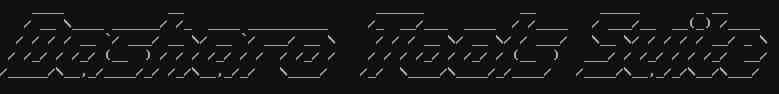

# Dasharo Tools Suite

## Overview

Dasharo Tools Suite (DTS) is a set of tools running in a minimal Linux
environment to deploy, update, and maintain firmware on Dasharo-supported
devices. For example, it can be used to update the firmware on a device or run
the initial deployment, even when no OS is currently installed.

* [Releases](https://github.com/Dasharo/meta-dts/releases) - `meta-dts` GitHub
  repository pages now collects all versions of `DTS` image on `Releases` tab.
  To verify binary integrity with hash and signature please go there, grab
  latest release and follow the instructions in [Dasharo release signature
  verification](../guides/signature-verification.md) using the key for the
  appropriate DTS release [from
  here.](https://github.com/3mdeb/3mdeb-secpack/tree/master/dasharo/dasharo_tools_suite)

* [Building](documentation/building.md) - describes how to build DTS.
* [Running](documentation/running.md) - describes how to run DTS.
* [Supported Hardware](documentation/supported-hardware.md) - lists which
  hardware is supported by DTS.
* [Features](documentation/features.md) - provides more details about DTS
  features.

## Reporting issues

Thank you for using Dasharo Tools Suite. If you have encountered any problems
with this system or would like to provide feedback for us - please open an issue
on [Dasharo
issues](https://github.com/Dasharo/dasharo-issues/issues?q=is%3Aopen+is%3Aissue+label%3ADasharoToolsSuite).
Dasharo Tools Suite has its own label: `DasharoToolsSuite` and [issue
template](https://github.com/Dasharo/dasharo-issues/issues/new?assignees=&labels=bug&projects=&template=bug_report.yml)
for bugs. Other types of issues in the repository are generic and can be used
with the `DasharoToolsSuite` label.

And if you have already used this system and would be interested in supporting
the project, please check the
[How to support us?](../osf-trivia-list/dts.md#how-to-support-us) section.

### Gathering additional information and providing logs

It is not always possible to copy/paste logs from DTS. In such cases, photos or
screenshots are also acceptable. Just imagine you are a professional
photographer trying to capture another natural miracle in the best quality
possible.

But remember that your privacy is on the first place. Do not share sensitive
information.
