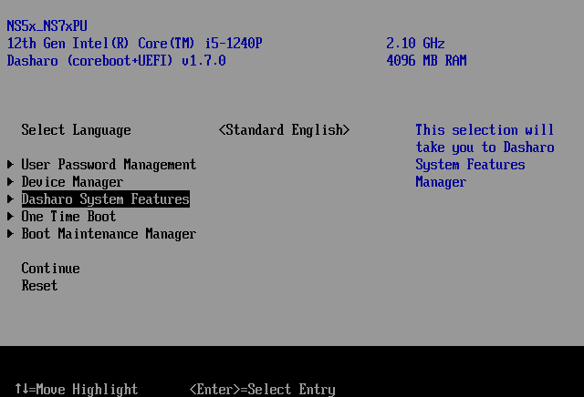
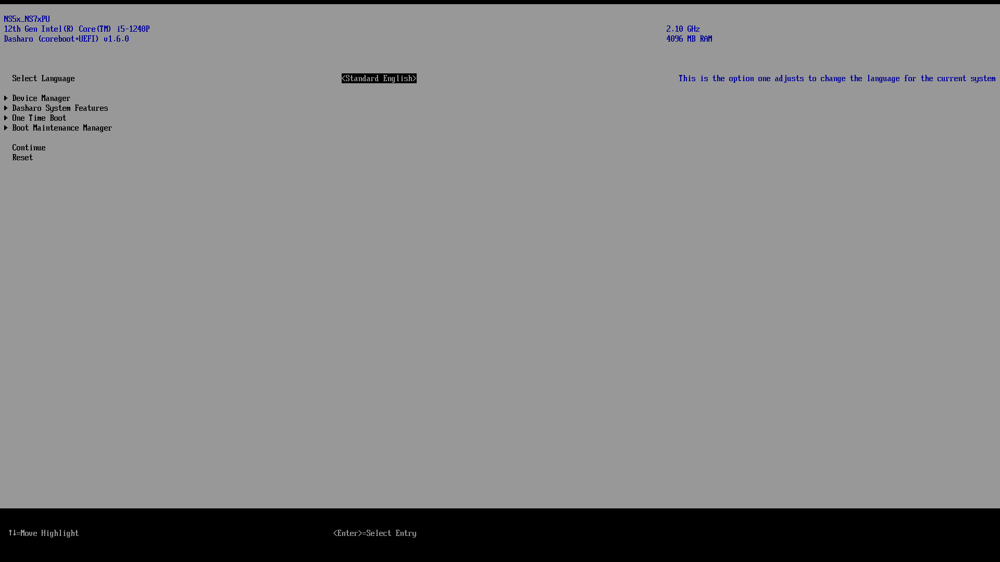
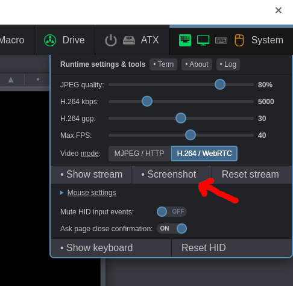

# Taking screenshots in firmware

## Introduction

Dasharo EDKII fork comes with the functionality of taking screenshots. This is
useful for creating guides, how-tos and tests. This document is meant to show
the best practices for taking screenshots.

## Resolution

When taking screenshots, remember to set the display mode to 80x25. This makes
the pictures easier to read when embedded into documentation. Notice how this:



is easier to read than this:



To set the mode in UEFI:

- Enter the UEFI Setup Menu
- Select `One Time Boot`
- Select `UEFI Shell`
- Type in `mode 80 25` and press Enter to switch mode
- Type in `exit` to go back to setup menu

You can browse the setup menu to take your screenshots now.

## Taking screenshots

The key combination for taking screenshots is `LCtrl` + `LAlt` + `F12`. When
taking screenshots, you'll notice a colored status indicator in the top left
corner of the screen. The colors indicate:

- Yellow - no writable FS found, screenshot is not taken
- Blue - current GOP is pitch black, screenshot is not taken
- Red - something went wrong, screenshot is not taken
- Green - screnshot taken and saved to PNG file

PNG files are saved to the first writable partition, which will in most cases be
the EFI System Partition. You can mount the ESP in Dasharo Tools Suite, e.g.:

```bash
# mount /dev/nvme0n1p1 /mnt
```

and then copy the files from there, or just `scp` them to your workstation.

## PiKVM

If a platform has PiKVM connected and configured, you can use it to take
screenshots instead. This makes it easier to save taken screenshots to your
workstation.

To take a screenshot in PiKVM, simply click on the `System` menu in the
top-right corner of the page and click on `Screenshot`:



This will open the screenshot in a new tab. From there you can `right-click` ->
`Save image as...`, or simply press `Ctrl` + `S` to save the image.

## Cropping

If you changed the mode prior to taking the screenshot, you'll notice that the
screenshot captured the entire framebuffer with the small content screen
centered in the middle. You'll need to crop them to size for usage in docs. You
can do this using GIMP's `Crop to Content` feature.
