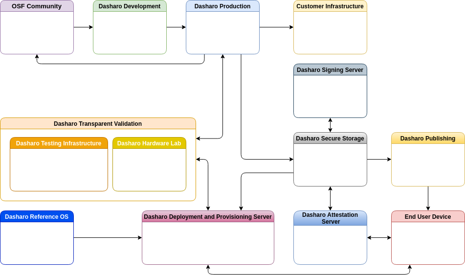

Ecosystem Overview
------------------

Dasharo ecosystem contain multiple components on various levels of
organization. This section overview role of every component.

* Open Source Firmware Community - semi-organised collections of contributors
  to projects related to embedded firmware. Dasharo project contributors are
  part of OSF community.
* Development - Dasharo Development describes processes which Embedded Firmware
  Team uses for the development of Dasharo Modules, which are sometimes custom
  services, but most of the time ready to use productised services, Open Core
  or SaaS.
* Production - Dasharo Production describes the process of putting together Dasharo
  Modules according to specific requirements. In this section we describe
  development infrastructure, build environment, CI/CD and build publishing
  methods. We also cover how production interacts with Dasharo Transparent
  Validation System.
* Customer Infrastructure - Some customers may have the need of replicating part of
  Dasharo Production process and infrastructure in their own environment, which
  leads to repositories synchronization, different CI/CD setup and other needs.
  This section describes interaction with Customer Infrastructure and which part
  of Dasharo Production is deployable on the customer site.
* Transparent Validation - Dasharo Transparent Validation (DTV) is a set of
  software, firmware and hardware components with the goal of simplifying and
  improving long term maintenance of Dasharo firmware. In this section we
  introduce components which belong to DTV.
* Testing Infrastructure - Part of Dasharo Transparent Validation responsible
  for scheduling automated testing, publishing test results and interacting
  with Dasharo Production in the area of release candidate quality confirmation.

<!--
* Hardware Laboratory
* Secure Storage
* Signing Server
* Attestation Server
* Deployment and Provisioning Server
* Reference OS
* Publishing Server
* End User Device
-->
