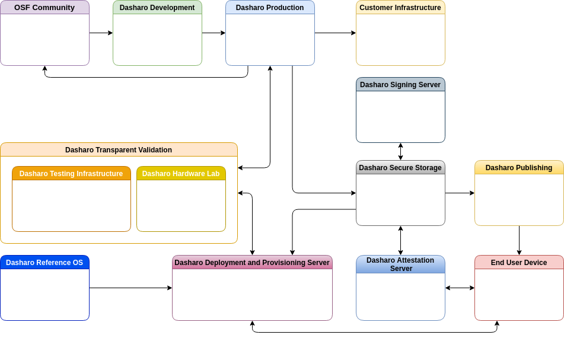

Ecosystem Overview
------------------

Dasharo ecosystem contain multiple components on various levels of
organization. This section overview role of every component.

* [Open Source Firmware Community](ecosystem/osf-community.md) - semi-organised
  collections of contributors to projects related to embedded firmware. Dasharo
  project contributors are part of OSF community.
* [Development](ecosystem/dev.md) - Dasharo Development describe processes
  which Embedded Firmware Team use for development of Dasharo Modules, which
  are sometimes custom services, but most of the time ready to use productised
  services, Open Core or SaaS.
* [Production](ecosystem/prod.md) - Dasharo Production describe process of putting
  together Dasharo Modules according to specific requirements. In this section we
  describe development infrastructure, build environment, CI/CD and build publishing
  methods. We also cover how production interact with Dasharo Transparent Validation
  System. 
* [Customer Infrastructure](ecosystem/customer-infrastructure.md)
* [Testing Infrastructure](ecosystem/testing-infrastructure.md)
* [Hardware Laboratory](ecosystem/hardware-infrastructure.md)
* [Secure Storage](ecosystem/secure-storage.md)
* [Signing Server](ecosystem/signing-server.md)
* [Attestation Server](ecosystem/attestation-server.md)
* [Deployment and Provisioning Server](ecosystem/deployment-and-provisioning-server.md)
* [Reference OS](ecosystem/reference-os.md)
* [Publishing Server](ecosystem/publishing-server.md)
* [End User Device](ecosystem/end-user.md)
