# Capsule Updates

## Introduction

This document lists devices which support UEFI Update Capsules and
demonstrates how to use them for a firmware update.  There is [a more detailed
overview](../kb/capsule-updates-overview.md) which can be helpful in showing how
this compares to other update methods.

## Supported devices

!!! note

    Update Capsules are only supported in UEFI/EDK2 firmware versions,
    not in SeaBIOS or Heads-based firmware flavors.

The following table describes which devices support Update Capsules
and since which firmware release, if applicable.  If a particular device isn't
mentioned, it means that it doesn't support this update method.

| Manufacturer |     Device      | Starting with FW version | V2 starting with FW version |
| ------------ | --------------- | ------------------------ | --------------------------- |
| Hardkernel   | Odroid H4+      | v0.9.1                   | —                           |
| MSI          | Z690-A PRO      | v1.1.4                   | Upcoming DPP release        |
| MSI          | Z790-P PRO      | v0.9.2                   | Upcoming DPP release        |
| NovaCustom   | 11th Gen series | v1.6.0                   | —                           |
| NovaCustom   | 12th Gen series | v1.8.0                   | —                           |
| NovaCustom   | 14th Gen series | v1.0.0                   | —                           |
| NovaCustom   | NUC BOX         | v0.9.0                   | —                           |
| Protectli    | Vault VP66xx    | v0.9.3                   | —                           |

## Prerequisites

* _UEFI Shell_<br>
  If your Dasharo firmware does not include the UEFI Shell as a boot option, you
  will need an external boot device, such as a USB drive containing the UEFI
  Shell.
* _Storage device available from UEFI Shell_<br>
  Not all file-systems are available to UEFI, so not all storage devices and
  partition on them will be usable for the purpose of capsule updates.  An
  ESP (EFI System Partition, where `EFI/` directory is located) is a good choice
  because it should be always readable by UEFI.
  If you're running the UEFI Shell from a USB drive, this step is already
  covered - you can simply continue using the same USB drive.
* _`CapsuleApp.efi`_<br>
  This is a UEFI application which passes a capsule file to firmware to perform
  an update.
* _Firmware capsule_<br>
  The firmware update capsule file itself.  Should have `.cap` file extension.

## What's preserved by an update

| Type         | Notes                                                   |
| ----         | -----                                                   |
| SMMSTORE     | holds UEFI Variables such as [settings] or [boot order] |
| ROMHOLE      | only on MSI                                             |
| SMBIOS       | unique data like serial number or UUID                  |
| boot logo    | [set by the user](logo-customization.md)                |
| GbE          | unique Gigabit Ethernet configuration (MAC address)     |

Preservation is done as a best effort. However some firmware changes are
expected (e.g., current custom logo can be too large for the new firmware),
thus a failure to move data in some cases won't necessarily abort an update.

[settings]: ../dasharo-menu-docs/dasharo-system-features.md
[boot order]: ../dasharo-menu-docs/boot-maintenance-mgr.md

## How to use UEFI Update Capsules

!!! question

    This page describes the manual steps for capsule update. fwupd automates
    all of the steps described here, so you should only need to follow this
    guide if fwupd is unsupported for your device.

1. Copy `CapsuleApp.efi` and `firmware.cap` files to a partition (the shorter
   the path from the root, the easier it will be to find in the UEFI Shell).

2. Enter [Boot Manager Menu][bmm] and select `UEFI Shell` entry.  Alternatively,
   if you're in Setup, use [One Time Boot][otb] which is a different way to do
   the same.

3. Press `Escape` to get to the prompt.  In practice pressing any key works the
   same in most cases, so no problem if you didn't make it in 5 seconds.

4. The first thing that UEFI Shell prints, even before the prompt with the
   timer, is the list of file systems and block devices (it can also be
   retrieved later by running `map` command):
   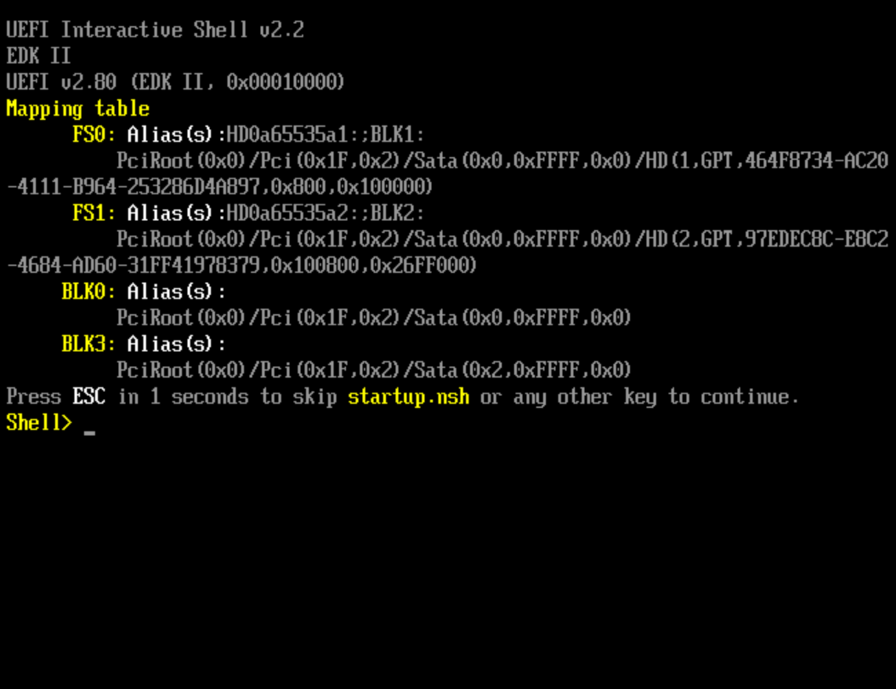
   The hard part is to find the drive with `CapsuleApp.efi` and `firmware.cap`
   among them. One way of doing it is going through `FS*` sequentially using
   `ls` command:
   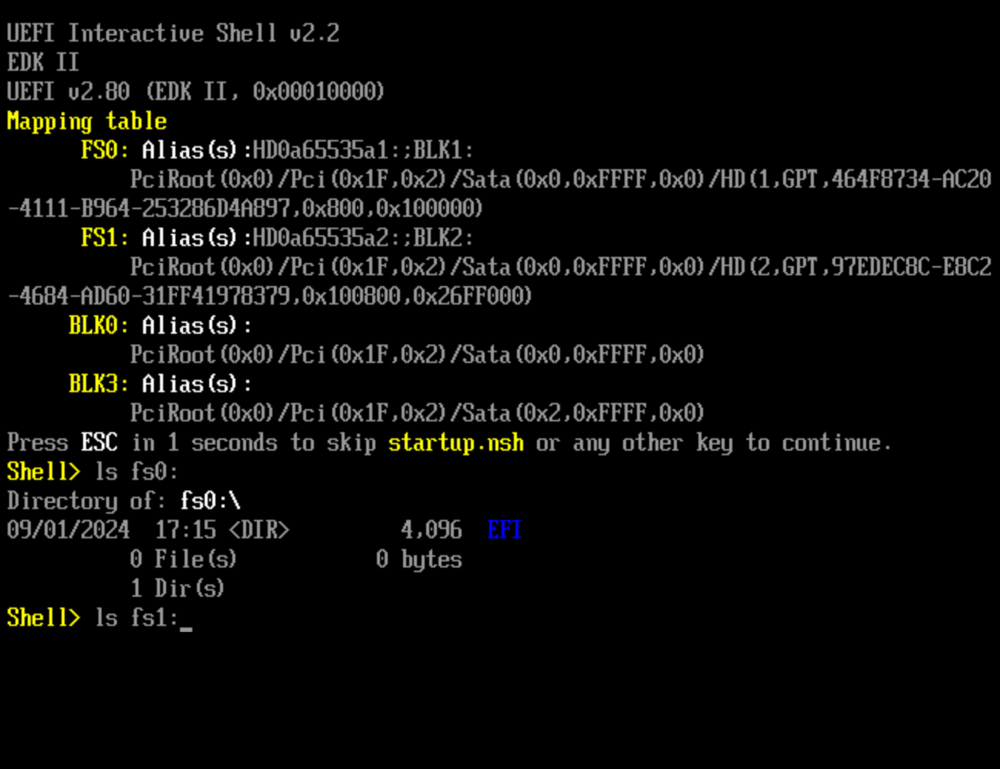
   Once the file-system is identified, run its name to switch to it:
   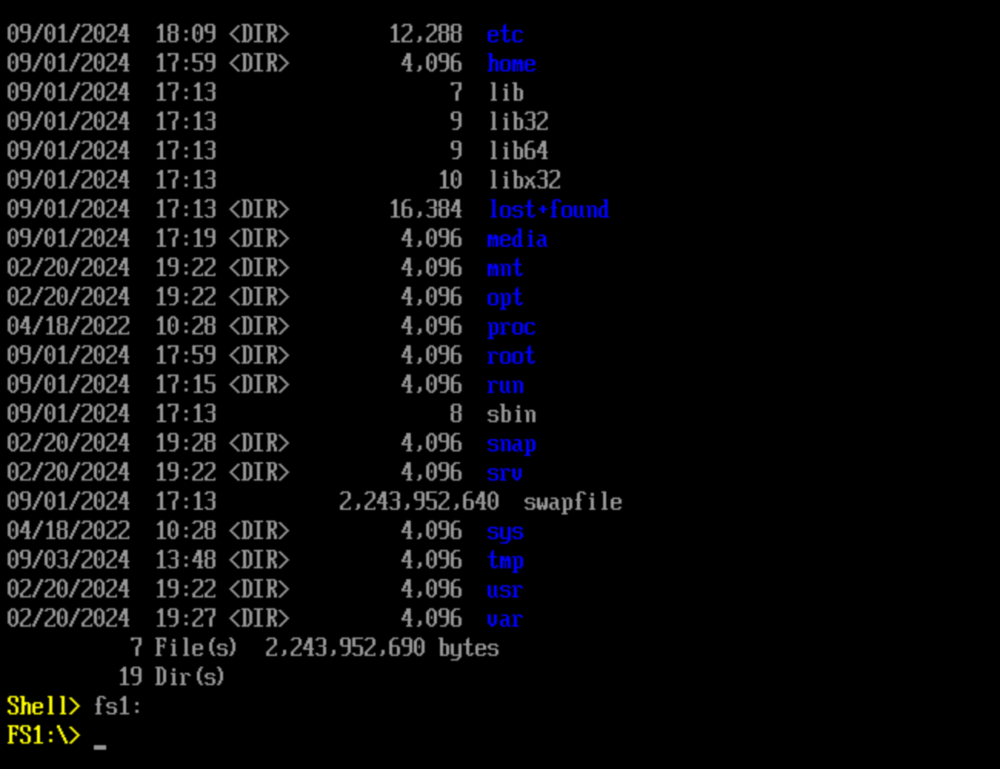

5. If files are in file-system's root, no need to do anything here.  Otherwise,
   use `cd` command to open a target directory to not have to enter full paths:
   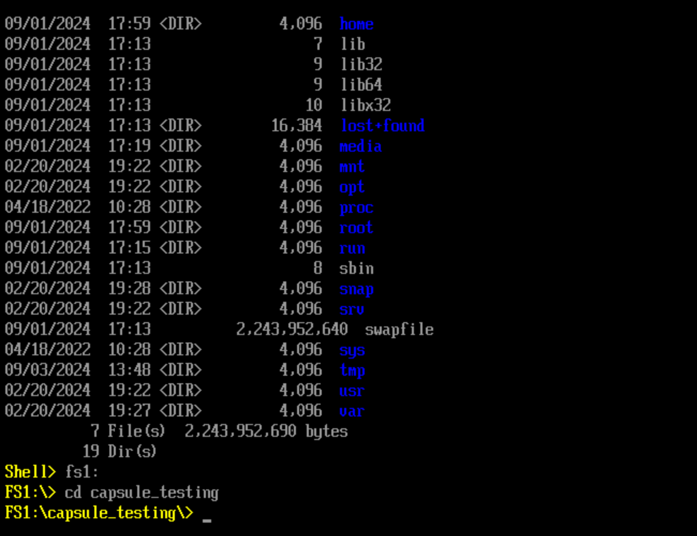

6. Now you should be in a position to initiate a capsule update (run `ls` again
   if in doubt about current location):

    === "Newer versions (V2)"

        Run `CapsuleApp.efi firmware.cap -OD` (substitute `firmware.cap` with an
        actual file name; the `-OD` flag must come after the capsule file name):
        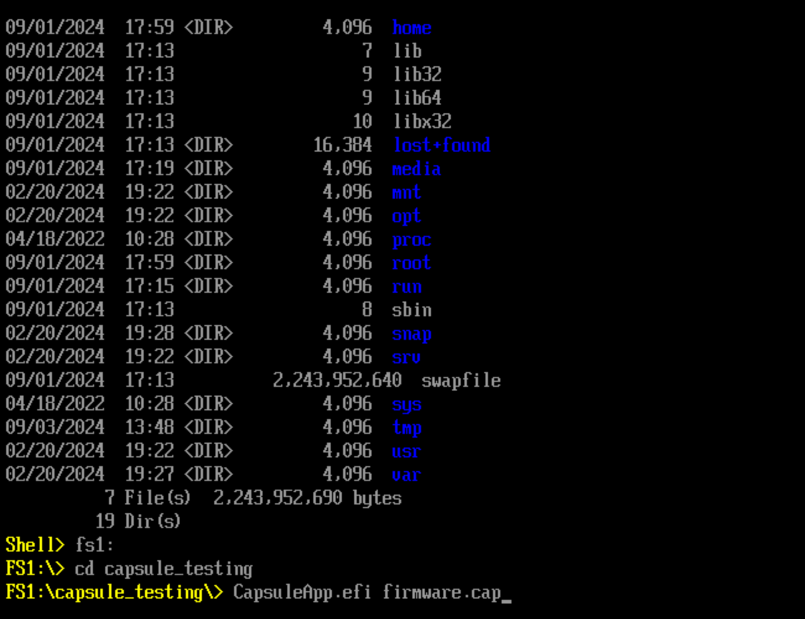

    === "Older versions"

        !!! note

            Out of [technical necessity](https://github.com/Dasharo/dasharo-issues/issues/1302),
            Intel Management Engine (Intel ME) must be HAP-disabled in order for
            firmware to process a capsule successfully. If you're sure that the
            supplied capsule is the correct one, but you keep getting this error:

            ```
            [FIRMWARE WARNING] Capsule updates are only supported while Intel ME is in HAP mode!
            CapsuleApp: failed to query capsule capability - Unsupported
            ```

            Then double-check that Intel ME is in `Disabled (HAP)` state in [the
            corresponding menu][me-menu] or switch it to that state before performing
            an update.

        Ensure Intel ME is [HAP-disabled][me-menu] if it's enabled or soft-disabled
        at the moment. An update won't be initiated if this isn't done
        (`CapsuleApp.efi` will make an effort and give up, so no harm other than
        update not happening).

        Then run `CapsuleApp.efi firmware.cap` (substitute `firmware.cap` with an
        actual file name):
        

7. An ongoing firmware update with graphical progress bar looks like this:

    === "Newer versions (V2)"

        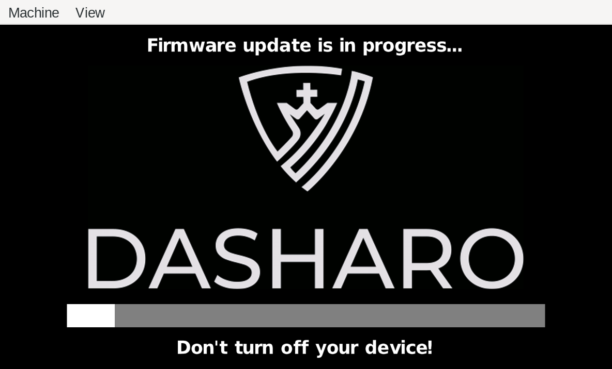

    === "Older versions"

        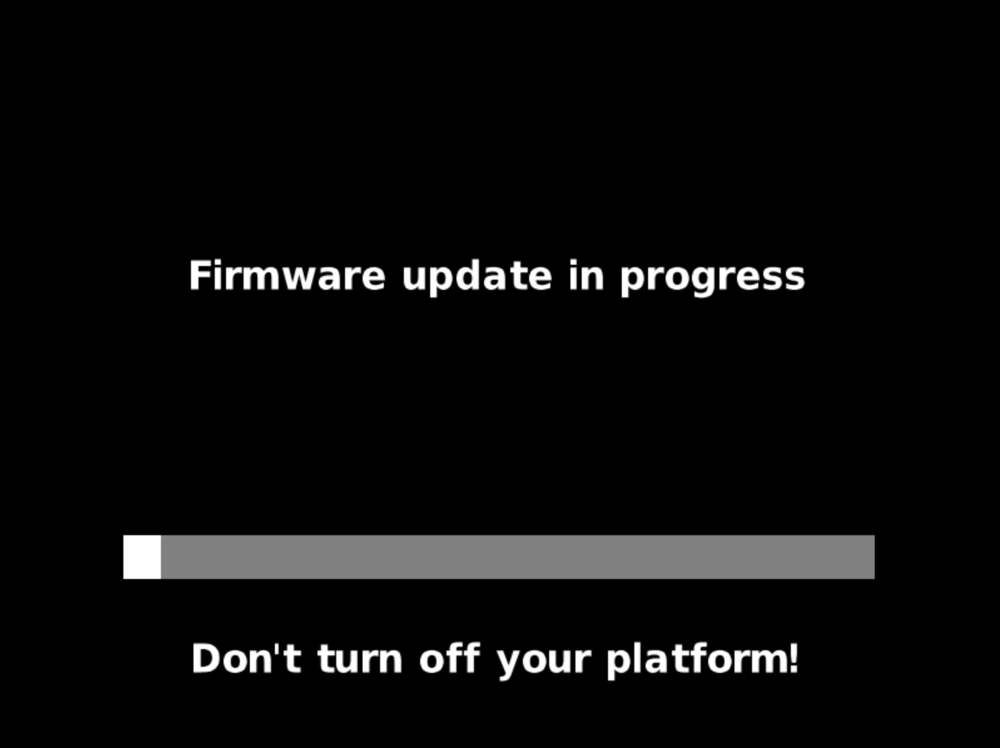

    !!! note

        Many releases for Protectli devices have a textual progress bar. If
        you happen to be doing the update over serial console with no monitor
        plugged in, V2 releases will also fall back to the textual mode over
        serial.

    !!! warning

        Don't reboot or power off the device until the process is completed!

=== "Newer versions (V2)"

    After the update is complete, a results screen will be shown.  On success:

    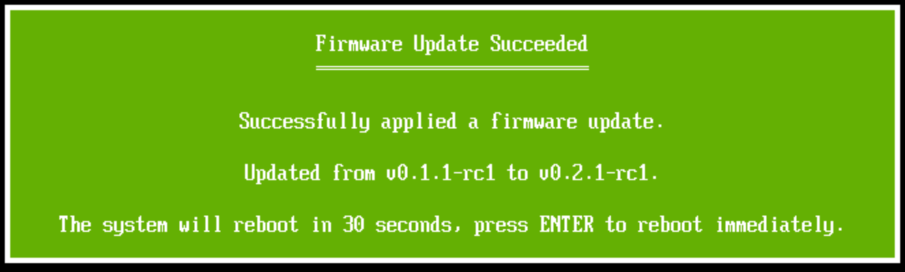

    On failure:

    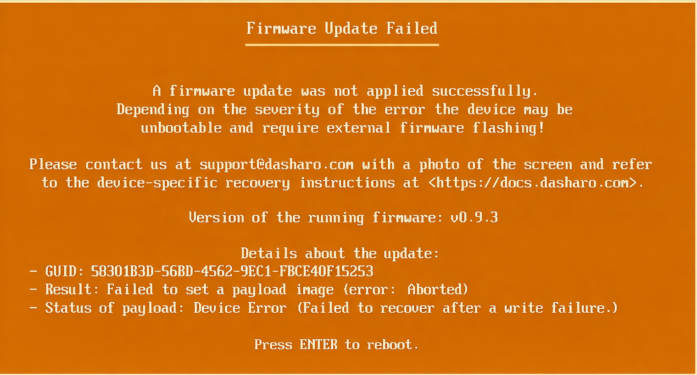

    A failed update is followed by a recovery attempt, which is not guaranteed to
    succeed, but should leave the system bootable in most cases.

    After a successful update, the machine will reboot automatically.  After that,
    if everything succeeded, you should have an updated firmware with data migrated
    from the previous version. In the case of a failure, you will be prompted
    to press `Enter` to attempt reboot. After such reboot successfully restored
    previous firmware might boot, but it can't be guaranteed.

=== "Older versions"

    After either a successful or failed update, the machine should reboot
    automatically.  After that, if everything succeeded, you should have an updated
    firmware with data migrated from the previous version.

    !!! note

        Since the settings were preserved, remember to re-enable Intel Management
        Engine after the update.

[bmm]: ../dasharo-menu-docs/overview.md#boot-manager-menu
[otb]: ../dasharo-menu-docs/overview.md#one-time-boot
[me-menu]: ../dasharo-menu-docs/dasharo-system-features.md#intel-management-engine-options

## Version verification

Current version of the firmware can be seen in the top-left corner of the main
page of the [Setup][main-page].

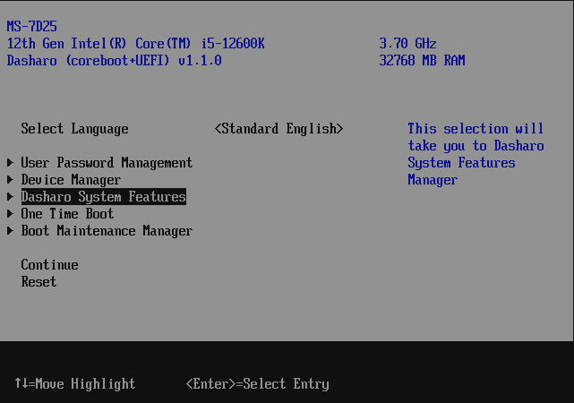

[main-page]: ../dasharo-menu-docs/overview.md#main-page

## Troubleshooting

### Looking up abort reason after a reboot

In case the update process has aborted, one can run `CapsuleApp.efi -S` in UEFI
Shell to get basic information pointing to the reason:

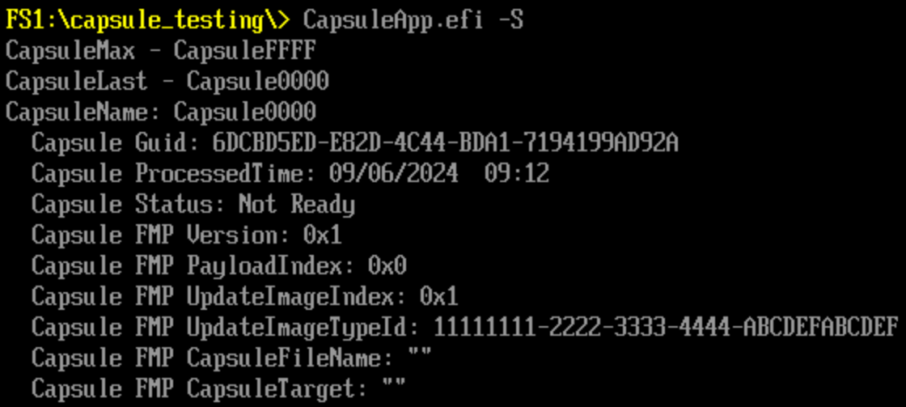

The most interesting field is `Capsule Status:`.  The error codes there are
quite generic but still useful:

* `Security Violation` indicates an issue with capsule's signature
* `Not Ready` indicates that the capsule is unsupported by this firmware, likely
  because it isn't compatible

### Interactive error during an update

You may also see the following screen:

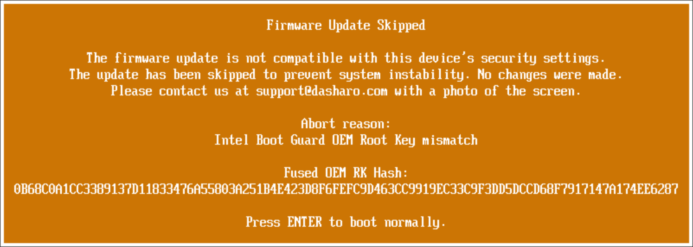

If you see this error, contact our support at support@dasharo.com, making sure
to attach a photo of the screen you're seeing.

## Further information

* [Overview of Update Capsules](../kb/capsule-updates-overview.md)
* [Details on Update Capsules](../kb/edk2-capsule-updates.md)
  (developer-oriented)
