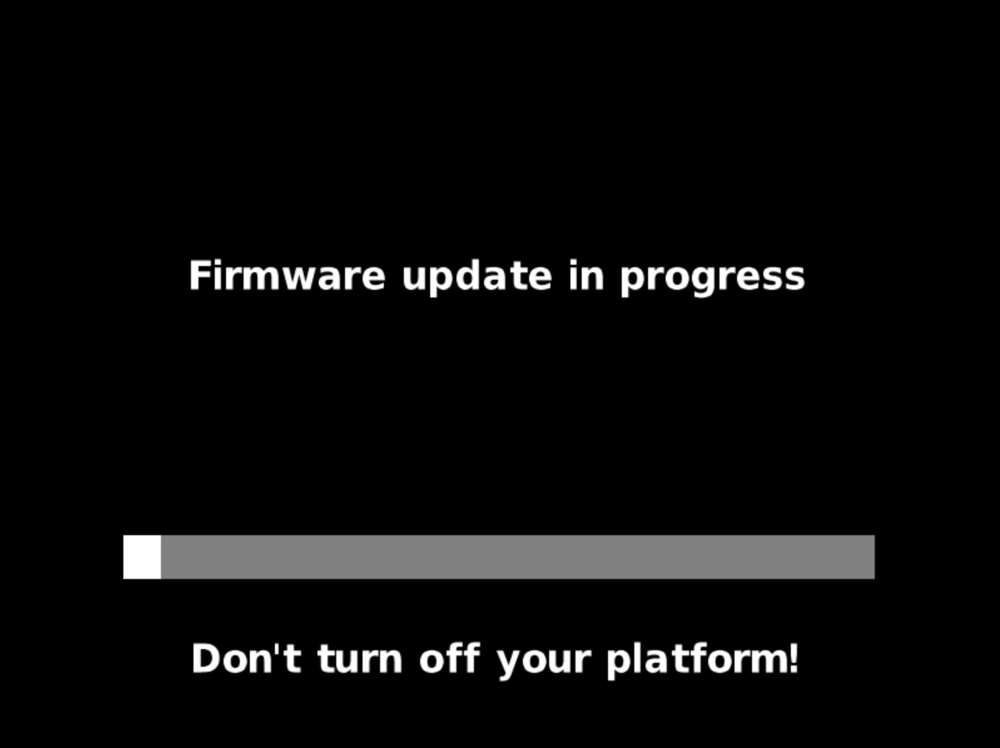
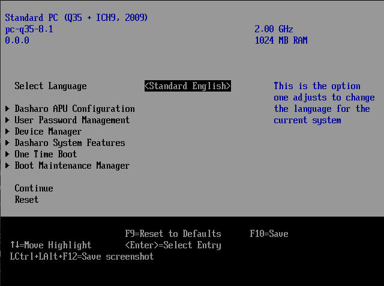

# Capsule Updates

## Introduction

This document lists devices which support UEFI Update Capsules and
demonstrates how to use them for a firmware update.  There is [a more detailed
overview](../kb/capsule-updates-overview.md) which can be helpful in showing how
this compares to other update methods.

## Supported devices

!!! note

    Update Capsules are only supported in UEFI/EDK2 firmware versions,
    not in SeaBIOS or Heads-based firmware flavors.

The following table describes which devices support Update Capsules
and since which firmware release, if applicable.  If a particular device isn't
mentioned, it means that it doesn't support this update method.

| Manufacturer |     Device      | Starting with FW version |
| ------------ | --------------- | ------------------------ |
| MSI          | Z690-A PRO      | v1.1.4                   |
| MSI          | Z790-P PRO      | v0.9.2                   |
| NovaCustom   | 11th Gen series | v1.6.0                   |
| NovaCustom   | 12th Gen series | v1.8.0                   |
| NovaCustom   | 14th Gen series | v1.0.0                   |
| Protectli    | Vault VP66xx    | v0.9.3                   |

## Prerequisites

* _UEFI Shell_<br>
If your Dasharo firmware does not include the UEFI Shell as a boot option, you will
need an external boot device, such as a USB drive containing the UEFI Shell.
* _Storage device available from UEFI Shell_<br>
  Not all file-systems are available to UEFI, so not all storage devices and
  partition on them will be usable for the purpose of capsule updates.  An
  ESP (EFI System Partition, where `EFI/` directory is located) is a good choice
  because it should be always readable by UEFI.
  If you’re running the UEFI Shell from a USB drive, this step is already
  covered- you can simply continue using the same USB drive.
* _`CapsuleApp.efi`_<br>
  This is a UEFI application which passes a capsule file to firmware to perform
  an update.
* _Firmware capsule_<br>
  The firmware update capsule file itself.  Should have `.cap` file extension.

## What's preserved by an update

| Type         | Notes                                      |
| ---          | ---                                        |
| SMMSTORE     | holds UEFI Variables such as [settings](../dasharo-menu-docs/dasharo-system-features.md) or [boot order](../dasharo-menu-docs/boot-maintenance-mgr.md)                  |
| ROMHOLE      | only on MSI                                |
| SMBIOS       | unique data like serial number or UUID     |
| boot logo    | [set by the user](logo-customization.md)   |
| GbE          | unique Gigabit Ethernet configuration (MAC address)  |

Preservation is done as a best effort. However some
 firmware changes are expected (e.g., current custom
 logo can be too large for the new firmware), thus a
 failure to move data in some cases won’t necessarily
 abort an update.

## How to use UEFI Update Capsules

!!! question
    This page describes the manual steps for capsule update. fwupd automates
    all of the steps described here, so you should only need to follow this
    guide if fwupd is unsupported for your device.

!!! note

    Out of technical necessity, Intel Management Engine (Intel ME) must be
    HAP-disabled in order for firmware to process a capsule successfully.  If
    you're sure that the supplied capsule is the correct one, but you keep
    getting this error:

    ```
    CapsuleApp: failed to query capsule capability - Unsupported
    ```

    Then double-check that Intel ME is in `Disabled (HAP)` state in [the
    corresponding menu][me-menu] or switch it to that state before performing
    an update.

1. Copy `CapsuleApp.efi` and `firmware.cap` files to a partition (the shorter
   the path from the root, the easier it will be to find in the UEFI Shell).

2. See the note above about Intel ME and HAP-disable it if it's enabled or
   soft-disabled at the moment.  An update won't be initiated if this isn't
   done (`CapsuleApp.efi` will make an effort and give up, so no harm other than
   update not happening).

3. Enter [Boot Manager Menu][bmm] and select `UEFI Shell` entry.  Alternatively,
   if you're in Setup, use [One Time Boot][otb] which is a different way to do
   the same.

4. Press `Escape` to get to the prompt.  In practice pressing any key works the
   same in most cases, so no problem if you didn't make it in 5 seconds.

5. The first thing that UEFI Shell prints, even before the prompt with the
   timer, is the list of file systems and block devices (it can also be
   retrieved later by running `map` command):
   
   The hard part is to find the drive with `CapsuleApp.efi` and `firmware.cap`
   among them. One way of doing it is going through `FS*` sequentially using
   `ls` command:
   
   Once the file-system is identified, run its name to switch to it:
   

6. If files are in file-system's root, no need to do anything here.  Otherwise,
   use `cd` command to open a target directory to not have to enter full paths:
   

7. Now you should be in a position to initiate a capsule update (run `ls` again
   if in doubt about current location) via `CapsuleApp.efi
   firmware.cap` (substitute `firmware.cap` with an actual file name):
   

8. An ongoing firmware update looks like this:
   

!!! warning

    Don't reboot or power off the device until the process is completed!

After either a successful or failed update, the machine should reboot
 automatically. After that, if everything succeeded, you should have an
 updated firmware with data migrated from the previous version.

!!! note

      Since the settings were preserved, remember to re-enable Intel Management Engine after the update.

[me-menu]: ../dasharo-menu-docs/dasharo-system-features.md#intel-management-engine-options
[bmm]: ../dasharo-menu-docs/overview.md#boot-manager-menu
[otb]: ../dasharo-menu-docs/overview.md#one-time-boot

## Version verification

Current version of the firmware can be seen in the top-left corner of the main
page of the [Setup][main-page].



[main-page]: ../dasharo-menu-docs/overview.md#main-page

## Troubleshooting

In case the update process has aborted, one can run `CapsuleApp.efi -S` in UEFI
Shell to get basic information pointing to the reason:


The most interesting field is `Capsule Status:`.  The error codes there are
quite generic but still useful:

* `Security Violation` indicates an issue with capsule's signature
* `Not Ready` indicates that the capsule is unsupported by this firmware, likely
  because it isn't compatible

## Further information

* [Overview of Update Capsules](../kb/capsule-updates-overview.md)
* [Details on Update Capsules](../kb/edk2-capsule-updates.md)
  (developer-oriented)
