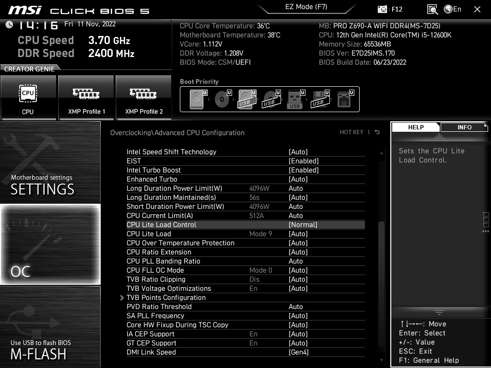
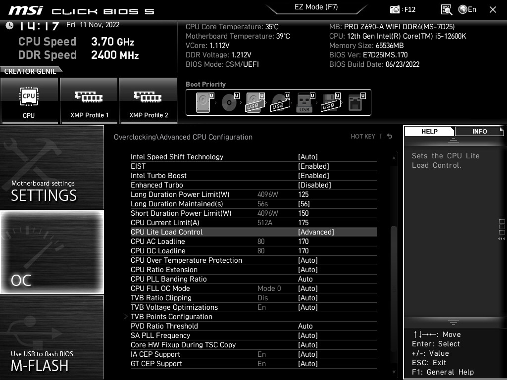
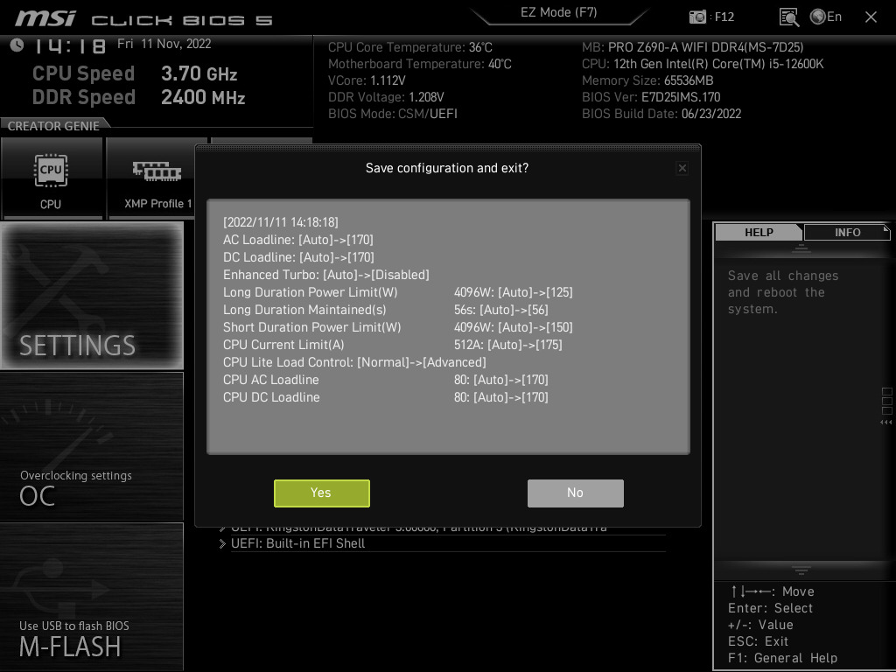

# Dasharo Reviewers Guide

Based on reviews of Dasharo compatible with MSI Z690-A DDR4/DDR5, we created
the following guide to explain the performance gap between MSI proprietary and
Dasharo open-source firmware, but in the long run, the same discoveries can
apply to other Dasharo and open-source firmware solutions.

## Introduction

During the 23+ years of coreboot's existence, one aspect that has never been
in-depth tested is how its performance compares against proprietary firmware
solutions that run on the same hardware platform. The lack of performance
testing is because, for most of the interested parties, the selling point of
coreboot was the transparency of being open-source, and this rarely made direct
comparisons about other features or functionality. Historically, most of what
we could find about coreboot performance involves the lower POST times claims,
but there needs to be more information regarding its runtime performance as
measured in benchmarks, which is a significant point that end users are
interested in. Sadly, we need more internal resources and the necessary field
experience to conduct such exhaustive benchmark testing. Several significant
findings came from third-party benchmarks and community reports, which is
enough to know our current standing. Professional hardware reviewers should be
better at performing and analyzing measures than we are.

## Why We Ask To Fine Tune Settings

In general, we found out in our limited benchmarking that performance
out-of-the-box with Dasharo is measurably lower than performance with MSI
proprietary firmware, in the order of 6-8% on the benchmarked Core i5 12600K.
Lower performance was quickly tracked down to MSI using, by default, certain
processor operating parameters that are quite different from the values stated
on the Intel datasheets, resulting in alterations of the processor behavior
that allows it to sustain Turbo Boost with higher clock speeds and for longer
periods than otherwise possible, and thus appear to perform better overall.
After normalizing across both MSI proprietary firmware and Dasharo, the values
we found were different, and the benchmark difference was [reduced to around 2%
(21:19- 29:00)](https://vimeo.com/756437712).

We also found several review websites that have already written articles and
analysis about this matter. Mainboard vendors use default values above those
specified by Intel (technically overclocking) to produce better performance
results in benchmarks ([AnandTech][anandtech], [TechSpot][techspot],
[VideoCardz][videocardz], [Gamers Nexus about cheating][gamersnexus1],
[GamersNexus about MSI default settings][gamersnexus2], [GamersNexus Z490
YouTube Review][gamersnexus3], [TechPowerUp][techpowerup], [Tom's
Hardware][tomshw]). Depending on whom you ask, using aggressive values by
default can be seen either as a convenience, since the end user gets more
performance without having to know how to configure the firmware, or as a form
of cheating, due to the end user usually having no idea about these changes and
that they are overclocking out-of-the-box. As for the time being, we're
sticking to Intel specification default values; these mainboard vendors'
custom optimizations hurts us because it makes the difference look much bigger
than it is.

What we want to showcase is how Dasharo (for this MSI port, coreboot + EDKII
UefiPayloadPkg) performance compares against the proprietary firmware codebase.
The only way to do so accurately is by ensuring that the hardware operating
values are the same in both Dasharo and the original firmware so that the
performance differences are not due to higher processor clock speeds thanks to
higher Power Limits, unlimited Turbo Boost times, or similar tricks. Note that
we are okay with out-of-the-box comparisons, but that wouldn't be directly an
apples-to-apples comparison of the performance of both firmware codebases,
which is our point. Thus, to make it fair, the hardware has to be tweaked to
run with the same operating values on both. As you can't change values on
Dasharo unless you're willing to recompile (or ask for a custom build with
tweaked values), the easiest way is by bringing MSI firmware values down to
Dasharo/Intel levels.

## Find Your Processor Intel Default Parameters

So far we've found six processor-configurable parameters that differ
significantly: PL1, PL2, PL1 Tau, ICCMAX, DC_LL, and AC_LL. coreboot uses the
values found on two sections of the Intel 12th Generation Intel Core Processors
Datasheet (Volume 1 of 2).  You will have to check the datasheet to find the
proper values for your processor so that you can manually input them onto MSI
firmware. In the case of MSI firmware default values, we found no public
information, so we only know how it autoconfigures the processors we tested.
Note that on the datasheet, Intel doesn't mention processor models by
name/number but instead classifies them by amount of P+E cores and Base Power
TDP, so first, you have to check these two values from Intel Ark for your
processor model, then check on the Datasheet tables what matches both classes
to get the Intel default values for the configurable parameters.

Here are examples covering the 12400, 12600K, 12900K and 12900KS (`Processor
Line Thermal and Power - Package Turbo Specifications (S / HX - Processor
Lines) - S-Processor Line LGA`) from [this section][intel_pl] of datasheet:

[intel_pl]: https://edc.intel.com/content/www/us/en/design/ipla/software-development-platforms/client/platforms/alder-lake-desktop/12th-generation-intel-core-processors-datasheet-volume-1-of-2/009/processor-line-thermal-and-power/

* 12400 6+0 Core 65W PL1 = 65W PL2 = 117W PL1 Tau = 28s
* 12600K 6+4 Core 125W PL1 = 125W PL2 = 150W PL1 Tau = 56s
* 12900K 8+8 Core 125W PL1 = 125W PL2 = 241W PL1 Tau = 56s
* 12900KS 8+8 Core 150W PL1 = 150W PL2 = 241W PL1 Tau = 56s

`VCCCORE DC Specifications - Processor VCCCORE Active and Idle Mode DC Voltage
and Current Specifications - Segment S-Processor Line`  from [this
section][intel_vcc] of datasheet:

[intel_vcc]: https://edc.intel.com/content/www/us/en/design/ipla/software-development-platforms/client/platforms/alder-lake-desktop/12th-generation-intel-core-processors-datasheet-volume-1-of-2/009/vcccore-dc-specifications/

* 12400 S-Processor Line (65W) 6+0 -Core ICCMAX = 151A DC_LL/AC_LL = 1.7 mΩ (170)
* 12600K S-Processor Line (125W) 6+4 -Core ICCMAX = 175A DC_LL/AC_LL = 1.7 mΩ (170)
* 12900K S-Processor Line (125W) 8+8 -Core ICCMAX = 280A DC_LL/AC_LL = 1.1 mΩ (110)
* 12900KS S-Processor Line (150W) 8+8 -Core ICCMAX = 280A DC_LL/AC_LL = 1.1 mΩ (110)[^1]

On S-Processor Line, AC_LL is the same as DC_LL.

For reference, on a 12600K, the MSI 1.70 firmware on Auto with CPU Cooler
Tuning set to Boxed Cooler (lowest values for auto-configuration) uses the
following values vs. Dasharo/Intel defaults:

* MSI BIOS 1.70 PL1 = 241W PL2 = 241W PL1 Tau = 56s ICCMAX = 250A DC_LL/AC_LL = 80
* Dasharo 1.1.0 PL1 = 125W PL2 = 241W PL1 Tau = 56s ICCMAX = 175A DC_LL/AC_LL = 170

## Configure MSI Firmware With Intel Default Parameters

After you have found your processor model values, you can input them on MSI
firmware. Most likely, you want to start from default settings.

Enter MSI Firmware, and change the following:

* Settings Menu (Left Panel) -> Save & Exit
* Restore Defaults (Confirm Yes)
* Save Changes and Reboot (Confirm Yes)

After the power off/on cycle, enter MSI firmware again, change the following
values, then repeat Save Changes and Reboot:

* OC Menu (Left Panel) -> Advanced CPU Configuration
    - Enhanced Turbo: Disabled (This is MSI name for Multi Core Enhancement)
    - Long Duration Power Limit(W): PL1
    - Long Duration Maintained(s): PL1 Tau
    - Short Duration Power Limit(W): PL2
    - CPU Current Limit (A): ICCMAX
    - CPU Lite Load Control: Advanced (Required to input DC_LL and AC_LL as
      numbers instead of "Modes")
    - CPU AC Loadline: AC_LL
    - CPU DC Loadline: DC_LL

## Miscellaneous Comments

* Since you can software flash Dasharo and flash MSI firmware again on the same
  system, you likely want to use the same computer to test both firmware so
  that no temperature or clock speeds difference could attribute to different
  pressure on heatsink mounting or silicon lottery.
* MSI firmware bases its default (Auto) PL1, PL2, and ICCMAX values on the CPU
  Cooler Tuning set. When using Restore Defaults on a 12600K, this setting
  defaults to Water Cooler, which allows for technically unlimited PL1 and PL2
  (4095W). Even the Boxed Cooler setting configures the 12600K to 241W PL1 and
  241W PL2. Thus, you must manually set the individual values for controlled
  results.
* So far, the setting that most affected benchmark scores are AC_LL and DC_LL.
  PL1, PL2 and ICCMAX are limiting. They are only meaningful if the processor
  gets limited by them, which would depend on the processor model (some have more
  headroom than others. PL1 is 125W for both 6+4 12600K and 8+8 12900K, the
  latter would be severely more limited), whereas the other two values are always
  in effect.

On the tested 12600K, the effect of the significantly lower values of AC_LL on
DC_LL that MSI uses is a rather massive difference of 20 Watts in power
consumption (as reported by ThrottleStop and HWiNFO, and also by lower
processor temperatures) when running Cinebench R23. Thus, with MSI values
(whenever on MSI or a custom Dasharo build with those), the 12600K doesn't even
reach the PL1 limit, allowing it to maintain the highest Turbo Boost clock
speeds infinitely, whereas, on Dasharo (or MSI with Intel default values), the
extra power consumption makes it to go beyond PL1, eventually throttling back
to slower clocks to keep under PL1.

* LCC (Loadline Calibration Control) is also present in another menu as CPU
  Loadline Calibration Control, but we left it at Auto. We need to find out if
  changes in CPU Lite Load Control / CPU AC Loadline / CPU DC Loadline change it
  or if LCC operates the same regardless of changes to the previous options.
* The most critical performance-related bug we found in Dasharo involves
  benchmarking Single Thread applications on Windows 11. With Dasharo, Windows
  11 CPU Scheduler likes to move threads around between P and E cores, whereas
  MSI firmware on the same scenario instead always favors P cores. Such behavior
  significantly affects the scores of Single-Threaded benchmarks and makes them
  highly variable depending on which core type a thread spent most of its time.
  There may be MSRs (Model Specific Registers) related to Intel Thread Director
  that we aren't aware of that manages this. The only workaround found is to set
  CPU Affinity manually, which can be performed automatically with Process Lasso,
  with the bonus of using Forced Mode to continuously re-apply the CPU Affinity
  settings, as some applications, including Cinebench, like to change them when
  you start to run the benchmark. Of course, this will not happen on P core, only
  models like 12400. We did not test manual affinity tested on Linux.
* Dasharo currently doesn't support manually changing the memory clock speeds,
  and it will default to the highest standard JEDEC profile supported by the
  installed memory modules. MSI firmware also defaults to JEDEC profiles, so
  out-of-the-box, they're matched at memory configuration, thus not a problem.
  Many enthusiast-grade DDR4 modules use 3200 MHz (maximum supported by Alder
  Lake-S) or higher and have that clock speed as an XMP profile, whereas the
  standard JEDEC profile could be just 2133 or 2400 MHz. In most cases, a 3200
  MHz DDR4 module will run at lower speeds than expected. There are modules rated
  for JEDEC 3200 MHz 22-22-22 @ 1.2V that should work in both Dasharo and MSI
  firmware, in case you're interested in testing this. It is also possible to
  force Dasharo to use an XMP profile if you're willing to recompile or use a
  custom build.
* There are a lot of other settings and MSRs (Model Specific Registers) that we
  have yet to test. We track the progress of that effort in [this][issue173]
  issue. Public [Alder Lake FSP Integration Guide][adl_fsp] documents how to set
  these settings On or Off, but there are few details about how they change the
  Processor behavior. The remaining 2% of performance will come from matching all
  these settings.

[^1]: On the public datasheet, there is no DC_LL for the 8+8 150W class, only
  8+8 125W, but we can confirm from alternate sources that this is the correct
value.
[anandtech]: <https://www.anandtech.com/show/6214/multicore-enhancement-the-debate-about-free-mhz>
[techspot]: <https://www.techspot.com/news/77313-do-need-re-review-core-i9-9900k.html>
[videocardz]: <https://videocardz.com/newz/asus-asrock-and-msi-bring-overclocking-to-h470-b460-and-non-k-intel-core-cpus>
[gamersnexus1]: <https://www.gamersnexus.net/guides/3385-cheating-or-optimized-z390-motherboard-bclk-comparison>
[gamersnexus2]: <https://www.gamersnexus.net/guides/3590-dont-run-z490-motherboards-with-default-settings-for-your-build>
[gamersnexus3]: <https://www.youtube.com/watch?v=qQ_AETO7Fn4>
[techpowerup]: <https://www.techpowerup.com/268260/hwinfos-power-reporting-deviation-sensor-reveals-how-motherboard-makers-are-cheating-ryzen-cpus>
[tomshw]: <https://www.tomshardware.com/features/amd-ryzen-motherboard-power-cheat-testing>
[issue173]: <https://github.com/Dasharo/dasharo-issues/issues/173#issuecomment-1213181583>
[adl_fsp]: <https://github.com/intel/FSP/blob/master/AlderLakeFspBinPkg/Docs/AlderLake_FSP_Integration_Guide.pdf>
