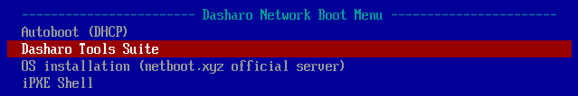

# Firmware update

## Introduction

This document is a guide for updating firmware on your Dasharo-powered device.

## Firmware Update Method Support Table

The table below shows which firmware update methods are supported
for which devices supporting the Dasharo firmware.

- Every device supports manual updates.
- If a device is missing from the table, the only update method supported is
flashing a firmware ROM file manually.
- A hyphen means no support for a given method.
- A version in a column means the method is supported starting from the given
Dasharo version. The update to the first supported version for a given method
needs to be performed using other methods.
- The table might contain upcoming and not yet released versions if the feature
is planned.

{{ read_csv('./firmware-update-method-support-table.csv') }}

[fum]: ../kb/firmware-update-mode.md
[cup1]: ./capsule-update.md
[fwupd]: ../kb/fwupd.md
[lvfs]: ../kb/fwupd.md
[cup2]: ./capsule-update.md

!!! note

    Firmware Update Mode (FUM) and Capsule Updates are only supported in UEFI
    firmware, not supported in SeaBIOS or Heads-based firmware flavors.

!!! note

    Enforcing capsule authentication in V2 made newer capsules incompatible
    with the older ones.  The first release with V2 publishes capsules of the
    older kind which can be used to upgrade from prior releases, but starting
    with this release **older capsules are no longer accepted** to not
    compromise capsule authentication enhancements.

## Manual update

Firmware versions without support for Firmware Update Mode have various update
procedures. Check out your device's Firmware Update documentation for more
information.

## Known issues

Here are known issues, grouped by the platform vendor.

### Generic

#### Firmware doesn't support capsule update in FUM

This issue can happen if DTS was booted via [FUM](#firmware-update-mode) on
Dasharo firmware version that does not support capsule updates while in FUM.
It can only occur when in Firmware Update Mode and only if capsules are
available as this is default way of updating or fusing your firmware.

??? note

    You can read more about this issue at
    <https://github.com/Dasharo/dasharo-issues/issues/1759>

??? success "Solution"

    * Boot DTS without Firmware Update Mode. To do that you can follow
    [DTS documentation](../../dasharo-tools-suite/documentation/running).
    * When in Firmware Update Mode make sure to use
        [dts.ipxe](https://boot.dasharo.com/dts/dts.ipxe) script when booting
        DTS. You can do that by:

        * Letting FUM boot it by default
        * Choosing `Dasharo Tools Suite` in `Dasharo Network Boot Menu`

            

        * Running it manually from iPXE shell by following [Launching
            DTS](../../dasharo-tools-suite/documentation/running/#launching-dts)

#### Failed to queue capsule update

The most likely reason for this error is enabled ME. If FD region is unlocked,
then capsule update requires ME to be HAP disabled.

??? note

    In case of locked FD region, e.g. on some
    [MSI platforms](#locked-fd-region-and-me-warnings) or on [fused NovaCustom
    laptops](../dasharo-tools-suite/documentation/features.md#fuse-platform-dasharo-trustroot)
    updates don't require ME to be HAP disabled (as it can't be done) so
    solution below won't work for you. In that case, please report the issue.

??? success "Solution"

    1. Set ME mode to [disabled (HAP)](../dasharo-menu-docs/dasharo-system-features.md#intel-management-engine-options)
    1. Save changes and reboot platform
    1. Try the [update again](#firmware-update-mode)

If update still fails, please [report
it](../dasharo-tools-suite/overview.md#reporting-issues).

#### Heads update fails

Heads firmware update fails with error message displaying issues with (any of)
FD, ME or BIOS regions being either locked or not flashed.

??? success "Solution"

    For heads update, the following regions must be unlocked and flashed: FD,
    ME, BIOS. If any of the regions is locked, the update will not proceed
    in order to avoid bricking the device.

    For ME related warnings, please ensure the Intel Management Engine is
    disabled in Dasharo settings. Please disable management engine using
    `HAP` mode, and if the update still fails after the change, please also try
    with ME in "soft-disabled" mode.

### MSI

---

#### Locked FD region and ME warnings

The following warnings appear when updating Dasharo:

```bash
The firmware binary to be flashed contains Flash Descriptor (FD), but FD is not writable!
The firmware binary contains Management Engine (ME), but ME is not disabled!
```

??? success "Solution"

    The locked Flash Descriptor makes it impossible to unlock and flash the
    Management Engine. The problem is not critical and you may continue with the
    update process. Your firmware will contain old ME. However, we advise to perform
    additional steps to flash it, as the old ME may cause some issues in the future.
    To do that, you will have to flash firmware with FD and ME externally using
    FlashBIOS. This will bypass the locks on those regions. If you wish to proceed
    with this approach, please follow the steps in the
    [recovery guide][recovery-msi]. Keep in mind that the memory will need to be
    trained again, and firmware settings will be reset.

#### FlashBIOS not working

Platform: `MSI Z790-P DDR4`

Dasharo version: Before `v0.9.2`

FlashBIOS does not work

??? success "Solution"

    The problem is likely caused by the fact that we changed the versioning scheme
    of firmware. Due to this mismatch, FlashBIOS only works for `Z790-P DDR4` since
    `v0.9.2`. If you wish to update to that version, you will first need to flash
    the BIOS region with `v0.9.2` firmware and then use FlashBIOS to flash
    everything, including ME. You can flash BIOS with the following command:

    ```bash
    flashrom -p internal --noverify-all --ifd -i bios -w <firmware_file>
    ```

[recovery-msi]: ../unified/msi/recovery.md
