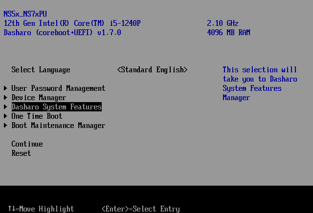

# Firmware update

## Introduction

This document is a guide for updating firmware on your Dasharo-powered device.

!!! tip

    If your current firmware supports UEFI Update Capsules, there is a dedicated
    [guide on their usage](../guides/capsule-update.md).  If unsure, check out
    [the compatibility table](../guides/capsule-update.md#supported-devices)
    there.

## Firmware Update Mode

Newer Dasharo releases support Firmware Update Mode, which performs updates
automatically over the network.

!!! question "Does my device support Firmware Update Mode?"

    Not sure if your device supports Firmware Update Mode? Check out the
    [compatibility table](/kb/firmware-update-mode#supported-devices) in the
    Knowledge Base section.

To enter Firmware Update Mode:

1. Enter the Setup Menu and navigate to Dasharo System Features:

1. Navigate to `Dasharo Security Options`:

1. Select `Firmware Update Mode`:

1. When prompted, press Enter to accept. The device will reboot in Firmware
  Update Mode.

1. After reboot, when prompted, press the indicated key on the keyboard.
  Alternatively, to abort Firmware Update Mode, press Enter instead or simply
  wait for the timeout to expire.

Once in Firmware Update Mode, proceed with the firmware update steps outlined
in device-specific documentation.

After the firmware update is finished, the device will reboot automatically. If
the update includes an Embedded Controller firmware update, it will be applied
automatically after reboot and the device will reboot again.

!!! tip

    Check out a more detailed explanation and rationale for Firmware Update Mode
    in the [Knowledge Base](/kb/firmware-update-mode) section.

## Manual update

Firmware versions without support for Firmware Update Mode have various update
procedures. Check out your device's Firmware Update documentation for more
information.
