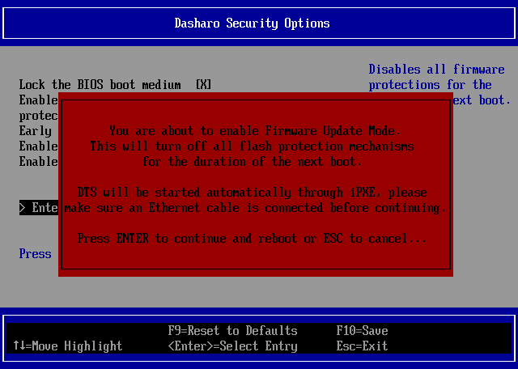

# Firmware update

## Introduction

This document is a guide for updating firmware on your Dasharo-powered device.

!!! tip

    If your current firmware supports UEFI Update Capsules, there is a dedicated
    [guide on their usage](../guides/capsule-update.md).  If unsure, check out
    [the compatibility table](../guides/capsule-update.md#supported-devices)
    there.

## Firmware Update Mode

Newer Dasharo releases support Firmware Update Mode, which performs updates
automatically over the network.

!!! question "Does my device support Firmware Update Mode?"

    Not sure if your device supports Firmware Update Mode? Check out the
    [compatibility table](../kb/firmware-update-mode.md#supported-devices) in the
    Knowledge Base section.

To enter Firmware Update Mode:

1. Enter the Setup Menu and navigate to Dasharo System Features:

1. Navigate to `Dasharo Security Options`:

1. Select `Firmware Update Mode`:

1. When prompted, press Enter to accept. The device will reboot in Firmware
  Update Mode.

1. After reboot, when prompted, press the indicated key on the keyboard.
  Alternatively, to abort Firmware Update Mode, press Enter instead or simply
  wait for the timeout to expire.

Once in Firmware Update Mode, proceed with the firmware update steps outlined
in device-specific documentation.

After the firmware update is finished, the device will reboot automatically. If
the update includes an Embedded Controller firmware update, it will be applied
automatically after reboot and the device will reboot again.

!!! tip

    Check out a more detailed explanation and rationale for Firmware Update Mode
    in the [Knowledge Base](../kb/firmware-update-mode.md) section.

## Manual update

Firmware versions without support for Firmware Update Mode have various update
procedures. Check out your device's Firmware Update documentation for more
information.

## Known issues

Here are known issues, grouped by the platform vendor.

### Generic

#### Heads update fails

Heads firmware update fails with error message displaying issues with (any of)
FD, ME or BIOS regions being either locked or not not flashed.

??? success "Solution"

    For heads update, the following regions must be unlocked and flashed: FD,
    ME, BIOS. If any of the regions is locked, the update will not proceed
    in order to avoid bricking the device.

    For ME related warnings, please ensure the Intel Management Engine is
    disabled in Dasharo settings. Please disable management engine using
    `HAP` mode, and if the update still fails after the change, please also try
    with ME in "soft-disabled" mode.

### MSI

---

#### Locked FD region and ME warnings

The following warnings appear when updating Dasharo:

```bash
The firmware binary to be flashed contains Flash Descriptor (FD), but FD is not writable!
The firmware binary contains Management Engine (ME), but ME is not disabled!
```

??? success "Solution"

    The locked Flash Descriptor makes it impossible to unlock and flash the
    Management Engine. The problem is not critical and you may continue with the
    update process. Your firmware will contain old ME. However, we advise to perform
    additional steps to flash it, as the old ME may cause some issues in the future.
    To do that, you will have to flash firmware with FD and ME externally using
    FlashBIOS. This will bypass the locks on those regions. If you wish to proceed
    with this approach, please follow the steps in the
    [recovery guide][recovery-msi]. Keep in mind that the memory will need to be
    trained again, and firmware settings will be reset.

#### FlashBIOS not working

Platform: `MSI Z790-P DDR4`

Dasharo version: Before `v0.9.2`

FlashBIOS does not work

??? success "Solution"

    The problem is likely caused by the fact that we changed the versioning scheme
    of firmware. Due to this mismatch, FlashBIOS only works for `Z790-P DDR4` since
    `v0.9.2`. If you wish to update to that version, you will first need to flash
    the BIOS region with `v0.9.2` firmware and then use FlashBIOS to flash
    everything, including ME. You can flash BIOS with the following command:

    ```bash
    flashrom -p internal --noverify-all --ifd -i bios -w <firmware_file>
    ```

[recovery-msi]: ../unified/msi/recovery.md
