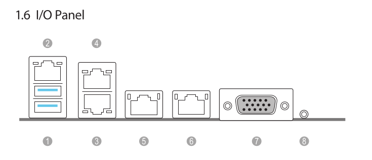

# Laboratory stand dedicated to ASRock Rack SPC741D8-2L2T/BCM lab assembly guide

## Introduction

This document describes platform-specific details for assembling an [ASRock Rack
SPC741D8-2L2T/BCM](https://www.asrockrack.com/general/productdetail.asp?Model=SPC741D8-2L2T/BCM#Specifications)
testing stand. Use this document as reference while going through [Generic
Testing Stand
Setup](../../unified-test-documentation/generic-testing-stand-setup.md)

## Prerequisites

The below table contains information about all elements which are needed to
create the testing stand.

* ASRock Rack SPC741D8-2L2T/BCM platform
* [RTE v1.1.0](https://shop.3mdeb.com/shop/open-source-hardware/open-source-hardware-3mdeb/rte/)
* Sonoff S20 type E
* 5x2 1mm pitch female header to 10x 2.54mm female DuPont connector adapter
  cable
* 2x female to female 2.54mm DuPont wire
* DB9 null modem cable
* DB9 serial port to 10 pin header adapter
* [Board manual](https://download.asrock.com/Manual/SPC741D8-2L2TBCM.pdf)

## Connections

The following sections describe how to enable all of the following features:

* serial connection to the platform,
* controlling power supply,
* enabling basic power actions with the platform (power off/power on/reset),
* external flashing with the RTE,

### Serial connection

Connect the DB9 to 10 pin header adapter to the COM1 header on the motherboard.

Connect the DB9 null modem cable to the RTE DB9 connector and to the DB9 to
10 pin header adapter.

### Power supply controlling

Connect the PSU power cord to Sonoff.

### Basic power operations enabling

Connect the RTE J11 header to the platform JFP1 header as described in the
table:

|    RTE    | ASRock SPC741D8 PANEL1 header |
| :-------: | :---------------------------: |
| J11 pin 9 |            PWRBTN#            |
| J11 pin 8 |            RESET#             |

### External flashing enabling

1. Connect the **5x2 1mm pitch female header to 10x 2.54mm female DuPont
   connector adapter cable** to the BIOS_PH1 header
2. Map out the BIOS pins: Using a multimeter in continuity mode, probe each
   of the 2.54mm pins against each of the pins on the SOIC-16 BIOS package
3. Once you have labeled each of the pins, connect them to the RTE's SPI
   header

### Complete Setup

After preparing all of the connections, three activities should also be
performed to enable all of the test stand features:

1. Connect Sonoff to the mains:

    

1. Connect the RTE to the Internet by using the Ethernet cable.
1. Connect the RTE to the mains by using the microUSB 5 V/2 A power supply.

## Theory of operation

The following sections describe how to use all of the enabled features:

* serial connection to the platform,
* controlling power supply,
* enabling basic power actions with the platform (power off/power on/reset),
* external flashing with the RTE,
* device power status readout.

### Serial connection

The method of setting and using serial connection is described in the
[Serial connection guide](../../transparent-validation/rte/v1.1.0/serial-port-connection-guide.md).

### Power supply controlling

Power supply controlling (in this case: controlling the state of Sonoff)
should be performed with
[osfv_cli](https://github.com/Dasharo/osfv-scripts/tree/main/osfv_cli).

To perform basic power operations use the commands described below:

1. Turn on the power supply:

    ```bash
    osfv_cli sonoff --sonoff_ip <sonoff_ip_address> on
    ```

2. Turn off the power supply:

    ```bash
    osfv_cli sonoff --sonoff_ip <sonoff_ip_address> off
    ```

### Basic power operations

Basic power operations should be performed based on the
[osfv_cli](https://github.com/Dasharo/osfv-scripts/tree/main/osfv_cli). To
perform basic power operations use the commands described below:

1. Turn on the platform:

    ```bash
    osfv_cli rte --rte_ip <rte_ip_address> pwr on
    ```

1. Turn off the platform:

    ```bash
    osfv_cli rte --rte_ip <rte_ip_address> pwr off
    ```

1. Reset the platform:

    ```bash
    osfv_cli rte --rte_ip <rte_ip_address> pwr reset
    ```

> Note, that in order for the above commands to work properly, the platform
should be powered up: both Sonoff and the power supply must be turned on.

### External flashing

The external flashing procedure should be performed using [OSFV
cli](https://github.com/Dasharo/osfv-scripts).

For external flashing hardware connection please refer to the [board's
recovery section (setup with RTE)](../../variants/asrock_spc741d8/recovery.md).

### Ethernet

The board's IPMI Ethernet (2) as well as second Ethernet port (4) for host
should be connected to the network.


