# OpenBMC Lab Assembly Guide for ASRock Turin

## Introduction

This document describes platform-specific details for assembling an
[ASRock Rack TURIND8UD-2T/X550](https://www.asrockrack.com/general/productdetail.asp?Model=TURIND8UD-2T/X550#Specifications)
testing stand. Use this document as reference while going through
[Generic Testing Stand Setup](../../unified-test-documentation/generic-testing-stand-setup.md)

## Prerequisites

The below table contains information about all elements which are needed to
create the testing stand. Most of the hardware matches the platform's main
components - refer to the
[hardware configuration matrix](../../variants/asrock_turind8ud/hardware-matrix.md#main-components)
for the CPU, RAM, case, power supply, and so on.

- ASRock Rack TURIND8UD-2T/X550 platform
- [RTE v1.1.0](https://shop.3mdeb.com/shop/open-source-hardware/open-source-hardware-3mdeb/rte/)
- RTE SPI extender HAT (exposes `SPI_1` and `SPI_2` headers)
- NOUS A1T smart outlet
- IDC to RS232 adapter
- RS232 null modem cable
- SPI flash TPM adapter set, one for the motherboard `TPM_BIOS_PH_1` header and
    one for the SPI extender HAT
- matching IDC or FPC cable around 30 cm long (for the host SPI flash),
    depending on adapter used in previous point
    * FPC: pitch 1 mm, 13 conductors, same side contacts
    * IDC: pitch: 2.54 mm, 14 conductors
- 3x 2.54 mm female to female jumper wire cables
- 2x5 1.27mm pitch IDC connector to individual 2.54mm female connector
    cables (for the BMC SPI flash)
- 3D printed RTE mount (modular base with a stackable RTE base)
- 4x M3 6mm screws with nuts (to join the 3D printed parts)
- 7x M3 6mm screws (3 to fasten the RTE to the RTE base, 4 to fasten the base to
    the PC case)

## RTE mount

The RTE sits on a 3D printed mount that screws into the bottom of the PC case,
reusing the case's fan or SSD mounting holes. The mount is modular: printed
parts stack on top of the base and screw together, and the RTE fastens to a
printed RTE base on the stack.

1. Join the 3D printed parts. Each edge is fixed with an M3 6mm screw and nut,
    four pairs in total (one per edge):

    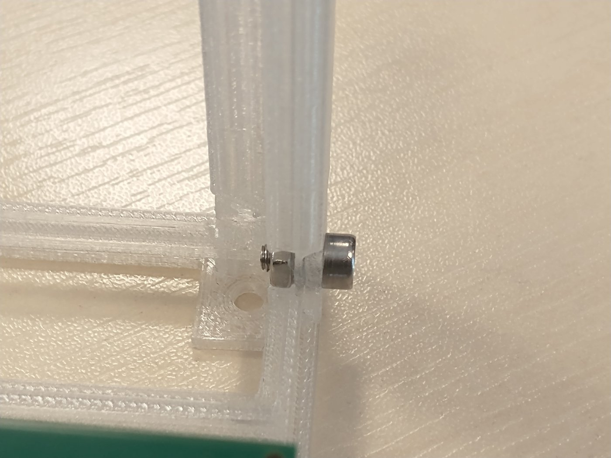

1. Fasten the RTE to the RTE base with 3 M3 6mm screws:

    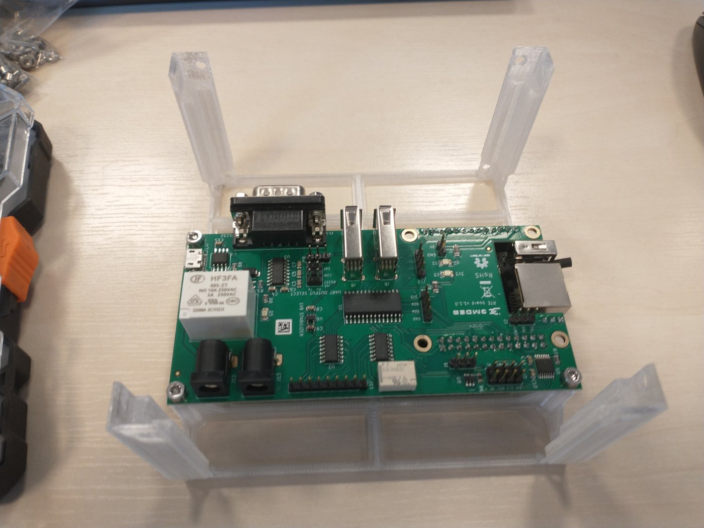

1. Stack the SPI extender HAT (RTE SPI mux) on top of the RTE:

    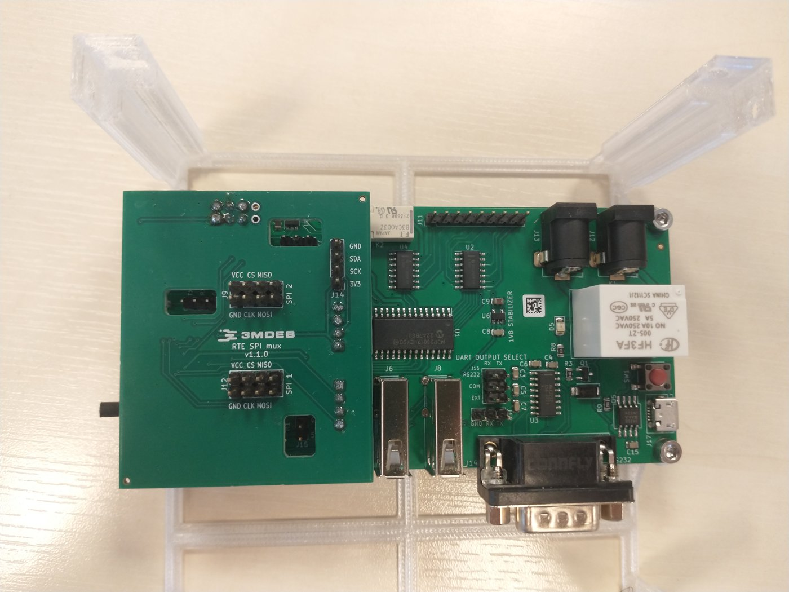

1. Screw the assembled base into the bottom of the PC case with 4 M3 6mm screws,
    using the case's fan or SSD mounting holes. The bare base is shown below to
    make the mounting location clear:

    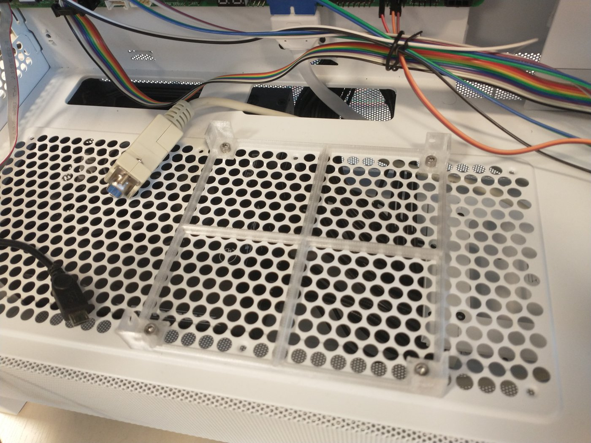

    > Screw the base into the case only after the previous steps are done. Once
    > the base is fixed in the case there is not enough room for a screwdriver,
    > which makes joining the printed parts (step 1) very hard.

## Connections

The following sections describe how to enable all of the following features:

- serial connection to the platform,
- controlling power supply,
- enabling basic power actions with the platform (power off/power on/reset),
- external flashing with the RTE,

### Serial connection

- Fit both jumpers, the TX one and the RX one, on the RTE [UART output select
    header](../../transparent-validation/rte/v1.1.0/specification.md#uart-output-select-header)
    (`J16`) to `RS232 + COM`. That routes the serial output to the DB9
    connector.
- Connect the IDC to RS232 adapter to the COM1 header on the motherboard.

    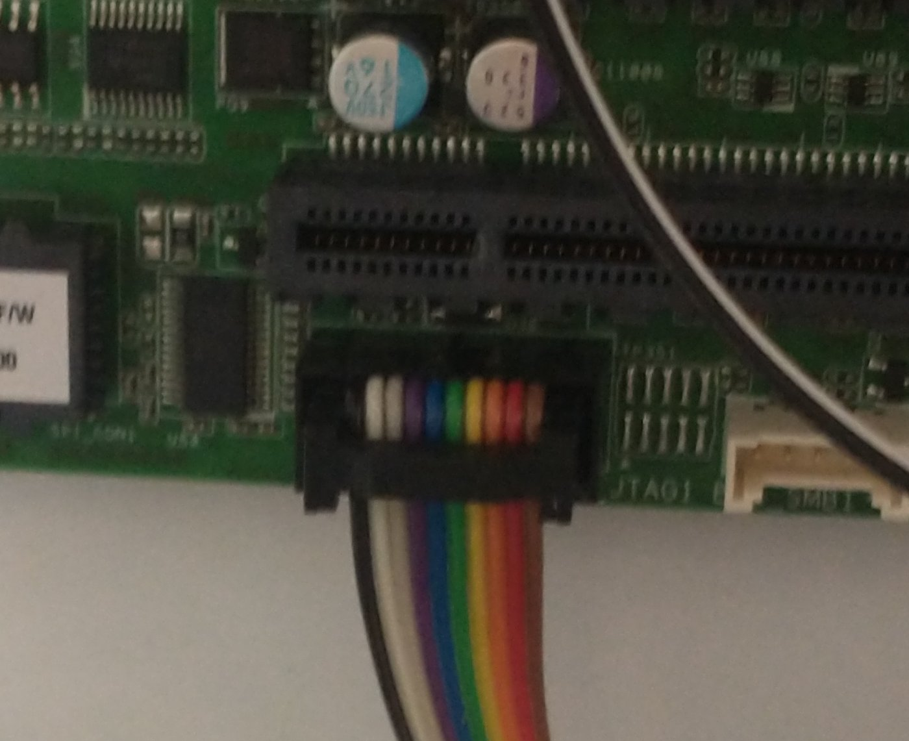

- Connect the RS232 null modem cable to the RTE DB9 connector and to the IDC to
  RS232 adapter.

    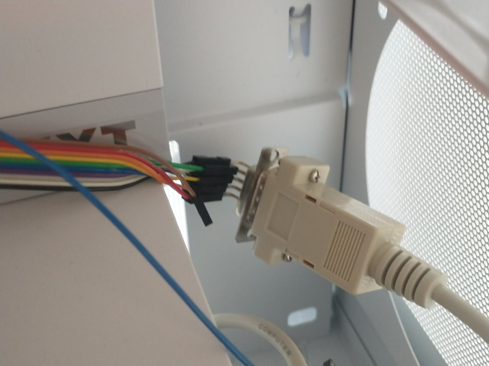

### Power supply controlling

Connect the PSU power cord to the NOUS A1T smart outlet.

### Basic power operations enabling

Connect the RTE to the platform 9-pin PANEL1 header as described in the table.
PWRBTN# and RESET# enable the power and reset operations. PLED+ is wired to the
RTE J1 header for the device power status readout.

|    RTE    | ASRock TURIND8UD PANEL1 header |
| :-------: | :----------------------------: |
| J11 pin 9 |            PWRBTN#             |
| J11 pin 8 |             RESET#             |
| J1 pin 1  |             PLED+              |

Cables connected to the RTE:

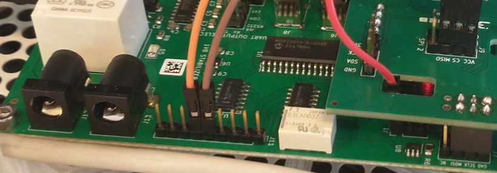

Cables connected to the PANEL1 header on the motherboard:

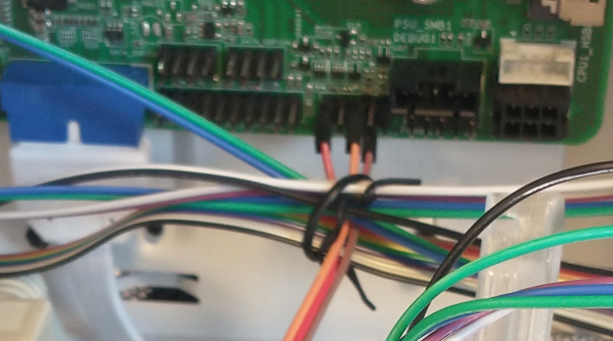

### External flashing enabling

External flashing uses the SPI extender HAT (RTE SPI mux) on the RTE. The HAT
exposes two SPI headers, `SPI_1` and `SPI_2`, each labeled `VCC`/`CS`/`MISO` on
one row and `GND`/`CLK`/`MOSI` on the other. Always wire by the silkscreen
label, not the pin position: the current mux revision swaps the two rows
relative to the original
[RTE SPI header](../../transparent-validation/rte/v1.1.0/specification.md#spi-header).
Use `SPI_1` for the host boot flash and `SPI_2` for the BMC flash.

**When flashing through the SPI extender HAT, do not follow the manual GPIO
steps from the recovery guide. The HAT requires additional GPIOs to be set,
which differs from the default RTE setup, so use `benchctl` - it sets them
automatically.**

#### Host boot flash

The host BIOS SPI flash is programmed through the on-board TPM header, which
exposes the SPI bus. An SPI flash TPM adapter PCB set carry the bus between the
motherboard and the RTE, one on the motherboard `TPM_BIOS_PH_1` header and one
on the SPI extender HAT, joined by a ribbon cable. Do not wire the TPM header
with individual jumper wires - that wiring does not work reliably at the SPI
clock used for flashing.

The adapters come in two variants, one with an IDC connector and one with an FPC
connector:

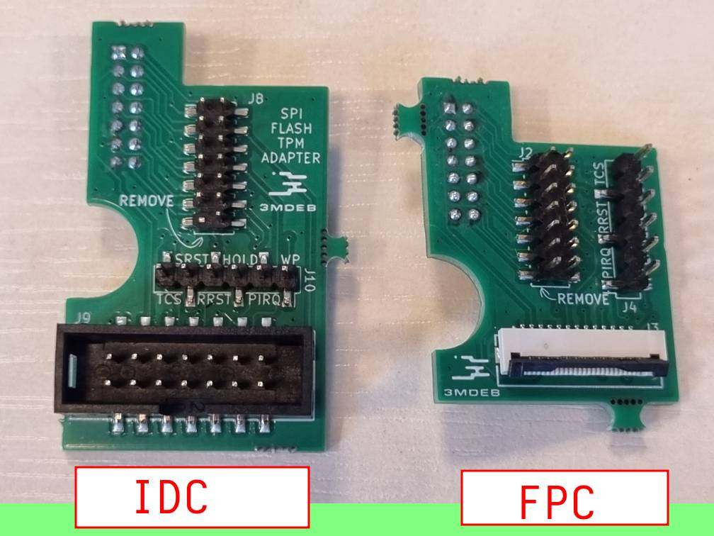

Pick one pair and use it on both ends. The rest of this guide uses the FPC cable:

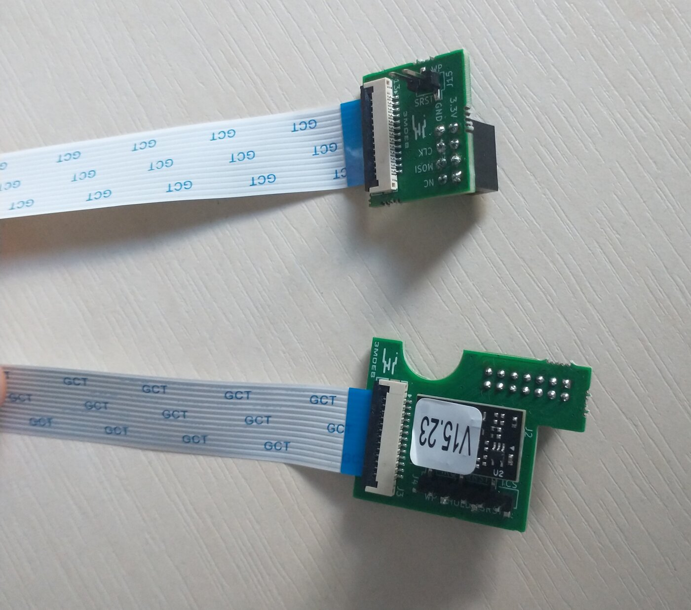

The cable should be around 30 cm - longer cables may not work.

Install the motherboard-side adapter before mounting the board in the case - it
can also be done with the board already in the case, but it is harder. Install
the PCB with the `TO MOBO` silkscreen (on the reverse side) onto the TPM header,
aligned with the bolt hole, and make sure all pins sit tightly:

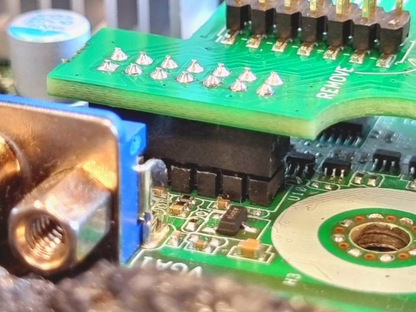

The TPM module goes back on the adapter's pass-through header, so the platform
keeps its TPM while the flash stays reachable:

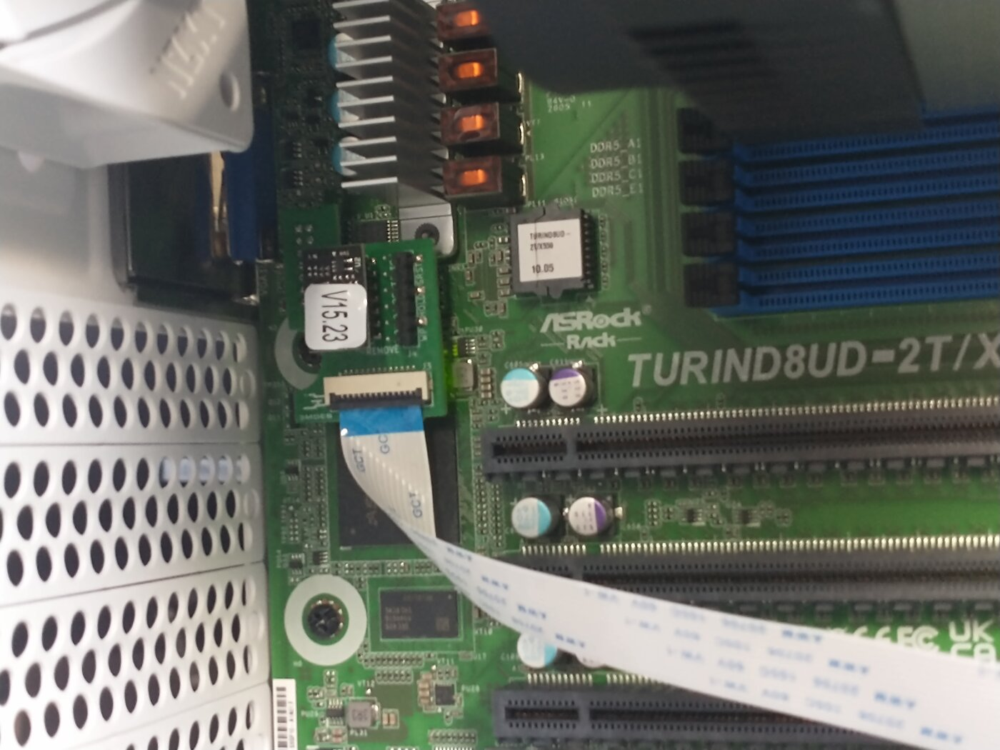

The second adapter mounts on the `SPI_1` header of the SPI extender HAT:

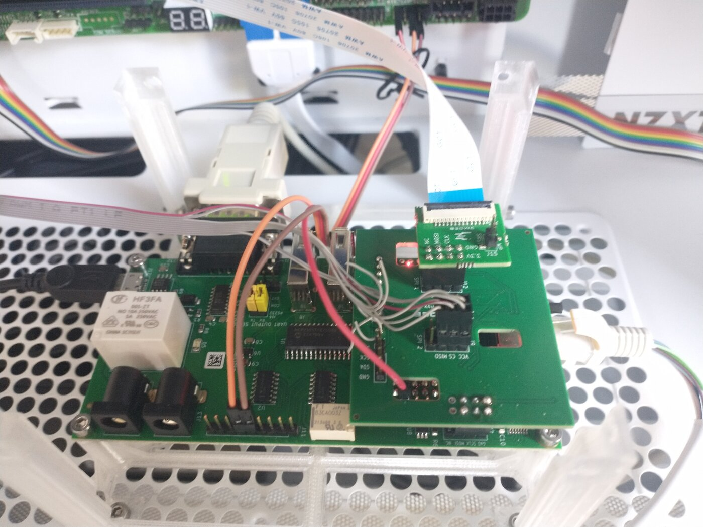

Route the cable from the motherboard down to the HAT:

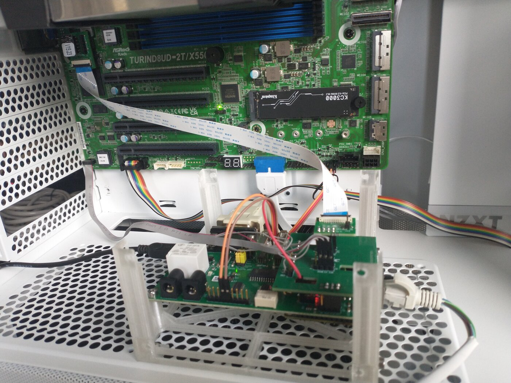

For the TPM header pinout, refer to the
[board's recovery section (setup with RTE)](../../variants/asrock_turind8ud/recovery.md#external-flashing).

#### BMC flash

`BMC_PH1` is a 2x5 1.27mm pitch header. Use the 1.27mm IDC connector to
individual 2.54mm female connector cables to wire the `SPI_2` header to
it according to the table:

| `SPI_2` | BMC_PH1 pin |
| :-----: | :---------: |
|   CS    |   1 (CS#)   |
|   VCC   |   2 (VCC)   |
|  MISO   | 3 (SO/MISO) |
|   CLK   |  6 (SCLK)   |
|  MOSI   | 8 (SI/MOSI) |
|   GND   |   9 (GND)   |

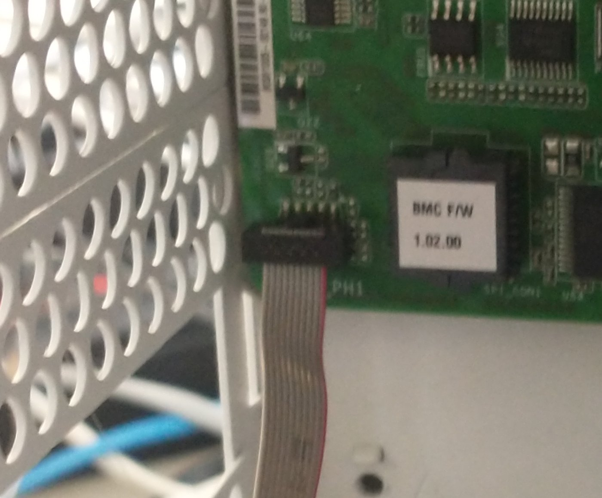

### Complete Setup

After preparing the connections, three activities should also be performed to
enable all of the test stand features:

1. Connect the NOUS A1T smart outlet to the mains:

    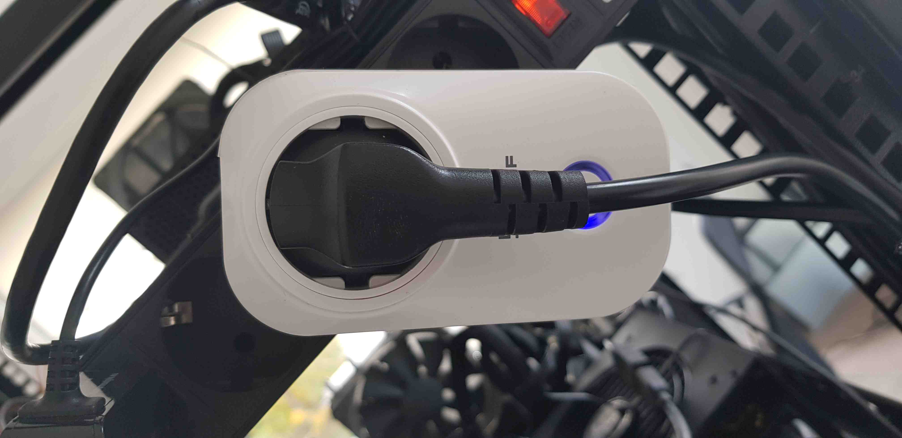

1. Connect the RTE to the Internet by using the Ethernet cable.

1. Connect the RTE to the mains by using the microUSB 5 V/2 A power supply.

Full setup:

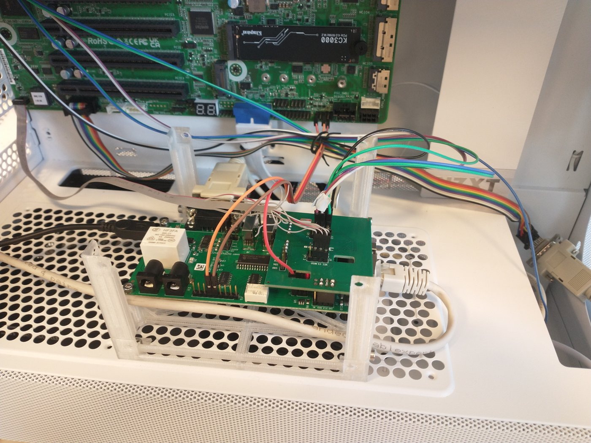

## Theory of operation

The following sections describe how to use all of the enabled features:

- serial connection to the platform,
- controlling power supply,
- enabling basic power actions with the platform (power off/power on/reset),
- external flashing with the RTE,
- device power status readout.

### Serial connection usage

The method of setting and using serial connection is described in the
[Serial connection guide](../../transparent-validation/rte/v1.1.0/serial-port-connection-guide.md).

You can also use [benchctl](https://github.com/zarhus/benchctl), since default
methods connect only to COM1 console which during OpenBMC development will
likely output only BMC logs. To see host serial you have to use method, which
`benchctl` assumes is via Serial-Over-LAN.

- To connect to COM1 serial:

    ```sh
    benchctl --host <rte_ip_address> console
    ```

- To connect to Serial-Over-LAN console:

    ```sh
    benchctl --host <rte_ip_address> console --sol <bmc_ip_address>
    ```

    This connects to the SoL with `ipmitool` via RTE (so BMC has to be reachable
    from RTE).

### Power supply controlling

Power supply controlling (in this case: controlling the state of the NOUS A1T
smart outlet) is performed with
[benchctl](https://github.com/zarhus/benchctl), which switches the outlet over
its Tasmota HTTP API. Pass the outlet address with `--tasmota-ip`:

1. Turn on the power supply:

    ```bash
    benchctl --host <rte_ip_address> \
        power ac --tasmota-ip <sonoff_ip_address> on
    ```

1. Turn off the power supply:

    ```bash
    benchctl --host <rte_ip_address> \
        power ac --tasmota-ip <sonoff_ip_address> off
    ```

1. Read the power supply state:

    ```bash
    benchctl --host <rte_ip_address> \
        power ac --tasmota-ip <sonoff_ip_address> status
    ```

You can also power-cycle the mains feed with the `cycle` subcommand, which
removes mains power completely and reapplies it after a brief wait:

```bash
benchctl --host <rte_ip_address> \
    power ac --tasmota-ip <sonoff_ip_address> cycle
```

> When using the BenchRack platform with an already prepared smart outlet
> (connected to the RTE AP network), skip `--tasmota-ip` - the outlet is
> reachable at `benchctl`'s default address:
>
> ```bash
> benchctl --host <rte_ip_address> power ac on
> ```

### Basic power operations

Basic power operations should be performed with
[benchctl](https://github.com/zarhus/benchctl). To perform basic power
operations use the commands described below:

1. Turn on the platform:

    ```bash
    benchctl --host <rte_ip_address> power on
    ```

1. Turn off the platform:

    ```bash
    benchctl --host <rte_ip_address> power off
    ```

1. Reset the platform:

    ```bash
    benchctl --host <rte_ip_address> power reset
    ```

1. Read the power status:

    The power status readout uses the PLED+ signal wired to the RTE J1 header and
    is reported by `benchctl`:

    ```bash
    benchctl --host <rte_ip_address> power status
    ```

> Note, that in order for the above commands to work properly, the platform
> should be powered up: both the NOUS A1T smart outlet and the power supply must
> be turned on.

### External flashing

The external flashing is performed with
[benchctl](https://github.com/zarhus/benchctl), which can flash both the host
BIOS flash and the BMC flash:

1. Flash the host firmware:

    ```bash
    benchctl --host <rte_ip_address> flash write host <firmware>
    ```

1. Flash the BMC firmware:

    ```bash
    benchctl --host <rte_ip_address> flash write bmc <firmware>
    ```

For external flashing hardware connection please refer to the
[board's recovery section (setup with RTE)](../../variants/asrock_turind8ud/recovery.md#external-flashing).

The AMD board takes longer to boot due to memory training happening on the PSP
side. Thus the first signs of life from open-source firmware may appear even
after a couple of minutes (depends on amount of populated RAM).

### Ethernet

The board's IPMI Ethernet (2) as well as a host Ethernet port (4 or 5) should be
connected to the network.

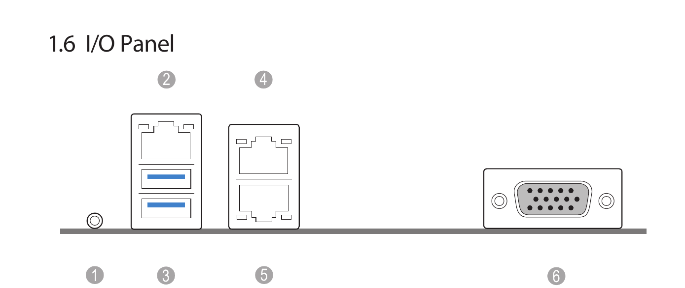
