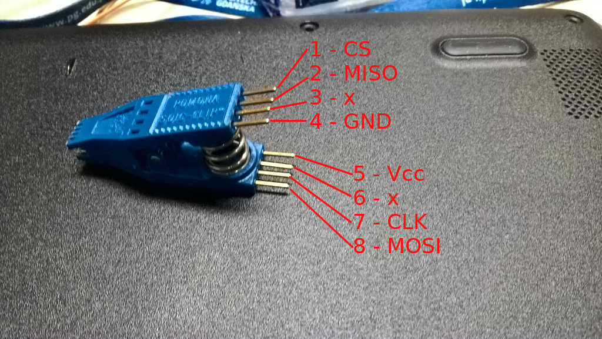
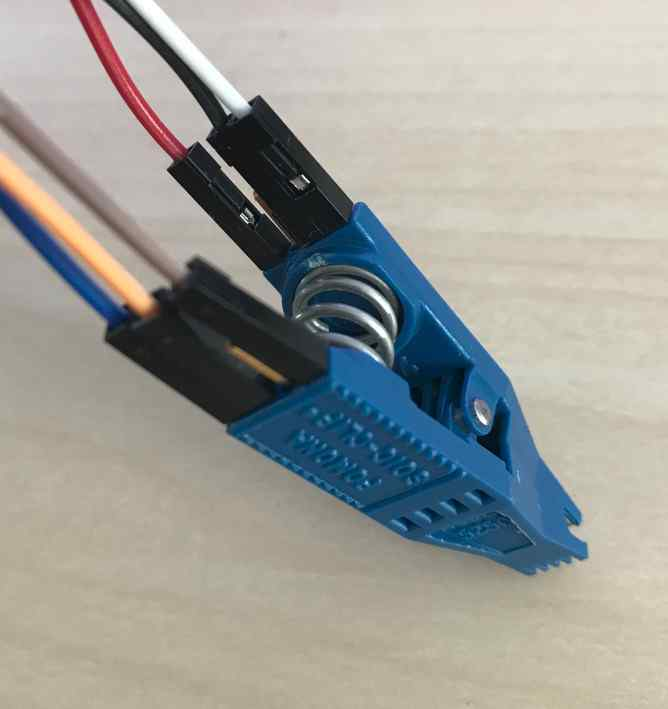
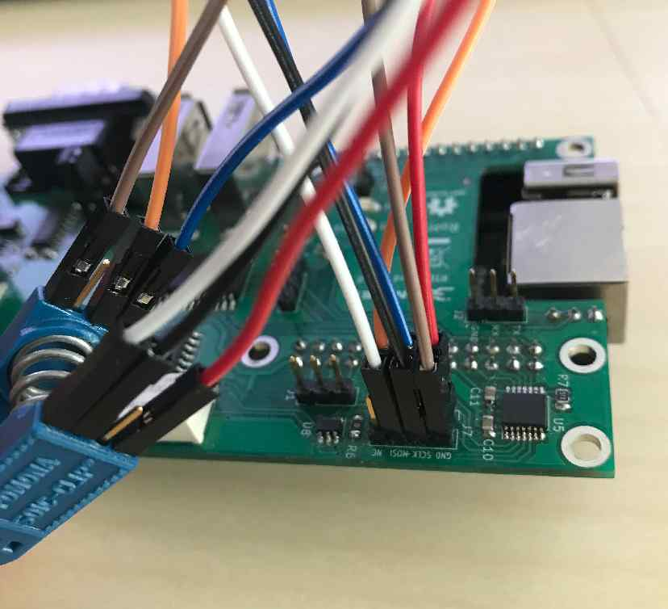
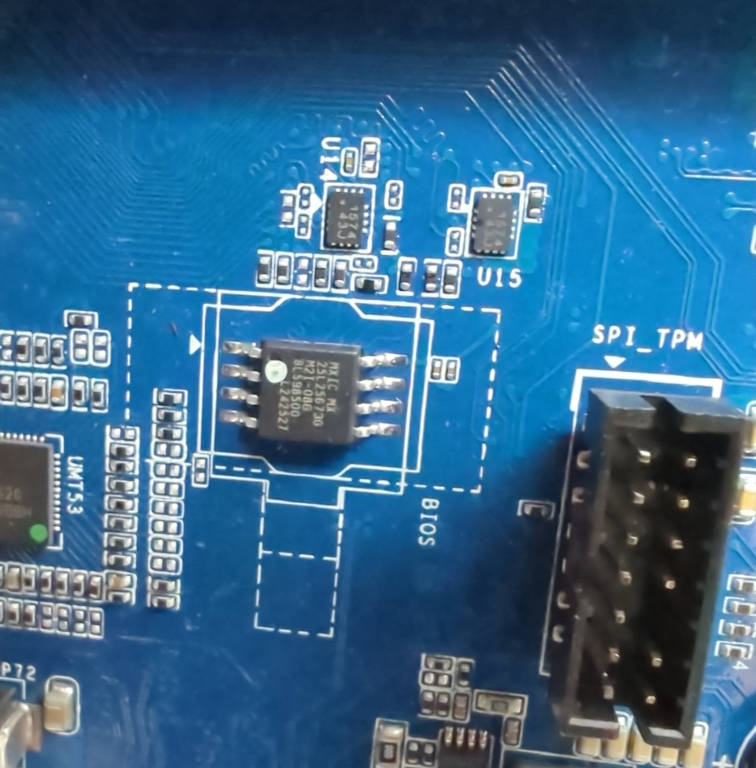
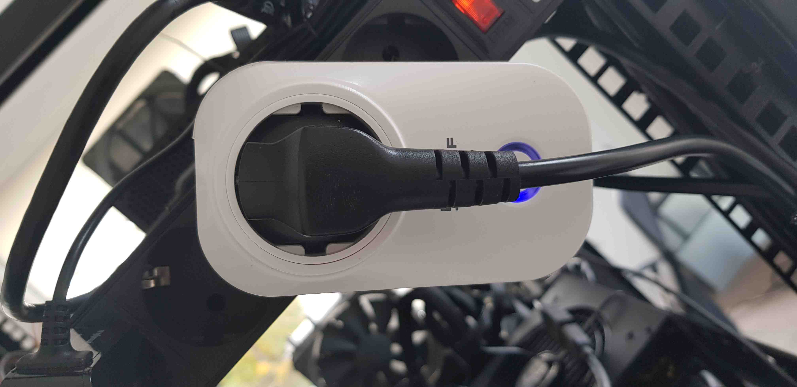
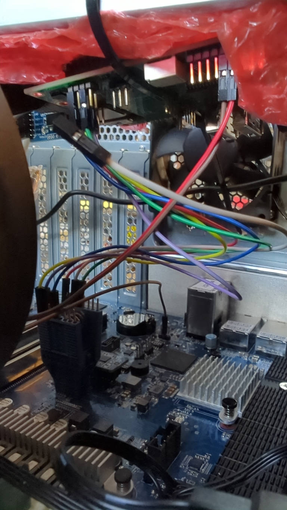
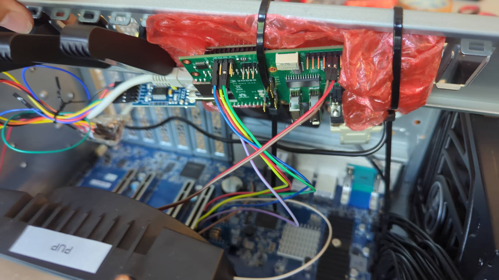
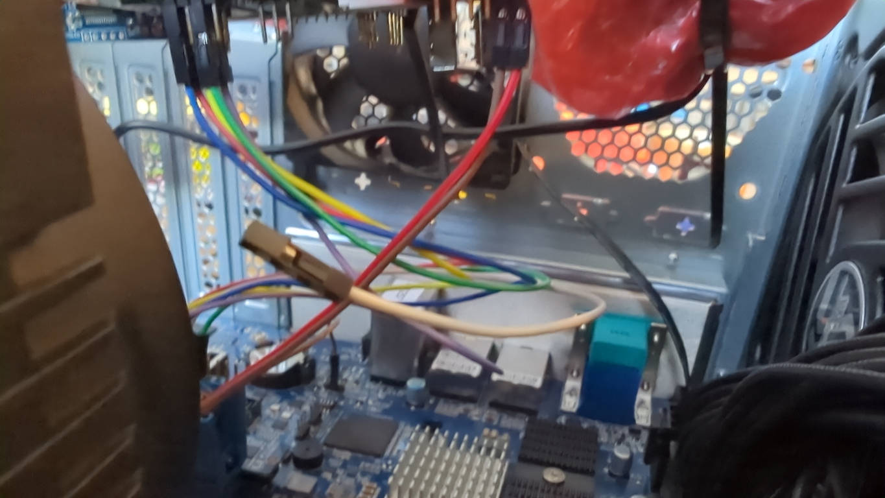
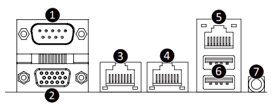

# Laboratory stand dedicated to MGigabyte MZ33-AR1 platform assembly guide

## Introduction

This document describes platform-specific details for assembling an [Gigabyte
MZ33-AR1](https://www.gigabyte.com/Enterprise/Server-Motherboard/MZ33-AR1-rev-3x)
testing stand. Use this document as reference while going through [Generic
Testing Stand
Setup](../../unified-test-documentation/generic-testing-stand-setup.md)

## Prerequisites

The below table contains information about all elements which are needed to
create the testing stand.

* Gigabyte MZ33-AR1 platform
* [RTE v1.1.0](https://shop.3mdeb.com/shop/open-source-hardware/open-source-hardware-3mdeb/rte/)
* Sonoff S20 type E
* 9x standard female-female connection wire 2.54 mm raster
* Pomona SOIC8 clip
* DB9 null modem cable
* [Board manual](https://download.gigabyte.com/FileList/Manual/server_manual_mz33ar1_e_v3.0.pdf?v=1bb5e694edc0f667add839e7409b6c35)

## Connections

The following sections describe how to enable all of the following features:

* serial connection to the platform,
* controlling power supply,
* enabling basic power actions with the platform (power off/power on/reset),
* external flashing with the RTE,

### Serial connection

Connect the DB9 null moden cable to the RTE DB9 connector and DB9 connector on
the rear panel of Gigabyte MZ33-AR1.

### Power supply controlling

Connect the PSU power cord to Sonoff.

### Basic power operations enabling

Connect the RTE J11 header to the platform JFP1 header as described in the
table:

| RTE            | Gigabyte MZ33-AR1 FP_1      |
|:--------------:|:---------------------------:|
| J11 pin 9      | FP_1 pin 11 (PWR_ON)        |
| J11 pin 8      | FP_1 pin 15 (RST)           |
| J15 pin 1 (GND)| FP_1 pin 13 (GND)           |

### External flashing enabling

1. Connect the wire cables to the **Pomona clip**.

    
    

2. Connect the Pomona clip to the [SPI header](../../transparent-validation/rte/v1.1.0/specification.md)
   on RTE.

    | SPI header | Pomona clip  |
    |:----------:|:------------:|
    | Vcc        | pin 5 (Vcc)  |
    | GND        | pin 4 (GND)  |
    | CS         | pin 1 (CS)   |
    | SCLK       | pin 7 (CLK)  |
    | MISO       | pin 2 (MISO) |
    | MOSI       | pin 8 (MOSI) |

    

3. Clip on the BIOS chip on the board:

    

### Complete Setup

After preparing all of the connections also three activities should be
performed to enable all of the test stand features:

1. Connect Sonoff to the mains:

    

1. Connect the RTE to the Internet by using the Ethernet cable.
1. Connect the RTE to the mains by using the microUSB 5 V/2 A power supply.

Complete setup should looks as follows:





## Theory of operation

The following sections describe how to use all of the enabled features:

* serial connection to the platform,
* controlling power supply,
* enabling basic power actions with the platform (power off/power on/reset),
* external flashing with the RTE,
* device power status readout.

### Serial connection

The method of setting and using serial connection is described in the
[Serial connection guide](../../transparent-validation/rte/v1.1.0/serial-port-connection-guide.md).

### Power supply controlling

Power supply controlling (in this case: controlling the state of Sonoff)
should be performed with
[osfv_cli](https://github.com/Dasharo/osfv-scripts/tree/main/osfv_cli).

To perform basic power operations use the commands described below:

1. Turn on the power supply:

    ```bash
    osfv_cli sonoff --sonoff_ip <sonoff_ip_address> on
    ```

2. Turn off the power supply:

    ```bash
    osfv_cli sonoff --sonoff_ip <sonoff_ip_address> off
    ```

### Basic power operations

Basic power operations should be performed based on the
[osfv_cli](https://github.com/Dasharo/osfv-scripts/tree/main/osfv_cli). To
perform basic power operations use the commands described below:

1. Turn on the platform:

    ```bash
    osfv_cli rte --rte_ip <rte_ip_address> pwr on
    ```

1. Turn off the platform:

    ```bash
    osfv_cli rte --rte_ip <rte_ip_address> pwr off
    ```

1. Reset the platform:

    ```bash
    osfv_cli rte --rte_ip <rte_ip_address> pwr reset
    ```

> Note, that in order for the above commands to work properly, the platform
should be powered up: both Sonoff and the power supply must be turned on.

### External flashing

The external flashing procedure should be performed using [OSFV
cli](https://github.com/Dasharo/osfv-scripts).

For external flashing hardware connection please refer to the [board's
recovery section (setup with RTE)](../../variants/gigabyte_mz33-ar1/recovery.md).

### Ethernet

The board IPMI Ethernet (5) as well as first Ethernet port (4) for host should be
connected to the network.


