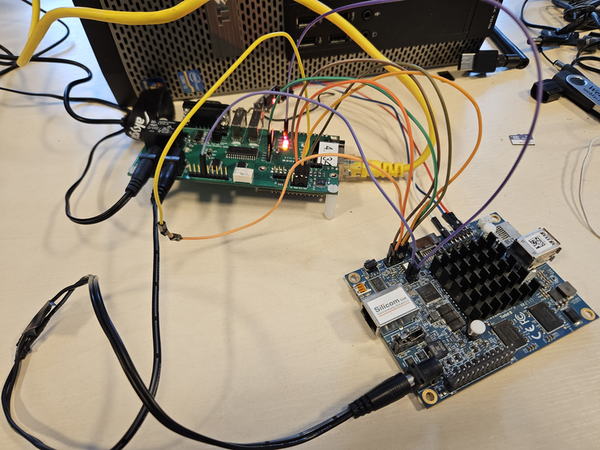

# Dasharo compatible with MinnowBoard Turbot - lab assembly guide

## Intro

This document gathers various notes and documentation useful for development of
Dasharo compatible with the MinnowBoard Turbot platform.

## Hardware connection

### Requirements

- [RTE](https://3mdeb.com/open-source-hardware/#rte)

- USB-UART converter

- DC Jack - DC Jack wire

### Serial

MinnowBoard exposes a pin header with debug UART on `J4`.

- Attach the pins on MinnowBoard to the USB-UART converter.

| USB-UART converter | Minnowboard Uart header (J4)|
|:------------------:|:-------------------------:  |
|    GND             | 1 (GND)                     |
|    TX              | 4 (RX)                      |
|    RX              | 5 (TX)                      |

### SPI

| RTE header J7 pin | Minnowboard header J1 pin       |
|:-----------------:|:-------------------------:      |
| 1 (NC)            | 3.3V connect from RTE J9 pin 1  |
| 2 (GND)           | 2 (GND)                         |
| 3 (CS)            | 3 (SPICS#) via 1.2 kOhm resistor|
| 4 (SCLK)          | 4 (SPICLK)                      |
| 5 (MISO)          | 5 (SPIDI)                       |
| 6 (MOSI)          | 6 (SPIDO)                       |
| 7 (NC)            | Not connected                   |
| 8 (NC)            | Not connected                   |

### Power supply

- Connect 5V power supply to RTE `J12` connector
- Connect RTE `J13` connector to MinnowBoard `J9` connector with a DC Jack - DC
  Jack wire

You can control the power supply using the
[osfv_cli](https://github.com/Dasharo/osfv-scripts/tree/main/osfv_cli)
tool:

```bash
osfv_cli rte --rte_ip <rte-ip> --model minnowmax rel tgl
```

- Power switch can also be controlled from the RTE. Connect the power control
pins according to the following table:

| RTE       | MinnowBoard |
|:---------:|:-----------:|
| J11 Pin 9 | J5 Pin 1    |
| J15 GND   | J5 Pin 2    |

The power state can be controlled with the `osfv_cli` script:

```bash
osfv_cli rte --rte_ip <rte-ip> --model minnowmax pwr on
osfv_cli rte --rte_ip <rte-ip> --model minnowmax pwr off
```

- Example setup:



## Flashing firmware

You can flash firmware with the `osfv_cli` tool. Before trying to flash make
sure that SPI is connected properly.

```bash
osfv_cli rte --rte_ip <rte_ip> --model minnowmax flash write --rom <path_to_binary>
```
