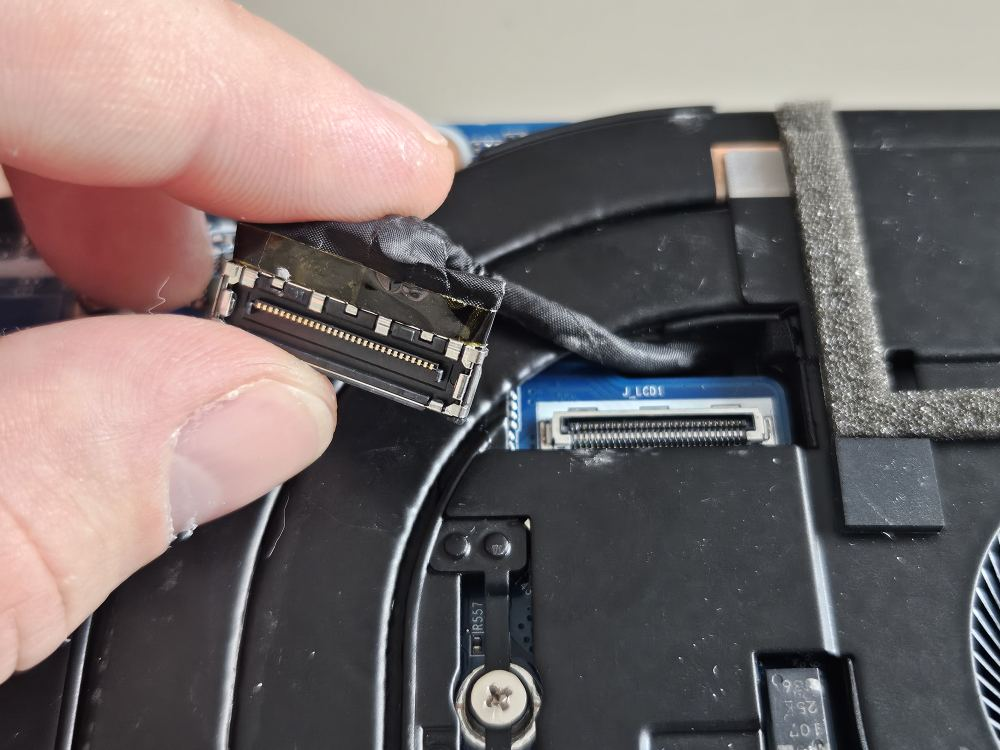
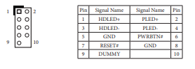

# Laboratory stand dedicated to NovaCustom platforms assembly guide

## Introduction

This document describes platform-specific details for assembling NovaCustom
platforms in the rack. Use this document as reference while going through
[Generic Testing Stand Setup](../../unified-test-documentation/generic-testing-stand-setup.md)

## Prerequisites

The below table contains platform-specific information about all elements which
are needed to create testing stands for NovaCustom machines.

=== "Laptops"

    * [RTE v1.1.0](https://shop.3mdeb.com/shop/open-source-hardware/open-source-hardware-3mdeb/rte/)
    * RTE power supply 5V 2A Micro-USB
    * Sonoff S26R2
    * PiKVM
    * FTDI FT232 USB-UART adapter
    * 3x standard female-female DuPont 2.54mm wire

    ## Theory of operation

    The following sections describe how to use all of the enabled features:

    * serial connection to the platform,
    * controlling power supply,
    * enabling basic power actions with the platform (power off/power on/reset),

    ### Preparation

    Prepare the platform for remote control:

    #### Power on AC

    Due to the lack of an exposed power button signal, we're depending on the Power
    on AC feature to remotely power the device on and off. Follow the steps below
    to prepare the platform:

    * Go to the UEFI Setup Menu -> Dasharo System Features -> Power Management
      Options
    * Switch the option `Power state after power/AC loss` to `Powered On`
    * Save and reset the platform
    * Disconnect the internal battery

    #### Internal display

    The internal display may be automatically used by the operating system or
    firmware, preventing the use of PiKVM. To work around this, ensure the internal
    display is disconnected.

    The internal display eDP connector is typically located near the CPU and the
    heatsink, and requires some force to pull out:

    

=== "NUC BOX"

    * [RTE v1.1.0](https://shop.3mdeb.com/shop/open-source-hardware/open-source-hardware-3mdeb/rte/)
    * RTE power supply 5V 2A Micro-USB
    * Sonoff S26R2
    * FTDI FT232 USB-UART adapter
    * 2x female-female 2.54mm wires

    ## Theory of operation

    The following sections describe how to use all of the enabled features:

    * serial connection to the platform,
    * controlling power supply,
    * enabling basic power actions with the platform (power off/power on/reset),

    ### Preparation

    #### Power and reset buttons

    See the onboard header chart from the NUC BOX manual:

    

    Connect the power pin to RTE pin 410, and the reset pin to RTE pin 109
    following the
    [specification](https://docs.dasharo.com/transparent-validation/rte/v1.1.0/specification/#specification).

    #### Sonoff

    Connect the platform to the mains through the Sonoff smart socket to allow
    remote power cutting/cold boot tests.

    If for some reason you are unable to use the POWER# and RESET# pins, you
    can fallback to depending on the Power on AC feature to remotely power the
    device on and off. Follow the steps below:

    * Go to the UEFI Setup Menu -> Dasharo System Features -> Power Management
      Options
    * Switch the option `Power state after power/AC loss` to `Powered On`
    * Save and reset the platform

### Serial connection

The platform does not have an exposed native serial interface. Instead, an FTDI
FT232 USB to UART adapter is used.

Follow the steps described in [this article on the OSFV repo](https://github.com/Dasharo/open-source-firmware-validation/blob/develop/docs/novacustom.md)
for a detailed serial setup guide and theory of operation.

### External flashing

External flashing is currently not available on these platforms.
