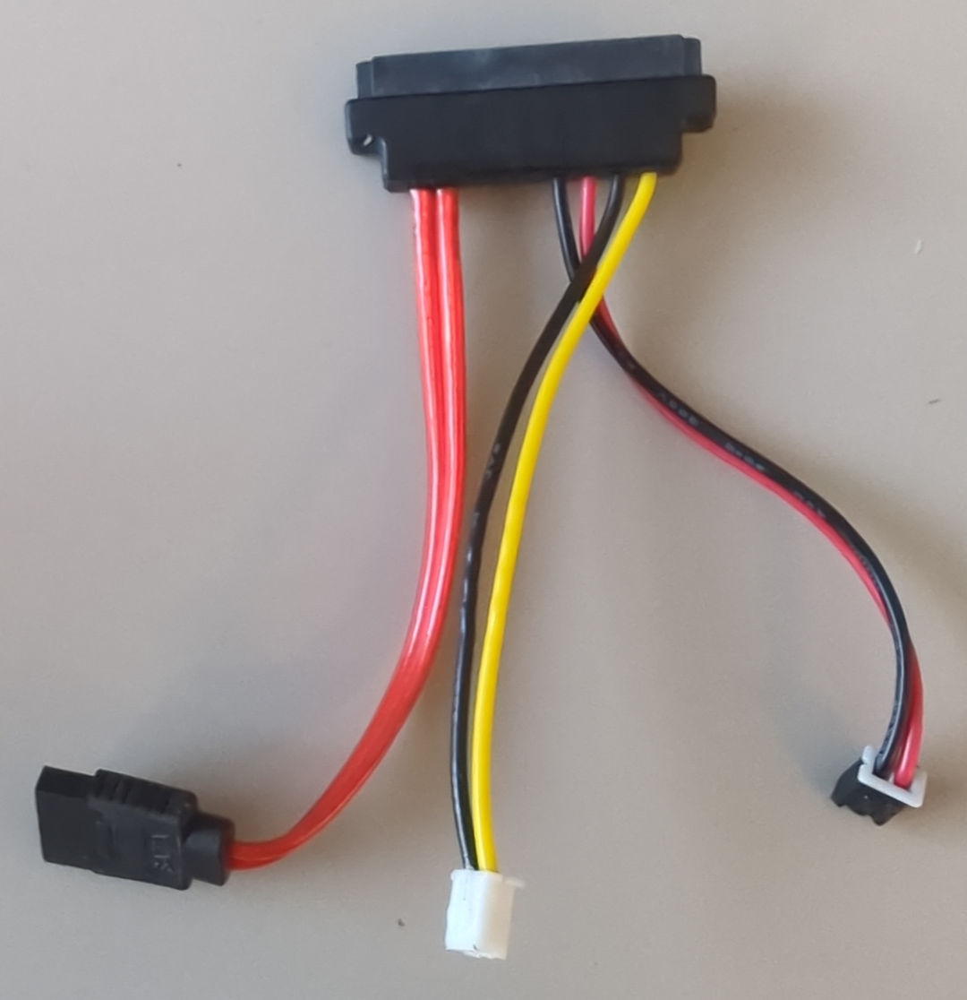
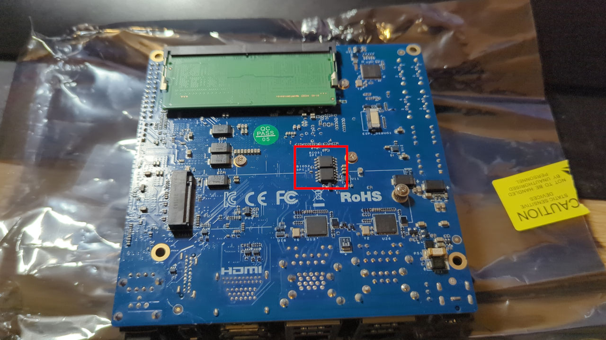
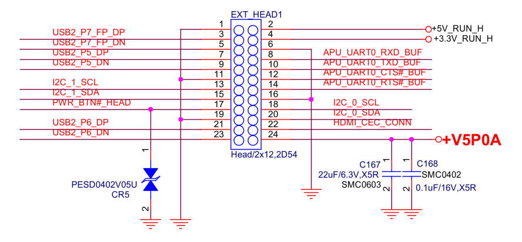
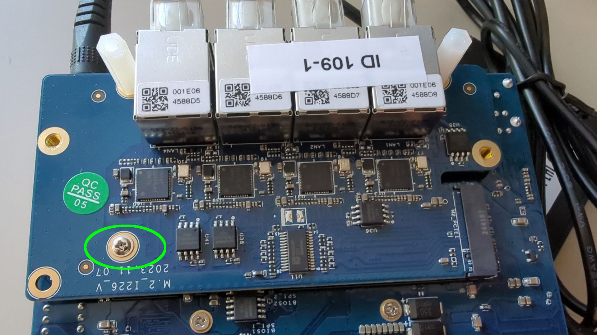
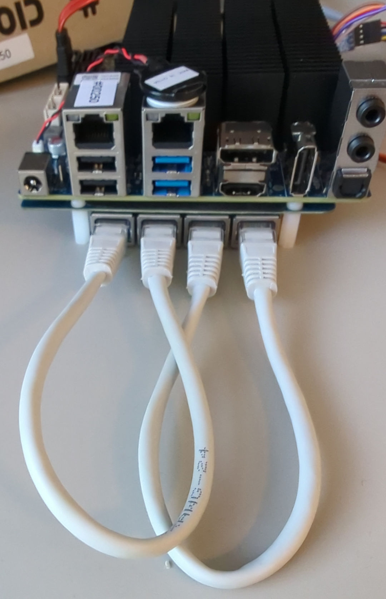
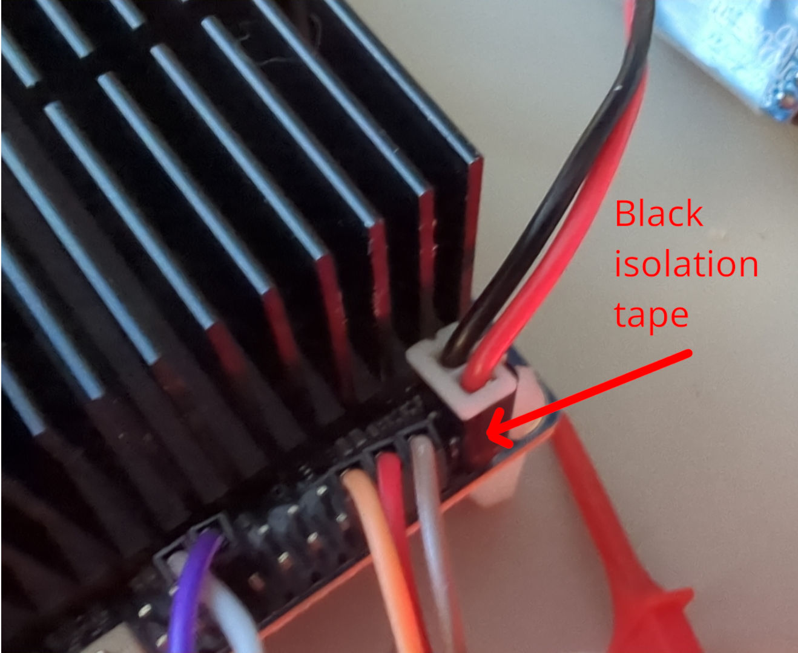
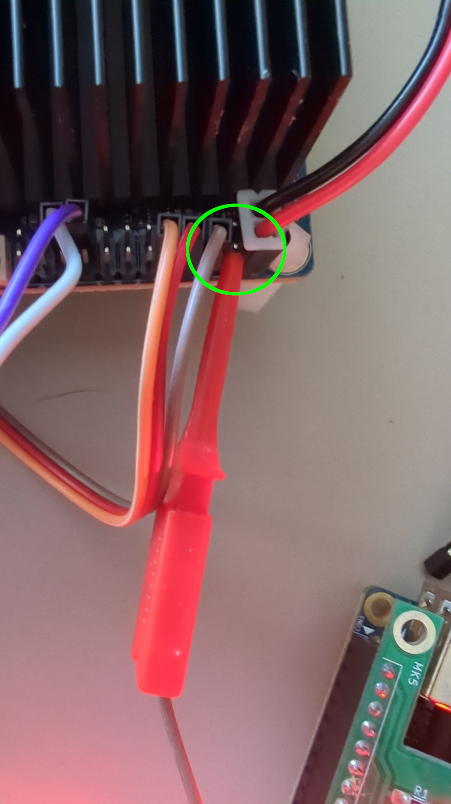
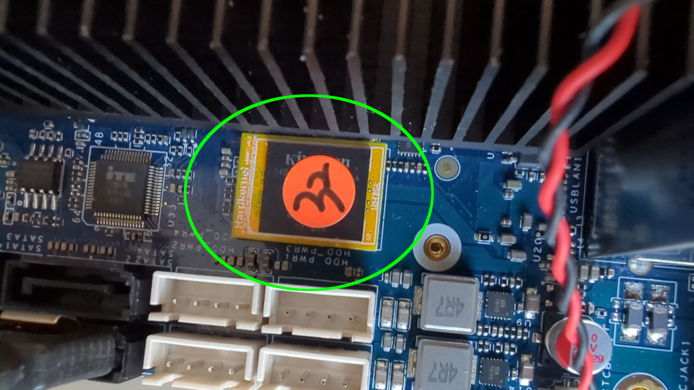

# Laboratory stand dedicated to Odroid-H4 platforms assembly guide

## Introduction

This document describes platform-specific details for assembling Odroid
H4 testing stands. Use this document as reference while going through
[Generic Testing Stand Setup](../../unified-test-documentation/generic-testing-stand-setup.md)

## Prerequisites

The below table contains platform-specific information about all elements which
are needed to create testing stands for Odroid H4.

* [RTE v1.1.0](https://shop.3mdeb.com/shop/open-source-hardware/open-source-hardware-3mdeb/rte/)
* RTE power supply 5V 2A Micro-USB
* 11x standard female-female connection wire 2.54 mm raster
* Pomona 8-pin SOIC clip
* 2x RJ45 cable: 1 for RTE and 1 for the platform
* NVMe disk
* eMMC module for ODROID

For netcard setup additionally:

* 1x female 2.54 mm raster connection wire with a probe hook
* 2x RJ45 cable: short patchcords for the netcard ports
* SATA SSD 2.5'' instead of NVMe disk
* SSD disk adapter to SATA+power connector

> If you have a proper SATA cable and power cable for the dedicated connectors
> on ODROID, use them instead.

  

### External flashing enabling

Connect the RTE SPI header to the platform using the 2.54 mm female-female
wires and Pomona as shown in [Generic testing stand setup](../../unified-test-documentation/generic-testing-stand-setup.md)
to the flash chip on the bottom of your platform:


### Serial connection

The method of setting and using serial connection is described in the
[Serial connection guide](../../transparent-validation/rte/v1.1.0/serial-port-connection-guide.md).
In this case, you will need to enable UART port and connect it to the pins 6,
8 and 10 of ODROID's Peripheral Expansion Header using 2.54 mm female-female
wires.

| RTE J18             | Odroid H4 EXPANSION HEADER             |
|:--------------------|:---------------------------------------|
| J18 pin 1 (TX)      | pin 8  APU_UART_RXD_BUF  |
| J18 pin 2 (RX)      | pin 10 APU_UART_TXD_BUF  |
| J18 pin 3 (GND)     | pin 6  GND               |



### Netcard specific setup

When assembling a netcard in the M.2 NVMe slot, ensure the standoffs are
mounted first before mounting the netcard into ODROID. Then use a screw to
secure the netcard connection:

  

After assembling the netcard, connect 2x RJ45 short patchcords to ports 1-2
and 3-4.  The automated validatio nwill use that connection to verify that
Ethernet ports are functional and meet performance criteria.

  

When a netcard is present in the M.2 NVMe slot, it is not possible to have an
NVMe disk anymore. Thus one needs to connect an SATA disk. ODROID H4+ and H4
Ultra have 4 SATA slots, which can be used as an alternative storage. Connect
the SATA cable to one of the SATA connectors. Connect the black-red wire pair
for SATA power to the pins 1 and 2 of ODROID's Peripheral Expansion Header.
note that the red-black wire pair has to be isolated at the end, because the
exposes metal surfaces on the connector may touch the neighboring pins of the
ODROID's Peripheral Expansion Header.

> If you have a proper SATA cable and power cable for the dedicated connectors
> on ODROID, use them instead.

  

| SATA power cable | Odroid H4 EXPANSION HEADER |
|:-----------------|:---------------------------|
| black            | pin 1 GND                  |
| read             | pin 2 +5V_RUN_H            |

### Power LED connection

The power LED indication is used often in the validation suites to check the
power state of the platform. Connect RTE J10 pin 1 with the pins 4 of ODROID's
Peripheral Expansion Header using 2.54 mm female-female wire. It allows the
RTE to read the power LED state.

| RTE J10   | Odroid H4 EXPANSION HEADER |
|:----------|:---------------------------|
| J18 pin 1 | pin 4 +3.3V_RUN_H          |

For netcard setup use the wire with probe hook, because the SATA power cable
has a thick connector, which prevents standard 2.54mm wire to be connected:

> If you have a proper SATA cable and power cable for the dedicated connectors
> on ODROID, use regular 2.54mm wire instead.

  

## Theory of operation

The following sections describe how to use all of the enabled features:

* serial connection to the platform,
* controlling power supply,
* enabling basic power actions with the platform (power off/power on),
* external flashing with the RTE.

### Power supply controlling

Power supply controlling is performed with the relay module on RTE
connected to one of RTE GPIOs. Power operation should be performed using
the `rte_ctrl` script implemented in `meta-rte` (OS image dedicated to the
RTE platform).

To toggle the power supply use the below command:

```bash
rte_ctrl rel
```

### Basic power operations

Basic power operations should be performed based on the `rte_ctrl` script
implemented in `meta-rte` (OS image dedicated to the RTE platform). To perform
basic power operations use the below-described commands:

1. Turn on the platform:

    ```bash
    rte_ctrl pon
    ```

1. Turn off the platform:

    ```bash
    rte_ctrl poff
    ```

> Note, that in order for the above commands to work properly, the platform
should be powered up: both RTE Relay and the power supply must be connected and
turned on.

### External flashing

The external flashing procedure should be performed based on the scripts
implemented on the RTE platform. To perform the flashing operation reproduce,
the below-described steps:

!!! Danger "Important"
    It is recommended to detect the chip with the DC jack power cable
    disconnected from the Odroid. If the chip is successfully detected,
    you can reconnect the DC power jack and proceed with your task. If the
    chip fails to detect after reconnecting the power, you may need to attach
    an additional grounding cable to the RTE. This additional grounding is not
    always necessary, but it can resolve detection issues if they arise.

1. First run the flashrom command on RTE to check if the flash is detected by
    following the first three steps from [this guide](https://docs.dasharo.com/transparent-validation/rte/v1.1.0/specification/#how-to-set-gpio-states-to-flash-spi)
    , this chip requires 3.3V.

1. Next check if the pomona is connected properly.

    ```bash
    flashrom -p linux_spi:dev=/dev/spidev1.0,spispeed=16000
    ```

1. By using `scp` put the requested Dasharo file to the RTE:

    ```bash
    scp <path_to_firmware>/<firmware_file> root@<RTE_IP>:/tmp/coreboot.rom
    ```

    Where:

    - `path_to_firmware` - path to firmware, which should send to RTE,
    - `firmware_file` - the name of the firmware file, which should be sent
        to RTE,
    - `RTE_IP` - IP address of the connected RTE.

1. Login to RTE via `ssh` or `minicom`.
1. Write the flash chip by executing the following command on RTE:

    ```bash
    flashrom -p linux_spi:dev=/dev/spidev1.0,spispeed=16000 -w /tmp/coreboot.rom
    ```

    > Do not interrupt the flashing procedure in any way (especially by
    changing connections). It may cause hardware damage!

1. If the writing was successful, the output from the command above should
    contain the phrase `Verifying flash... VERIFIED`.

### USB devices

Since some issues with USB controllers may only happen on selected USB ports,
it's important to plug in USB devices to all 4 USB ports of the board.

### NVMe disk

Connect NVMe disk to the bottom M.2 slot for SSD. The disk will serve as main
storage for operating systems.

### eMMC module

Plug ODROID eMMC module to the eMMC connector on board. eMMC is optional
storage for operating systems but may be used in automated testing to validate
eMMC functionality.

  
