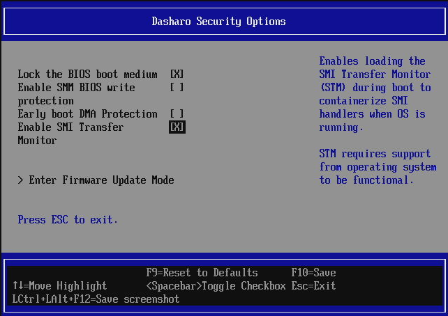

# Preparing Ubuntu for SMI Transfer Monitor

## Introduction

The SMI Transfer Monitor (STM) is a hypervisor running in VMX root mode at
privilege level -1. It provides isolation and protection for System Management
Mode (SMM) handlers by interposing on all SMIs while the OS is running. Using
STM on Linux requires two components:

1. A patched KVM driver that exposes two new ioctls
   (`KVM_BUMP_USAGE_COUNT` and `KVM_DEC_USAGE_COUNT`) to prevent the CPU from
   exiting VMX mode while STM is active, which would otherwise cause a GP fault
   and kernel panic.
2. The `dual_monitor_mode` kernel module from the
   [stm_linux_module](https://github.com/Dasharo/stm_linux_module) repository,
   which manages STM startup, shutdown, and platform power state transitions
   (suspend, hibernate). It is a Dasharo fork of [Eugene d. Myers'
   stm_linux_module](https://github.com/EugeneDMyers/stm_linux_module) with
   compilation fixes for newer kernels.

!!! note

    This guide covers Ubuntu 26.04 (Linux 7.0.0). The KVM patch in the original
    repository was written for Linux 5.10.120, but was updated to apply to
    Linux 7.0 on Dasharo fork. Still, the patch file may not apply cleanly to
    all Linux versions and must be adapted manually as described below.

!!! Warning

    You will have to disable kernel lockdowns, Secure Boot, and load unsigned
    kernel modules to make it work. Do not attempt it unless you are aware of
    the risks involved with the process.

## Prerequisites

- Intel x86_64 system with VT-x (VMX) support
- Dasharo firmware with STM support enabled
- At least 10 GB of free disk space for the kernel source and build artifacts

Verify that VMX is available on your system:

```bash
$ grep -m1 vmx /proc/cpuinfo
```

The output must contain the `vmx` flag. If it is absent, STM cannot run on
this system.

## Preparing to launch STM

### Step 0: Running STM capable firmware

To use STM the firmware must enable STM in the build and place it in special
memory area. Follow the board-specific flashing/update documentation how to
flash the firmware, if you have a firmware binary with STM.

STM in Dasharo is runtime configurable in the setup menu. If you see STM
option in the `Setup Menu -> Dasharo System Features -> Dasharo Security
Options` then it means your firmware supports STM:



Enable the STM option first (default disabled) before proceeding with next
steps and modules compilation. Save settings and reset the board.

### Step 1: Install Build Dependencies

```bash
$ sudo apt update
$ sudo apt install -y \
    build-essential \
    git \
    bc \
    flex \
    bison \
    dwarves \
    dpkg-dev \
    zstd \
    gawk \
    pahole \
    libdw-dev \
    libdwarf-dev \
    libelf-dev \
    libssl-dev \
    linux-source \
    linux-headers-$(uname -r)
```

### Step 2: Prepare the Kernel Source Tree

Obtain and prepare the kernel source. Set the `KDIR` variable for use in
later steps.

```bash
$ cd /usr/src/linux-source-7.0.0/
$ sudo tar --strip-components=1 -xvf linux-source-7.0.0.tar.bz2 >/dev/null
$ export KDIR=/usr/src/linux-source-7.0.0
$ cd ${KDIR}
$ sudo cp /boot/config-$(uname -r) .config
$ sudo make olddefconfig
$ sudo make scripts prepare modules_prepare
# linux-source package does not contain certificates, so we have to unset them
$ sudo scripts/config --set-str SYSTEM_TRUSTED_KEYS ""
$ sudo scripts/config --set-str SYSTEM_REVOCATION_KEYS ""
```

### Step 3: Clone the stm_linux_module Repository

```bash
$ cd ~
$ git clone https://github.com/Dasharo/stm_linux_module.git
```

### Step 4: Adapt the KVM Patch

The repository provides `linux_stm_patches.patch`, which targets Linux
5.10.120. However, on Dasharo fork the patch has been updated and will apply
on Linux v7.0. Otherwise, the changes must be applied manually to two files.

The patch adds two ioctl commands that let the `dual_monitor_mode` module
increment and decrement the KVM internal usage counter, keeping the CPU in
VMX mode for as long as STM needs it. The ioctl numbers `0x20` and `0x21`
are unassigned in the KVMIO namespace on both kernel versions.

To patch the file automatically, use the following commands:

```bash
$ sudo cp ~/stm_linux_module/linux_stm_patches.patch ${KDIR}
$ cd ${KDIR}
$ sudo patch -p1 < linux_stm_patches.patch
patching file include/uapi/linux/kvm.h
patching file virt/kvm/kvm_main.c
# Also copy the modified header to linux-headers location
sudo cp include/uapi/linux/kvm.h \
    /usr/src/linux-headers-$(uname -r)/include/uapi/linux/kvm.h
```

If it has applied successfully, you may skip steps 4.1 and 4.2.

### 4.1 Add the ioctl definitions to kvm.h

Open `${KDIR}/include/uapi/linux/kvm.h` in a text editor. Locate the block
of `#define KVM_*` entries that use the `_IO`, `_IOR`, `_IOW`, or `_IOWR`
macros and add the following two lines:

```diff
#define KVM_GET_MSR_INDEX_LIST    _IOWR(KVMIO, 0x02, struct kvm_msr_list)
+/* Bumps the KVM usage count for the STM */
+#define KVM_BUMP_USAGE_COUNT  _IO(KVMIO, 0x20)
+ /* Decrements the KVM usage count for STM breakdown */
+#define KVM_DEC_USAGE_COUNT   _IO(KVMIO, 0x21)
```

Verify that these numbers are free in your tree before adding them:

```bash
$ grep -n "KVMIO,  0x2[01]" ${KDIR}/include/uapi/linux/kvm.h
```

No output means `0x20` and `0x21` are available. If there is a conflict,
choose the next free pair of values and use them consistently in both files.

Make the same changes in the installed linux-headers by copying the modified
file:

```bash
sudo cp ${KDIR}include/uapi/linux/kvm.h \
     /usr/src/linux-headers-$(uname -r)/include/uapi/linux/kvm.h
```

### 4.2 Add the ioctl handlers to kvm_main.c

Open `${KDIR}/virt/kvm/kvm_main.c`. Find the function `kvm_dev_ioctl()` and
locate its `switch` statement. Add the two new cases after the `case
KVM_CHECK_EXTENSION:` label:

```diff
	case KVM_CHECK_EXTENSION:
		r = kvm_vm_ioctl_check_extension_generic(kvm, arg);
		break;
+	case KVM_BUMP_USAGE_COUNT:
+		kvm_usage_count++;
+		r = 0;
+		break;
+	case KVM_DEC_USAGE_COUNT:
+		kvm_usage_count--;
+		r = 0;
+		break;
```

Move `static int kvm_usage_count;` variable declaration above the
`kvm_vm_ioctl` implementation:

```diff
+static int kvm_usage_count;

static long kvm_vm_ioctl(struct file ...
```

### Step 5: Build the Patched KVM Modules

For in-tree module builds, `modpost` reads vmlinux symbol CRCs exclusively
from `vmlinux.o` - `KBUILD_EXTRA_SYMBOLS` is only honoured by external
(`M=`) builds and is silently ignored here. The way to resolve
cross-module dependencies (e.g. `irqbypass → kvm`) without duplicating
symbol sources is to build all affected modules in a **single** `make`
invocation, so that `modpost` processes all three `.o` files together:

```bash
cd ${KDIR}
# Compile the kernel core and produce vmlinux.o (~20–60 min depending
# on hardware). KVM is =m in Ubuntu, so our kvm_main.c changes do not
# affect this step.
sudo make -j$(nproc) vmlinux
```

Next build the KVM modules:

```bash
# Build irqbypass and both KVM modules in one invocation.
# modpost resolves the irqbypass → kvm dependency internally because it
# processes all three .o files in the same run. vmlinux symbols come only
# from vmlinux.o - no extra symbol files needed, no duplicates.
sudo make -j$(nproc) \
    virt/lib/irqbypass.ko \
    arch/x86/kvm/kvm.ko \
    arch/x86/kvm/kvm-intel.ko
```

After a successful build, the patched modules are located at:

- `${KDIR}/arch/x86/kvm/kvm.ko`
- `${KDIR}/arch/x86/kvm/kvm-intel.ko`

Strip the `.BTF` and `.BTF_ids` ELF sections from both modules before
installing. The BTF metadata produced by our build does not match the
running kernel's own BTF, which causes a `failed to validate module BTF:
-22` error in `dmesg`. Stripping these sections prevents the validation
attempt; KVM functionality is unaffected:

```bash
sudo objcopy --remove-section=.BTF \
        --remove-section=.BTF_ids \
        ${KDIR}/arch/x86/kvm/kvm.ko
sudo objcopy --remove-section=.BTF \
        --remove-section=.BTF_ids \
        ${KDIR}/arch/x86/kvm/kvm-intel.ko
```

### Step 6: Replace the Running KVM Modules

!!! warning
    The following steps overwrite system KVM modules. Keep a recovery method
    available (live USB, serial console, or SSH from a second machine) before
    proceeding.

Identify the module paths for the running kernel and back them up:

```bash
$ KVM_DIR=/lib/modules/$(uname -r)/kernel/arch/x86/kvm
$ sudo cp ${KVM_DIR}/kvm.ko.zst{,.bak}
$ sudo cp ${KVM_DIR}/kvm-intel.ko.zst{,.bak}
```

Ubuntu stores kernel modules as zstd-compressed `.ko.zst` files. Compress
the newly built modules before installing:

```bash
$ zstd -19 -f ${KDIR}/arch/x86/kvm/kvm.ko -o ~/kvm.ko.zst
$ zstd -19 -f ${KDIR}/arch/x86/kvm/kvm-intel.ko -o ~/kvm-intel.ko.zst
$ sudo cp ~/kvm.ko.zst ${KVM_DIR}/kvm.ko.zst
$ sudo cp ~/kvm-intel.ko.zst ${KVM_DIR}/kvm-intel.ko.zst
$ sudo depmod -a
```

If the system uses AMD instead of Intel, replace `kvm-intel` with `kvm-amd`
in all commands above.

Reload the KVM stack:

```bash
$ sudo rmmod kvm_intel kvm
$ sudo modprobe kvm
$ sudo modprobe kvm_intel
```

Verify the modules loaded without errors:

```bash
$ dmesg | tail -20
$ lsmod | grep kvm
```

### Step 7: Build the dual_monitor_mode Module

```bash
$ cd ~/stm_linux_module
$ make
```

### Step 8: Install and Load the Module

```bash
$ sudo make install
$ sudo modprobe dual_monitor_mode
```

If you see an `modprobe: FATAL: Module dual_monitor_mode not found in
directory /lib/modules/<version>`, try to load the module directly from local
directory:

```bash
$ sudo modprobe ./dual_monitor_mode.ko
```

Verify the module is loaded:

```bash
$ lsmod | grep dual_monitor_mode
```

## Verification

Check the kernel log for STM activity:

```bash
$ sudo dmesg | grep -i -E "stm|dual.monitor"
```

A successful initialization produces log lines from the `dual_monitor_mode`
module indicating that VMX mode is being maintained and the STM handshake
with the firmware completed.:

```text
19 STM-LINUX: starting launch_stm on all processors
0 STM-LINUX - starting launch_stm
0 STM-LINUX: Opt-in to STM commences
0 STM-LINUX: STM_API_INITIALIZE_PROTECTION succeeded
...
13 STM-LINUX: Opt-in to STM commences
19 STM-LINUX - starting launch_stm
17 STM-LINUX - starting launch_stm
14 STM-LINUX: Opt-in to STM commences
12 STM-LINUX: Opt-in to STM commences
15 STM-LINUX: Opt-in to STM commences
16 STM-LINUX: Opt-in to STM commences
19 STM-LINUX: Opt-in to STM commences
18 STM-LINUX: Opt-in to STM commences
17 STM-LINUX: Opt-in to STM commences
11 STM-LINUX: Opt-in to STM commences
19 STM-LINUX: STM apparently launched (1)
```

You may also use
[cbmem](../common-coreboot-docs/dumping_logs.md#cbmem-utility) utility to dump
firmware log. It should also contain output from the STM:

```bash
$ sudo cbmem -1 | grep "(STM)"
```

Example output:

```text
(STM) ELF Relocation in progress Base 4B130000 Reloc tables 4B15A520
(STM) 363 locations to be relocated
(STM) ELF Relocation done
(STM) MsegBase (MSR) - 4B130000
(STM) MsegLength (end of TSEG) - 00ED0000
(STM) Cr30Offset - 00032000
(STM) Page Table Start - 4B162000
(STM)    ********************** STM/PE *********************
(STM) !!!STM build time - Aug  7 2026 10:36:30!!!
(STM) !!!STM Relocation DONE!!!
(STM) !!!Enter StmInit (BSP)!!! - 0 (10007)
...
(STM) 19 CurrentVmcs - 000000010221F000 VmcsSize 1000
(STM) 6 !!!LaunchBack!!!
(STM) 7 !!!LaunchBack!!!
(STM) Setting up SMI Handler for 32 bit mode
(STM) 16 !!!LaunchBack!!!
(STM) 12 !!!LaunchBack!!!
(STM) 1 !!!LaunchBack!!!
(STM) 15 !!!LaunchBack!!!
(STM) 17 !!!LaunchBack!!!
(STM) 11 !!!LaunchBack!!!
(STM) 14 !!!LaunchBack!!!
(STM) 19 !!!LaunchBack!!!
```

To confirm the STM works, try to set the BootTimeout variable to trigger SMI
handler via EFI Runtime Services variable protocol, e.g.:

```bash
sudo efibootmgr -t 4
```

The command should return that the timeout is now 4 seconds and give no
errors. If STM was not informed about all resources needed to perform flashing
operation in SMM mode to update the variable, the cbmem log would contain:

```text
(STM) 5 !!!EPTViolationHandler!!!
(STM) 5  Qualification - 0000000000000782
(STM) 5  GuestPhysicalAddress - 00000000BFCFC010
(STM) 5 SmmEPTViolationHandler - Add unclaimed MEM_RSC!
```

In the above example, the address `00000000BFCFC010` refers to the SPI
controller MMIO space, which was not yet allowed for SMI handler access during
the STM support development. Absence of additional messages or errors in cbmem
utility proves that SMI handler used for flash access work properly.
