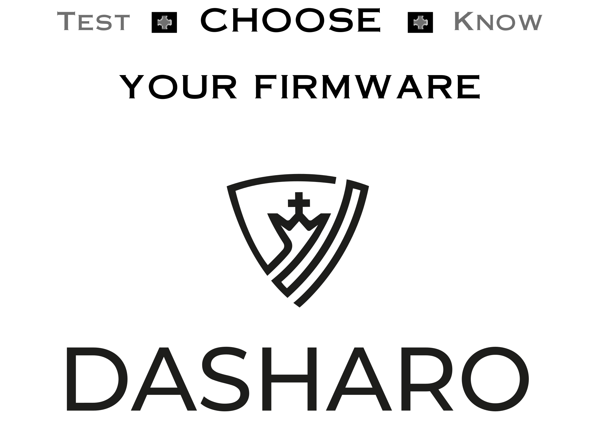

# 

# About

Dasharo is open-source firmware distribution focusing on clean and simple code,
long-term maintenance, transparent validation, privacy-respecting
implementation, liberty for the owners, and trustworthiness for all.

Dasharo consists of productized services, open-core, and SaaS products which
help to provide scalable, modular, easy to combine open-source BIOS, UEFI, and
firmware solutions. It offers the components that are needed to develop and
maintain a high quality, and modular firmware, for the stability and security
of your platform.

[Dasharo homepage](https://dasharo.com/)

## Compatible hardware

Refer to the [Supported hardware section.](/unified/novacustom/overview/)

<!--
TODO: explain how user, developer, customer may add to this list
TODO: introduce status like officially supported by vendor or nor officially
supported by vendor
TODO: explain that not all hardware may be listed here, because of embargo,
non-public development, custom hardware handled by vendor
-->

## Community

* [Dasharo Matrix Workspace](https://matrix.to/#/#dasharo:matrix.org) - general
  Dasharo discussion, support and other open-source firmware related work.
* [Dasharo OSF vPub](https://vpub.dasharo.com/) - 3-4 times a year we organize
  online party to discuss recent achievements in open-source firmware, open
  source hardware and open instruction set architecture. Feel free to check the
  website about recent vPub plans or subscribe to newsletter.

## Newcomers

If you are new to Dasharo, this section it to help you get started using Dasharo
firmware and possibly contributing to making it better.

### coreboot

If you have no prior experience with coreboot, it's highly recommended to visit
OpenSecurityTraining2 and finish these courses:
* [Arch4031](https://p.ost2.fyi/courses/course-v1:OpenSecurityTraining2+Arch4031_x86-64_RV_coreboot+2021_v1/about),
* [Arch4021](https://p.ost2.fyi/courses/course-v1:OpenSecurityTraining2+4021_Intro_UEFI+2022_v1/about)
OpenSecurityTraining2 provides other great courses related to firmware, which
are all freely avialable [here](https://p.ost2.fyi/courses).

### Docker

coreboot needs a specific toolchain to be built, hence why it is usually built
inside of a Docker. In case of Dasharo, all images are build using Docker, so
you will make sure it works properly on your system.

Follow these two links:
* [Install Docker Engine on Ubuntu](https://docs.docker.com/engine/install/ubuntu/)
* [Post-installation steps for Linux](https://docs.docker.com/engine/install/linux-postinstall/)

### Dasharo Contribution

All code review and all issues related to Dasharo are resolved on
[GitHub](https://github.com/). An account there is nessesary to contribute and
report issues. All Dasharo repositories can be found
[here](https://github.com/Dasharo).

When you have an account on GitHub go ahead and
[configure an SSH key](https://docs.github.com/en/authentication/connecting-to-github-with-ssh).
It's also highly recommended to configure a GPG key before contributing
anything. Instructions to do that can be found
[here](https://docs.github.com/en/authentication/managing-commit-signature-verification/adding-a-gpg-key-to-your-github-account).
With that your account should be ready to contribute to Dasharo. Here are some
additional links to help:
* [Dasharo code structure](https://docs.dasharo.com/dev-proc/source-code-structure/)
* [Creating a pull pequest from a fork](https://docs.github.com/en/pull-requests/collaborating-with-pull-requests/proposing-changes-to-your-work-with-pull-requests/creating-a-pull-request-from-a-fork)
* [Pull request eviews](https://docs.github.com/en/pull-requests/collaborating-with-pull-requests/reviewing-changes-in-pull-requests/about-pull-request-reviews)

### Dasharo Matrix Space

[Matrix](https://matrix.org/) as a communicator used at Dasharo. If you want
quick answers it's best to join our matrix space and talk to us there.

https://matrix.to/#/#dasharo:matrix.org

<!--

For now we deprecating this terminology. We will get back to it when we will
support enough platforms to justify and explain our strategy for given market
segment.

## Stock Keeping Units (SKUs)

Also called variants or flavours. In essence Dasharo SKUs are set of Open
Source Firmware releases produced for given market segment with awareness of
features that given segment requires. Each market segment includes two types of
platforms: Reference Platform (RP) and Hardware Compatibility List Platforms
(HCLP).

What SKUs we support:

* [Dasharo Workstation](variants/workstation.md)
* [Dasharo Firewall](variants/firewall.md)
* [Dasharo Secure Firewall](variants/secure-firewall.md)
* [Dasharo Trustworthy Server CE](variants/trustworthy-server.md)
* [Dasharo Trustworthy Computing](variants/trustworthy-computing.md)
* [Dasharo Server](variants/server.md)
* [Dasharo Safety-Critical](variants/safety-critical.md)

Dasharo SKUs roadmap is available on [SKUs Overview](variants/skus-overview.md) page.
-->
