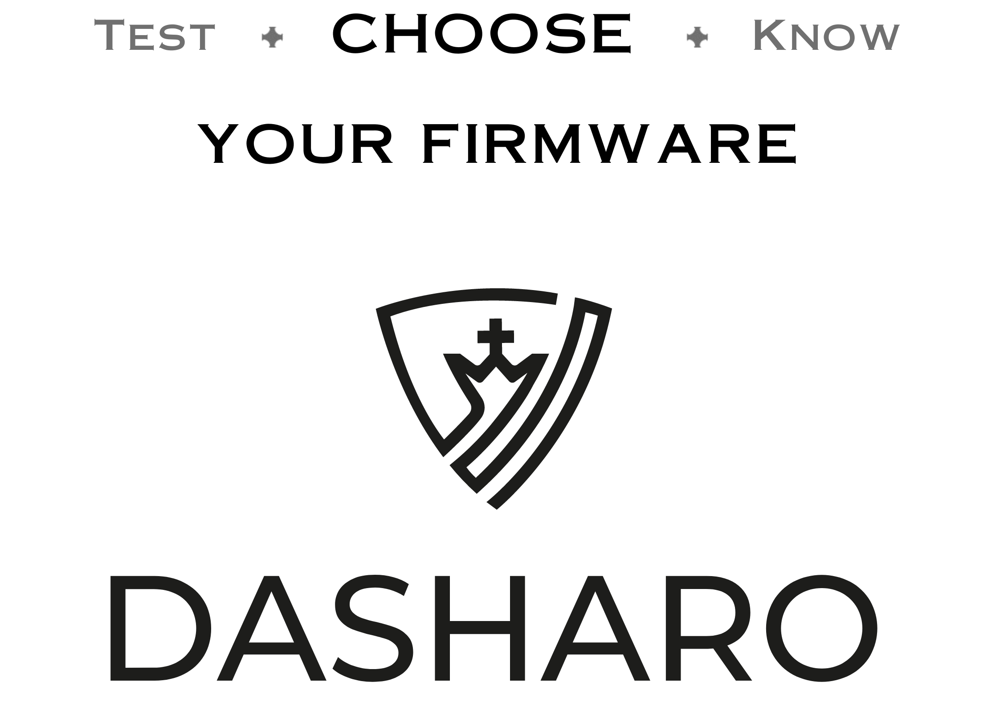

# 

Dasharo is an open-source firmware distribution crafted with an emphasis on
trustworthiness, privacy, and liberty. Our mission is to empower users with a
firmware they can trust. We believe in open development, firmware
resilience, platform security transparency, right to repair and digital
sovereignty. Here's what makes Dasharo the go-to choice for secure
firmware:

## Key Features

- **Seamless Deployment**: Start your journey with Dasharo effortlessly. [Learn
  how
  →](dasharo-tools-suite/documentation/features.md#dasharo-zero-touch-initial-deployment)
- **Clean & Simple Code**: Our code is readable and maintainable, designed with
  developers in mind. [Explore our GitHub →](https://github.com/dasharo)
- **Long-term Maintenance**: We are committed to supporting Dasharo for years
  to come. [Read about our vision
  →](osf-trivia-list/dasharo.md#dasharo-long-term-maintenance)
- **Professional Support**: Our team of experts is here to help you at every
  step. [Get support →](osf-trivia-list/dasharo.md#dasharo-professional-support)
- **Transparent Validation**: We believe in a transparent process with no black
  boxes. [See our validation process
  →](https://blog.3mdeb.com/tags/validation/)
- **Superior Documentation**: Detailed documentation to help you understand
  every facet of Dasharo. [Visit our docs →](dasharo-menu-docs/overview.md)
- **Privacy-Respecting Implementation**: We prioritize your privacy, ensuring
  your data remains yours. [Learn more →](osf-trivia-list/dasharo.md#future-work)
- **Liberty for Owners**: Dasharo gives you complete control over your
  firmware. [Discover the freedom →](osf-trivia-list/dasharo.md#future-work)

[**Learn More**](osf-trivia-list/dasharo.md) | [**Visit Dasharo's
Homepage**](https://dasharo.com/)

> Dasharo is a registered trademark and product developed by
> [3mdeb](https://3mdeb.com).

## 🖥️ Compatible Hardware

Find the perfect hardware match for Dasharo in our comprehensive [Supported
Hardware Section](variants/overview.md)

## 💼 Commercial Inquiries

Looking to integrate Dasharo into your business? [Reach out to
us](https://www.dasharo.com/pages/contact/) for commercial inquiries and
collaborations.

## 🌍 Community

Become a part of the vibrant Dasharo community:

- **Chat with Us**: Join the conversation in the [Dasharo Matrix
  Workspace](https://matrix.to/#/#dasharo:matrix.org).
- **Stay Updated**: Don't miss our quarterly [Dasharo
  Events](https://vpub.dasharo.com/) featuring:
    + **Dasharo User Group (DUG)**: A forum for Dasharo users to connect, share
      experiences, and stay informed.
    + **Dasharo Developers vPub**: A relaxed virtual meetup for developers and
      enthusiasts to discuss, share, and connect.
- **Get involved** via the
  [Bug Bounty](https://github.com/Dasharo/dasharo-issues?tab=readme-ov-file#bug-bounty).

> Find us on other social platforms using the icons at the bottom right.

{{ subscribe_form("dbbf5ff3-976f-478e-beaf-749a280358ea",
"Subscribe to Dasharo Newsletter") }}

<!--

## 📢 Testimonials

Hear from our satisfied users and clients:

> "Dasharo provided us with the secure firmware solution we were looking for."
> - **Client A**
> "An open-source firmware that truly respects user freedom." - **User B**

[Share your testimonial →](#)

-->

## 📅 Events Calendar

Stay up to date with our latest events by visiting our [3mdeb Events
Page](https://3mdeb.com/events/), where you'll find the most current schedule of
upcoming activities.

For more details on our events roadmap, you can also check the latest [Dasharo
Community
Status](https://www.youtube.com/results?search_query=%22Dasharo+Community+Status%22&sp=CAI%253D)
or view presentation [slides](https://dl.3mdeb.com/dasharo/dug/).

[View full calendar →](https://vpub.dasharo.com)

## 📚 Resources

Dive deeper with our rich library of resources:

- [Guides](guides/logo-customization.md)
- [Knowledge Base](glossary.md)

## 📰 Blog

Catch up on the latest in the Dasharo world:

- [Research of RAM data remanence times](https://blog.3mdeb.com/2024/2024-12-13-ram-data-decay-research/)
- [UEFI Update Capsules for Open Source firmware](https://blog.3mdeb.com/2024/2024-12-10-uefi-capsule-updates/)
- [Qubes Os Summit 2024](https://blog.3mdeb.com/2024/2024-12-09-qubes-os-summit-post/)
- [Improving measured boot and TPM support in Dasharo](https://blog.3mdeb.com/2024/2024-11-28-measured-boot-improvements/)
- [UEFI Secure Booting FreeBSD with Dasharo firmware](https://blog.3mdeb.com/2024/2024-11-14-secureboot-freebsd/)

[Visit our blog →](https://blog.3mdeb.com)

## 🔍 Quick Links

- [FAQ](osf-trivia-list/introduction.md)
- [Contact Us](https://www.dasharo.com/pages/contact/)
- [Newsletter Subscription](https://www.dasharo.com/#newsletter)

  > Connect with us on [Twitter](https://twitter.com/dasharo_com),
  > [LinkedIn](https://www.linkedin.com/company/10157825),
  > [GitHub](https://github.com/dasharo), and more.
