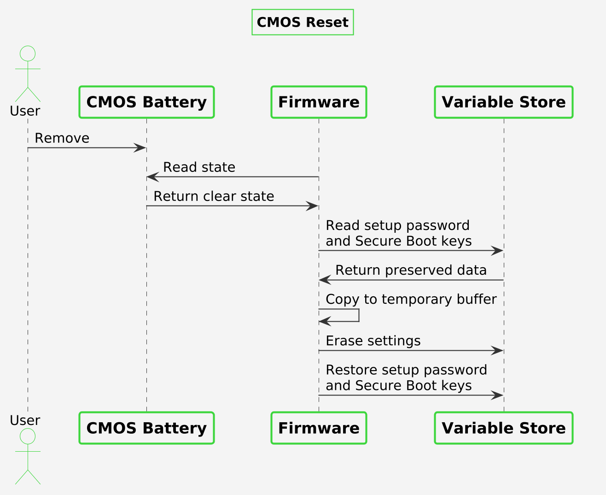

# CMOS reset

Dasharo firmware can restore all UEFI settings to their defaults when the CMOS
is cleared. This makes it easy to recover a device that no longer boots
correctly due to misconfigured firmware settings, without needing access to
the setup menu.

## How it works

On every boot, the firmware checks whether the CMOS contents are still valid.
If the CMOS was cleared, the firmware erases the UEFI settings
stored in the SPI flash variable store (SMMSTORE), so the next boot
uses the default configuration.

The following data is preserved across the reset:

- the [setup menu password](../dasharo-menu-docs/overview.md#user-password-management)
- the [UEFI Secure Boot](../dasharo-menu-docs/device-manager.md#secure-boot-configuration)
  certificates (PK, KEK, db, dbx)

These are copied aside before the SMMSTORE is erased and restored
afterwards, so a CMOS clear does not require re-entering the
setup password or Secure Boot keys.

## Clearing the CMOS

=== "NovaCustom"

    1. Power off the device and disconnect the power adapter.
    1. Open the case, temove the CMOS battery, wait over 10 seconds and reinstall it.
    1. Power on the device. The first boot after the reset may take longer
       than usual.

=== "Protectli"

    1. Power off the device and disconnect the power adapter.
    1. Open the case and locate the CMOS header. Header locations for each model are
       shown in the [Recovery](../unified/protectli/recovery.md) section.
    1. Short the `CMOS` and `GND` pins of the header for a few seconds,
       e.g. with a jumper.
    1. Remove the jumper, close the case and power on the device. The first
       boot after the reset may take longer than usual.

## Use case

A user changes a setting in the setup menu, after which the device no longer
boots and the setup menu cannot be entered. Clearing the CMOS returns all
settings to their defaults, while the setup password and Secure Boot keys stay
in place, so the device can boot again without being reflashed.
