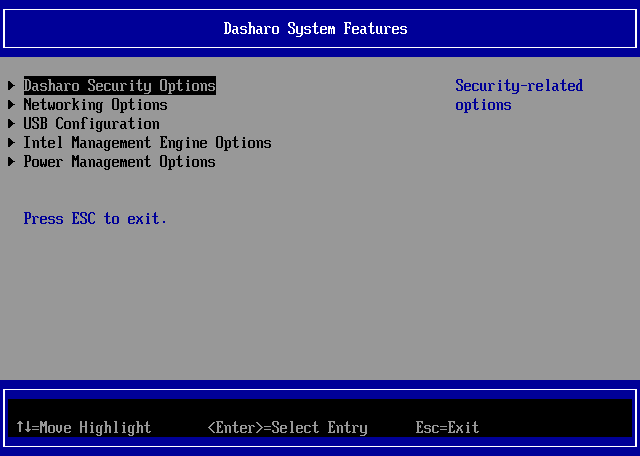
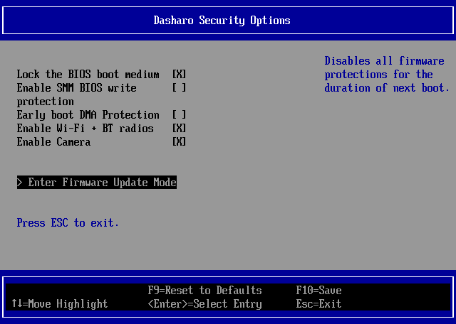
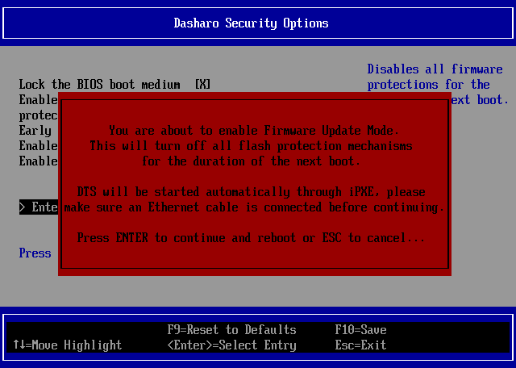
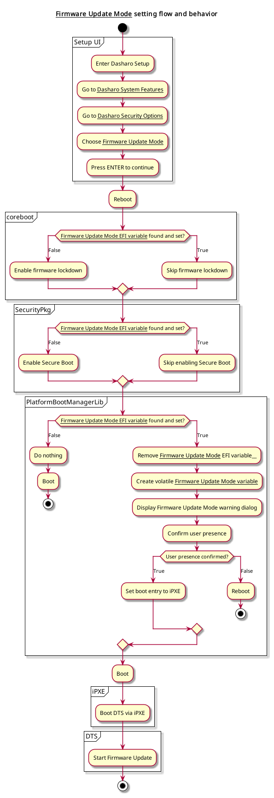

# Firmware update

## Introduction

This document describes the operation and rationale for Firmware Update Mode.

!!! tip

    If you are a user looking for a guide for updating firmware, check out the
    [Guides](../guides/firmware-update.md) section instead.

## Firmware Update Mode

For enhanced firmware security, Dasharo uses a number of security mechanisms to
prevent overwriting firmware. Depending on device, these may be some or all of
the following:

- SPI flash write-protection - prevents overwriting the initial bootblock and
  Verified Boot code
- SMM BIOS write protection - prevents all writes to BIOS flash memory outside
  of privileged code running in System Management Mode
- UEFI Secure Boot - in combination with Linux Kernel Lockdown, prevents direct
  access to the SPI flash controller from the OS

If you are interested, see the
[Dasharo System Features](../dasharo-menu-docs/dasharo-system-features.md)
section for more details.

To allow updating firmware by the end user, these protections must be disabled
first. To facilitate this, Dasharo has a Firmware Update Mode option that
**temporarily** disables firmware security measures for the duration of one
boot.

## Supported devices

The following table describes which devices support Firmware Update Mode
and the starting firmware version, if applicable.

!!! note

    Firmware Update Mode is currently only supported in UEFI firmware versions,
    not in SeaBIOS or Heads-based firmware flavors.

| Manufacturer | Device | FUM supported | Starting with FW version |
| --- | --- | --- | --- |
| MSI | Z690-A PRO | Yes | v1.1.2 |
| MSI | Z790-P PRO | Yes | v0.9.0 |
| NovaCustom | NS5x/7x ADL | Yes | v1.7.0 |
| NovaCustom | NS5x/7x TGL | Yes | v1.5.0 |
| NovaCustom | NV4x ADL | Yes | v1.7.0 |
| NovaCustom | NV4x TGL | Yes | v1.5.0 |
| NovaCustom | V5x0TU MTL | Yes | v0.9.0 |
| NovaCustom | V5x0TNx | Yes | v0.9.1 |
| NovaCustom | NUC BOX | Yes | v0.9.0 |

## How to use Firmware Update Mode

To enter Firmware Update Mode:

1. Enter the Setup Menu and navigate to Dasharo System Features:

1. Navigate to `Dasharo Security Options`:

1. Select `Firmware Update Mode`:

1. When prompted, press Enter to accept. The device will reboot in Firmware
  Update Mode.

1. After reboot, when prompted, press the indicated key on the keyboard.
  Alternatively, to abort Firmware Update Mode, press Enter instead or simply
  wait for the timeout to expire.

Once in Firmware Update Mode, proceed with the firmware update steps outlined
in device-specific documentation.

## Firmware Update Mode flowchart

