# Firmware Update Dependencies

This page describes in detail the various dependencies on security features
imposed by different firmware update protocols.

## Security features

| Feature Name | Type | Controlled by | Impact on Flash Updates |
| --- | --- | --- | --- |
| BIOS Lock (SPI Protected Ranges) | Runtime | PCH registers | Specific memory addresses in the BIOS region defined in these registers are hardware-locked from writing, regardless of BIOS_WE. |
| SMM BIOS Write Protection (BWP) | Runtime | PCH registers | Hardware enforcement. The BIOS region is read-only unless the processor is physically executing in SMM (System Management Mode). Even if BIOS_WE is set, writes fail if not in SMM. |
| HAP Mode (High Assurance Platform) | Persistent | Intel Flash Descriptor | Disables the ME. Required for updating the ME region on an Unfused system via Capsule, because you must not overwrite the ME firmware while it is running. |
| SPI Flash Region Access Permissions | Persistent | Intel Flash Descriptor | These define which regions are read- and write-accessible to the software running on the Application Processor (AP). On a fused platform, the IFD and ME regions are write-protected. Unfused platforms allow write access to all regions. |
| Intel Boot Guard | Persistent | Intel Management Engine | Cryptographically verifies and measures the BIOS region, allowing for establishing a hardware-derived Root of Trust. Disallows booting any BIOS images without correct signature. |
| Field-Programmable Fuses (FPF) | Permanent | PCH E-fuses | Enables immutability of the Intel Boot Guard configuration, ensuring that Boot Guard cannot be disabled by reflashing the ME region with a different Boot Guard configuration. Permanently ties the PCH to given BIOS signing keys. |

## Capsule Update

## Firmware Update Mode

