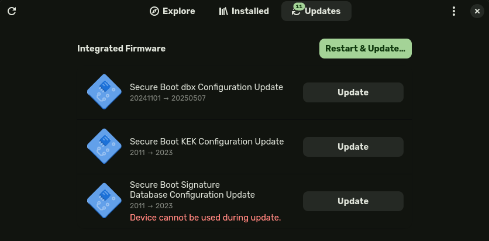

# fwupd

## Introduction

[fwupd][fwupd website] iis an open-source Linux daemon (background process), that
is widely used to make firmware updates almost as seamless and simple
as updating system packages. It is supported by most hardware vendors
and Linux distributions.

The `fwupd` daemon relies on the Linux Vendor Firmware Service (LVFS)
for distributing and managing the firmware binaries to the users.

!!! note
     `fwupd` depends on
     [Capsule Updates](https://docs.dasharo.com/guides/capsule-update/)
     support. Refer to the [Firmware update](https://docs.dasharo.com/unified/novacustom/firmware-update/)
     section of your device documentation.

## Usage

The most popular Desktop Environments like Gnome and KDE automatically
look for firmware updates on LVFS and suggest performing them with a
simple button press.

||
|--|
|Firmware update available in Gnome Software|

For more advanced users, and more lightweight
DEs/WMs `fwupdmgr` can be used in the terminal.

* Detect the supported hardware

    ```bash
    fwupdmgr get-devices
    ```

* Refresh metadata from LVFS

    ```bash
    fwupdmgr refresh
    ```

* Check for available updates

    ```bash
    fwupdmgr get-updates
    ```

* Download and install the firmware updates

    ```bash
    fwupdmgr update
    ```

## References

[fwupd website][fwupd website]
[fwupd github repository][fwupd github repository]
[fwupd documentation][fwupd documentation]

[fwupd website]: https://fwupd.org
[fwupd github repository]: https://github.com/fwupd/fwupd
[fwupd documentation]: https://lvfs.readthedocs.io
