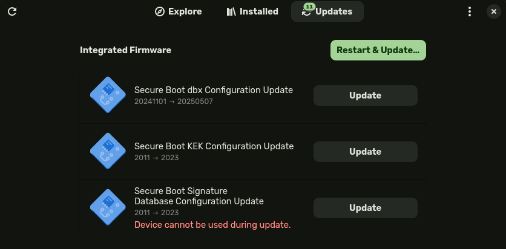

# fwupd

## Introduction

[fwupd][fwupd website] is an open-source project, that
is widely used to make firmware updates almost as seamless and simple
as updating system packages. It is supported by most hardware vendors
and Linux distributions.

The `fwupd` daemon relies on the Linux Vendor Firmware Service (LVFS)
for distributing and managing the firmware binaries to the users.

!!! note
     `fwupd` depends on
     [Capsule Updates](https://docs.dasharo.com/guides/capsule-update/)
     support. Refer to the "Firmware update" section of your device
     documentation (like [this one](https://docs.dasharo.com/unified/novacustom/firmware-update/)).

## Firmware Update Prerequisites

### Intel ME

This only applies to devices with an Intel Management Engine, that are not fused
using the [Dasharo Trust Root](https://docs.dasharo.com/glossary/#dasharo-trustroot)
technology, and use Dasharo versions released before 2026. Check your release
notes to verify if the step is required.

Intel Management Engine needs to be disabled manually to successfully perform an
fwupd update. Failing to do so won't do any harm to the system, but the update
will be rejected.

Intel ME needs to be switched to the `Disabled (HAP)` state using the Setup Menu
to perform the update. It cannot be done automatically by fwupd. Afterwards,
Intel ME needs to be manually turned back on if desired.

Check [Intel Management Engine Options](../dasharo-menu-docs/dasharo-system-features.md#intel-management-engine-options)
documentation for details on how to set ME mode to `Disabled (HAP)`.
See this [Intel ME/CSME FAQ page](../osf-trivia-list/me.md)
for information about disabling the ME, or [Issue #1302](https://github.com/Dasharo/dasharo-issues/issues/1302)
for more context.

### Charger connected

On battery powered devices (laptops) the AC charger must be connected
before running fwupdmgr in order to start the update. It must be connected
for the whole duration of the update, until the device boots back up normally.

## Usage

### Desktop Environments

The most popular Desktop Environments like Gnome and KDE automatically
look for firmware updates on LVFS and suggest performing them with a
simple button press.

||
|--|
|Firmware update available in Gnome Software|

Before starting the update, check whether the [prerequisites](#firmware-update-prerequisites)
are met.

### CLI

For more advanced users or in more lightweight
DEs/WMs `fwupdmgr` can be used in the terminal.

#### Installation

Most Operating Systems come with fwupd preinstalled and use
it to perform firmware updates.

=== "Windows"
    Dasharo Capsule Updates using fwupdmgr are not currently supported on
    Windows. If that is the only Operating System you with to use, other update
    methods need to be considered.

=== "Ubuntu"
    Check if fwupdmgr is installed. Executing the command should
    print the versions of all fwupdmgr components:

    ```bash
    $ fwupdmgr --version
    ```

    <details><summary>Example output</summary>
        ```
        $ fwupdmgr --version
        compile   org.freedesktop.fwupd         1.9.31
        compile   com.hughsie.libxmlb           0.3.18
        compile   com.hughsie.libjcat           0.2.0
        runtime   org.freedesktop.fwupd-efi     1.4
        compile   org.freedesktop.gusb          0.4.8
        runtime   com.hughsie.libxmlb           0.3.x
        runtime   com.hughsie.libjcat           0.2.0
        runtime   org.freedesktop.gusb          0.4.8
        runtime   org.freedesktop.fwupd         1.9.31
        runtime   org.kernel                    6.17.0-14-generic
        ```
    </details>


    If not, install it using:

    ```bash
    $ sudo apt update
    $ sudo apt install fwupdmgr
    ```

=== "Fedora"
    Check if fwupdmgr is installed. Executing the command should
    print the versions of all fwupdmgr components:

    ```bash
    $ fwupdmgr --version
    ```

    <details><summary>Example output</summary>
        ```
        $ fwupdmgr --version
        compile   org.freedesktop.fwupd         1.9.31
        compile   com.hughsie.libxmlb           0.3.18
        compile   com.hughsie.libjcat           0.2.0
        runtime   org.freedesktop.fwupd-efi     1.4
        compile   org.freedesktop.gusb          0.4.8
        runtime   com.hughsie.libxmlb           0.3.x
        runtime   com.hughsie.libjcat           0.2.0
        runtime   org.freedesktop.gusb          0.4.8
        runtime   org.freedesktop.fwupd         1.9.31
        runtime   org.kernel                    6.17.0-14-generic
        ```
    </details>

    If not, install it using:

    ```bash
    $ sudo dnf install fwupdmgr
    ```

=== "QubesOS"
    To use fwupdmgr on QubesOS the program needs to be run on
    the `dom0` qube and it requires internet connection.
    For that reason a fwupdmgr wrapper for QubesOS exists,
    that sets up the network tunnels for the firmware update
    downloads to be possible from dom0.
    The qubes-fwupdmgr package should be installed out of the box.
    Executing the command should print the help screen:

    ```bash
    $ sudo qubes-fwupdmgr
    ```

    <details><summary>Example output</summary>
        ```
        $ sudo qubes-fwupdmgr
        ======================================================================
        Usage:
        ======================================================================
            Command:			qubes-fwupdmgr [OPTION…][FLAG..]
            Example:			qubes-fwupdmgr refresh --whonix --url=<url>

        Options:
        ======================================================================
            get-devices:			Get all devices that support firmware updates
            get-updates:			Get the list of updates for connected hardware
            refresh:			Refresh metadata from remote server
            update:				Update chosen device to latest firmware version
            update-heads:			Updates heads firmware to the latest version (EXPERIMENTAL, not fully supported yet)
            downgrade:			Downgrade chosen device to chosen firmware version
            clean:				Delete all cached update files

        Flags:
        ======================================================================
            --whonix:			Download firmware updates via Tor
            --device:			Specify device for heads update (default - x230)
            --url:				Address of the custom metadata remote server

        Help:
        ======================================================================
            -h --help:			Show help options
        ```
    </details>

### Checking the current firmware version

=== "Ubuntu, Fedora"
    To check the currently used firmware version, run the following command

    ```bash
    $ fwupdmgr get-devices
    ```

    Look for `System Firmware` or `UEFI Device Firmware` in the output.
    <details><summary>Example of a firmware version entry:</summary>
        ```
        ├─UEFI Device Firmware:
        │     Device ID:          204ce525ed4dbc468e789eb029f3627dd13d6cf4
        │     Summary:            UEFI System Resource Table device (updated via NVRAM)
        │     Current version:    1.0.1
        │     Minimum Version:    1.0.1
        │     Vendor:             NovaCustom (DMI:3mdeb)
        │     GUID:               f4deb4f3-f673-48fe-a481-627357b00b6a
        │     Device Flags:       • Internal device
        │                         • System requires external power source
        │                         • Supported on remote server
        │                         • Needs a reboot after installation
        │                         • Device is usable for the duration of the update
        │                         • Updatable
        │     Device Requests:    • Message
        ```
    </details>

=== "QubesOS"
    To check for available updates for your device, run the following command

    ```bash
    $ sudo qubes-fwupdmgr get-devices
    ```

    Look for `System Firmware` or `UEFI Device Firmware` in the output.

    <details><summary>Example of get-devices output</summary>
        ```
        ======================================================================
        System Firmware
        ======================================================================
            DeviceId:           204ce525ed4dbc468e789eb029f3627dd13d6cf4
            Guid:               ·f4deb4f3-f673-48fe-a481-627357b00b6a
            Summary:            UEFI System Resource Table device (updated via NVRAM)
            Plugin:             uefi_capsule
            Protocols:          ·org.uefi.capsule
            Flags:              ·internal
                                ·updatable
                                ·require-ac
                                ·needs-reboot
                                ·can-verify
                                ·usable-during-update
            RequestFlags:       ·allow-generic-message
            Checksums:          ·914872cd28744aacad621b8a95e02171b7854b79cf61c59eec939868a33de07d
            Vendor:             Notebook
            VendorIds:          ·DMI:3mdeb
            Version:            16777344
            VersionRaw:         16777344
            Created:            1771420572
            UpdateState         2
        ```
        As of QubesOS R4.2.3 the firmware version is not interpreted correctly
        by fwupdmgr.
        As a fallback on Dasharo firmware, use `dmidecode` to verify the firmware version.
        Run:
        ```bash
        $ sudo dmidecode -t bios | grep Version:
        ```
        Example output:
        ```txt
        Version: Dasharo (coreboot+UEFI) v1.0.0
        ```
    </details>

### Checking for updates

=== "Ubuntu, Fedora"
    To check for available updates for your device, run the following commands

    ```bash
    $ fwupdmgr refresh
    $ fwupdmgr get-updates
    ```

    <details><summary>Example of a possible update from v1.0.0 to v1.0.1:</summary>
        ```
        $ fwupdmgr get-updates
        Devices with no available firmware updates:
        • UEFI dbx
        • SSDPR-PX600-250-80
        Notebook V54x_6x_TU
        │
        └─System Firmware:
        │   Device ID:          204ce525ed4dbc468e789eb029f3627dd13d6cf4
        │   Summary:            UEFI System Resource Table device (updated via NVRAM)
        │   Current version:    1.0.0
        │   Minimum Version:    1.0.0
        │   Vendor:             NovaCustom (DMI:3mdeb)
        │   Update State:       Success
        │   GUID:               f4deb4f3-f673-48fe-a481-627357b00b6a
        │   Device Flags:       • Internal device
        │                       • Updatable
        │                       • System requires external power source
        │                       • Supported on remote server
        │                       • Needs a reboot after installation
        │                       • Cryptographic hash verification is available
        │                       • Device is usable for the duration of the update
        │   Device Requests:    • Message
        │
        └─V54x_6x_TU System Update:
                New version:      1.0.1
                Remote ID:        lvfs
                Release ID:       135872
                Summary:          V54x_6x_TU V540TU system firmware
                License:          Proprietary
                Size:             34.0 MB
                Created:          2026-01-29
                Urgency:          High
                Tested by NovaCustom:
                Tested:         2026-01-29
                Distribution:   ubuntu 24.04
                Old version:    1.0.1
                Version[fwupd]: 1.9.31
                Vendor:           NovaCustom
                Release Flags:    • Trusted metadata
                                • Is upgrade
                                • Tested by trusted vendor
                Description:
                New Dasharo firmware release for the NovaCustom Meteor Lake laptops

                with integrated graphics, featuring numerous bug fixes, performance

                improvements and stability fixes.
                Checksum:         178be21614286811e95484118e06b4b39c91fe401b234639d4aa73cd7d6f63d6
        ```
    </details>

=== "QubesOS"
    To check for available updates for your device, run the following commands

    ```bash
    $ qubes-fwupdmgr refresh
    $ qubes-fwupdmgr get-updates
    ```
    TODO

### Updating the firmware

### Preparation / Prerequisites

Before starting the update, check whether the [prerequisites](#firmware-update-prerequisites)
are met.

#### Update instructions

=== "Ubuntu, Fedora"
    To update your firmware, run the following commands:

    ```bash
    $ fwupdmgr refresh
    $ sudo fwupdmgr update
    ```

    <details><summary>Example of an update process:</summary>
        ```
        $ fwupdmgr update
        Devices with no available firmware updates:
        • UEFI dbx
        • SSDPR-PX600-250-80
        ╔══════════════════════════════════════════════════════════════════════════════╗
        ║ Upgrade System Firmware from 1.0.0 to 1.0.1?                                 ║
        ╠══════════════════════════════════════════════════════════════════════════════╣
        ║ New Dasharo firmware release for the NovaCustom Meteor Lake laptops          ║
        ║                                                                              ║
        ║ with integrated graphics, featuring numerous bug fixes, performance          ║
        ║                                                                              ║
        ║ improvements and stability fixes.                                            ║
        ║                                                                              ║
        ║ V54x_6x_TU must remain plugged into a power source for the duration of the   ║
        ║ update to avoid damage.                                                      ║
        ╚══════════════════════════════════════════════════════════════════════════════╝
        Perform operation? [Y|n]: y
        Authenticating…          [***************************************]
        ==== AUTHENTICATING FOR org.freedesktop.fwupd.update-internal-trusted ====
        Authentication is required to update the firmware on this machine
        Authenticating as: ubuntu
        Password:
        ==== AUTHENTICATION COMPLETE ====
        Waiting…                 [***************************************]
        Successfully installed firmware
        Do not turn off your computer or remove the AC adapter while the update is in progress.
        An update requires a reboot to complete. Restart now? [y|N]: y
        ==== AUTHENTICATING FOR org.freedesktop.login1.reboot ====
        Authentication is required to reboot the system.
        Authenticating as: ubuntu
        Password:
        ==== AUTHENTICATION COMPLETE ====
        ```
    </details>

=== "QubesOS"

    To update your firmware, run the following commands:

    ```bash
    $ sudo qubes-fwupdmgr refresh
    $ sudo qubes-fwupdmgr update
    ```
    TODO

!!! warning
    After the command finishes fwupd will instruct to reboot the device.
    The fwupd UEFI application that performs the update will be booted
    automatically after a reboot, unless there's user interaction
    Entering the Setup Menu, Boot Manager, or interfering in any other way will
    abort the update.
    Allow the device to reboot freely and do not press any buttons until the
    update finishes.

    Devices that have an Embedded Controller
    [might stay powered off after the update][dts-ec-update] and need to be
    powered on.

[dts-ec-update]: https://docs.dasharo.com/dasharo-tools-suite/documentation/features/#ec-update

#### Troubleshooting

##### No output from fwupdmgr update

Depending on the version of fwupdmgr, issues like the AC being disconnected on
battery powered devices might not be printed explicitly right away after
trying to perform an update. In such case try running the `get-devices` command
and look for `Problems` header and red text under device entries.
<details><summary>Example, update rejected, AC was not connected.</summary>
    ```
    ├─System Firmware:
    │ │   Device ID:          204ce525ed4dbc468e789eb029f3627dd13d6cf4
    │ │   Summary:            UEFI System Resource Table device (updated via NVRAM)
    │ │   Current version:    1.0.0
    │ │   Minimum Version:    1.0.0
    │ │   Vendor:             NovaCustom (DMI:3mdeb)
    │ │   Update State:       Success
    │ │   Problems:           • Device requires AC power to be connected
    │ │   GUID:               f4deb4f3-f673-48fe-a481-627357b00b6a
    │ │   Device Flags:       • Internal device
    │ │                       • System requires external power source
    │ │                       • Supported on remote server
    │ │                       • Needs a reboot after installation
    │ │                       • Cryptographic hash verification is available
    │ │                       • Device is usable for the duration of the update
    │ │                       • Updatable
    │ │   Device Requests:    • Message
    ```
    Note, that `Update State` is `Success` despite a failure, as it reports
    the status of the last correctly initiated Update. Without an AC connected,
    the update did not even start keeping the previous value of `Update State`.
</details>
If you see any errors during the update, check the [Troubleshooting](../guides/capsule-update.md#troubleshooting)
section of the Capsule Update guide.

##### fwupdmgr asks for AC despite it being connected

The check for AC charger being connected in Linux fails when the firmware
configures a [charging threshold](http://127.0.0.1:8000/unified/novacustom/features/#charge-thresholds)
for the battery that disconnects the charger once the battery reaches the threshold.
If the battery is considered full and not charging at the moment, the check in
fwupdmgr will think the charger is disconnected.

There are two options to work this issue around:

- Deplete battery charge a couple percent, so that it
    doesn't stop charging for the duration of fwupdmgr running the checks.
- Disable battery charging thresholds in the firmware.

### Verifying the firmware update result

=== "Ubuntu, Fedora"
    To check the result of your firmware update, run the following command:

    ```bash
    $ fwupdmgr get-results
    ```

    You will be prompted to select a device, for Dasharo firmware updates, select
    `System Firmware` or `UEFI Device Firmware`.

    <details><summary>Example of `fwupdmgr get-results` output after a successful update</summary>
        ```
        $ sudo fwupdmgr get-results
        0.	Cancel
        1.	597c1adb5fa5096f1949ae7535b85dc6ddd34f80 ((null))
        2.	4bde70ba4e39b28f9eab1628f9dd6e6244c03027 (Core™ Ultra 7 155H)
        3.	aec1a869eb0df71b7cea6b3ac71d39b830faf164 (MNE007QS1-4)
        4.	5792b48846ce271fab11c4a545f7a3df0d36e00a (Meteor Lake-P [Intel Graphics])
        5.	71b677ca0f1bc2c5b804fa1d59e52064ce589293 (SSDPR-PX600-250-80)
        6.	204ce525ed4dbc468e789eb029f3627dd13d6cf4 (System Firmware)
        7.	c6a80ac3a22083423992a3cb15018989f37834d6 (TPM)
        8.	6924110cde4fa051bfdc600a60620dc7aa9d3c6a (UEFI Platform Key)
        9.	362301da643102b9f38477387e2193e57abaa590 (UEFI dbx)
        Choose device [0-9]: 6
        System Firmware:
        Device ID:            204ce525ed4dbc468e789eb029f3627dd13d6cf4
        Previous version:     1.0.0
        Update State:         Success
        Last modified:        2026-02-18 14:01
        GUID:                 f4deb4f3-f673-48fe-a481-627357b00b6a
        Device Flags:         • Internal device
                                • Updatable
                                • System requires external power source
                                • Supported on remote server
                                • Needs a reboot after installation
                                • Cryptographic hash verification is available
                                • Device is usable for the duration of the update
        ```
    </details>

    This output means the firmware version has changed to the expected one.
    To manually verify this has really happened, refer to
    [Checking The Current Firmware Version](#checking-the-current-firmware-version).

=== "QubesOS"
    To update your firmware, run the following commands:

    ```bash
    $ sudo qubes-fwupdmgr refresh
    $ sudo qubes-fwupdmgr update
    ```

#### Troubleshooting

##### Failed to run update on reboot: expected ... and got

This Update Error is most often caused by failing to set the Intel ME
to `Disabled (HAP)` mode prior to running the update.

<details><summary>Example of fwupdmgr get-results output when that happens</summary>
```
$ sudo fwupdmgr get-results
0. Cancel
1. 597c1adb5fa5096f1949ae7535b85dc6ddd34f80 ((null))
2. 4bde70ba4e39b28f9eab1628f9dd6e6244c03027 (Core™ Ultra 7 155H)
3. aec1a869eb0df71b7cea6b3ac71d39b830faf164 (MNE007QS1-4)
4. 5792b48846ce271fab11c4a545f7a3df0d36e00a (Meteor Lake-P [Intel Graphics])
5. 71b677ca0f1bc2c5b804fa1d59e52064ce589293 (SSDPR-PX600-250-80)
6. 204ce525ed4dbc468e789eb029f3627dd13d6cf4 (System Firmware)
7. c6a80ac3a22083423992a3cb15018989f37834d6 (TPM)
8. 6924110cde4fa051bfdc600a60620dc7aa9d3c6a (UEFI Platform Key)
9. 362301da643102b9f38477387e2193e57abaa590 (UEFI dbx)
Choose device [0-9]: 6
System Firmware:
Device ID:            204ce525ed4dbc468e789eb029f3627dd13d6cf4
Previous version:     1.0.0
Update State:         Failed
Update Error:         failed to run update on reboot: expected 1.0.1 and got 1.0.0
Last modified:        2026-02-18 13:45
GUID:                 f4deb4f3-f673-48fe-a481-627357b00b6a
Device Flags:         • Internal device
                        • Updatable
                        • System requires external power source
                        • Supported on remote server
                        • Needs a reboot after installation
                        • Cryptographic hash verification is available
                        • Device is usable for the duration of the update
```
</details>

When that happens after rebooting instead of a Dasharo themed update
progress bar, a message like this will appear on top of the screen:

`[FIRMWARE WARNING] Capsule Updates are only supported while Intel ME is in HAP mode!`

Make sure the Intel ME mode in Setup menu is `Disabled (HAP)`. Refer to the
[prerequisites section](#firmware-update-prerequisites) and try again.

## References

- [fwupd website][fwupd website]
- [fwupd github repository][fwupd github repository]
- [fwupd documentation][fwupd documentation]

[fwupd website]: https://fwupd.org
[fwupd github repository]: https://github.com/fwupd/fwupd
[fwupd documentation]: https://lvfs.readthedocs.io
