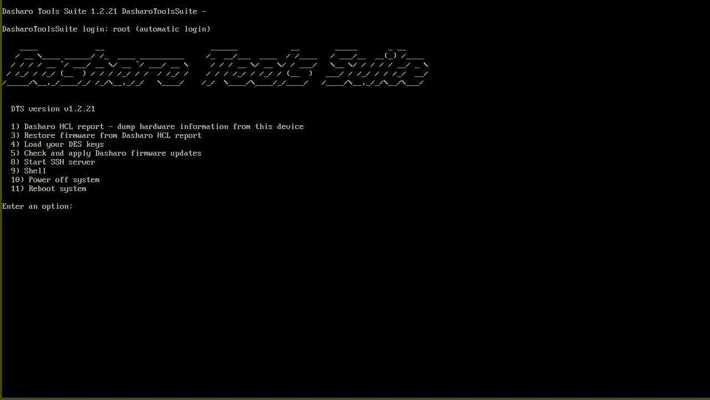

# Dasharo Tools Suite

## What is Dasharo Tools Suite?

Dasharo Tools Suite (DTS) is like a swiss army knife for Dasharo firmware: you
can execute initial deployment, firmware update and even dump machine logs for
debugging and development support.

Also refer to [DTS Overview](../dasharo-tools-suite/overview.md).

## How to get Dasharo Entry Subscription Releases using Dasharo Tools Suite?

Dasharo Entry Subscription Releases can be used to perform firmware updates
with DTS by providing Dasharo Entry Subscription credentials obtained after
buying a [Dasharo Entry Subscription](../ways-you-can-help-us.md#become-a-dasharo-entry-subscription-subscriber).

Commercial use of DTS should be discussed directly with
[3mdeb](mailto:leads@3mdeb.com) or [Dasharo Team](mailto:contact@dasharo.com).

### How can I use my Dasharo Entry Subscription credentials

<!-- Need to be replaced in case the menu changed. -->

After purchasing the Dasharo Entry Subscription, you should receive an email
with keys to use with [Dasharo Tools Suite](../dasharo-tools-suite/overview.md).
This section describes how to do it.

* Firstly, run DTS from a USB flash drive, documentation on this is included
  [here](../dasharo-tools-suite/documentation.md#bootable-usb-stick).

* After booting, you will see a text menu, choose option number 4,
  `Load your DES keys`, by pressing `4` and `Enter`.

* Next, rewrite the credentials received in the following order:
    - `logs key`,
    - `firmware download key`,
    - `password`.

* Credentials will be verified by DTS attempting to connect to our server. If
  successful, the message `Verification of the Dasharo DES was successful. They
  are valid and will be used.` will be displayed.

Below is a short video that present loading DES keys.

## How to support us?

In general there are three ways to support us:

### I have more time than money and I can code

Please help us develop Dasharo influence on open-source firmware market and
spread the word about it. There are multiple ways to do that:

* [Join Dasharo Matrix
  Community](../ways-you-can-help-us.md#join-dasharo-matrix-community) and
  support other members of community
* [Join Dasharo open-source firmware
  vPub](../ways-you-can-help-us.md#join-dasharo-open-source-firmware-vpub) or
  other related event organized by 3mdeb or Dasharo Team.
* [Write a Google review](../ways-you-can-help-us.md#write-a-google-review)
* [Follow us on social
  media](../ways-you-can-help-us.md#follow-us-on-social-media) and help
  spreading the word about Dasharo.
* [Contribute](../ways-you-can-help-us.md#contribute-through-github)
  documentation, test results, [Dasharo Hardware Compatibility List
  Reports](https://docs.dasharo.com/dasharo-tools-suite/documentation/#hcl-report)

To get access to DTS SE you should [contact 3mdeb](mailto:leads@3mdeb.com) or
[Dasharo Team](mailto:contact@dasharo.com) and prove your contribution
regarding above areas of support and influence. If it would be meaningful we
would be glad to give you access to DTS SE for a year.

### I have more time than money and I can't code

Please [contribute](../ways-you-can-help-us.md#contribute-through-github)
ideas for new features, review documentation and help testing bug fixes.

If you would like to pursue that path please contact us on [Dasharo -
General](https://matrix.to/#/#dasharo-general:matrix.org) Matrix channel to
agree on scope of contribution to avoid any potential collision with other
developers. To get access to DTS SE you should contact
[3mdeb](mailto:leads@3mdeb.com) or [Dasharo Team](mailto:contact@dasharo.com)
with links to your contribution and we would be glad to provide one year of DTS
SE updates.

### I have more money than time

Please [donate](../ways-you-can-help-us.md#donate-money) using one of
available methods and contact [3mdeb](mailto:leads@3mdeb.com) or [Dasharo
Team](mailto:contact@dasharo.com) to let us know about your donation. Minimal
donating to access DTS SE with one year update support is 60EUR.
