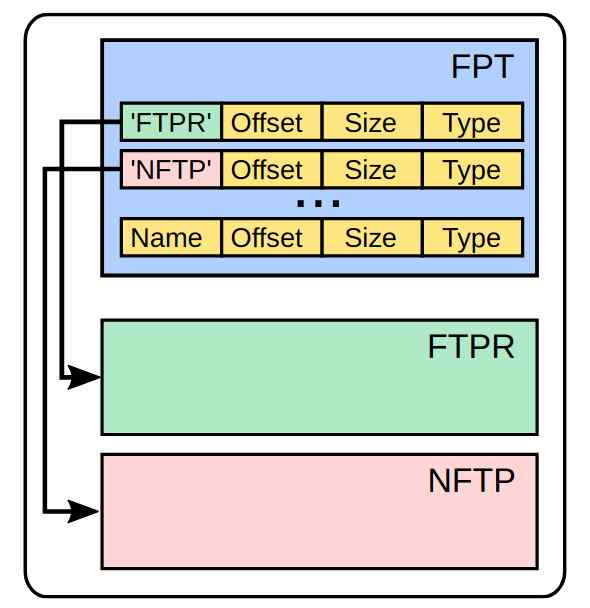
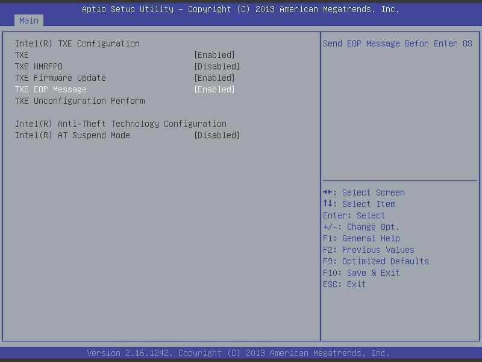

# Introduction

Until Nehalem (ME version 6) it was possible to remove ME firmware completely.
Starting with Nehalem, ME firmware can't be completely removed.

- If ME firmware is missing, the PC will not boot at all
- Earlier ME versions left a 30 minute grace period for recovering from
  a bad flash, but this is no longer true

Three methods to reduce ME's capabilities have been found: **neutering**,
**disabling** and **soft-disabling**.

- Removing non-essential portions of the ME's firmware is commonly referred
  to as **neutering** ME
- Setting a bit in the Flash Descriptor which acts as a kill-switch which
  tells ME to hang after initialization is usually what we mean by
  **disabling** ME

## Neutering ME

Neutralizing ME: removing non-essential portions of the ME's firmware

- Also called "neutering"
- Not initially designed by Intel

Method discovered by Nicola Corna of the me_cleaner project
Removes all modules other than those required for platform init

- Modules left in ME 6.0 - 10.x: `ROMP`, `BUP`
- Modules left in ME >= 11.x: `rbe`, `kernel`, `syslib`, `bup`, sometimes
  also `mfs`
A neutered ME will initialize hardware, then throw an error due to missing
firmware

- This sometimes results in power management issues
    + Therefore it's not recommended in production without extensive testing
- Functions provided by ME will no longer be operational

ME >= v11.x: Sometimes `mfs` also needs to be preserved. `mfs` is responsible
for some of the hardware initialization.

## Why is it possible?

- The FPT is not signed, has just a checksum
- The partitions are individually signed
- The offset and size of each partition are saved in each FPT entry

Source: [Intel ME myths and reality, Igor Skochinsky & Nicola Corna](https://fahrplan.events.ccc.de/congress/2017/Fahrplan/system/event_attachments/attachments/000/003/391/original/Intel_ME_myths_and_reality.pdf)

## Soft-disabling ME

It's also possible to put ME into a **soft-disabled** state by sending
a HECI `SET_ME_DISABLE` or `HMRFPO_ENABLE` message

- BIOS needs to send these messages
- ME will stay disabled until a corresponding `ENABLE` message is sent
- Functional ME firmware must be present
- Usually what the "Disable ME" option in some BIOSes does
- Also offered as an option when buying some laptops (e.g. Dell)

## HAP / AltMeDisable bit (aka disabling ME)

Method discovered in 2017 by Positive Technologies. Initially introduced by
Intel for government/intelligence purposes.

- Not even the US government trusts ME entirely!

Also supported by the me_cleaner project
Involves setting an undocumented, secret bit in the Flash Descriptor which
acts as a kill-switch for the ME

- `AltMeDisable` on ME versions < 11.x
- HAP (High Assurance Platform) on ME versions >= 11.x

Leaves ME in a stopped state, lets it shut down gracefully instead of erroring
out
- This can help prevent issues with power management that may arise from
  disabling the ME
- Supported by some OEMs

## 3mdeb official statement

Whenever it is possible 3mdeb try to minimize impact of (CS)ME/SPS/TXE or any
other firmware residing on peripheral or built-in CPUs.
