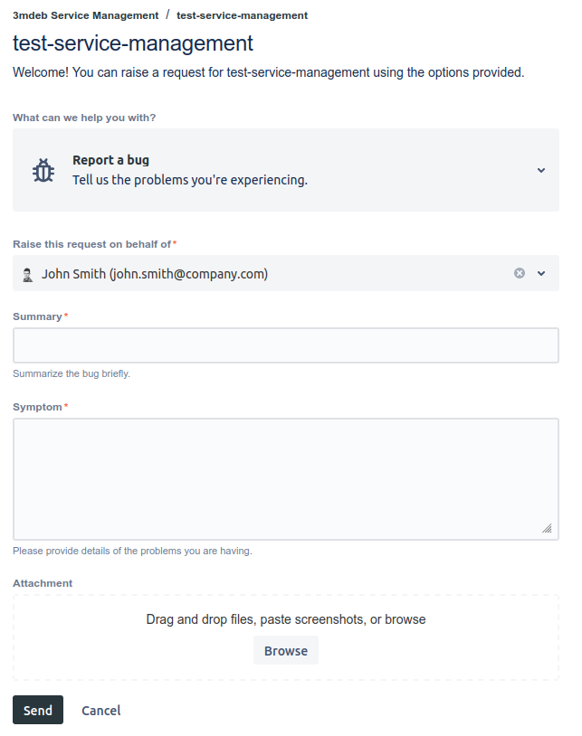

# Jira Service Management client procedure

## Dasharo Support Package

If you are interested in starting cooperation using the Support Package, it is the perfect time
to start. The Support Package will help us allocate resources and a secure timeline for your
needs. To ensure that we can provide comprehensive assistance with your current products and
future new developments, we encourage you to choose our new Support Package for more streamlined
cooperation, guaranteed availability, and quick, on-time delivery.

# Why should you add requests to Jira Service Management?

JSM allows you to easly keep track the status of your individual requests.\
Each new request you add, means analysis and pricing of task execution. This conversation will
take place place on JSM. Progress on the request will also be reported using JSM.

## Before you raise your first request

Remember to provide a list of email addresses of people that need an access to the portal.

## How to add a request

### Raising requests using the portal

To add a new request using the web service:

1. Go to [portal](https://jira-3mdeb.atlassian.net/servicedesk/customer/portals) and select the
   project.
2. Select a type of request and provide a required data. You can also add attachements by
   dragging and dropping into any part of the web page, or by clicking the `Browse` button.
3. When you are ready to send the request, click Send. Your request is created and awaits our response.

### Raising requests using email

If you prefer raising a request using email, you can do this by sending a message to special
email address generated for the project.

The email address will be provided to you by separate message.

### Communication through Jira Service Desk

You can always add a comment to the request and attach files. You can do it directly from the
JSM request page or using email simply by replying to the email thread.

We'll also add comments, questions and quotations in the comment section.

### What happens after you raise a request

We'll soon let you know let you know about the cost and what solutions are proposed.
You'll also receive an information what requests will be resolved in the next release.

## Process and request statuses

The diagram bellow presents how the workflow of JSM requests looks like.

### Open

Your request is created and visible for us, but we didn't start working on it yet.

### Analysis

Our team is analyzing your request. We will soon let you know what will be the cost of resolving
this request.

### Waiting for client

Your action is required to continue working on your request.\
We'll wait for your acceptance after our comment with SP estimation or after we ask for a
clarification.

> Note that the request with this status is waiting for your response. Delaying a response will
> result with lack of progress being made on the request.

### Approved

You have accepted the cost, and we will soon start working to resolve the request.

### Rejected

You have rejected the cost of resolving the request, and we will not work on this request.

### In progress

We are actively working on the request.

### On hold

The progress on resolving the request has been paused, and the work may be resumed in the future.

### Closed

The request has been resolved, but there was no work to be done or work was stopped due to:
1. the client's decision
2. feasibility study showed 0% success rate
3. other

### Done

The request is resolved, and work has been completed.

## Your SP budget

After completing the request, you'll recive an information about the state of your SP budget by email.

## SLAs

Our team aims to provide the best support experience. We want you to always be up to date on
the status of your request. We are doing our best to reply on your request in less that
36 hours.
