# Presale device preparation and validation

## Introduction

This document describes the preparation (assembly, flashing and verification)
procedure of the ASRock SPC741D8 with specified components in
[requirements](#requirements).

## Requirements

| Part         | Model Name                                                      | Image                                   |
|:-------------|:---------------------------------------------------------------:|:---------------------------------------:|
| Motherboard  | ASRock SPC741D8                                                 |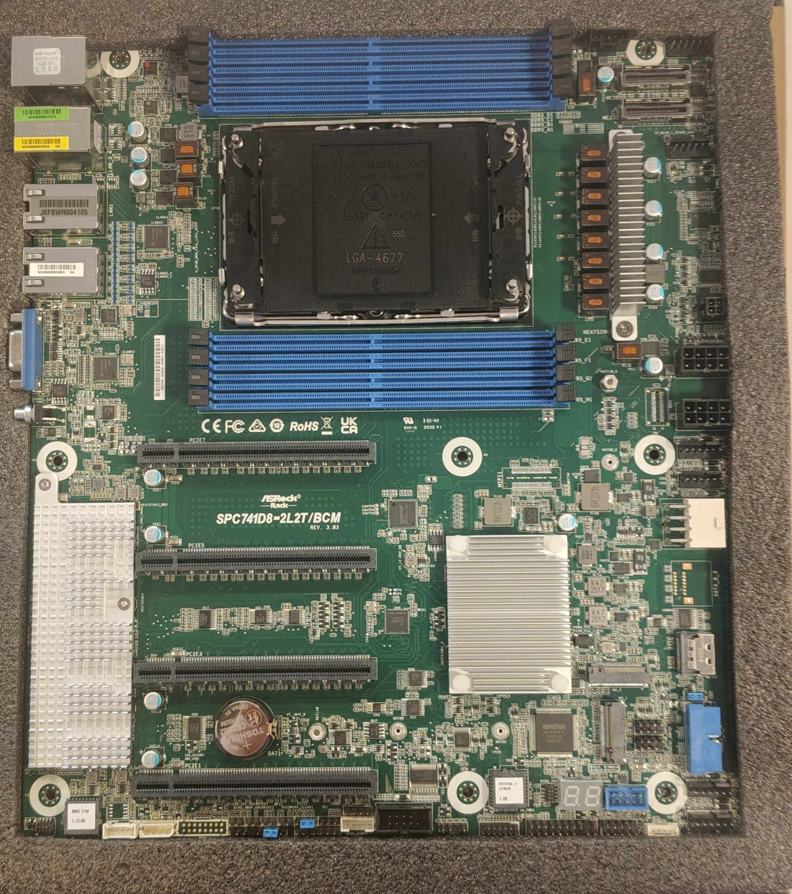   |
| CPU          | Intel Xeon Silver 4410Y                                         |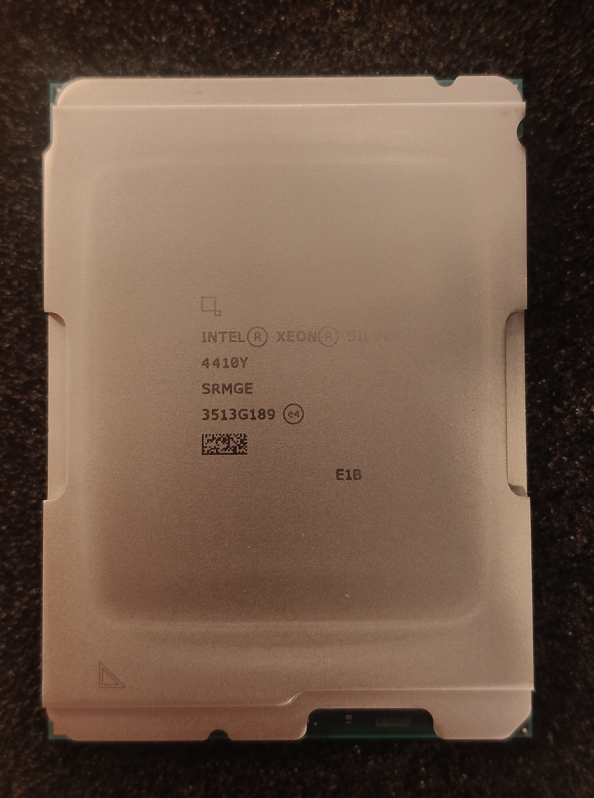                   |
| Cooling      | Arctic Freezer 4U-M                                             |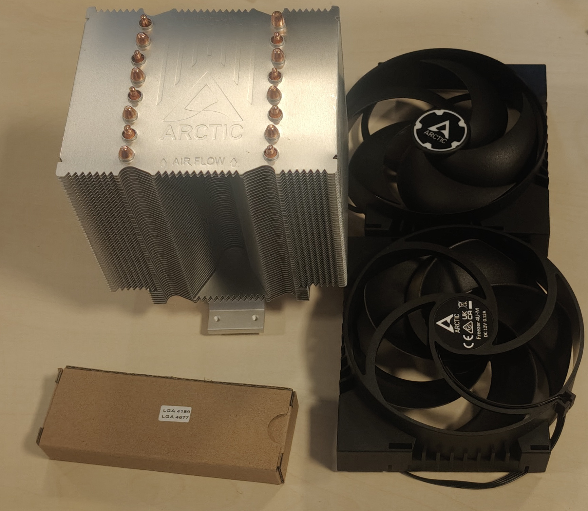         |
| RAM          | Kingston 16GB DDR5 ECC KSM48R40BS8KMM-16HMR                     |                |
| Power Supply | Seasonic Vertex GX 850W 80 Plus Gold                            |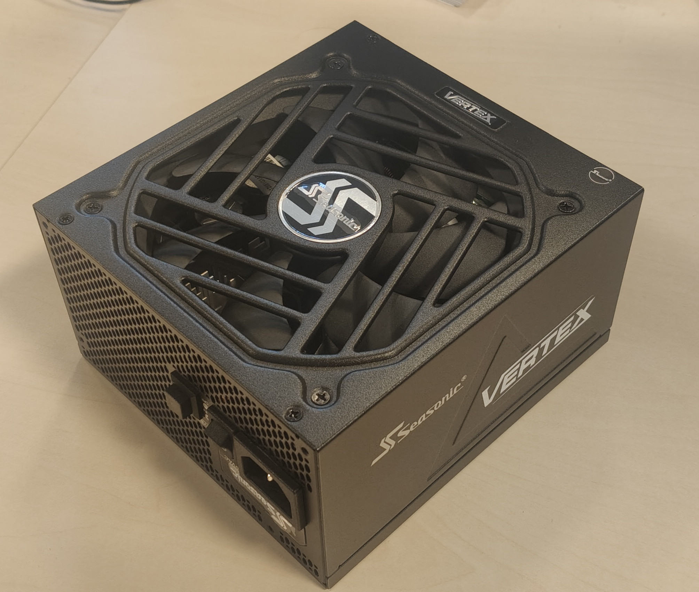 |
| Storage      | SSD Kingston KC3000 512 GB M.2 2280 NVMe                        |           |
| Enclosure    | SilverStone RM42-502 4U Rack Chassis                            |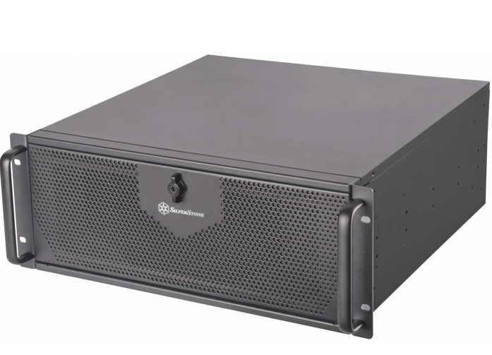       |
| TPM          | ASRock TPM-SPI Module                                           |            |

Additionally, you will need a screwdriver with bits P1, T30, and small pliers.
Remember to make all connections with the grounding strap.

## Device assembly

### Full set assembly

The section below describes the procedure for the complete assembly
of the working station.

1. Place the motherboard in front of you. This is the component with which most
    operations will be performed. It’s best to put something soft under the
    board to avoid damage during RAM installation and other steps.

    

1. In the motherboard box, find the CPU bracket marked "E1B".

    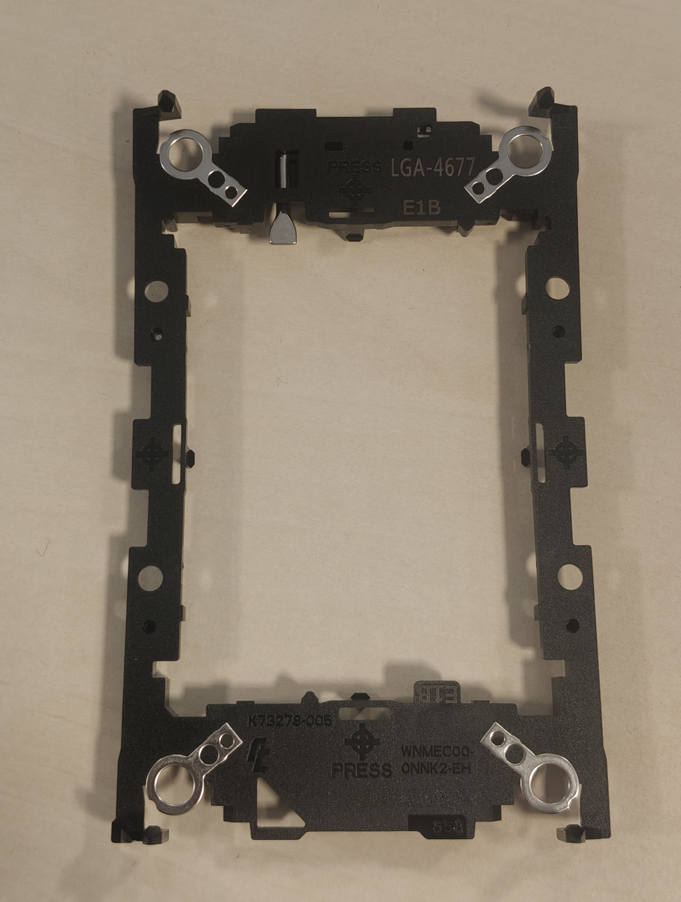

1. Attach the bracket to the CPU, making sure to line up the triangles and
    that all the clips are fully engaged.

    
    

1. Assemble the cooler by screwing in two metal pieces on both sides of the
    cooler. They can be found in the accessories box marked "LGA4677".
    You will need to screw in the holes marked "LGA4677".

    

1. Remove the CPU socket cover from the motherboard and very carefully place
    the CPU into the socket, making sure to line up the triangles.

    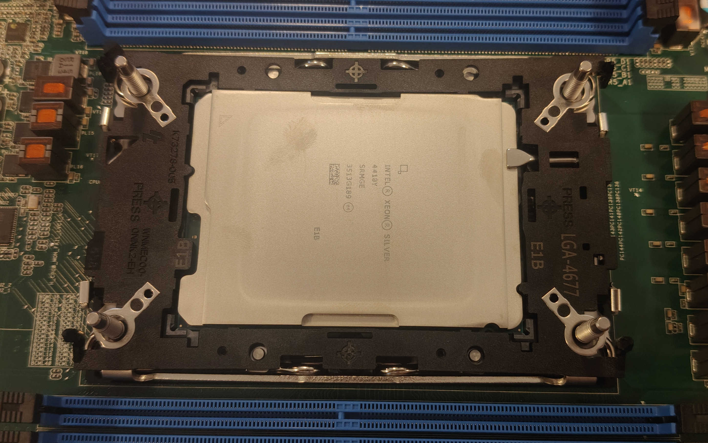

1. Apply thermal paste to the CPU, remove the peel from the bottom of the cooler,
    and place it on the CPU, ensuring the airflow arrows point in the direction
    of the motherboard I/O.

    
    

1. Tighten the CPU cooler using a T30 screwdriver. First, tighten the screws
    around halfway, then tighten the opposite corners fully. This is crucial
    for good contact between the CPU and the socket.

    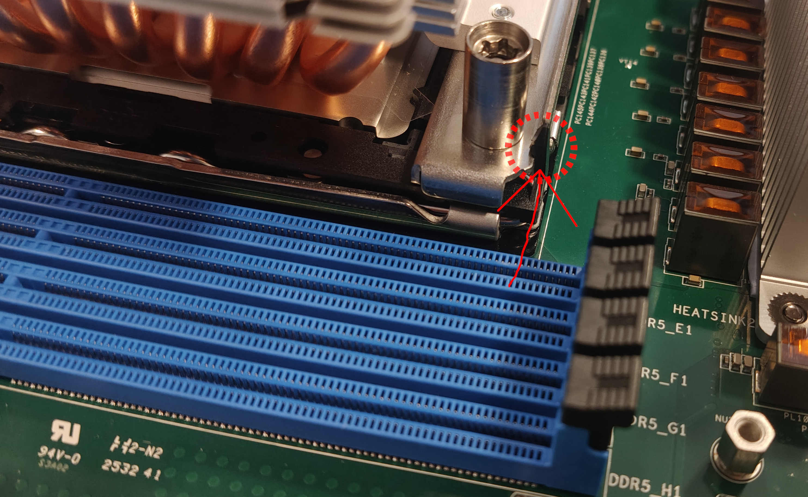

1. The cooler assembly can now be attached to the cooler by snapping the pieces
    on both sides. The fan with the Arctic logo on the front should be attached
    to the right side of the cooler.

    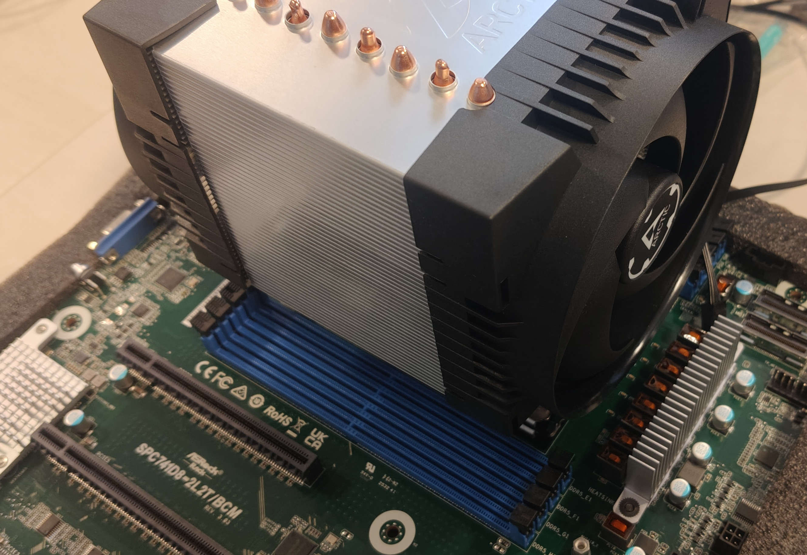

1. Connect the cooler fan headers by attaching them together and securing them
    to the motherboard in the FAN1 port.

    

1. Install the memory modules into the DIMM slots. To insert a single module,
    open the latches on both sides. Then insert the RAM and gently press
    downward until the latches close automatically. Install memory according
    to the table. If only one module is used, place it in slot A1.

    |                    | DIMM Number   |    |    |    |    |
    | ------------------ | ------------- | -- | -- | -- | -- |
    | DIMM SLOT          | 1             | 2  | 4  | 6  | 8  |
    | A1                 | V             | V  | V  | V  | V  |
    | B1                 |               |    |    | V  | V  |
    | C1                 |               |    | V  |    | V  |
    | D1                 |               |    |    | V  | V  |
    | E1                 |               |    | V  |    | V  |
    | F1                 |               |    |    | V  | V  |
    | G1                 |               | V  | V  | V  | V  |
    | H1                 |               |    |    | V  | V  |

    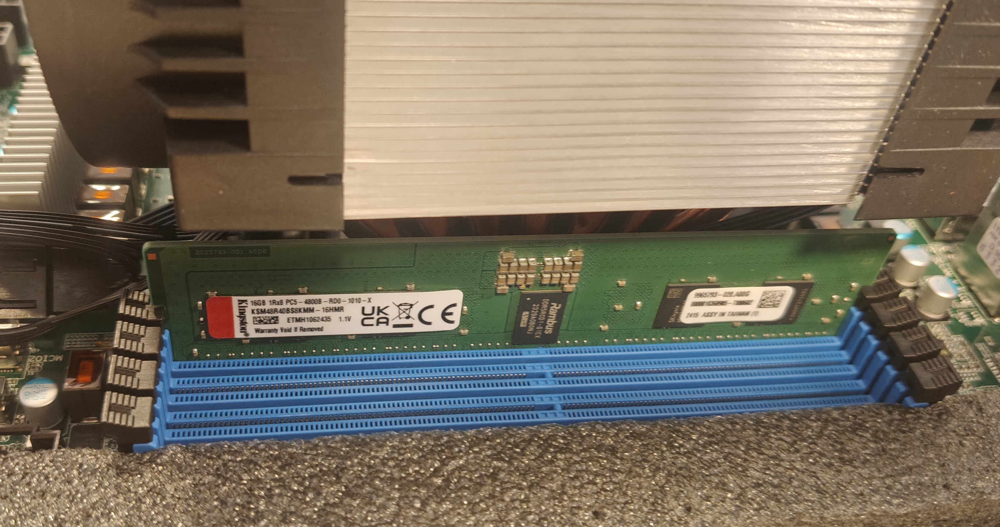

1. Using pliers, unscrew and screw back the SSD standoff one hole closer to the
    M.2 slot. Install the M.2 solid-state drive (SSD) into the M.2 slot and
    tighten the screw holding it. (You may need additional M3 screw for that)

    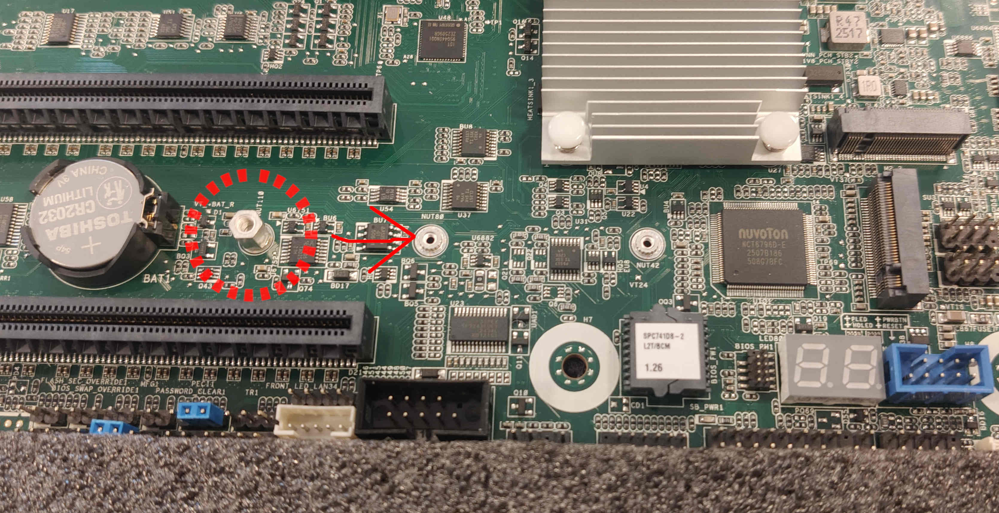
    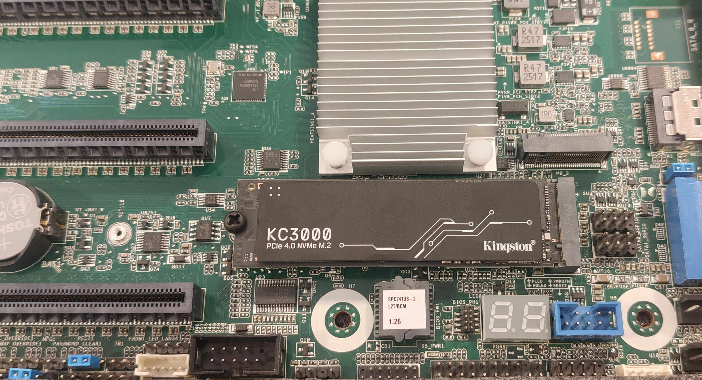

1. Install the TPM module in the slot marked "TPM_BIOS_PH1"

    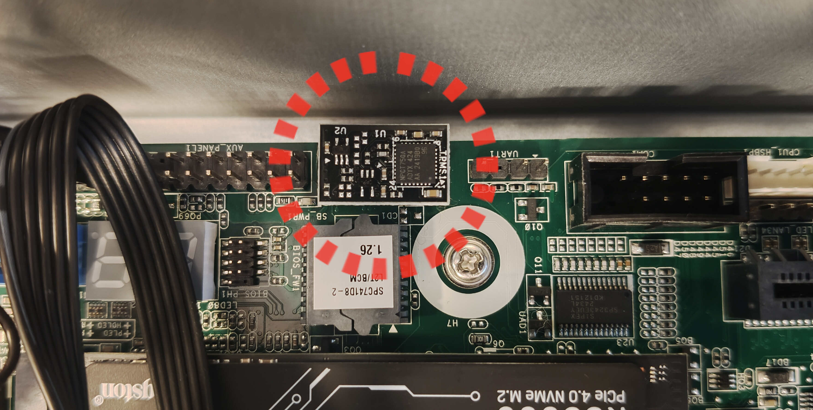

1. Open the chassis by removing four screws from both sides of the top panel
    and remove the metal PCIe cards holder by unscrewing four screws on the
    left and right sides (not the top). This piece will not be reinstalled
    in the case.

    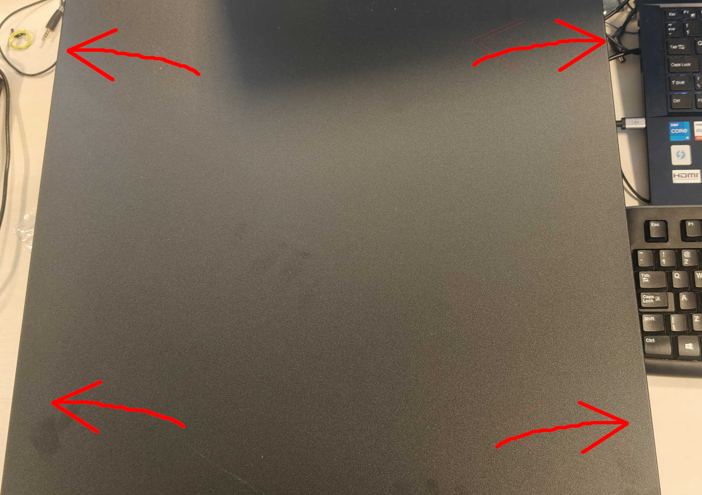
    

1. Install the IO shield by inserting it from inside the enclosure and
    pressing it lightly.

    

1. Make sure there are standoffs installed in all the correct spots, as shown
    in the picture.

    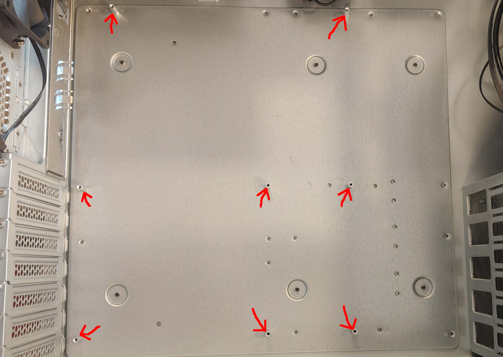

1. Before installing the power supply, locate and plug in the two CPU power
    cables and one 24-pin connector.

    
    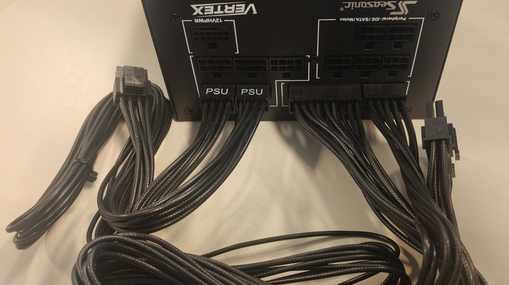

1. Install the PSU in the case by placing it in its slot on the right side of
    the case and securing it with all four screws at the back.

1. Place the motherboard into the case and fasten it with screws in the marked
    spots.

    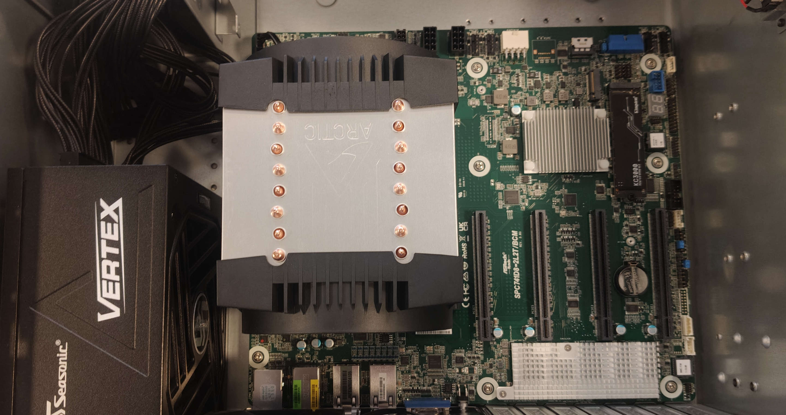

1. Ensure the IO shield covers for RJ-45 ports are properly trimmed, and that
    no metal tabs interfere with any ports.

    

1. Connect the front-panel cables to the appropriately marked spots.

    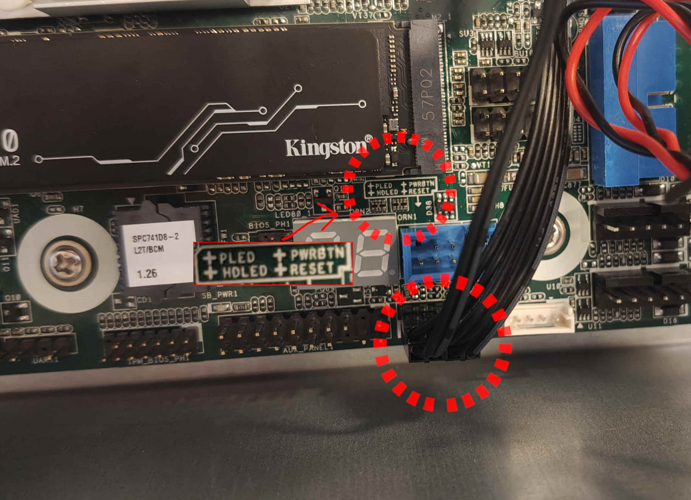

1. Connect the USB 3.0 cable to the port marked "USB3_3_4".

    

1. Connect the front fan to the "FAN4" header on the motherboard. To connect
    the rear fan, an extender will be needed to connect it to the "FAN3"
    connector.

    
    

1. Connect the power supply to the motherboard as shown in the provided images.
    For a 24-pin connector, an adapter provided with the motherboard will be
    needed.

    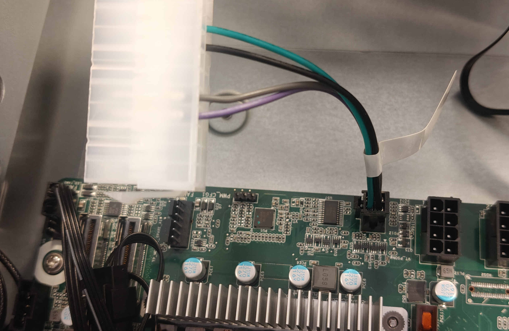
    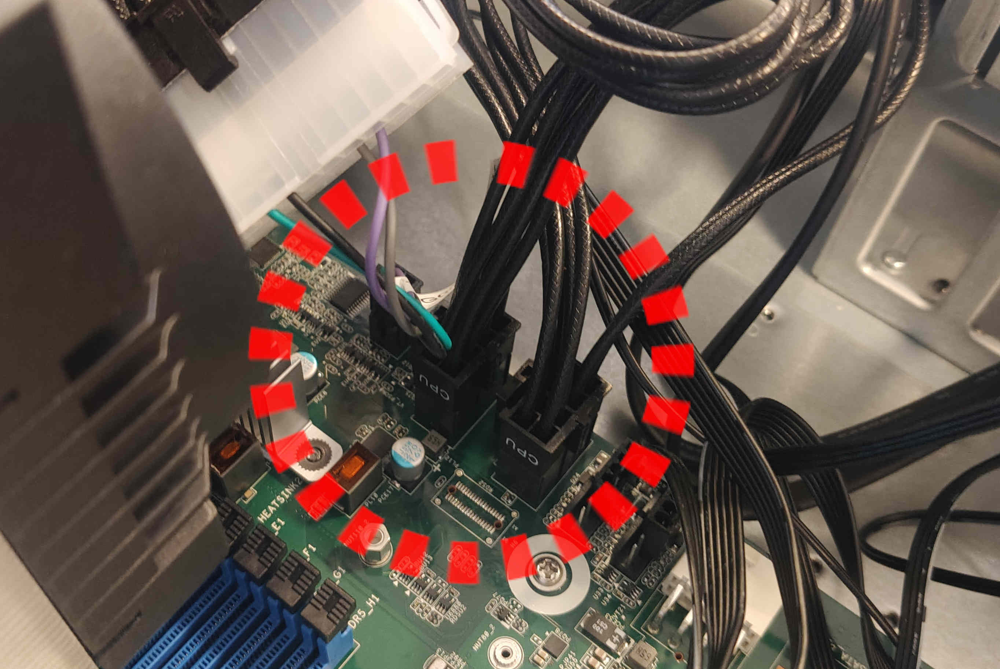

1. Bundle cables so they do not interfere with fans or other components.

    

1. Close the case by reinstalling all four screws.

1. Attach case keys to the front of the case to prevent loss or
    damage during shipping.

    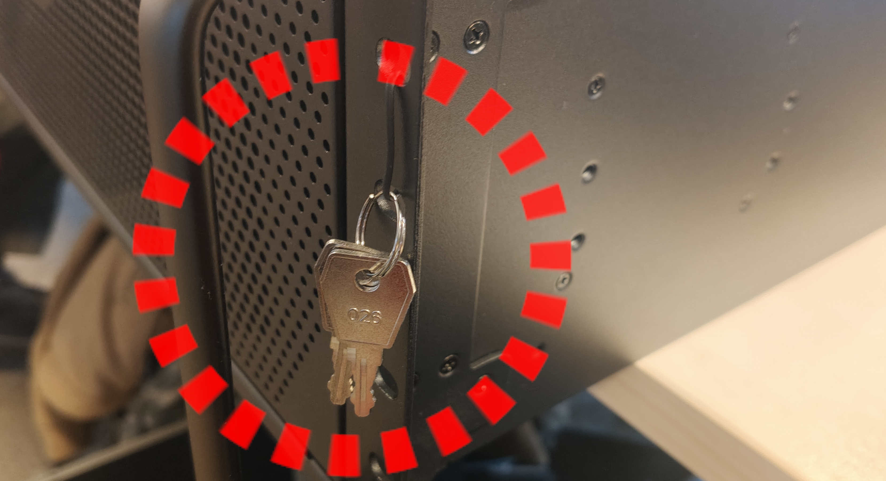

## Stock Firmware verification

Once the platform gets assembled, it is crucial to verify its functionality
before attempting to flash Dasharo firmware. This is to exclude the possibility
of the platform not booting due to bad hardware configuration.

Here's a list of steps that need to be performed:

1. Download the latest stable DTS version from
    [releases](https://github.com/Dasharo/meta-dts/releases/) and
    [flash the image](https://docs.dasharo.com/dasharo-tools-suite/documentation/running/#bootable-usb-stick)
    to the flash drive. For non-technical users, it is recommended to use Etcher
    to flash the image onto the flash drive.

    !!! note

        Make sure DTS version is at least `v2.7.3`. If it isn't available yet,
        use the newest release candidate version: `v2.7.3-rc<x>` as this version
        added PCR values to the HCL report.

1. Connect the device to the mains power.
1. Open the front panel using the attached key.
1. Plug the previously prepared flash drive into one of the available USB ports.
1. Power on the device with the button located on the front panel.
1. Make the platform boot from the flash drive.
1. Once DTS boots, run the HCL report with an option to send the logs to 3mdeb.
1. Power off the device.

## Flashing Dasharo Firmware

The Dasharo firmware can only be flashed externally by removing the memory
chip from the socket and using a dedicated adapter to flash it via CH341A
(v1.7) programmer. The following list guides how to perform this operation:

1. **Ensure the platform is disconnected from the power source!**
1. Locate the BIOS flash memory socket. The flash memory socket is located
    at the very bottom of the motherboard, below the NVMe drive (or socket if
    drive not yet mounted). The following picture showcases the socket location.

    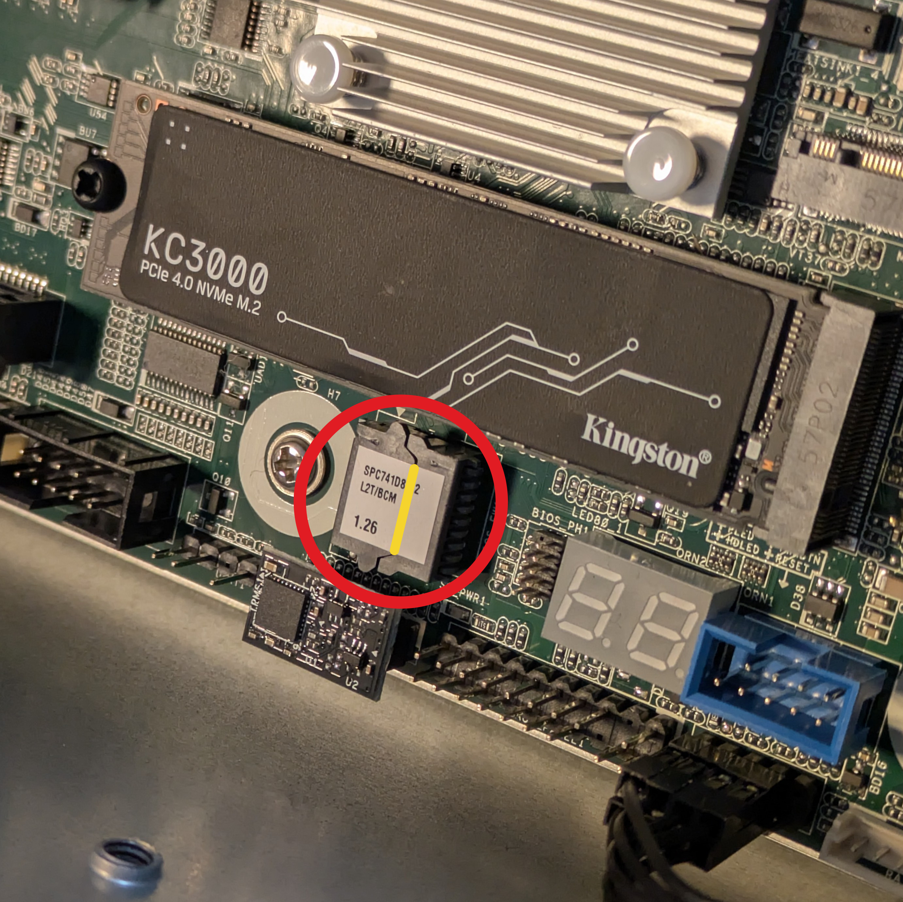

1. Open the flash memory socket. To open the flash memory socket, it is advised
    to remove the NVMe drive, as there is very little space to grab the socket
    door. Moreover, the socket door is sealed with a paper-like seal; one can
    use pointy tweezers or a small knife to gently cut the seal along the door
    edges as marked in the picture above. Once the previously mentioned things
    were done, open up the socket by pulling up the tabs on the bigger door of
    the chip memory socket. Once the bigger door is freed, one should be able to
    perform the same operation for the smaller door. The partially opened socket
    and the hinge direction have been showcased in the picture below.

    

1. Remove the memory from the socket. To remove the memory from the socket,
    one can slide tweezers underneath the memory chip to lift it up. This
    operation is much easier to perform with the NVMe drive removed. The picture
    below shows the removed flash memory and its orientation.

    

    The first pin of the chip is always marked with a dot (stamp) on the
    package. The dot and the first pin were highlighted by a red circle and
    arrow, respectively.

    _Note: While the picture shows `Macronix 5MX25L51245G` memory chip, the
    platform might as well come with different chips like `Winbond W25Q512JV`,
    therefore a chip model can differ. While the chips can be different, they
    shall have the same specification, therefore settings on the programmer are
    common for all the chips._

1. Obtain the CH341A v1.7 programmer (the one with green PCB) and the SOIC-16
    adapter. For your convenience, the right adapter has been labeled with the
    platform name it was bought for.

    

1. Set the programmers as follows:

    - set voltage/logic level to 3.3V,
    - set the programmer to flashing mode,
    - put the adapter pins into the groves and secure it.

    The above process has been shown in detail in the pictures below.

    

    The picture above showcases:

    - where to put the jumper (marked with a red arrow),
    - how to secure the adapter, by pulling the lever down when the pins are in
    the grooves (marked with green arrow),
    - the yellow circle showcases the 8 grooves at the rear of the programmer
    shall be left unpopulated. The programmer uses the first 8 pins.

    

    The picture above showcases:

    - lever in the lock position (marked with green arrow),
    - the logic level switch set to 3.3V (marked with a red arrow),
    - the programmer type and version were highlighted in yellow.

    _Note: On the bottom of the PCB, the programmer features a pictogram showing
    how to set the voltage level switch. The two memory models that are known to
    be mounted in this platform operate at 2.7 to 3.6 volts; it is safe to assume
    all do, to be compatible with the motherboard logic levels._

    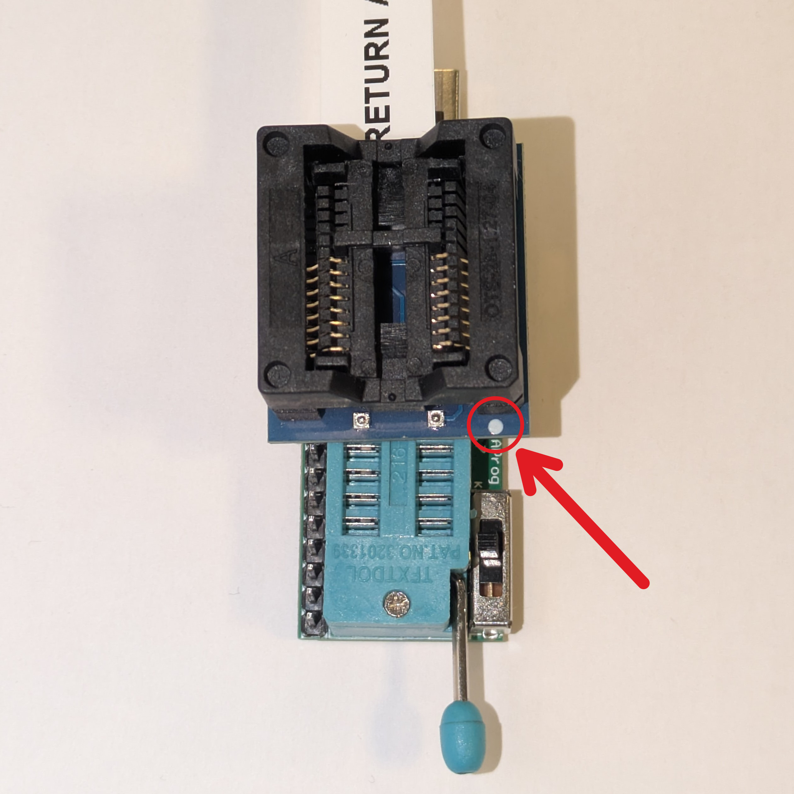

    The picture above showcases the top view of the programmer and adapter
    combo. The red arrow and a circle showcase how to locate the first pin in
    the socket. The rule is the same for memory chips; the dot means the first
    pin. Thus, when placing memory in the socket, both dots should be aligned.

1. Place the flash memory in the adapter (programmer). The picture below
    showcases the BIOS flash memory being socketed in the SOIC-16 adapter that's
    connected to the programmer.

    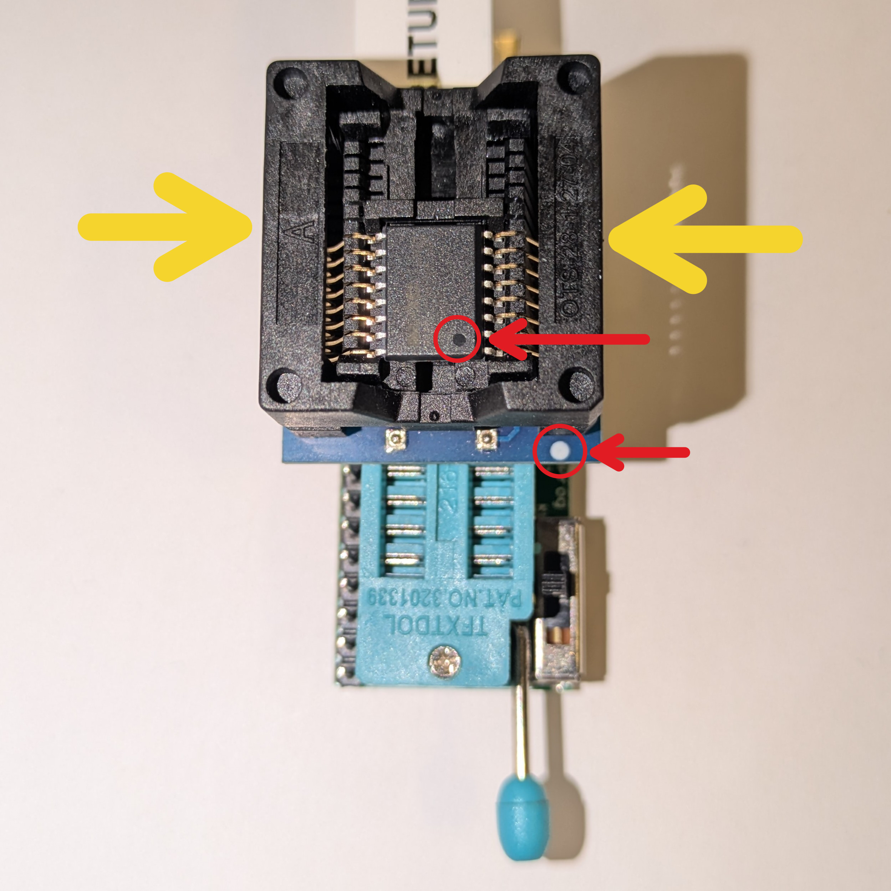

    To socket the memory chip in an adapter, first place it freely in the
    adapter. Make sure the dot on the memory chip and the dot on the adapter PCB
    are aligned (are in the same corner). The dots were marked with red arrows
    and circles.

    Finally, push the border marked with the yellow arrows down and then release
    them. The memory chip shall fall into place and be locked.

1. Connect the programming combo to your computer.

    _Note: Use of a USB extension cable is advised._

1. Open up the terminal and probe the flash chip. The command shown below does
    just that. It is safe to execute the command; no changes to the flash memory
    are made.

    **Command:**

    ```bash
    sudo flashrom -p ch341a_spi
    ```

    The expected output should be similar to the one shown below.

    **Example log:**

    ```log
        λ sudo flashrom -p ch341a_spi
        flashrom 1.4.0 on Linux 6.17.8-300.fc43.x86_64 (x86_64)
        flashrom is free software, get the source code at https://flashrom.org

        Found Winbond flash chip "W25Q512JV" (65536 kB, SPI) on ch341a_spi.
        [...]
    ```

    It might so happen that, additionally, the following information will be
    printed.

    **Example log:**

    ```log
        This flash part has status UNTESTED for operations: WP
        The test status of this chip may have been updated in the latest development
        version of flashrom. [...]
    ```

    If that's the case, the message can be simply ignored.

1. Dump the memory chip contents. This step is performed to ensure
    connection and memory operations are stable. The set of commands shown below
    does two memory dumps on the flash chip and prints the checksums of the
    dumped memory images. The commands are safe to perform, chip contents are
    **not** altered, but please note this might take a long amount of time
    (`8min+` per operation).

    **Command:**

    ```bash
    sudo flashrom -p ch341a_spi -r backup_p1.bin # Perform the first read
    sudo flashrom -p ch341a_spi -r backup_p2.bin # Perform the second read
    md5sum backup_p* # Calculate and print checksums for dumped memory images
    ```

    If the dumping memory succeeds, the "`Reading flash... done.`" will be
    printed out.

    **Example log:**

    ```log
    λ sudo flashrom -p ch341a_spi -r backup_p1.bin
    flashrom 1.4.0 on Linux 6.17.8-300.fc43.x86_64 (x86_64)
    flashrom is free software, get the source code at https://flashrom.org

    Found Winbond flash chip "W25Q512JV" (65536 kB, SPI) on ch341a_spi.
    [...]
    You can also try to follow the instructions here:
    https://www.flashrom.org/contrib_howtos/how_to_mark_chip_tested.html
    Thanks for your help!
    Reading flash... done.
    ```

    The output of `md5sum` command will be similar to the following.

    **Example log:**

    ```log
    λ md5sum backup_p*
    7519dd85799169b8561d2867f98ffec6  backup_p1.bin
    7519dd85799169b8561d2867f98ffec6  backup_p2.bin
    ```

    Note that **the hashes will be different** from those in the above example.
    The operation is considered a success if both hashes are the same.

1. Obtain the newest firmware for the platform. Log in to
    [Minio](https://dlui.dasharo.com), and go to the
    `dasharo-asrock-spc741d8-uefi/SPC741D8` directory. The directory stores all
    available firmware versions. Go to the directory containing the newest
    available firmware version and download the two files:

    - the firmware binary file with `.rom` extension.
    - the control checksum file with extension `.rom.sha256`.

1. In the terminal, go to the directory where the files have been downloaded.
1. Execute the following command to verify whether the checksums match.

    **Command:**

    ```bash
     sha256sum asrock_spc741d8_*.rom && cat asrock_spc741d8_*.rom.sha256
    ```

    The output of the command shall be as follows.

    **Example log:**

    ```log
    λ sha256sum asrock_spc741d8_*.rom && cat asrock_spc741d8_*.rom.sha256
    85e76fc57b5673c93aec6eb9e46ba00237f13636d62697506707971a28aa7a92  asrock_spc741d8_v0.9.0.rom
    85e76fc57b5673c93aec6eb9e46ba00237f13636d62697506707971a28aa7a92  asrock_spc741d8_v0.9.0.rom
    ```

    _Note: The checksums shown in the example above are just an example._

    The command will print out the checksum calculated locally and the master
    checksum afterwards. If the checksums match, one can proceed.

1. Flash the memory chip with new firmware. To flash the firmware onto the flash
    chip, execute the command from the snippet below. **NOTE THAT THIS ACTION IS
    DESTRUCTIVE. THE DEFAULT FIRMWARE WILL BE ERASED!**

    _Note: In case flashing goes wrong, you shall still have copies of the
    original firmware from a few steps before._

    **Command:**

    ```bash
    sudo flashrom -p ch341a_spi -w <name_of_downloaded_.rom_file>
    ```

    _Note: The flashing can take `20min+`._

    The output of the command will likely be as follows.

    **Example log:**

    ```log
    λ sudo flashrom -p ch341a_spi -w asrock_spc741d8_v0.9.0.rom
    flashrom 1.4.0 on Linux 6.17.8-300.fc43.x86_64 (x86_64)
    flashrom is free software, get the source code at https://flashrom.org

    Found Winbond flash chip "W25Q512JV" (65536 kB, SPI) on ch341a_spi.
    [...]
    Reading old flash chip contents... done.
    Erase/write done from 0 to 3ffffff
    Verifying flash... VERIFIED.
    ```

    If the "`Verifying flash... VERIFIED`" is printed out, the flashing has
    succeeded.

1. Put the memory chip back into the motherboard.
    **First, disconnect the programmer from the computer**, and then remove the
    flash memory from the socket. Use small tweezers to put the memory chip back
    into the socket.

    

    The picture above shows the proper orientation of the chip in the socket.
    Pin 1 on the chip shall be the closest one to the arrow on the
    silkscreen of the PCB. The dot showcasing chip orientation (pin one), and
    the arrow on the silkscreen were marked with red circles.

1. Close the socket doors, starting with the smaller one, followed by the
    bigger one.
1. Mount the NVMe drive back if removed.
1. Supply the power to the platform, and follow the procedure from the
    "[Stock Firmware Verification](#stock-firmware-verification)".

    The platform will take some time to boot for the first time, and it might
    switch on and off multiple times during the procedure.

    When DTS is booted, verify that the proper firmware version has been
    flashed.

    

    The picture above showcases the DTS menu. The firmware information and
    version shall be listed as in the image above. Note that the version shown
    in the picture is just an example.

1. Stick the holographic sticker on top of the socket. After the platform has
    been verified to be working and proper firmware has been installed, the
    socket needs to be sealed.

    Remove the leftovers from the original paper sticker with isopropyl alcohol
    and Q-tips (cotton buds). When the surface is dry, stick the new 3mdeb
    holographic sticker parallel to the bottom edge of the motherboard.
    Make sure the text orientation matches the text on the silkscreen (it's a
    nice quality touch).

When all steps were performed, the platform is ready to be backed up and
shipped.

## Useful content

* [Building manual][Build] - documentation contains information on how to build
    Dasharo compatible with ASRock SPC741D8.
* [Board Manual][BoardManual] - documentation contains detailed information about
    the motherboard and its operations.
* [CPU Cooler Manual][Cooler] - documentation contains information on how to
    properly assemble the CPU Cooler and mount the CPU to it.

[Deployment]: ../../variants/asrock_spc741d8/initial-deployment.md
[Build]: ../../variants/asrock_spc741d8/building-manual.md
[BoardManual]: https://download.asrock.com/Manual/SPC741D8-2L2TBCM.pdf
[Cooler]: https://support.arctic.de/freezer-4u-m/CoolerCoolerBuild
