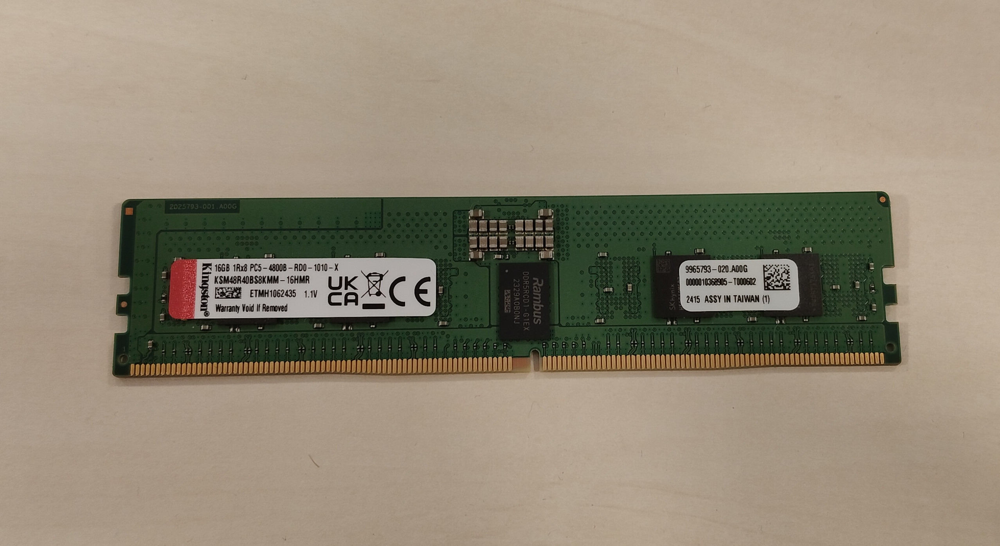
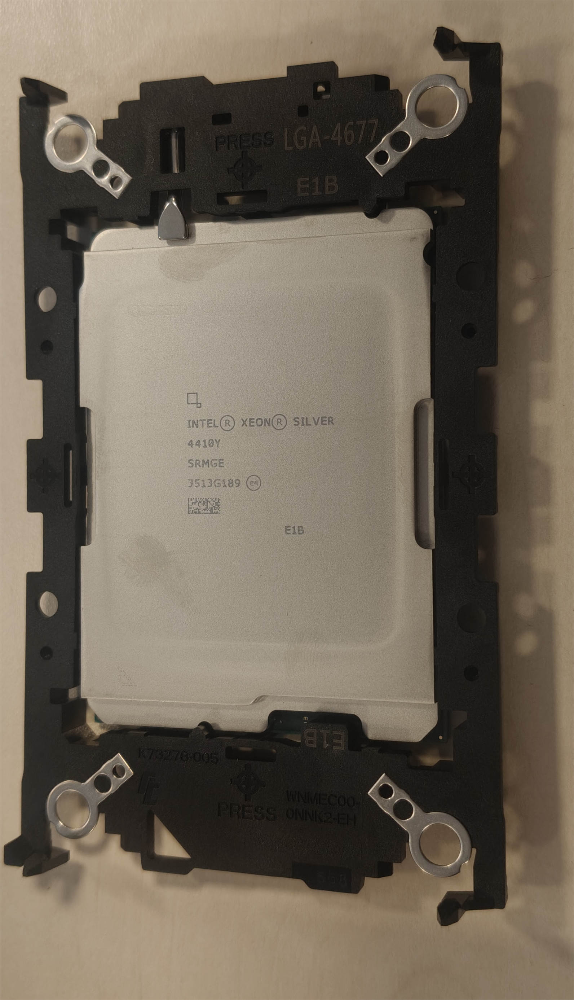
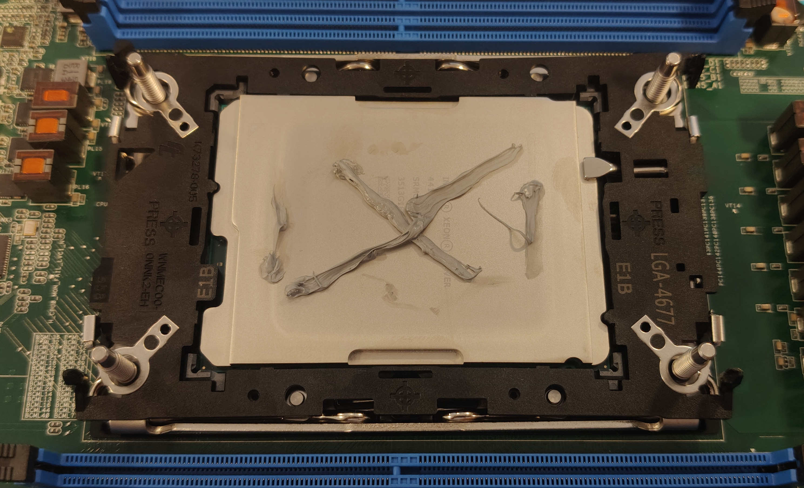
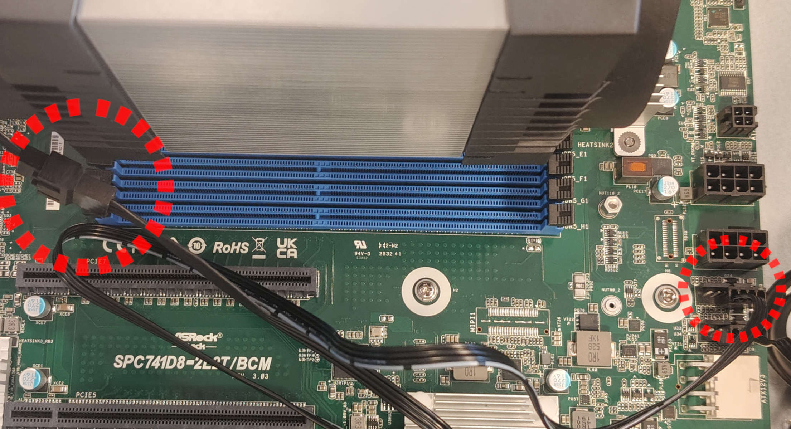

# Presale device assembly and validation

## Introduction

This document describes the assembly procedure of the ASRock SPC741D8 with
specified components in [requirements](#requirements).

## Requirements

| Part         | Model Name                                                      | Image                                   |
|:-------------|:---------------------------------------------------------------:|:---------------------------------------:|
| Motherboard  | ASRock SPC741D8                                                 |   |
| CPU          | Intel Xeon Silver 4410Y                                         |                   |
| Cooling      | Arcitc Freezer 4U-M                                             |         |
| RAM          | Kingston 16GB DDR5 ECC KSM48R40BS8KMM-16HMR                     |                |
| Power Supply | Seasonic Vertex GX 850W 80 Plus Gold                            | |
| Storage      | SSD Kingston KC3000 512 GB M.2 2280 NVMe                        |           |
| Enclosure    | SilverStone RM42-502 4U Rack Chassis                            |       |
| TPM          | ASRock TPM-SPI Module                                           |                   |

Additionally, you will need a screwdriver with bits P1, T30, and small pliers.
Remember to make all connections with the grounding strap.

## Device assembly

### Full set assembly

The section below describes the procedure for the complete assembly
of the working station.

1. Place the motherboard in front of you. This is the component with which most
    operations will be performed. It’s best to put something soft under the
    board to avoid damage during RAM installation and other steps.

    

1. In the motherboard box, find the CPU bracket marked "E1B".

    

1. Attach the bracket to the CPU, making sure to line up the triangles and
    that all the clips are fully engaged.

    
    

1. Assemble the cooler by screwing in two metal pieces on both sides of the
    cooler. They can be found in the accessories box marked "LGA4677".
    You will need to screw in the holes marked "LGA4677".

    

1. Remove the CPU socket cover from the motherboard and very carefully place
    the CPU into the socket, making sure to line up the triangles.

    

1. Apply thermal paste to the CPU, remove the peel from the bottom of the cooler,
    and place it on the CPU, ensuring the airflow arrows point in the direction
    of the motherboard I/O.

    
    

1. Tighten the CPU cooler using a T30 screwdriver. First, tighten the screws
    around halfway, then tighten the opposite corners fully. This is crucial
    for good contact between the CPU and the socket.

    

1. The cooler assembly can now be attached to the cooler by snapping the pieces
    on both sides. The fan with the Arctic logo on the front should be attached
    to the right side of the cooler.

    

1. Connect the cooler fan headers by attaching them together and securing them
    to the motherboard in the FAN1 port.

    

1. Install the memory modules into the DIMM slots. To insert a single module,
    open the latches on both sides. Then insert the RAM and gently press
    downward until the latches close automatically. Install memory according
    to the table. If only one module is used, place it in slot A1.

    |                    | DIMM Number   |    |    |    |    |
    | ------------------ | ------------- | -- | -- | -- | -- |
    | DIMM SLOT          | 1             | 2  | 4  | 6  | 8  |
    | ------------------ | ------------- | -- | -- | -- | -- |
    | A1                 | V             | V  | V  | V  | V  |
    | B1                 |               |    |    | V  | V  |
    | C1                 |               |    | V  |    | V  |
    | D1                 |               |    |    | V  | V  |
    | E1                 |               |    | V  |    | V  |
    | F1                 |               |    |    | V  | V  |
    | G1                 |               | V  | V  | V  | V  |
    | H1                 |               |    |    | V  | V  |

    

1. Using pliers, unscrew and screw back the SSD standoff one hole closer to the
    M.2 slot. Install the M.2 solid-state drive (SSD) into the M.2 slot and
    tighten the screw holding it. (You may need additional M3 screw for that)

    
    

1. Install the TPM module in the slot marked "TPM_BIOS_PH1"

    

1. Open the chassis by removing four screws from both sides of the top panel
    and remove the metal PCIe cards holder by unscrewing four screws on the
    left and right sides (not the top). This piece will not be reinstalled
    in the case.

    
    

1. Install the IO shield by inserting it from inside the enclosure and
    pressing it lightly.

    

1. Make sure there are standoffs installed in all the correct spots, as shown
    in the picture.

    

1. Before installing the power supply, locate and plug in the two CPU power
    cables and one 24-pin connector.

    
    

1. Install the PSU in the case by placing it in its slot on the right side of
    the case and securing it with all four screws at the back.

    

1. Place the motherboard into the case and fasten it with screws in the marked
    spots.

    

1. Ensure the IO shield covers for RJ-45 ports are properly trimmed, and that
    no metal tabs interfere with any ports.

    

1. Connect the front-panel cables to the appropriately marked spots.

    

1. Connect the USB 3.0 cable to the port marked "USB3_3_4".

    

1. Connect the front fan to the "FAN4" header on the motherboard. To connect
    the rear fan, an extender will be needed to connect it to the "FAN3"
    connector.

    
    

1. Connect the power supply to the motherboard as shown in the provided images.
    For a 24-pin connector, an adapter provided with the motherboard will be
    needed.

    
    

1. Bundle cables so they do not interfere with fans or other components.

    

1. Close the case by reinstalling all four screws.

1. Attach case keys to the front of the case to prevent loss or
    damage during shipping.

    

## Device validation

1. Connect the device to the mains power.
1. Open the front panel using the attached key.
1. Power on the device with the button located on the front panel.
1. If all connections have been made correctly, the device should start, and
    the boot logo should be shown.
1. Install Dasharo firmware in accordance with
    
1. Power on the device.
1. Boot to the Linux system (Ubuntu is recommended).
1. Open a terminal window and run the following command:

    ```bash
    sudo dmidecode -t 0 | grep Version
    ```

1. The output of the command above should be similar to:
    `Version: Dasharo (coreboot+UEFI) <version>` where the version should
    correspond to the version of the flashing binary used, eg. v1.0.0.
1. Check in the system that everything is working correctly.

## Useful content

* [Building manual][Build] - documentation contains information on how to build
    Dasharo compatible with ASRock SPC741D8.
* [Board manual][Board] - documentation contains detailed information about
    the motherboard and its operations.
* [CPU Cooler Manual][Cooler] - documentation contains information on how to
    properly assemble the CPU Cooler and mount the CPU to it.

[Build]:
[Board]:https://download.asrock.com/Manual/SPC741D8-2L2TBCM.pdf
[Cooler]:https://support.arctic.de/freezer-4u-m/CoolerCoolerBuild
