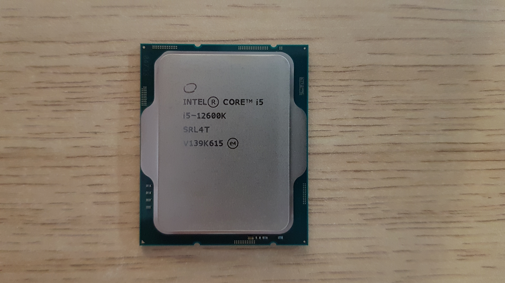

# Dell OptiPlex 9010 Lab Setup

## Introduction

This document is created for individuals, organizations and Dasharo Validation
Team members who would like to create remote and automated development,
debugging and testing environment.

This document describes Lab Setup of the Dell OptiPlex 9010 SFF with specified
components in [requirements](#requirements).

## Requirements

| Part         | Model Name                                                      | Image                                   |
|:-------------|:---------------------------------------------------------------:|:---------------------------------------:|
| Motherboard  | Dell OptiPlex 9010 SFF                                          |   |
| CPU          | Intel Core i7-3770, 3.7G                                      |                   |
| Cooling      | Noctua CPU NH-U12S Redux (w/ Noctua NM-i17xx-MP78 Mounting Kit) |         |
| RAM          | Kingston Fury Beast, DDR4, 4*8GB (32GB Total), 3600MHz, CL17    |                |
| Power Supply | Seasonic Focus PX 750W 80 Plus Platinum                         | |
| Storage      | SSD Intel 670p 512 GB M.2 2280 PCI-E x4 Gen3 NVMe               |           |
| Enclosure    | SilentiumPC Armis AR1                                           |       |
