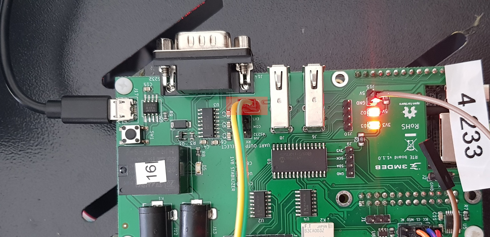
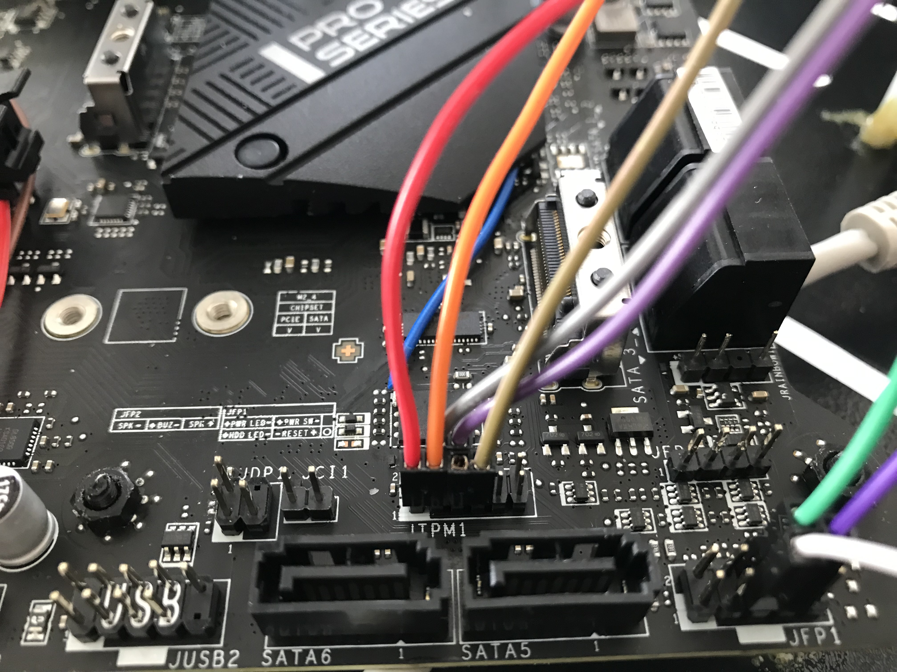
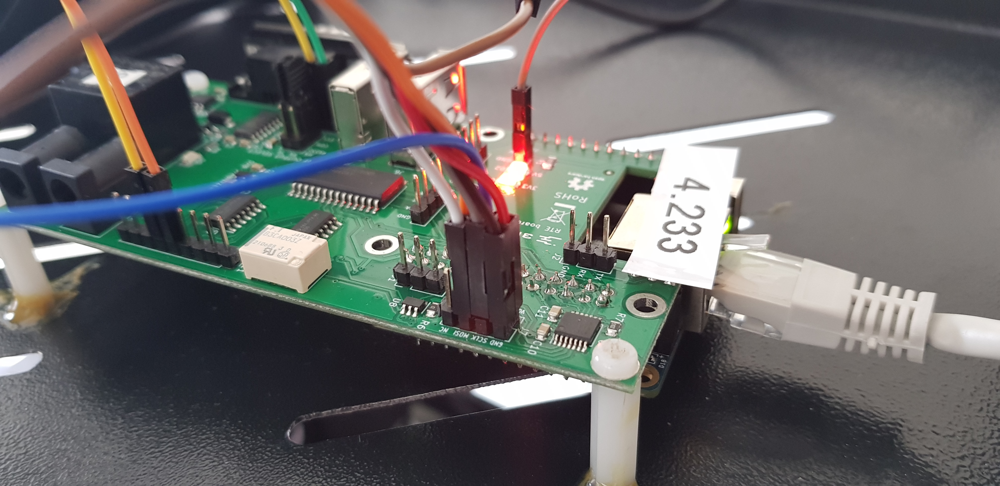
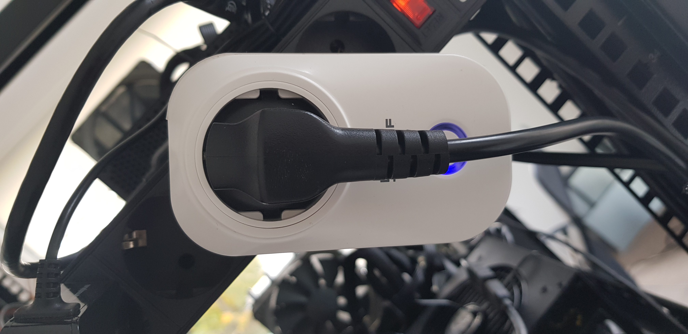

# MSI PRO Z690-A WIFI DDR4 Lab Setup

## Introduction

This document describes assembly of MSI PRO Z690-A DDR4 lab setup. At this
point fully assembled platform prepared using
[Presale Device Assembly](msi_z690.md) and RTE should be ready.
- [Device under test assembly](msi_z690.md)
- [RTE assembly](../rte/v1.1.0/getting-started.md#quick-start-guide)

## Requirements

| Part              | Model Name                                                 | Image                                    |
|:------------------|:----------------------------------------------------------:|:----------------------------------------:|
| Device Under Test | MSI PRO Z-690A DDR4 - [Assembled](msi_z690.md)             |    |
| RTE               | RTE - [Assembled](../rte/introduction.md#rte-introduction) |              |
| Sonoff            | Sonoff - [Assembled](???)                                  | |
| cables            | standard female-female connection wire 2.56mm raster       ||

[comment]: <> (TODO: Create external Sonoff docs)

## Assembly

1. Connect serial panel to RTE:

    **IMPORTANT:** Cable colors on photos change due to insufficient lenght
    (ORANGE -> GREEN). For full view see: [Complete Setup](#complete-setup)

    
    

1. Weld cable to SPI chip and connect it to the RTE `CS` as shown below:

    
    

1. Connect cables for SPI power menagment and grounding:

    
    
    

1. Make rest of neccesary SPI connections:

    
    
    

1. Connect MSI PRO Z690 power source to Sonoff:

    

1. Connect RTE to power source using MicroUSB 5V/2A power supply.

### Complete Setup

When all steps are finished, final setup should look as below:

### Usefull links for RTE theory of operation

1. Power On/Off and reset the platform:

- [comment]: <> (TODO: create external power control docs)

1. Control the power supply:

- [comment]: <> (TODO: create external power control docs)

1. External flash the BIOS chip:

- [Flashing guide](../rte/v1.1.0/getting-started.md#flashing-guide)

1. Set the communication with the platform:

- [Serial port connection guide](../rte/v1.1.0/getting-started.md#serial-port-connection-guide)

[comment]: <> (TODO: Verify links after merge)
