# MSI PRO Z690-A WIFI DDR4 Lab Setup

## Introduction

This document describes assembly of MSI PRO Z690-A DDR4 lab setup. At this
point fully assembled platform and RTE should be ready.

## Requirements

| Part              | Model Name                                                 | Image                                    |
|:------------------|:----------------------------------------------------------:|:----------------------------------------:|
| Device Under Test | MSI PRO Z-690A DDR4 - [Assembled](msi_z690.md)             |    |
| RTE               | RTE - [Assembled](../rte/introduction.md#rte-introduction) |              |
| Sonoff            | Sonoff - [Assembled](../sonoff/sonoff-setup.md)            | |
| cables            | standard female-female connection wire 2.56mm raster       ||

## Assembly

1. Connect serial panel to RTE:

    **IMPORTANT:** Cable colors on photos change due to insufficient length
    (ORANGE -> GREEN). For full view see: [Complete Setup](#complete-setup)

    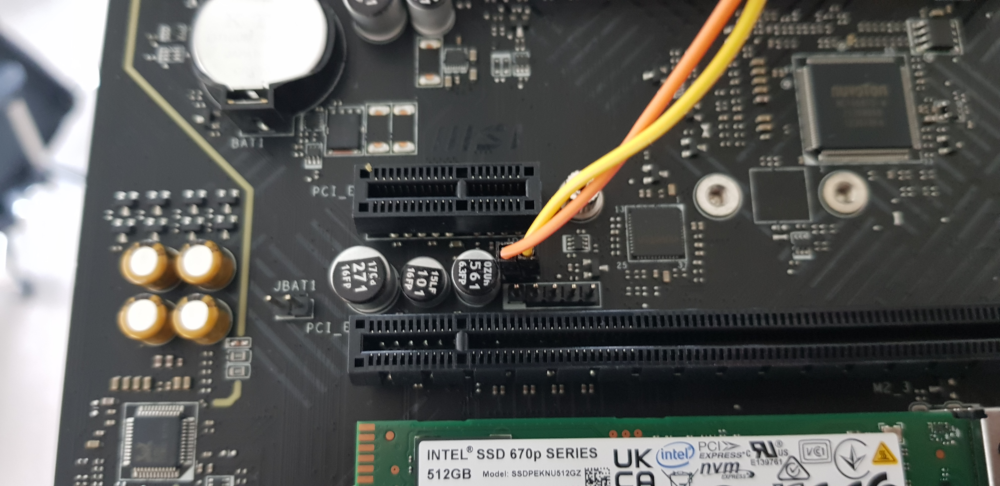
    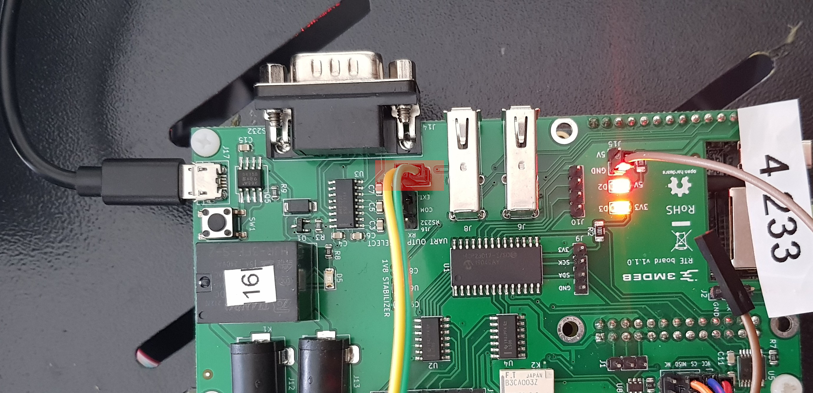

1. Weld cable to SPI chip and connect it to the RTE `CS` as shown below:

    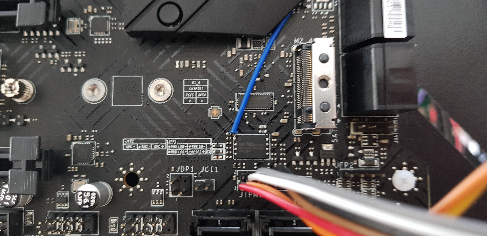
    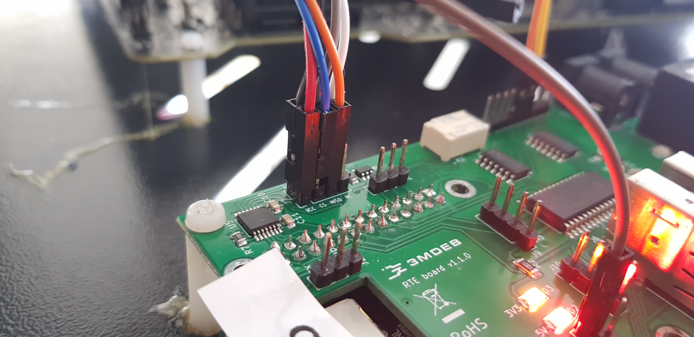

1. Connect cables for SPI power menagment and grounding:

    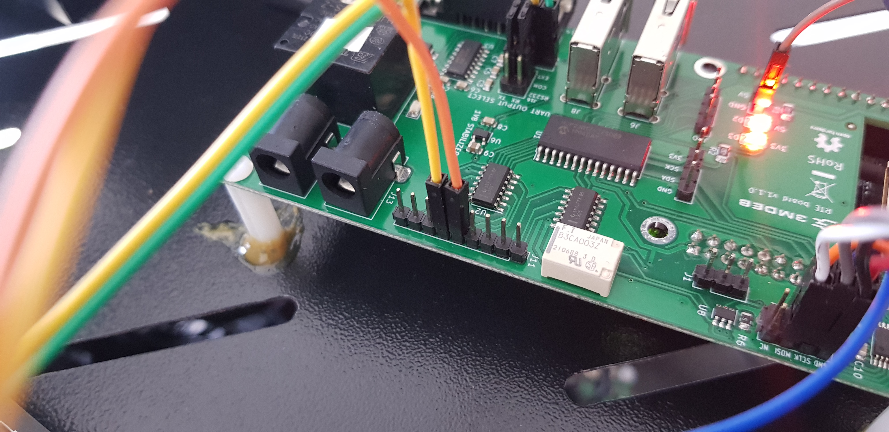
    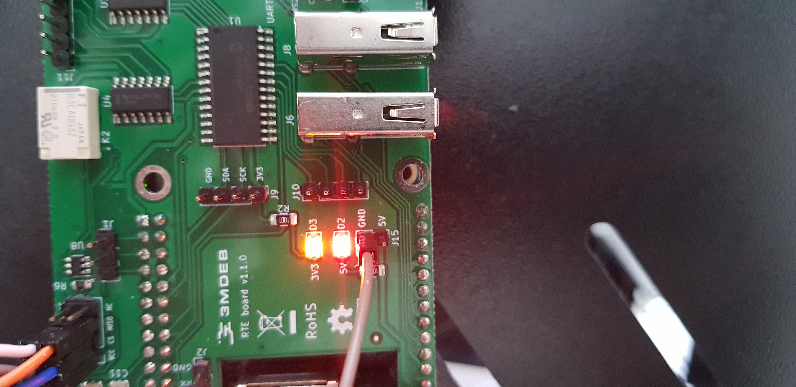
    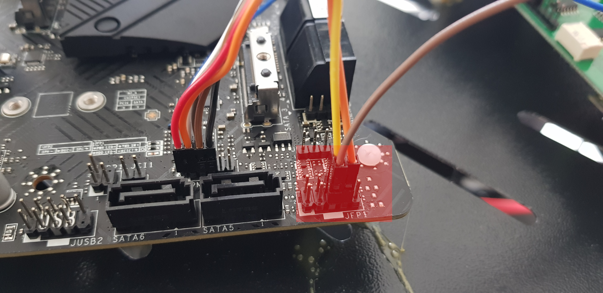

1. Make rest of necessary SPI connections:

    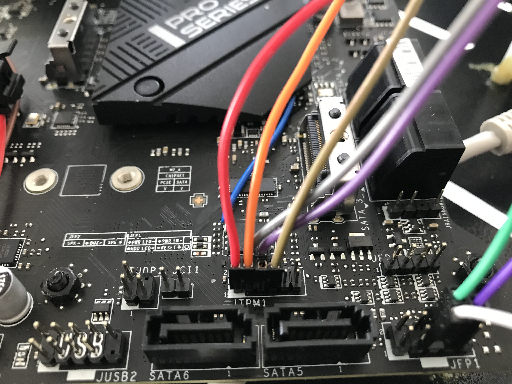
    
    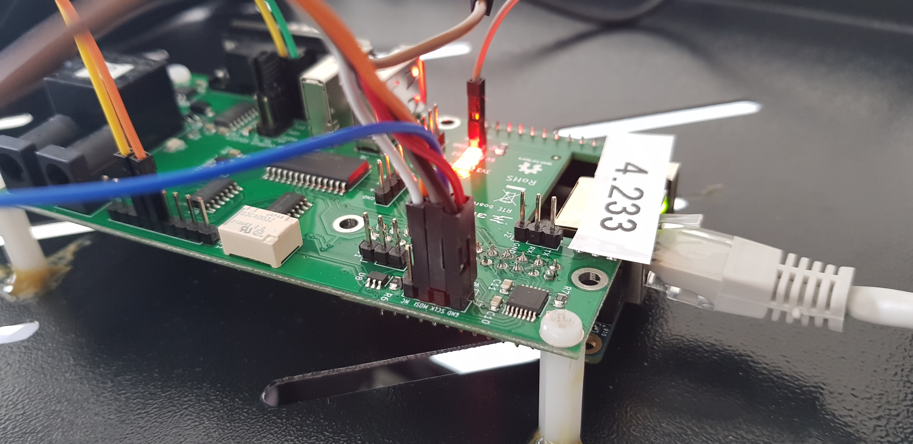

1. Connect MSI PRO Z690 power source to Sonoff:

    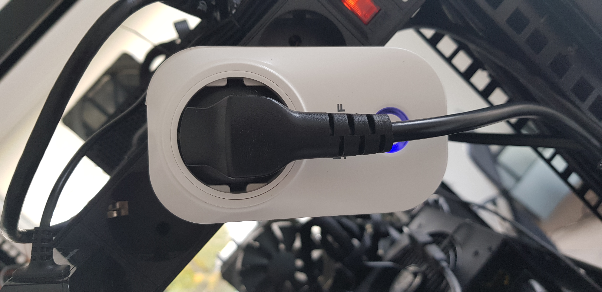

1. Connect RTE to power source using MicroUSB 5V/2A power supply.

### Complete Setup

When all steps are finished, final setup should look as below:

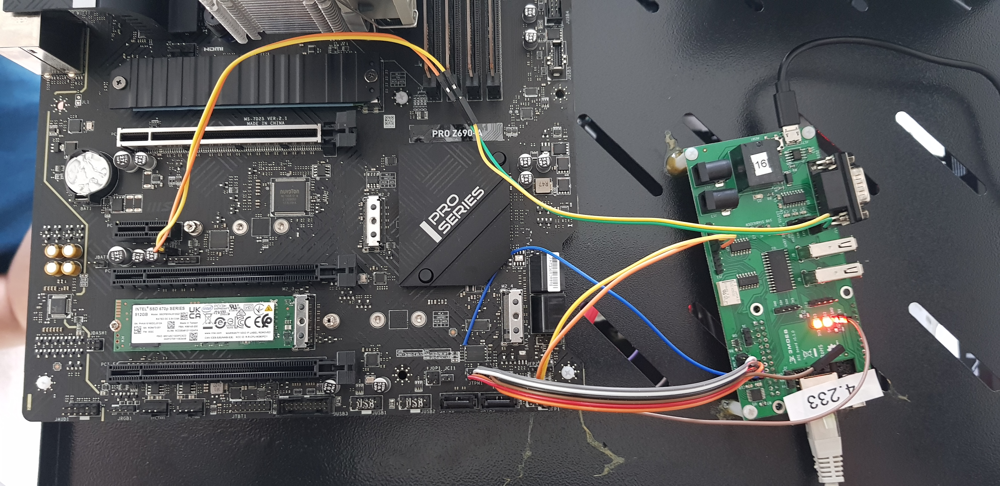

### Theory of operation

1. Power On/Off and reset the platform:

    RTE allows to control DUT by Sonoff and GPIOs. To turn on the power supply
    use below commands in RTE OS:

    ```bash
    rte_ctrl pon
    ```

    To turn the platform off:

    ```bash
    rte_ctrl poff
    ```

    To reset the platform:

    ```bash
    rte_ctrl reset
    ```

1. To control the power supply use below commands in RTE OS:

    ```bash
    ./sonoff.sh on
    ```

    To turn it off type:

    ```bash
    ./sonoff.sh off
    ```

    + [Sonoff relay control](../../sonoff/sonoff-setup.md#controlling-the-relay-switch)

1. External flash the BIOS chip:

    To flash DUT firmware follow the steps shown below:

    + Cut off DUT power supply using sonoff. IMPORTANT: you may cause hardware
       damage to the board if the power is not cut off!
    + Flash firmware using the provided script in root directory of RTE:

        ```bash
        ./flash.sh /tmp/coreboot.rom
        ```

- [Flashing guide](../../rte/v1.1.0/getting-started.md#flashing-guide)

1. Set the communication with the platform:

- [Serial port connection guide](../../rte/v1.1.0/getting-started.md#serial-port-connection-guide)

[comment]: <> (TODO: Verify links after merge)
