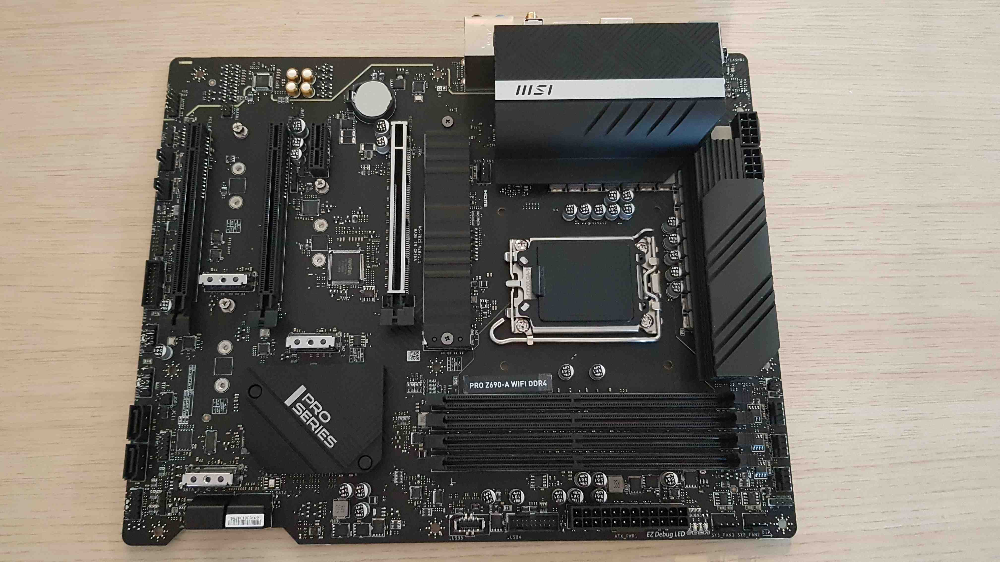
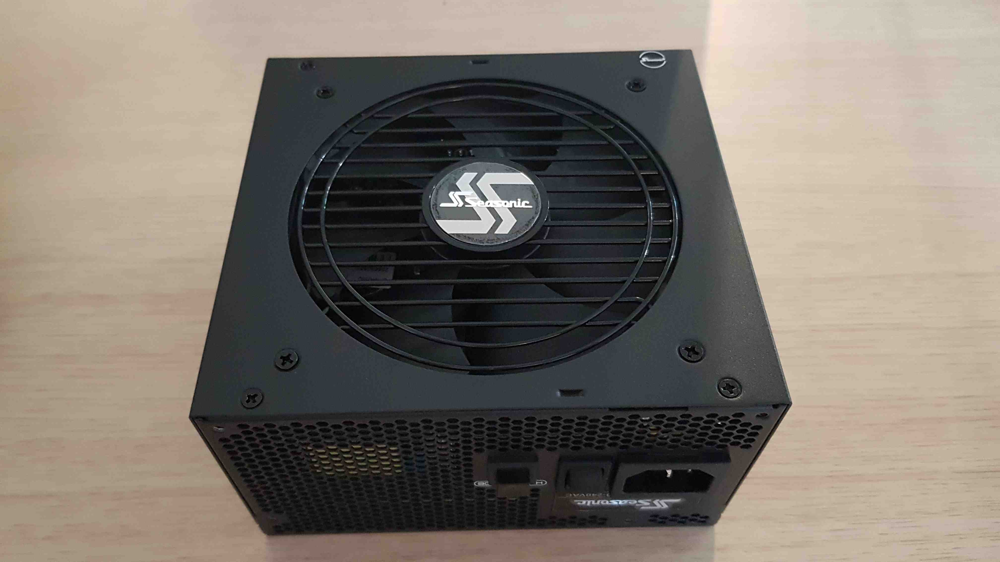
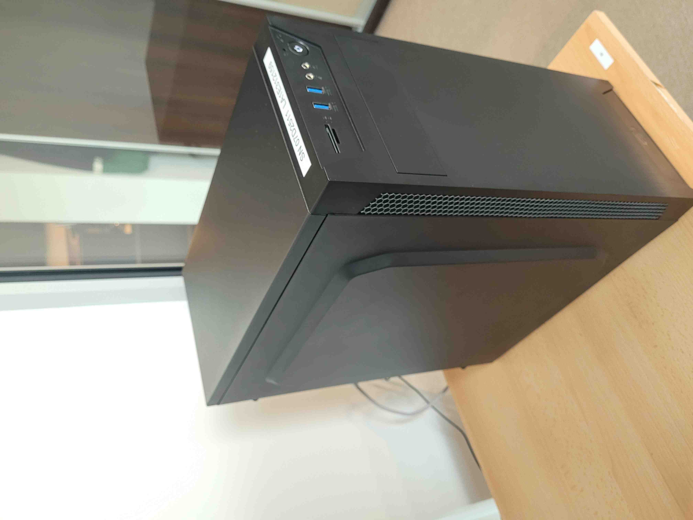
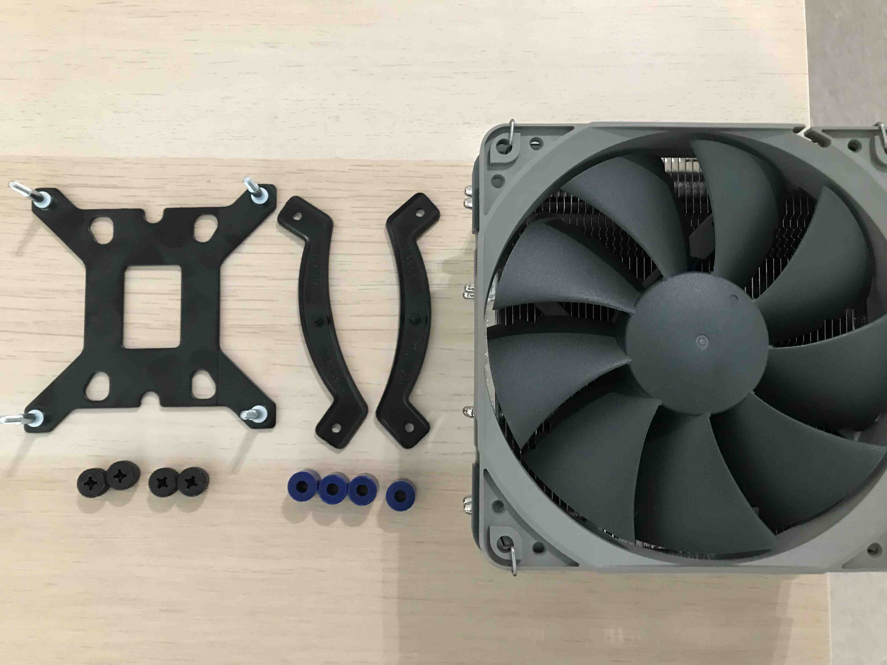
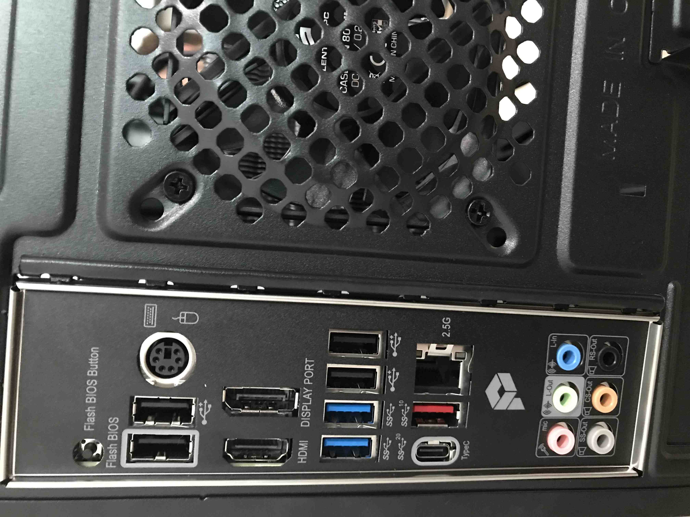
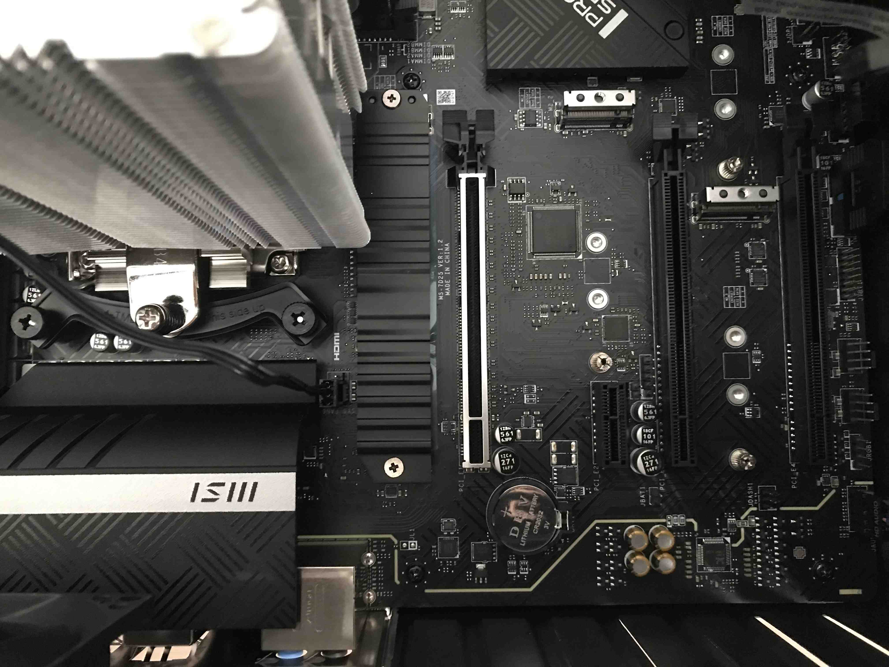

# Presale device assembly and validation

## Introduction

This document describes the assembly procedure of the MSI PRO Z690-A DDR4 with
specified components in [requirements](#requirements).

## Requirements

| Part         | Model Name                                                      | Image                                   |
|:-------------|:---------------------------------------------------------------:|:---------------------------------------:|
| Motherboard  | MSI PRO Z-690A DDR4                                             |   |
| CPU          | Intel Core i5-12600K, 3.7G                                      |                   |
| Cooling      | Noctua CPU NH-U12S Redux (w/ Noctua NM-i17xx-MP78 Mounting Kit) |         |
| RAM          | Kingston Fury Beast, DDR4, 4*8GB (32GB Total), 3600MHz, CL17    |                |
| Power Supply | Seasonic Focus PX 750W 80 Plus Platinum                         | |
| Storage      | SSD Intel 670p 512 GB M.2 2280 PCI-E x4 Gen3 NVMe               |           |
| Enclosure    | SilentiumPC Armis AR1                                           |       |

Additionally, you will need a regular Phillips screwdriver and thermal paste.
Try not to tighten all the elements to the maximum, as it will make disassembly
difficult. Remember that make all connections in the grounding strap.

## Device assembly

### Full set assembly

Section below describes the procedure of complete assembling of the
working station.

1. Unpack all equipment.
1. Place the motherboard in front of you, this is the component with which most
    of the operations will be performed. It's best to put something softer under
    the board so as not to damage it, e.g. during the installation of RAM
    modules.

    

1. To install the CPU on the motherboard first, open the CPU socket:

    

1. Insert the processor carefully and tighten it with the dedicated mechanism:

    

1. To install the CPU cooler, the parts shown in the picture below are
    necessary:

    

1. Attach the black stand to the bottom of the motherboard, then apply and screw
    down the remaining parts except the cooler itself and apply thermal paste.
    After these steps, the CPU area should look like this:

    

1. Then attach the cooler from above by tightening the two screws. Most likely,
    for this operation, it is necessary to dismantle the fan and restore it
    after tightening the screws.

    

1. Install the memory module into the DIMM slots. To insert a single module,
    open the latch on both sides. Then insert the RAM and gently press the
    module downward at both ends of the module and the latch will close
    automatically. Always insert memory modules in the DIMMA2 slot first.

    

1. Install the M.2 solid-state drive (SSD) into the M.2 slot. Remove the two
    screws from the cover and the one responsible for disk stabilization. Insert
    the SSD into the M.2 slot and tighten the previously removed screws.

    

1. Take the enclosure of the computer and open one side as shown in the picture
    below:

    

1. Install the rear panel by inserting it from the inside of the enclosure
    and pressing it lightly.

    

1. Insert the motherboard into the case but do not twist it, some pins are
    hard to connect when the motherboard is screwed. The photo below shows the
    slots that should be filled in the next steps.

    

1. Connect the fan from the CPU cooler to the slot marked `I`.

    

1. Connect the cables from the front panel to the appropriately marked places:

    

    A detailed description of the connection cable marked `D` can be found in
    the [Board manual](https://download.msi.com/archive/mnu_exe/mb/PROZ690-AWIFIDDR4_PROZ690-ADDR4100x150.pdf)
    in section: JFP1, JFP2: Front Panel Connectors.
    To verify correct connection of the cable marked `D`, you can compare them
    to the pictures below:

    Connection from the inside:
    

    Connection from the outside:
    

1. Connect the speaker to the slot marked before `E`:

    

1. Screw the motherboard to the enclosure.

1. Connect the power supply to the motherboard using the cables marked RE25 for
    connection to the `G` and `H` slots and the cable marked RJ21 to connect the
    `F` slots.

    

1. Connect the fan built into the enclosure to the indicated place:

    

1. Bundle the cables so that they don't interfere with the fans or other
    components.
1. Close the case of the computer.

### Motherboard assembly only

Section below describes the procedure of assembling the motherboard.

To prepare the motherboard the following operations should be performed:

1. Go through steps 1-8 from
    [Full set assembling section](#full-set-assembly).
1. Go through 13th step from [Full set assembling section](#full-set-assembly).
1. Connect cable marked `D` to allows power on the device as described in
    the 14th point of the
    [Full set assembling section](#full-set-assembly).
1. Connect the power supply to the motherboard as described in the 17th point
    of the [Full set assembling section](#full-set-assembly).

## Device validation

1. Connect the device to the mains.
1. Power on the device with the button located on the front panel.
1. If all connections have been made correctly, the device should start and
    the boot logo should be shown.
1. Install Dasharo firmware in accordance with
    [Installation manual](../../variants/msi_z690/installation-manual.md) -
    the `Migrating SMBIOS unique data` chapter can be skipped.
1. Power on the device.
1. Boot to Linux system (Ubuntu is recommended).
1. Open a terminal window and run the following command:

    ```bash
    sudo dmidecode -t 0 | grep Version
    ```

1. The output of the command above should be similar to:
    `Version: Dasharo (coreboot+UEFI) <version>` where the version should
    correspond to the version of the flashing binary used eg. v1.0.0.
1. Check in the system that everything is working properly.

## Useful content

* [Building manual][Build] - documentation contains information on how to
    build Dasharo compatible with the MSI PRO Z690-A DDR4.
* [Board manual][Board] - documentation contains detailed information about
    the motherboard and its operations.

[Build]: ../../variants/msi_z690/building-manual.md
[Board]: https://download.msi.com/archive/mnu_exe/mb/PROZ690-AWIFIDDR4_PROZ690-ADDR4100x150.pdf
