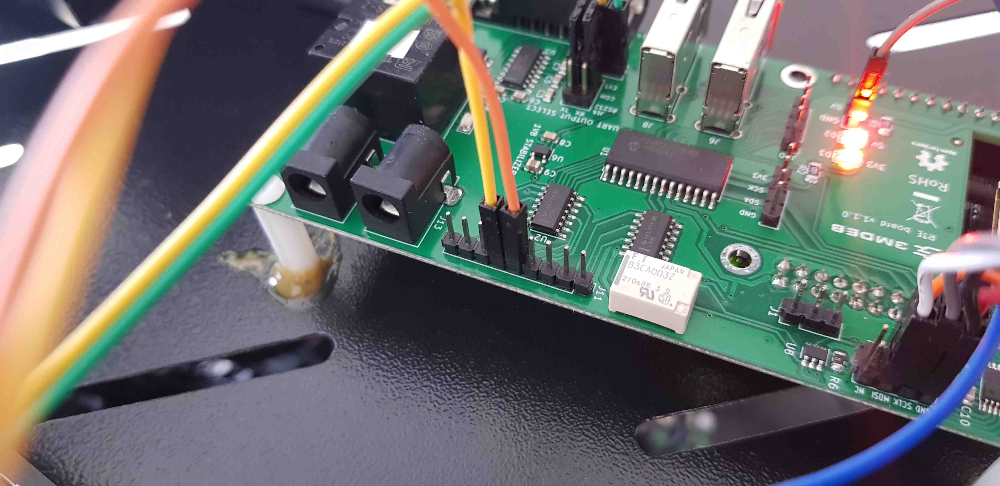
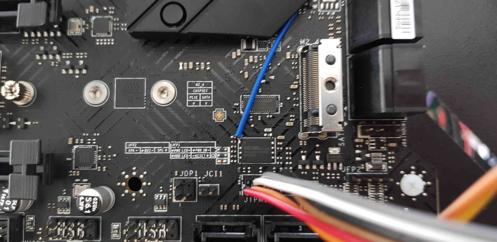
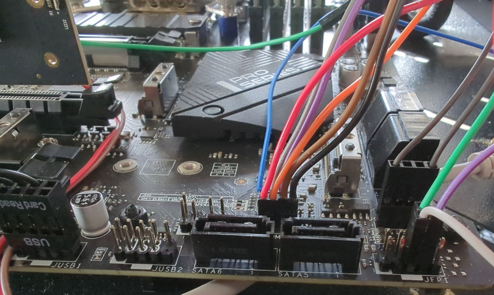
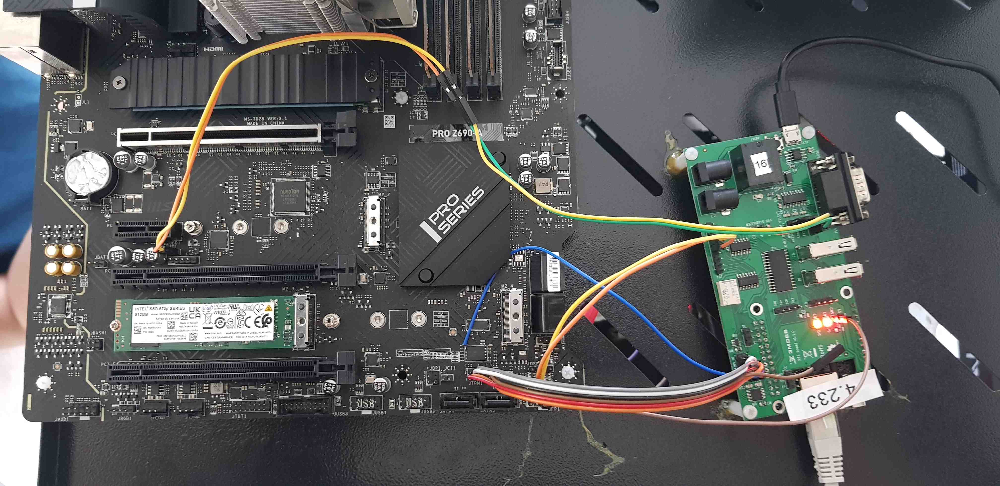

# Laboratory stand dedicated to MSI PRO Z690-A assembly guide

## Introduction

This document describes the assembly procedure dedicated to the MSI PRO Z690-A
testing stand.

## Prerequisites

The below table contains information about all elements which are needed to
create the testing stand.

* MSI PRO Z690-A platform
* [RTE v1.1.0](https://3mdeb.com/shop/open-source-hardware/open-source-hardware-3mdeb/rte/)
* Sonoff S20 type E
* 4x standard female-female connection wire 2.54 mm raster
* 7x standard female-female connection wire 2.54/2.00 mm raster
* USB-UART converter with 4-wire cable
* 4-pin header 2.54 mm raster

## Pre-setup activities

The following subsections describe the method of preparing all the
components of the laboratory stand.

### MSI PRO Z690-A

MSI PRO Z690-A platform should be prepared in accordance with the
[Motherboard assembly](presale-assembly-and-validation.md#motherboard-assembly-only)
documentation.

### RTE

RTE (acronym: Remote Testing Environment) should be prepared in accordance with
[Quick start guide](../rte/v1.1.0/quick-start-guide.md) documentation dedicated
to the device.

### Sonoff

The below section of the documentation is based on the
[EPSHome documentation](https://esphome.io/devices/sonoff_s20.html)

1. Open the Sonoff case.

1. Check if the headers are soldered to the board. If not - 4 pin header
    raster 2.54 mm should be soldered to the board in accordance with the below
    images.

    

    

1. Connect the USB-UART converter to the USB port.

    

1. Create a Sonoff configuration file. The file extension should be `.yaml` and
    it should contain the device configuration.

    Example configuration:

    ```yml
    esphome:
      name: XXXXXX
      platform: ESP8266
      board: esp01_1m

    wifi:
      ssid: "XXXXXX"
      password: "XXXXXX"
      # manual_ip:
      #   # Set this to the IP of the ESP
      #   static_ip: 192.168.4.187
      #   # Set this to the IP address of the router. Often ends with .1
      #   gateway: 192.168.4.1
      #   # The subnet of the network. 255.255.255.0 works for most home networks.
      #   subnet: 255.255.255.0
      power_save_mode: none


      # # Enable fallback hotspot (captive portal) in case wifi connection fails
      ap:
        ssid: "Sonoff1 Fallback Hotspot"
        password: "123456789"


    captive_portal:

    # Enable logging
    logger:

    # Enable Home Assistant API
    api:


    ota:


    binary_sensor:
    - platform: gpio
      pin:
        number: GPIO0
        mode: INPUT_PULLUP
        inverted: True
      name: "Sonoff S20 Button"
      on_press:
        - switch.toggle: relay
    - platform: status
      name: "Sonoff S20 Status"


    switch:
    - platform: gpio
      name: "Sonoff S20 Relay"
      pin: GPIO12
      id: relay

    output:
    - platform: esp8266_pwm
      id: s20_green_led
      pin: GPIO13
      inverted: True

    light:
    - platform: monochromatic
      name: "Sonoff S20 Green LED"
      output: s20_green_led

    web_server:
      port: 80
    ```

1. Run the docker container in the folder containing created `.yaml`
    configuration file:

    ```sh
    docker run --rm -v "${PWD}":/config --device=/dev/ttyUSB0 -p 6052:6052 -it esphome/esphome
    ```

1. Open the browser and type into the web browser the following address:

    ```bash
    http://localhost:6052/
    ```

1. Put the device in flash mode. Putting the device in this mode should be done
    in accordance with the
    [documentation](https://esphome.io/devices/sonoff_s20.html#step-4-uploading-firmware).
1. Change the upload method from OTA to `/dev/ttyUSB0`. After this operation,
    the new element with the name specified in `esphome:name` should be
    displayed.

1. Select the option `Upload`. After clicking, the program should generate
    the image, compile it and upload it to the device.
1. After successful upload replug the device to the USB (**without** the button
    pressed) to get out of the flashing mode.

1. Open connection to the device in the PC terminal by typing:

    ```bash
    sudo minicom -D /dev/ttyUSB0 -o -b 115200.
    ```

    > Note: `/dev/ttyUSB0` is example device - check whether `USB0` is the
    correct one.

1. Check if the device is responsible - whether network connectivity
    information is generated.

    > Note: The effective range for this device is only a few meters.

1. Based on the minicom logs read the IP address assigned to the device.

## Connections

The following sections describe how to enable all of the following features:

* serial connection to the platform,
* controlling power supply,
* enabling basic power actions with the platform (power off/power on/reset),
* external flashing with the RTE,
* reading power status.

### Serial connection

1. Attach the jumpers in the RTE J16 header to enable header J18:

    | Jumper position (TX)      | Jumper position (RX)            |
    |:-------------------------:|:-------------------------------:|
    | EXT + COM                 | EXT + COM                       |

1. Connect the RTE J18 header to the platform JBD1 header as described in the
    table:

    | RTE             | MSI PRO Z690-A                            |
    |:---------------:|:-----------------------------------------:|
    | J18 pin 1 (GND) | JBD1 pin 1 (pin closer to JBAT1)          |
    | J18 pin 2 (RX)  | JBD1 pin 2 (pin further from JBAT1)       |

    > Note: Pins on JBD1 are not described in the documentation. They have been
    discovered experimentally. Pay attention to the connections.

    
    

### Power supply controlling

Connect SeaSonic FOCUS Plus Platinum to Sonoff.

### Basic power operations enabling

Connect the RTE J11 header to the platform JFP1 header as described in the
table:

| RTE            | Msi Z690                    |
|:--------------:|:---------------------------:|
| J11 pin 9      | JFP1 pin 6 (PWR_ON)         |
| J11 pin 8      | JFP1 pin 7 (RST)            |
| J15 pin 1 (GND)| JFP1 pin 5 (GND)            |




### External flashing enabling

Connect the RTE SPI header to the platform as described in the table:

| RTE SPI header    | MSI Z690                                             |
|:-----------------:|:----------------------------------------------------:|
| J7 pin 1 (Vcc)    | JTPM1 pin 1 (SPI Power)                              |
| J7 pin 2 (GND)    | JTPM1 pin 7 (GND)                                    |
| J7 pin 3 (CS)     | Pin soldered to SPI chip pin 1 (CS), see image below |
| J7 pin 4 (SCLK)   | JTPM1 pin 6 (SPI Clock)                              |
| J7 pin 5 (MISO)   | JTPM1 pin 3 (MISO)                                   |
| J7 pin 6 (MOSI)   | JTPM1 pin 4 (MOSI)                                   |

> Note: external access to the flash chip is possible only from the JTPM header.
As the header does not provide a connection to the `CS` pin, the connection
should be provided by direct soldering to the one of flash chip pins





### Reading power status

Connect the RTE J1 header to the platform JFP1 header as shown in the picture
below:


The values ​​of `R1`, `R2`, `V1` and `V2` should meet the relationship according
to the formula `R1/R2 = V2/V1`. `V1` cannot be greater than 3.3V (RTE property).

### Complete Setup

After preparing all of the connections also three activities should be
performed to enable all of the test stand features:

1. Connect Sonoff to the mains:

    

1. Connect the RTE to the Internet by using the Ethernet cable.
1. Connect the RTE to the mains by using the microUSB 5 V/2 A power supply.

Complete setup should looks as follows:



## Theory of operation

The following sections describe how to use all of the enabled features:

* serial connection to the platform,
* controlling power supply,
* enabling basic power actions with the platform (power off/power on/reset),
* external flashing with the RTE,
* reading power status.

### Serial connection

The method of setting and using serial connection is described in the
[Serial connection guide](../rte/v1.1.0/serial-port-connection-guide).

### Power supply controlling

Power supply controlling (in this case: controlling the state of Sonoff)
should be performed based on the `sonoff.sh` script implemented in `meta-rte`
(OS image dedicated to the RTE platform).

> Note, that before using the above-mentioned script, it should be modified and
`SONOFF_IP` parameter should be set in accordance with obtained Sonoff IP address.

To perform basic power operations use the below-described commands:

1. Turn on the power supply:

    ```bash
    ./sonoff on
    ```

1. Turn off the power supply:

    ```bash
    ./sonoff on
    ```

### Basic power operations

Basic power operations should be performed based on the `rte_ctrl` script
implemented in `meta-rte` (OS image dedicated to the RTE platform). To perform
basic power operations use the below-described commands:

1. Turn on the platform:

    ```bash
    rte_ctrl pon
    ```

1. Turn off the platform:

    ```bash
    rte_ctrl poff
    ```

1. Reset the platform:

    ```bash
    rte_ctrl reset
    ```

> Note, that in order for the above commands to work properly, the platform
should be powered up: both Sonoff and the power supply must be turned on.

### External flashing

The external flashing procedure should be performed based on the scripts
implemented on the RTE platform. To perform the flashing operation reproduce,
the below-described steps:

1. By using `scp` put the requested Dasharo file to the RTE:

    ```bash
    scp <path_to_firmware>/<firmware_file> root@<RTE_IP>:/tmp/coreboot.rom
    ```

    Where:

    - `path_to_firmware` - path to firmware, which should send to RTE,
    - `firmware_file` - the name of the firmware file, which should be sent
        to RTE,
    - `RTE_IP` - IP address of the connected RTE.

1. Login to RTE via `ssh` or `minicom`.
1. Read the flash chip by executing the following command on RTE:

    ```bash
    ./flash.sh read tmp/dump.rom
    ```

1. If the reading was successful, the output from the command above should
    contain the phrase `Verifying flash... VERIFIED`.
1. Write the flash chip by executing the following command on RTE:

    ```bash
    ./flash.sh write /tmp/coreboot.rom
    ```

    > Do not interrupt the flashing procedure in any way (especially by
    changing connections). It may cause hardware damage!

1. If the reading was successful, the output from the command above should
    contain the phrase `Verifying flash... VERIFIED`.

### Reading power status

To read the current power status use the following command:

```bash
cat /sys/class/gpio/gpio12/value
```

Example output:

* `1` means that the platform is turned on.
* `0` means that the platform is turned off.
