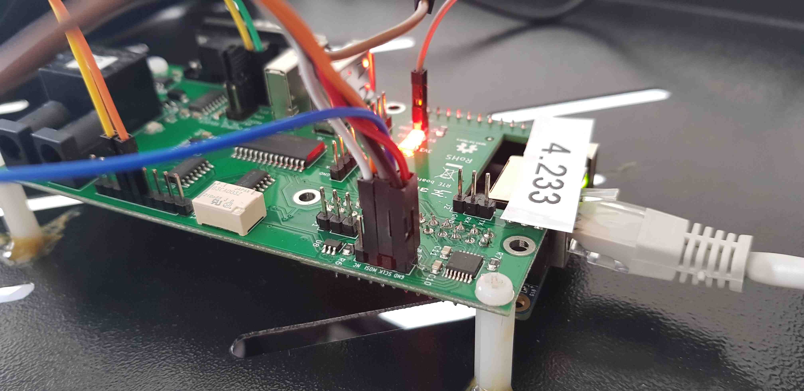

# Laboratory stand dedicated for MSI PRO Z690-A assembly guide

## Introduction

This document describes the assembly procedure dedicated for the MSI PRO Z690-A
testing stand.

## Prerequisites

The below table contains information about all elements which are needed to
create the testing stand.

* MSI PRO Z690-A platform
* [RTE v1.1.0](https://3mdeb.com/shop/open-source-hardware/open-source-hardware-3mdeb/rte/)
* Sonoff S20 type E
* Standard female-female connection wires 2.56mm raster
* USB-UART converter with 3 wire cables

## Pre-setup activities

The following sections describe how to prepare all the components of the
laboratory stand.

### MSI PRO Z690-A

MSI PRO Z690-A platform should be prepared in accordance with the
[Motherboard assembly](presale-assembly-and-validation.md#motherboard-assembly-only)
documentation.

### RTE

RTE (acronym: Remote Testing Environment) should be prepared in accordance with
[Quick start guide](../rte/v1.1.0/quick-start-guide.md) documentation dedicated
for the device.

### Sonoff

The following section of the documentation based on the
[EPSHome documentation](https://esphome.io/devices/sonoff_s20.html)

1. Open the case.

1. Make sure that headers are soldered - if not, it has to be done.

    
    

1. Connect the uart converter to usb.

    

1. Run docker container in the folder containing yaml
    configuration file  eg. `sonoff_s20.yaml`:

    ```sh
    docker run --rm -v "${PWD}":/config --device=/dev/ttyUSB0 -p 6052:6052 -it esphome/esphome
    ```

    > you can copy the following with modified wifi
    credentials and `esphome:name`

    example configuration file:

    ```yml
    esphome:
      name: XXXXXX
      platform: ESP8266
      board: esp01_1m

    wifi:
      ssid: "XXXXXX"
      password: "XXXXXX"
      # manual_ip:
      #   # Set this to the IP of the ESP
      #   static_ip: 192.168.4.187
      #   # Set this to the IP address of the router. Often ends with .1
      #   gateway: 192.168.4.1
      #   # The subnet of the network. 255.255.255.0 works for most home networks.
      #   subnet: 255.255.255.0
      power_save_mode: none


      # # Enable fallback hotspot (captive portal) in case wifi connection fails
      ap:
        ssid: "Sonoff1 Fallback Hotspot"
        password: "123456789"


    captive_portal:

    # Enable logging
    logger:

    # Enable Home Assistant API
    api:


    ota:


    binary_sensor:
    - platform: gpio
      pin:
        number: GPIO0
        mode: INPUT_PULLUP
        inverted: True
      name: "Sonoff S20 Button"
      on_press:
        - switch.toggle: relay
    - platform: status
      name: "Sonoff S20 Status"


    switch:
    - platform: gpio
      name: "Sonoff S20 Relay"
      pin: GPIO12
      id: relay

    output:
    - platform: esp8266_pwm
      id: s20_green_led
      pin: GPIO13
      inverted: True

    light:
    - platform: monochromatic
      name: "Sonoff S20 Green LED"
      output: s20_green_led

    web_server:
      port: 80
    ```

1. Go to:

    ```sh
    http://localhost:6052/#
    ```

**In your browser:**

1. Put the device in a flash mode as explained
    [here](https://esphome.io/devices/sonoff_s20.html#step-4-uploading-firmware).

    + unplug the device
    + plug with the button pressed and hold 2sec

1. Change the upload method from OTA to `/dev/ttyUSB0`
    Now you should see new element with name that you specified in
    `esphome:name`.
1. Click upload - the program will be generated, compiled
    and uploaded to the device.

1. After successful upload replug the device to the usb
    (**without** the button pressed)
    to get out of the flashing mode.

1. Use minicom to inspect if the device is flashed properly and
    if it can connect to the network.

    Bear in mind that the antenna in this device is very poorly
    performing - effective range is only few meters.

Useful links:

<https://gitlab.com/3mdeb/mazetron/docs/-/blob/master/firmware-flashing.md#troubleshooting>

The device will host the website which can be used to switch the relay.

The IP may be inspected via minicom serial logs.

In the future the device should have statically assigned IP by its
MAC address.

## Connections

1. Connect serial panel to RTE:

    **IMPORTANT:** Cable colors on photos change due to insufficient length
    (ORANGE -> GREEN). For full view see: [Complete Setup](#complete-setup)

    
    

1. Weld cable to SPI chip and connect it to the RTE `CS` as shown below:

    
    

1. Connect cables for SPI power menagment and grounding:

    
    
    

1. Make rest of necessary SPI connections:

    
    
    

1. Connect MSI PRO Z690 power source to Sonoff:

    

1. Connect RTE to power source using MicroUSB 5V/2A power supply.

## Complete Setup

When all steps are finished, final setup should look as below:


## Theory of operation

1. Power On/Off and reset the platform:

    RTE allows to control DUT by Sonoff and GPIOs. To turn on the power supply
    use below commands in RTE OS:

    ```bash
    rte_ctrl pon
    ```

    To turn the platform off:

    ```bash
    rte_ctrl poff
    ```

    To reset the platform:

    ```bash
    rte_ctrl reset
    ```

1. To control the power supply use below commands in RTE OS:

    + Acquire `sonoff.sh` script and put it in RTE home directory.
        [Link](https://github.com/3mdeb/RteCtrl/blob/master/scripts/sonoff.sh)

    + Edit script with ip of the Sonoff eg:

        ```bash
        #!/bin/bash

        SONOFF_IP=192.169.1.13
        ```

    + Usage:

        To turn it on type:

        ```bash
        ./sonoff.sh on
        ```

        To turn it off type:

        ```bash
        ./sonoff.sh off
        ```

1. External flash the BIOS chip:

    To flash DUT firmware follow the steps shown below:

    + Obtain `./flash.sh` script from
        [here](https://github.com/3mdeb/RteCtrl/blob/master/scripts/flash.sh).

    + Cut off DUT power supply using sonoff.

        > **IMPORTANT:** you may cause hardware damage to the board if the power
        > is not cut off!

    + Flash firmware using the provided script in root directory of RTE:

        ```bash
        ./flash.sh /tmp/coreboot.rom
        ```

    + [Flashing guide](../rte/v1.1.0/getting-started.md#flashing-guide)

1. Set the communication with the platform:

    + [Serial port connection guide](../rte/v1.1.0/getting-started.md#serial-port-connection-guide)
