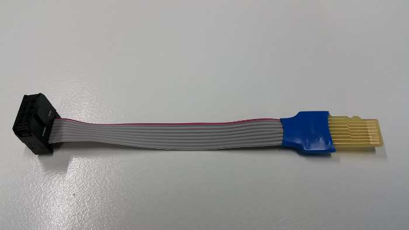

# muxPi board validation

> In case of any troubles, first it is recommended to read [comprehend Theory of Operations](theory-of-operations.md) for muxPi devices.

## Necessary components preparation

* NanoPi
* muxPi
* ETH, microUSB<->USB cables, power supply (5V/2A Dc 5.5/2.1mm jack)
* 2 SDcards (minimum 8GB each)
* IDC-uSD adapter (DUT<->SD card)
* SD card adapter (USB<->SD card)
* Device bootable from SD card (e.g. RPI)



## NanoPi setup

1. Prepare microSD card (minimum 8GB) for NanoPi NEO operating system.
1. Download and extract image - [link](https://cloud.3mdeb.com/index.php/s/n42rLcAQ5cWcxgW/download)
1. Flash image into microSD card ([Etcher](https://www.balena.io/etcher/) tool could be helpful)

## muxPi setup

1. Attach NanoPi to muxPi connectors.
1. Plug ETH cable to RJ45 NanoPi port.
1. Plug microUSB<->USB cable to muxPi and your machine.
1. Plug in power supply.
1. Make sure that jumpers are correctly set according to image:


1. Connect to NanoPi using terminal:
`sudo minicom -D /dev/ttyUSB0 -o -b 115200`

1. Save ip address:
`ifconfig`

1. Connect to NanoPi via ssh (with password: `fa`):
`ssh root@192.168.4.XXX`

1. Or via serial connection
> NOTE: Connecting with MuxPi through serial will automatically login as non
root user `pi` with password `pi`.

## Validation steps

#### 1. Install WiringNP

```
 git clone https://github.com/friendlyarm/WiringNP
 cd WiringNP/
 chmod 755 build
 ./build
```

* verify installation:

```
gpio readall
```

* If your installation is successful the following messages will show up:

```
 +-----+-----+----------+------+---+-NanoPi-NEO--+------+----------+-----+-----+
 | BCM | wPi |   Name   | Mode | V | Physical | V | Mode | Name     | wPi | BCM |
 +-----+-----+----------+------+---+----++----+---+------+----------+-----+-----+
 |     |     |     3.3V |      |   |  1 || 2  |   |      | 5V       |     |     |
 |  12 |   8 |  GPIOA12 | ALT5 | 0 |  3 || 4  |   |      | 5V       |     |     |
 |  11 |   9 |  GPIOA11 | ALT5 | 0 |  5 || 6  |   |      | 0v       |     |     |
 | 203 |   7 |  GPIOG11 |  OFF | 0 |  7 || 8  | 0 | ALT5 | GPIOG6   | 15  | 198 |
 |     |     |       0v |      |   |  9 || 10 | 0 | ALT5 | GPIOG7   | 16  | 199 |
 |   0 |   0 |   GPIOA0 | ALT5 | 0 | 11 || 12 | 0 |  OUT | GPIOA6   | 1   | 6   |
 |   2 |   2 |   GPIOA2 |  OFF | 0 | 13 || 14 |   |      | 0v       |     |     |
 |   3 |   3 |   GPIOA3 |  OFF | 0 | 15 || 16 | 0 |  OFF | GPIOG8   | 4   | 200 |
 |     |     |     3.3v |      |   | 17 || 18 | 0 |  OFF | GPIOG9   | 5   | 201 |
 |  64 |  12 |   GPIOC0 | ALT4 | 0 | 19 || 20 |   |      | 0v       |     |     |
 |  65 |  13 |   GPIOC1 | ALT4 | 0 | 21 || 22 | 0 | ALT5 | GPIOA1   | 6   | 1   |
 |  66 |  14 |   GPIOC2 | ALT4 | 0 | 23 || 24 | 1 |  OUT | GPIOC3   | 10  | 67  |
 +-----+-----+----------+------+---+----++----+---+------+----------+-----+-----+
 | BCM | wPi |   Name   | Mode | V | Physical | V | Mode | Name     | wPi | BCM |
 +-----+-----+----------+------+---+-NanoPi-NEO--+------+----------+-----+-----+

 +-----+----NanoPi-NEO USB/Audio-+----+
 | BCM | wPi |   Name   | Mode | V | Ph |
 +-----+-----+----------+------+---+----+
 |     |     |       5V |      |   | 25 |
 |     |     |  USB-DP1 |      |   | 26 |
 |     |     |  USB-DM1 |      |   | 27 |
 |     |     |  USB-DP2 |      |   | 28 |
 |     |     |  USB-DM2 |      |   | 29 |
 |     |     |    IR-RX |      |   | 30 |
 |  17 |  19 |  GPIOA17 |  OFF | 0 | 31 |
 |     |     |  PCM/I2C |      |   | 32 |
 |     |     |  PCM/I2C |      |   | 33 |
 |     |     |  PCM/I2C |      |   | 34 |
 |     |     |  PCM/I2C |      |   | 35 |
 |     |     |       0V |      |   | 36 |
 +-----+-----+----------+------+---+----+

 +-----+----NanoPi-NEO Debug UART-+----+
 | BCM | wPi |   Name   | Mode | V | Ph |
 +-----+-----+----------+------+---+----+
 |   4 |  17 |   GPIOA4 | ALT5 | 0 | 37 |
 |   5 |  18 |   GPIOA5 | ALT5 | 0 | 38 |
 +-----+-----+----------+------+---+----+
```

#### 2. Cortex-M0 flashing

The second controllable unit on the muxPi board is embedded microcontroller
`STM32 F030C6T6` from Cortex-M0 family. It is required to flash special binary
prepared by Tizen group (the code is not open yet, but this process is in
progress). To flash muxPi's microcontroller, follow steps below:

1. Make sure that VDD jumper is left open.
1. Download binary file - [link](https://cloud.3mdeb.com/index.php/s/adnEZLgo2diXkdw/download).
1. Copy binary to nanoPi: `scp <path-to-file> root@192.168.4.XXX:/root/`
1. Update package lists (nanoPi): `apt-get update`
1. Install stm32flash utility (nanoPi): `sudo apt-get install stm32flash`
1. Export GPIO: `gpio mode 3 out` and `gpio mode 7 out`
1. Set Cortex-M0 to "Flashing mode": `gpio write 7 1`
1. Power up microcontroller: `gpio write 3 1`
1. Flash firmware: `stm32flash -w /root/firmware-05.bin -v -g 0x0 /dev/ttyS2`
1. Power off microcontroller: `gpio write 3 0`
1. Set Cortex-M0 to "Execution mode": `gpio write 7 0`
1. Power on microcontroller: `gpio write 3 1`

From now on, muxPi's LCD should light on and display:

```
*  MuxPi  *
HW: 1.0 SW: 0.5
```

#### 3. SD Adapter

1. Connect IDC-uSD adapter to the muxPI board:


2. Insert the microSD card to microSD card slot accessible on the bottom side of
   muxPi board.
3. To enable microSD card reader, connect to Cortex from MuxPi via minicom:

```
minicom -D /dev/ttyS2
```

and enter in minicom following commands:

```
ts
```

and then

```
dut
```

> NOTE: Each command should return `OK`

4. Connect IDC-uSD adapter to a SD card adapter plugged into your machine
> NOTE: You need to force IDC-uSD adapter to insert into SD card adapter

5. (On your machine) Check if device is connected: `dmesg -w`
should help. You should also be able to read and write
data to uSD card from file manager.

6. Flash image into microSD card (for RPI or other device
bootable form SD card.)

7. Disconnect uSD adapter form a SD card adapter and connect
to the device (e.g. RPI).

8. Connect device to the power supply, now device should boot
via IDC-uSD adapter.

#### 4. Screening

1. It is recommended to use screen program for communication:
1. Install screen: `sudo apt-get install screen`
1. Open connection (from muxPi): `screen /dev/ttyS2 115200,cs8,ixon,ixoff`
1. Write `help` and press Enter.

Help output:

```
help --- This help
version --- Display version of the firmware
echo --- Get (no arguments) or set ('on' or 'off') echo on serial "console": echo [on|off]. The default value is on.
power --- Get (no arguments) or set ('on' or 'off') or switch off and on ('tick') power supply for DUT: power [on|off|tick]
hdmi --- Get (no arguments) or set ('on' or 'off') HDMI HOTPLUG pin: hdmi [on|off]
dyper --- Get (no second argument) or set ('on' or 'off') DyPer state: dyper 1|2 [on|off]
 mux --- Connect microSD card to external connector (DUT) or card reader (ts): mux [dut|ts]
 dut --- Connect microSD card and power to DUT: dut
  ts --- Connect microSD card and power to TS: ts
 led --- Get (no second or third argument) or set ('R G B') color of led (1 | 2), ex: led 1 255 0 255
 clr --- Clear oled display
text --- Print text on the OLED display: text x y color content
draw --- Draw an object on the OLED display: draw object x1 y1 [x2 y2], objects are:
         - point x y color - draws one point at given coordinates
         - line x1 y1 x2 y2 color - draws line between given coordinates
         - rectangle left top width height color - draws line between given coordinates
         - circle x y radius color - draws line between given coordinates
color must be 'on', 'off' or 'inv'
 adc --- Print current adc value of all (if no arguments are given) or one specified channel, ex: adc 1
voltage --- Print current voltage [mV] of all (if no arguments are given) or one specified channel, ex: voltage 1
current --- Print current current [mA] being consumed by DUT
lthor --- Get (no second argument) or set state of lthor control signals:
         - lthor switch [usb|uart] - redirect DUT's USB wires to NanoPi's 'usb' or 'uart'
         - lthor id [usb|uart] - switch DUT's USB to 'usb' or 'uart' mode
         - lthor vbus [on|off] - switch DUT's VBUS 'on' or 'off'
         - lthor combo [usb|uart] - make DUT and MuxPi USB work in 'usb' or 'uart' mode - no get function

 key --- Get current state of given key or both if no key number is given: key [1|2]
uart --- Get current value of UART voltage or set if new value is given [in millivolts]

```

> NOTE: `help` might not display anything. Then try to use minicom.

Minicom quick guide:

1. Install minicom: `sudo apt-get install minicom`
1. Connect via minicom: `sudo minicom -D /dev/ttyS2 -o -b 115200`
1. Type: `help`

> NOTE: If output is the same as above then basic validation for muxPi is done.

---

*Images source: [Wiki Tizen](https://wiki.tizen.org/MuxPi)*
