# MuxPi - Theory of Operations

## Block diagram

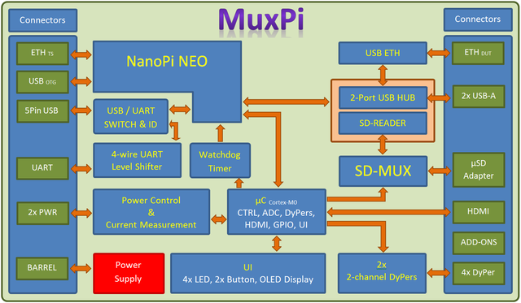

## muxPi setup

### NanoPi NEO

Preparation of the muxPi's "heart":

1. Prepare microSD card (minimum 8GB) for NanoPi NEO operating system.
1. Download and extract image - [link][nanopi-image2]
1. Flash image into microSD card ([Etcher][etcher] tool could be helpful)
1. Insert card to NanoPi microSD slot.
1. Attach NanoPi to muxPi connectors.
1. Plug Ethernet cable to RJ45 NanoPi port.

#### Serial communication

There are two methods to setup serial communication with muxPi:

* with microUSB<->USB cable

    

* with UART/USB converter

    Attach USB/UART converter to muxPi's left addon female header (`GND`,
     `DBG UART RX`, `DBG UART TX` on pinout image below):

    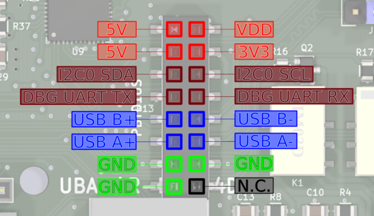

    and plug USB connector to the computer. Next, open connection in PC
    terminal by typing:

    ```bash
    sudo minicom -D /dev/ttyUSB0 -o -b 115200.
    ```

    > `/dev/ttyUSB0` is example device - check whether `USB0` is the correct one

#### Jumpers configuration

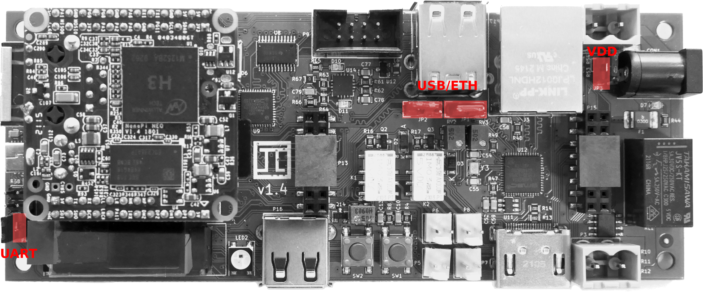

* UART - pins `Vloc` & `VCC` - if jumped then internal voltage generator is
    used as voltage reference for data lines and powers up target device. If
    open then voltage reference for data lines comes from target device and
    internal voltage generator is unused.
* USB/ETH - determines what USB data lines of one USB HUB are connected to. If
    first two pins are jumped then USB lines are connected to add-on connector.
    If last two pins are jumped then these lines are connected tu USB<->ETH
    converter. If none of the pins are jumped then the only connection is the
     upper socket of double connector.

    > NOTE: The upper socket of double USB-A connector must be left empty if
    USB<->ETH is selected or add-on connector is selected and something is
    connected to these data lines on the addon!
    > NOTE: Both jumpers must be placed in the same position!

* VDD - if this pins are jumped then the VDD and 3V3 are always on. If this is
    left open then VDD and 3V3 are controlled by NanoPi. The usage example is
    setting value of USB ID potentiometer (which is located underneath NanoPi).
    But when NanoPi NEO is removed there is no way to turn on power for
    microcontroller (that is when VDD jumper is helpful).

    > NOTE: If there is no particular need then leave this jumper open.

#### Power supply

To power on MuxPi with NanoPi attached, plug the 5V/2A DC 5.5/2.1mm power supply
jack to the CON1 muxPi's connector. Power consumption of MuxPi should be less
then 1A assuming no addons connected.

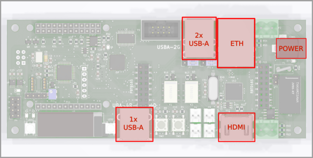

#### IP address

To check which IP address has been assigned, type in terminal: `ifconfig`.

OPTIONAL STEP:
To set static IP, create the following file:

```bash
sudo vi /etc/NetworkManager/NetworkManager.conf
```

Edit NetworkManger.conf and set the value of "managed" under "ifupdown" to
false:

```bash
[ifupdown]
managed=false
```

Add network setting to `/etc/network/interfaces`:

```bash
sudo vi /etc/network/interfaces
```

Here is sample of `/etc/network/interfaces`:

```bash
# The loopback network interface
auto lo
iface lo inet loopback

# network interface not managed by Network Manager
allow-hotplug eth0
iface eth0 inet static
address 192.168.4.XXX
netmask 255.255.255.0
gateway 192.168.4.1
dns-nameservers 192.168.4.1
```

Restart the whole device:

```bash
reboot
```

Now you should be able to connect to device through ssh:

```bash
ssh root@192.168.4.XXX
```

with the password: `fa`

#### Install WiringNP

Connect to NanoPi NEO through ssh (serial connection automatically login to non
root user `pi`), then type:

```bash
git clone https://github.com/friendlyarm/WiringNP
cd WiringNP/
chmod 755 build
./build
```

Verify installation:

```bash
gpio readall
```

If your installation is successful the following messages will show up:

```bash
 +-----+-----+----------+------+---+-NanoPi-NEO--+------+----------+-----+-----+
 | BCM | wPi |   Name   | Mode | V | Physical | V | Mode | Name     | wPi | BCM |
 +-----+-----+----------+------+---+----++----+---+------+----------+-----+-----+
 |     |     |     3.3V |      |   |  1 || 2  |   |      | 5V       |     |     |
 |  12 |   8 |  GPIOA12 | ALT5 | 0 |  3 || 4  |   |      | 5V       |     |     |
 |  11 |   9 |  GPIOA11 | ALT5 | 0 |  5 || 6  |   |      | 0v       |     |     |
 | 203 |   7 |  GPIOG11 |  OFF | 0 |  7 || 8  | 0 | ALT5 | GPIOG6   | 15  | 198 |
 |     |     |       0v |      |   |  9 || 10 | 0 | ALT5 | GPIOG7   | 16  | 199 |
 |   0 |   0 |   GPIOA0 | ALT5 | 0 | 11 || 12 | 0 |  OUT | GPIOA6   | 1   | 6   |
 |   2 |   2 |   GPIOA2 |  OFF | 0 | 13 || 14 |   |      | 0v       |     |     |
 |   3 |   3 |   GPIOA3 |  OFF | 0 | 15 || 16 | 0 |  OFF | GPIOG8   | 4   | 200 |
 |     |     |     3.3v |      |   | 17 || 18 | 0 |  OFF | GPIOG9   | 5   | 201 |
 |  64 |  12 |   GPIOC0 | ALT4 | 0 | 19 || 20 |   |      | 0v       |     |     |
 |  65 |  13 |   GPIOC1 | ALT4 | 0 | 21 || 22 | 0 | ALT5 | GPIOA1   | 6   | 1   |
 |  66 |  14 |   GPIOC2 | ALT4 | 0 | 23 || 24 | 1 |  OUT | GPIOC3   | 10  | 67  |
 +-----+-----+----------+------+---+----++----+---+------+----------+-----+-----+
 | BCM | wPi |   Name   | Mode | V | Physical | V | Mode | Name     | wPi | BCM |
 +-----+-----+----------+------+---+-NanoPi-NEO--+------+----------+-----+-----+

 +-----+----NanoPi-NEO USB/Audio-+----+
 | BCM | wPi |   Name   | Mode | V | Ph |
 +-----+-----+----------+------+---+----+
 |     |     |       5V |      |   | 25 |
 |     |     |  USB-DP1 |      |   | 26 |
 |     |     |  USB-DM1 |      |   | 27 |
 |     |     |  USB-DP2 |      |   | 28 |
 |     |     |  USB-DM2 |      |   | 29 |
 |     |     |    IR-RX |      |   | 30 |
 |  17 |  19 |  GPIOA17 |  OFF | 0 | 31 |
 |     |     |  PCM/I2C |      |   | 32 |
 |     |     |  PCM/I2C |      |   | 33 |
 |     |     |  PCM/I2C |      |   | 34 |
 |     |     |  PCM/I2C |      |   | 35 |
 |     |     |       0V |      |   | 36 |
 +-----+-----+----------+------+---+----+

 +-----+----NanoPi-NEO Debug UART-+----+
 | BCM | wPi |   Name   | Mode | V | Ph |
 +-----+-----+----------+------+---+----+
 |   4 |  17 |   GPIOA4 | ALT5 | 0 | 37 |
 |   5 |  18 |   GPIOA5 | ALT5 | 0 | 38 |
 +-----+-----+----------+------+---+----+
```

#### Cortex-M0 flashing

The second controllable unit on the muxPi board is embedded microcontroller
`STM32 F030C6T6` from Cortex-M0 family. It is required to flash special binary
prepared by Tizen group (the code is not open yet, but this process is in
progress). To flash muxPi's microcontroller, follow steps below:

1. Make sure that `VDD` jumper is left open.
1. Download binary file - [link][cortex-binary]
1. Copy binary to nanoPi: `scp <path-to-file> root@192.168.4.XXX:/root/`
1. Update package lists (nanoPi): `apt-get update`
1. Install stm32flash utility (nanoPi): `sudo apt-get install stm32flash`
1. Export GPIO: `gpio mode 3 out` and `gpio mode 7 out`
1. Set Cortex-M0 to "Flashing mode": `gpio write 7 1`
1. Power up microcontroller: `gpio write 3 1`
1. Flash firmware: `stm32flash -w firmware-05.bin -v -g 0x0 /dev/ttyS2`
1. Power off microcontroller: `gpio write 3 0`
1. Set Cortex-M0 to "Execution mode": `gpio write 7 0`
1. Power on microcontroller: `gpio write 3 1`

From now on, muxPi's LCD should light on and display:

```bash
*  MuxPi  *
HW: 1.0 SW: 0.5
```

## Software installation

> NOTE: It is recommended to cross-compile muxPi's software on your host machine

### Building using docker

Prerequisites: `Docker`, `Make`.

1. Clone repository: `git clone https://github.com/SamsungSLAV/muxpi.git`.
1. Change directory: `cd muxpi/sw/nanopi`.
1. Build muxPi software: `make docker-build`

Resulting binaries will be in `bin` directory.

#### Building from source

Prerequisites: `git`, `go (1.10+)`

1. Go get it: `go get github.com/SamsungSLAV/muxpi`
1. Change directory: `cd $GOPATH/src/github.com/SamsungSLAV/muxpi/sw/nanopi`
1. Download dependencies: `go get ./...`
1. Build binaries:

    ```bash
    mkdir -p bin
    GOARCH=arm GOOARM=7 GOOS=linux go build -o bin/stm ./cmd/stm/
    GOARCH=arm GOOARM=7 GOOS=linux go build -o bin/fota ./cmd/fota/
    ```

#### Install muxpi-power

`muxpi-power` - tool for controling power supply for  MuxPi's main board.

1. Copy muxpi-power files (change `XXX` to proper values):

    ```bash
    scp power/muxpi-power root@192.168.4.XXX:/usr/bin
    scp power/systemd/muxpi-power.service root@192.168.4.XXX:/etc/systemd/system
    ```

1. On your MuxPi device, enable and start muxpi-power service:

    ```bash
    systemctl enable muxpi-power.service
    systemctl start muxpi-power.service
    ```

#### Install stm

`stm` - tools/libs for communicating with STM32F030 microcontroller.

1. Copy stm binary and systemd files (change `XXX` to proper values):

    ```bash
    scp bin/stm_armv7 root@192.168.4.XXX:/usr/bin/stm
    scp stm/systemd/stm.service root@192.168.4.XXX:/etc/systemd/system
    scp stm/systemd/stm-user.socket root@192.168.4.XXX:/etc/systemd/system
    scp stm/systemd/stm.socket root@192.168.4.XXX:/etc/systemd/system
    scp stm/stm root@192.168.4.XXX:/usr/local/bin/stm
    ```

1. On your MuxPi device - create group stm and add your user:

    ```bash
    groupadd stm
    usermod -aG stm root
    ```

1. On your MuxPi device - enable stm sockets:

    ```bash
    systemctl daemon-reload
    systemctl enable stm.socket stm-user.socket
    systemctl start stm.socket stm-user.socket
    ```

#### Install fota

`fota` - tools/libs for flashing devices - usually microSD card.

1. Copy fota binary to MuxPi device (change `XXX` to proper values):

    ```bash
    scp bin/fota_armv7 root@192.168.4.XXX:/usr/bin/fota
    ```

1. On your MuxPi device - create a symlink from `/usr/local/bin/fota` to
`/usr/bin/fota/`. Only `/usr/local/bin/fota/` should be used by software
interfacing with MuxPi. This allows to swap fota implementation to your
preferred tool:

    ```bash
    ln -s /usr/bin/fota /usr/local/bin/fota
    ```

## DUT setup

### DUT power supply

MuxPi is capable of:

* power switching on/off
* current measurement

Power switching - it can switch power supply up to 5A and 250VAC. One line is
connected directly and one is connected through relay.

Current measurement - It is able to measure up to -/+5A and is galvanically
isolated from the rest of components thanks to use of Hall effect current sensor
ACS712ELCTR-05B-T. It is connected to unswitchable power line. The current
sensor is bypassed with 3 0R resistors tha can be populated if current sensor is
not needed. These resistors must not be populated if current measurement is
required.

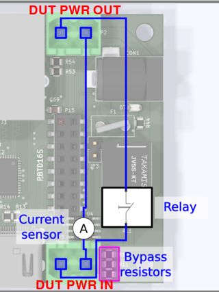

#### UART connections

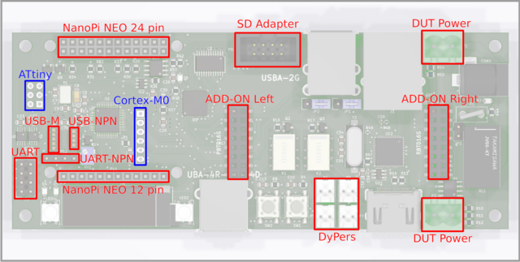

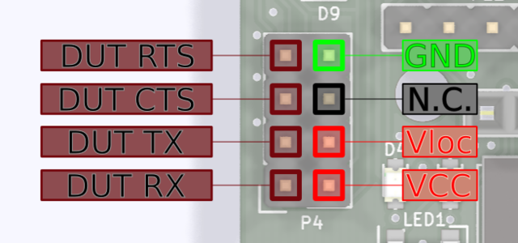

* `GND` - digital ground of MuxPi board
* `N.C.` - not connected
* `Vloc` - local voltage - voltage may be generated internally on MuxPi if the
  DUT, or anything else we are connecting to, has not power pin. Nn such case
  voltage generator must be set to desired value and activated. Command "uart
  3300" must be sent to Cortex-M0, where 3300 is desired voltage given in
  millivolts. The voltage range is from 0 to 5000mv. Pins `Vloc` an `VCC` must
  be connected eachother. Typical jumper is a perfect connector for this
  purpose. `Vloc` may be also used to power up additional converter RS232C. For
  example if converter to RS232C (+/-12v) must be used then it may be powered
  from `Vloc` pin.
* `VCC` - power of DUT. If dut has no such power pin then it must be connected
to Vloc and vloc must be configured properly as stated above.
* `DUT RX` - receiver data line in the DUT - through this line MuxPi sends data
to the DUT
* `DUT TX` - transmitter data line in the DUT - from this line MuxPi reads data
form the DUT
* `DUT CTS` - Clear To Send - hardware handshake
* `DUT RTS` - Ready To Send - hardware handshake

Example configuration for OrangePi (DUT) uart connection:

1. Set 3.3V Vloc (/dev/ttyS2 terminal): `uart 3300`
1. Attach UART jumper (`Vloc` and `Vcc`).
1. Connect GND, RX and TX (without crossing).
1. Open connection: `screen /dev/ttyS1 115200,cs8,ixon,ixoff`

> NOTE: `RX`, `TX`, `XTS`, `RTS` are crossed on the board so you don't need
    to cross the wires by yourself.
> NOTE: A device powered from `Vloc` mustn't draw more than 50mA of current.

#### Add-ons

Add-ons headers are extensions for attaching new shields or simply using NanoPi
and CortexM0 interfaces:


* `5V` - power supply - not switchable - always present
* `3V3` - switchable (controlled by NanoPi) 3.3V power supply
* `I2C0 SDA` - I2C0 SDA line connected to NanoPi
* `I2C0 SCL` - I2C0 SCL line connected to NanoPi
* `DBG UART TX` - UART0 (debug) of NanoPi
* `DBG UART RX` - UART0 (debug) of NanoPi
* `USB B+/-`, `USB A+/-` USB host lines connected to NanoPi through USB HUB
* `GND` - ground lines
* `N.C`. - not connected

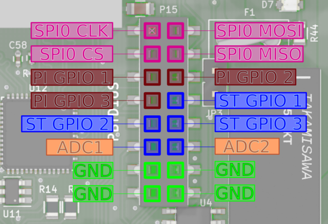

* `SPI0 CLK` - SPI0 clock line connected to NanoPi
* `SPI0 MOSI` - SPI0 "master output slave input" line connected to NanoPi
* `SPI0 CS` - SPI0 "chip select" line connected to NanoPi
* `SPI0 MISO` - SPI0 "master input slave output" line connected to NanoPi
* `PI GPIO 1,2,3` - GPIO (General Purpose Input/Output) connected to NanoPi NEO.
  Ports PG11, PL11, PA17 respectively.
* `ST GPIO 1,2,3` - GPIO connected to Cortex-M0 microcontroller. Ports PB3, PB4,
  PB5 of STM32F03C6T6 respectively.
* `ADC1,2` - analog inputs connected to analog to digital converter of Cortex-M0
  microcontroller. Ports PA1, PA2 respectively. Voltage range of this input is 0
  to 3.3V. This lines are not buffered in any way so attention must paid when
  dealing with them.
* `GND` - ground lines

>NOTE: PI GPIO 1 has additional special function. It is connected to Cortex-M0
    Boot0 pin which enables firmware download mode during microcontroller boot.
    1 - enables this mode while 0 disables it. So it is useless as GPIO when
    the microcontroller is being booted.

#### DyPers

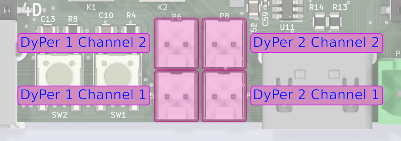

Dyper is a small, electromagnetic relay which is controllable by software. There
are 2 dypers on MuxPi board. Each of them has two channels. Both channels are
switched at the same time with the same command. So both of them can be on and
both can be off but there is no way to turn one on and one off. They can be
controlled by CortexM0 - examples [here](#user-interface).

#### ETH and USB

ETH and upper USB of double USB socket share the same USB channel from USB HUB.
Jumpers located at the rear side of double USB connector allow to disconnect
this USB from ETH and connect to add-on connector. Details on this topic are
covered in jumpers section.

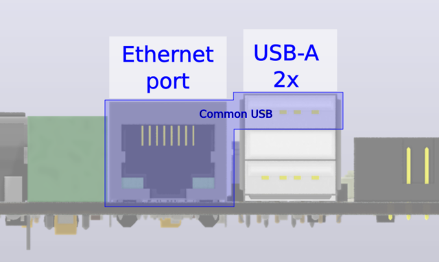

#### USB-M

This is USB connector dedicated to mobile devices from Samsung company. This
connector has controllable Vbus line and also controllable ID line.

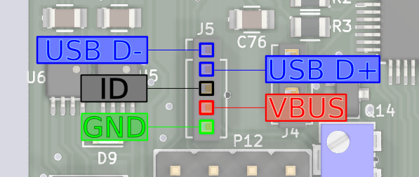

More information about this type of interface, it's capabilities and example of
flashing smartphone can be found [here][usb-m].

#### SD Adapter

This connector is used to connect microSD card, put into MuxPi, to a DUT.


This connector requires IDC-uSD cable adapter:


Target microSD card must be attached to microSD card reader accessible on bottom
side of muxPi board.

To enable microSD card reader, connect to Cortex from MuxPi via minicom:

```bash
minicom -D /dev/ttyS2
```

and enter in minicom following commands:

```bash
ts
```

and then:

```bash
dut
```

Each command should return `OK`

After doing this you can connect the uSD's end of the cable adapter to the
external card reader and check if it is correctly recognized by PC. You should
also be able to run the microcontroller from the card attached to MuxPi if the
card contains appropriate OS.

## Interacting with muxPi

### Connection with NanoPi

User can simply open SSH connection by (password: `fa`):

`ssh root@<muxpi-ip-address>`

* or use serial connection mentioned [here](#serial-communication)

> NOTE: Connecting with MuxPi through serial will automatically login as non
    root user `pi` with password `pi`.

#### User interface

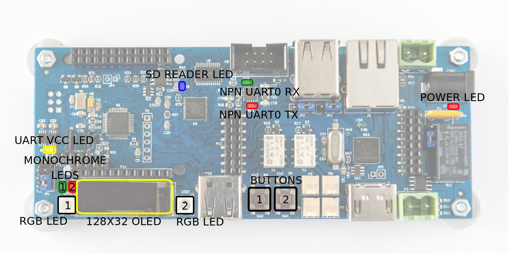

Features operable directly via NanoPi GPIOs:

| #Pin (board) | #WiringNP | Description       | Low state "0" | High state "1" |
|:------------:|:---------:|:-----------------:|:-------------:|:--------------:|
| 12           | 1         | LED1              | LED off       | LED on         |
| 13           | 2         | LED2              | LED off       | LED on         |
| 15           | 3         | Power (Cortex m0) | Power off     | Power on       |
| 7            | 7         | Boot (Cortex m0)  | Execution mode| Flashing mode  |

> NOTE: Initially, above GPIOs are not exported. Set GPIOs mode with `gpio mode
  <#WiringNP> out`.

Example LED1 control:

* LED1 on: `gpio write 1 1`
* LED1 off: `gpio write 1 0`

Example of flashing Cortex-M0 is described [here](#cortex-m0-flashing).

The microcontroller is connected to NanoPi NEO with UART. This UART is connected
to third UART of NanoPi - /dev/ttyS2. The port is configured to 115200,8,N1 and
cannot be changed without modification of the firmware. The protocol is text
based, simple and human readable. Each command has to be ended with 'n' or 'r'
character. Each command is confirmed with 'OK' string or error string.

It is recommended to use `screen` program for communication:

1. Install screen: `sudo apt-get install screen`
2. Open connection (from muxPi): `screen /dev/ttyS2 115200,cs8,ixon,ixoff`
3. Write `help` and press `Enter`.

Features operable through Cortex-M0 microcontroller (help output):

```bash
help --- This help
version --- Display version of the firmware
echo --- Get (no arguments) or set ('on' or 'off') echo on serial "console": echo [on|off]. The default value is on.
power --- Get (no arguments) or set ('on' or 'off') or switch off and on ('tick') power supply for DUT: power [on|off|tick]
hdmi --- Get (no arguments) or set ('on' or 'off') HDMI HOTPLUG pin: hdmi [on|off]
dyper --- Get (no second argument) or set ('on' or 'off') DyPer state: dyper 1|2 [on|off]
 mux --- Connect microSD card to external connector (DUT) or card reader (ts): mux [dut|ts]
 dut --- Connect microSD card and power to DUT: dut
  ts --- Connect microSD card and power to TS: ts
 led --- Get (no second or third argument) or set ('R G B') color of led (1 | 2), ex: led 1 255 0 255
 clr --- Clear oled display
text --- Print text on the OLED display: text x y color content
draw --- Draw an object on the OLED display: draw object x1 y1 [x2 y2], objects are:
         - point x y color - draws one point at given coordinates
         - line x1 y1 x2 y2 color - draws line between given coordinates
         - rectangle left top width height color - draws line between given coordinates
         - circle x y radius color - draws line between given coordinates
color must be 'on', 'off' or 'inv'
 adc --- Print current adc value of all (if no arguments are given) or one specified channel, ex: adc 1
voltage --- Print current voltage [mV] of all (if no arguments are given) or one specified channel, ex: voltage 1
current --- Print current current [mA] being consumed by DUT
lthor --- Get (no second argument) or set state of lthor control signals:
         - lthor switch [usb|uart] - redirect DUT's USB wires to NanoPi's 'usb' or 'uart'
         - lthor id [usb|uart] - switch DUT's USB to 'usb' or 'uart' mode
         - lthor vbus [on|off] - switch DUT's VBUS 'on' or 'off'
         - lthor combo [usb|uart] - make DUT and MuxPi USB work in 'usb' or 'uart' mode - no get function

 key --- Get current state of given key or both if no key number is given: key [1|2]
uart --- Get current value of UART voltage or set if new value is given [in millivolts]
```

---

_Images source: [Wiki Tizen](https://wiki.tizen.org/MuxPi)_

[nanopi-image]: https://cloud.3mdeb.com/index.php/s/MENgScifExeeo6P/download
[nanopi-image2]: https://cloud.3mdeb.com/index.php/s/n42rLcAQ5cWcxgW/download
[cortex-binary]: https://cloud.3mdeb.com/index.php/s/adnEZLgo2diXkdw/download
[etcher]: https://www.balena.io/etcher/
[usb-m]: https://wiki.tizen.org/MuxPi#USB-M
