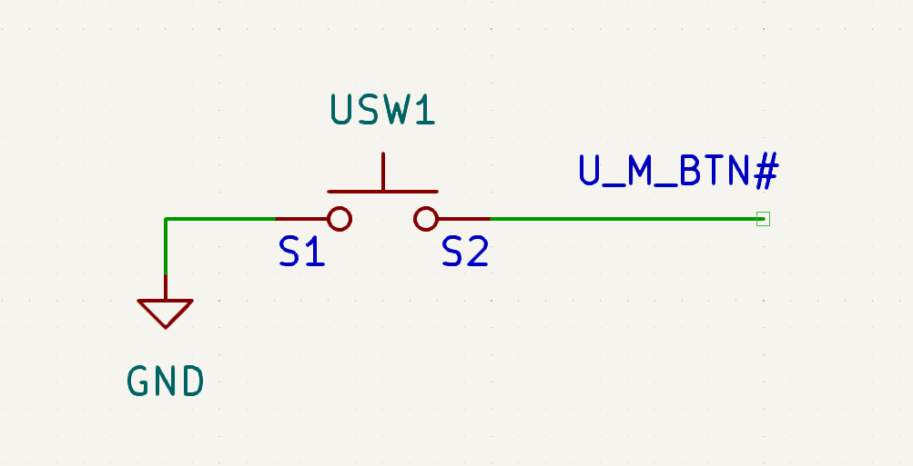
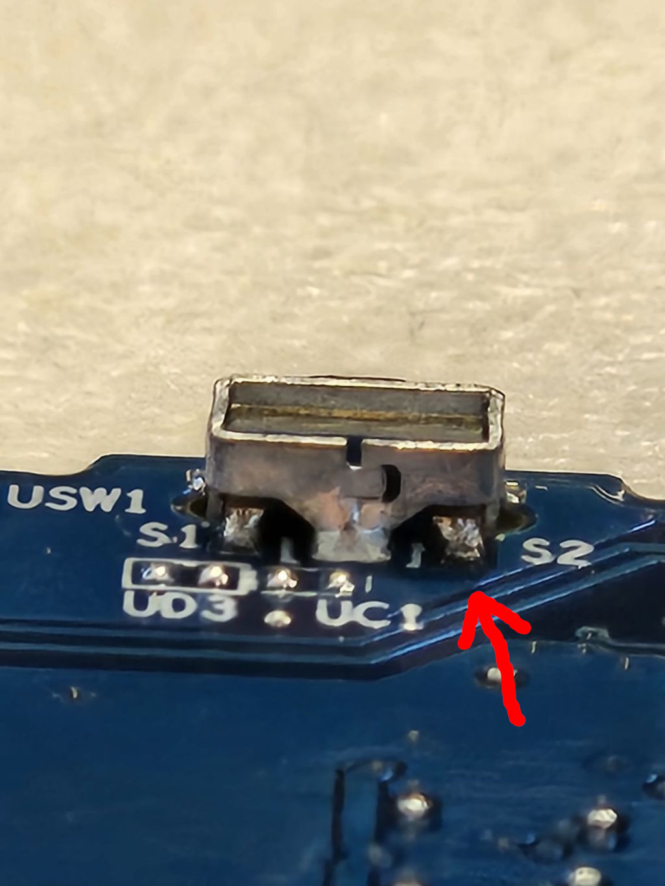
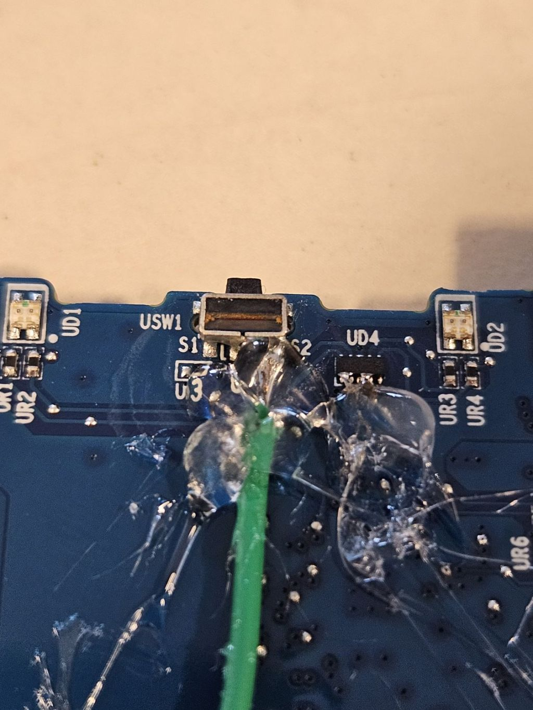
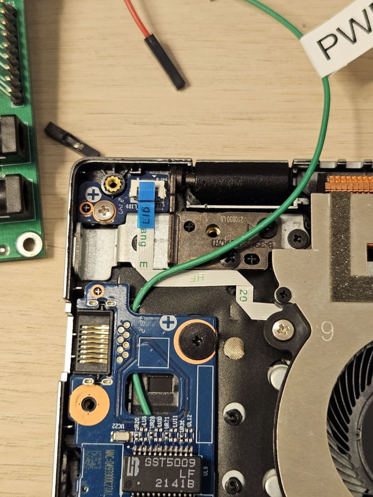
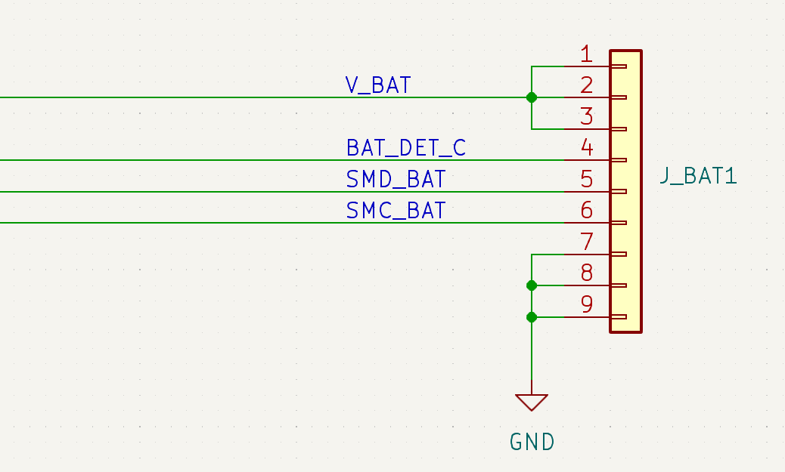
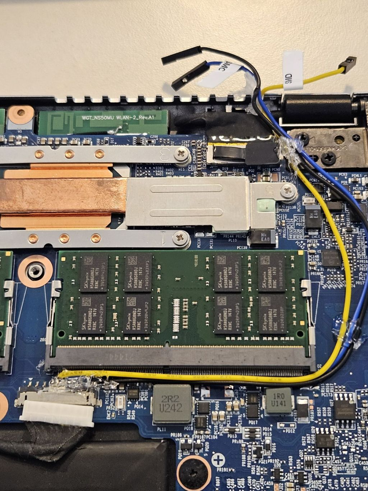
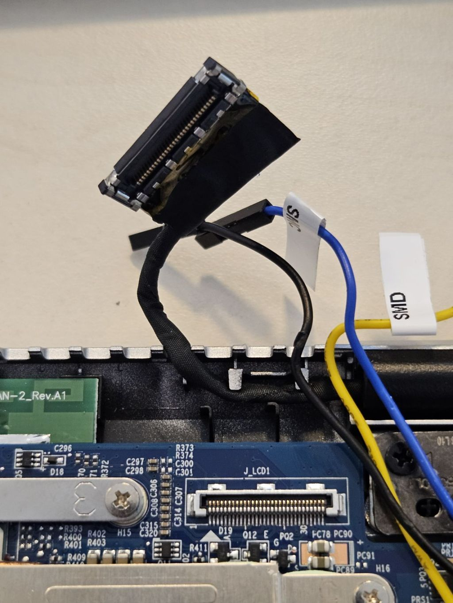
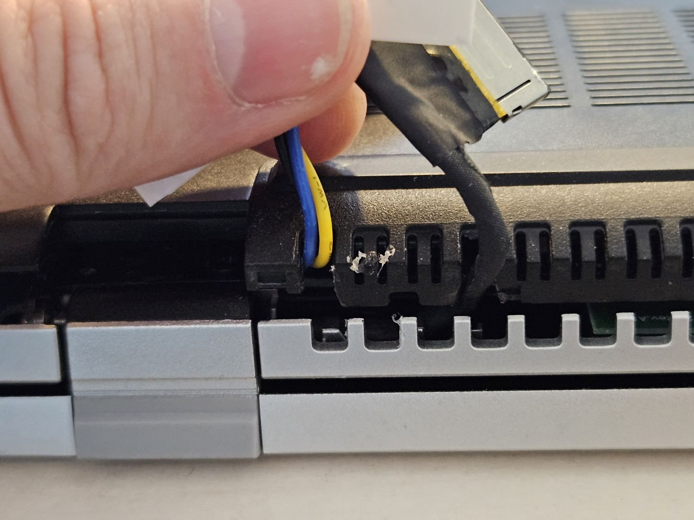

# Laboratory assembly guide for NovaCustom laptops

## Introduction

This document describes the process of installing and configuring NovaCustom
laptops in a rackmount chassis for remote access, testing and debugging. In
contrast to other boards, setting up a laptop for remote control involves some
soldering.

This document is useful as reference while going through
[Generic Testing Stand Setup](../../unified-test-documentation/generic-testing-stand-setup.md).

## Prerequisites

The below table contains information about all elements which are needed to
assemble the testing setup.

* Laptop (DUT)
* [RTE](https://shop.3mdeb.com/shop/open-source-hardware/open-source-hardware-3mdeb/rte/)
  (any board revision is suitable)
* Sonoff S20 / S26 type E (EU plug)
* 4x standard male-female connection wire 2.54 mm raster
* I2C to UART relay with USB cable
* PiKVM
* Power supply for the DUT

### Soldering

Remote access to laptops requires that some soldering is done. At least the
following signals will need to be soldered:

* Power switch
* EC SMBus clock and data
* Ground

First, identify the solder points in the device schematics. Take NS50PU for
example:

* Power button: Switch `USW1` pulls signal `U_M_BTN#` to the ground when pressed.
  According to the schematics, we can solder the S2 terminal of the power
  button:

    

    Let's find that terminal on the board:

    

    Solder a jumper wire to it. Secure the solder joint using hot glue, to prevent
    the cable from falling off when pulled:

    

    Route the cable to the outside of the laptop chassis. In this case, we'll
    route the cable under the audio board out via the fan exhaust vent:

    > While there, let's also disconnect the lid switch FFC cable to prevent the
    > laptop from going to sleep automatically (visible in the top left corner)

    

* Now for the other signals, find the battery connector in the schematic:

    

    We can see that we can take the groud signal from pins 7,8 or 9, `SMD_BAT`
    (SMBus Data) from pin 5 and `SMC_BAT` (SMBus Clock) from pin 6. Now solder the
    wires and secure them using hot glue as before:

    

    We'll also need to disconnect the eDP cable that connects the internal display
    to the mainboard. This will allow us to see the firmware on a PiKVM instead of
    the internal display. Gently disconnect it and route it outside via the
    exhaust vent:

    

    Now, to be able to close the bottom cover on the laptop, you may also need to
    make modifications to the chassis:

    

### Connections

Make the following connections:

* Power switch -> RTE OC GPIO
* EC SMBUS -> Nucleo I2C to UART relay -> RTE via USB
* PiKVM HDMI and USB to the laptop
* Power supply with a sonoff to the laptop

Remember about two important rules during making connections and placing stand
in the rack:

**Use ESD Strap**: When assembling and connecting equipment in the lab, it is
essential to use ESD straps. These straps help to prevent electrostatic
discharge and protect sensitive electronic components from damage. Make sure you
wear a strap every time you make a connection, and if someone is helping you,
they have to also wear an ESD strap.

**Cut off the power supply**: Before making any connections and ensure that the
platform, RTE and any other components are disconnected from power. This
precautionary measure reduces the risk of electrical accidents and protects both
the equipment and you.

### USB devices

Since some issues with USB controllers may only happen on select USB ports,
it's important to plug in USB devices to both USB ports of the board.
