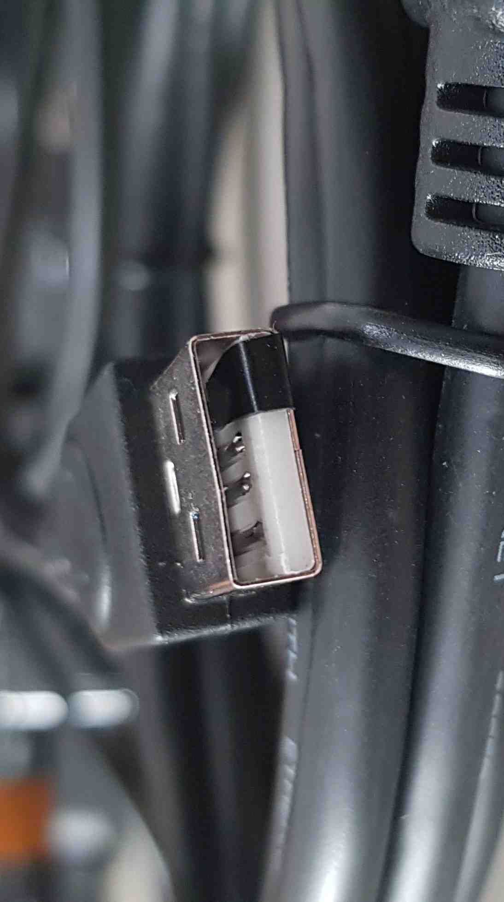

# Presale device assembly and validation

## Introduction

This document describes the assembly procedure of the PiKVM (device based on
Raspberry Pi 4 or Raspberry Pi Zero 2W) with components specified in
[requirements](#requirements).

## Requirements

> Note that the PiKVM build might be basing on two types of Raspberry Pi: RPi 4
    or RPi Zero 2W.

Hardware components necessary to build PiKVM on RPi Zero 2W:

* Raspberry Pi Zero 2W,
* microSD card 16 GB,
* USB-A 5 V 3.1 A charger (female socket),
* HDMI to CSI-2 bridge,
* Raspberry Pi Zero Camera Cable,
* HDMI-HDMI cable,
* USB A - micro USB cable (male, male),
* Y-splitter cable.
* (Optional) UART -> USB converter

Hardware components necessary to build PiKVM on RPi 4:

* Raspberry Pi 4,
* microSD card 16 GB,
* USB-A 5 V 3.1 A charger (female socket),
* HDMI to CSI-2 bridge,
* HDMI-HDMI cable,
* USB A - USB C cable,
* Y-splitter cable.
* (Optional) UART -> USB converter

## Device assembly

The following section of the documentation shows the assembly procedure for
PiKVM including setting up a WiFi connection and methods for reading device IP.

### Set based on RPi Zero 2W preparation

The section below describes the method of preparing PiKVM hardware based on
RPI Zero 2W.

1. Connect SD card and HDMI to CSI-2 bridge with camera cable:

    

1. Block USB power from device under test by preparing USB cable:

    

1. Connect HDMI cable from the device under test to HDMI -> CSI-2 bridge.
1. Connect the USB splitter to the Raspberry Pi micro USB port.
1. Connect one side of the splitter to USB-A 5 V 3.1 A charger.
1. Connect other side to device under test via USB cable with blocked power.

### Set based on RPi 4 preparation

To build PiKVM on RPi 4, use the
[RPI 0 set documentation](#set-based-on-rpi-zero-2w) and replace the cable for
connecting to the RPi and the cable for connecting with the CSI-2 bridge.

### OS image building and flashing

1. Prepare the OS in accordance with the
[PiKVM Handbook](https://docs.pikvm.org/building_os/).

1. Flash the SD card using `bmaptool` or `balenaEtcher`.
    - to do this by `balenaEtcher` go to the [producer site](https://www.balena.io/etcher/)
        and follow his procedure on how to download and flash an SD card.
    - to do this by `bmaptool` reproduce the following steps:
        + install `bmaptool` by opening the terminal and typing the following
            command:

            ```bash
            sudo apt install bmap-tools
            ```

        + create the bmap by typing the following command:

            ```bash
            bmaptool create /path/to/your/image > /path/where/you/want/bmap/file/saved/bmapfilename.bmap
            ```

        + flash image to the SD card by typing the following command:

            ```bash
            sudo bmaptool copy --bmap ~/path/where/your/bmap/file/is/located /path/where/your/image/is/located /path/to/memory/device
            ```

1. Insert the flashed SD card into the SD card slot on the PiKVM.

### Set up WiFi

The section below describes the method of setting up a WiFi connection for the
PiKVM. This section is dedicated especially to the PiKVMs based on RPi Zero 2W,
which is not equipped with an Ethernet port.

1. Mount the first partition of the memory card.

1. Edit or make the `pikvm.txt` file in the following convention:

    ```bash
    FIRSTBOOT=1
    WIFI_ESSID="name"
    WIFI_PASSWD="password"
    ```

    > Note: Do not remove line `FIRSTBOOT=1` or `FIRST_BOOT-1` line. It may
        occur with troubles with the device starts.

1. Unmount the first partition of the memory card.

> Note: In some countries, in which WiFi channel 13 is in use, the device
    might not connect to the WiFi. To prevent this, the router should be
    configured properly: channels 12-14 or Auto Scan mode should be disabled.

### Read IP adress

The section below describes the known methods of reading PiKVM IP.

1. First option: from `os` repository run the following command:

    ```bash
    make scan
    ```

    Example output:

    ```bash
    .
    .
    .
    ===== Toolbox image is ready =====
    ===== Searching for Pis in the local network =====
    docker run \
    		--rm \
    		--tty \
    		--net host \
    	pi-builder-arm-toolbox arp-scan --localnet | grep -Pi "\s(b8:27:eb:|dc:a6:32:)" || true
    192.168.4.13	dc:a6:32:aa:aa:aa	Raspberry Pi Trading Ltd
    ```

1. Second option: open the web interface of your router and find the list of
    issued IP addresses. Localization of the mentioned list depends on the
    router model.

1. Third option:
    * solder pins for serial output as on images below:

        
        

    * Check Raspberry Pi Zero2W IP by booting to system and reading
        information via serial (eg.) UART -> USB converter.

## Device validation

1. Connect the device to the mains.
1. Login to RTE via `ssh` (by using earlier obtained IP address) or
    `minicom` (by using USB-UART converter with 3 wire cables).
