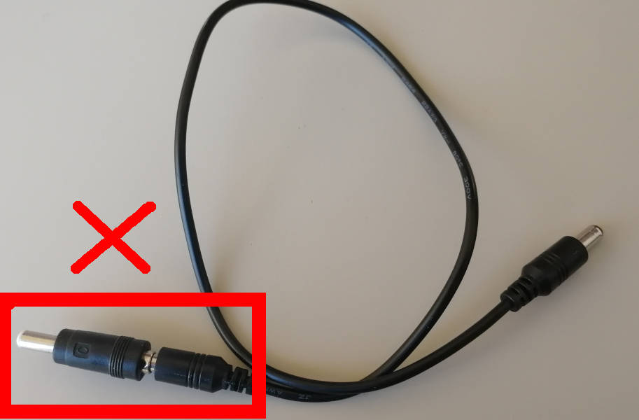
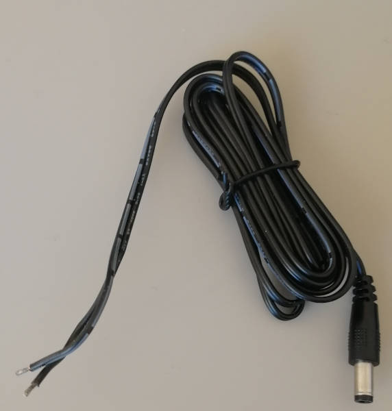
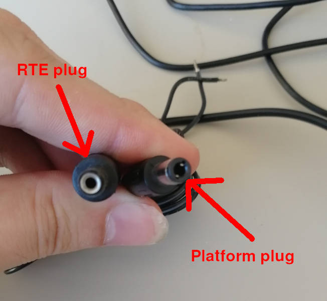

# Laboratory stand dedicated to Protectli platforms assembly guide

## Introduction

This document describes the assembly procedure dedicated to the Protectli
platforms (VP2410, VP2420, VP4630/VP4650/VP4670, V1210/V1410/V1610) testing
stand.

## Prerequisites

The below table contains information about all elements which are needed to
create the testing stand.

* [RTE v1.1.0](https://shop.3mdeb.com/shop/open-source-hardware/open-source-hardware-3mdeb/rte/)
* RTE power supply 5V 2A Micro-USB
* 6x standard female-female connection wire 2.54 mm raster
* 6x standard female-female connection wire 2.54/2.00 mm raster
* 2x RJ45 cable: 1 for RTE and 1 for the platform

=== "VP2410"

    * VP2410 platform
    * Power supply for the platform: 12V 5A
    * Micro-USB to USB-A male-male cable for console

=== "VP2420"

    * VP2420 platform
    * Power supply for the platform: 12V 5A
    * Micro-USB to USB-A male-male cable for console

=== "VP4630/VP4650/VP4670"

    * VP4630/VP4650/VP4670 platform
    * Sonoff S20 type E (relay unused due to disruptions in power during high CPU load)
    * USB-UART converter with 4-wire cable
    * 4-pin header 2.54 mm raster
    * Pomona SOIC8 clip
    * Micro-USB to USB-A male-male cable for console
    * Power supply for the platform:
        - VP4630: 12V 5A
        - VP4650/VP4670: 12V 7.5A

=== "V1210/V1410/V1610"

    * V1210/V1410/V1610 platform
    * Power supply for the platform: 12V 4A
    * USB-C to USB-A male-male cable for console

## Pre-setup activities

The following subsections describe the method of preparing all the
components of the laboratory stand.

### Platform

The bottom cover has to be removed to connect wires and clips to the platform.

### RTE

RTE (acronym: Remote Testing Environment) should be prepared in accordance with
[Quick start guide](../rte/v1.1.0/quick-start-guide.md) documentation dedicated
to the device.

### Sonoff

Prepare Sonoff according to [Sonoff preparation
instructions](../sonoff/sonoff_preparation.md) for platforms that require
Sonoff for power control (see [Prerequisites](#prerequisites)).

## Connections

The following sections describe how to enable all of the following features:

* serial connection to the platform,
* controlling power supply,
* enabling basic power actions with the platform (power off/power on/reset),
* external flashing with the RTE,
* CMOS reset circuit.

### Serial connection

Depending on platform connect the USB-C or MicroUSB to the platform console
port and the USB-A end to one of the RTE USB-A ports.

### Power supply controlling

=== "VP2410"

    Connect 12V power supply to RTE J13 connector, then RTE J12 connector to
    DC connector. Do not use any DC jack adapters as these seem to introduce
    power losses and noises, making the power connection unstable.

    Picture of the improper cable:

    

    Picture of the proper cable:

    

    One has to solder the good cable with the half of bad cable to form a full
    cable. Cut the bad cable in half and strip the isolation. Take the red wire
    and solder it to the proper cables' white striped wire, this is the hot
    wire with positive voltage. Isolate the connection with a tape. Take the
    second black wire from the improper cable and solder it to the unstriped
    wire of the proper cable. Use tape to isolate and strengthen the whole
    connection. The cable is ready. Be sure to use plugs in the following way:

    

=== "VP2420"

    Connect 12V power supply to RTE J13 connector, then RTE J12 connector to
    DC connector. Do not use any DC jack adapters as these seem to introduce
    power losses and noises, making the power connection unstable.

    Picture of the improper cable:

    

    Picture of the proper cable:

    

    One has to solder the good cable with the half of bad cable to form a full
    cable. Cut the bad cable in half and strip the isolation. Take the red wire
    and solder it to the proper cables' white striped wire, this is the hot
    wire with positive voltage. Isolate the connection with a tape. Take the
    second black wire from the improper cable and solder it to the unstriped
    wire of the proper cable. Use tape to isolate and strengthen the whole
    connection. The cable is ready. Be sure to use plugs in the following way:

    

=== "VP4630/VP4650/VP4670"

    Connect platform power supply EU plug to Sonoff.

=== "V1210/V1410/V1610"

    Connect 12V power supply to RTE J13 connector, then RTE J12 connector to
    DC connector. Do not use any DC jack adapters as these seem to introduce
    power losses and noises, making the power connection unstable.

    Picture of the improper cable:

    

    Picture of the proper cable:

    

    One has to solder the good cable with the half of bad cable to form a full
    cable. Cut the bad cable in half and strip the isolation. Take the red wire
    and solder it to the proper cables' white striped wire, this is the hot
    wire with positive voltage. Isolate the connection with a tape. Take the
    second black wire from the improper cable and solder it to the unstriped
    wire of the proper cable. Use tape to isolate and strengthen the whole
    connection. The cable is ready. Be sure to use plugs in the following way:

    

### Basic power operations enabling

Connect the RTE J11 header to the platform FP1/F_PANEL1 header using 2.54mm to
2mm wires as described in the table:

| RTE       | Protectli                     |
|:---------:|:-----------------------------:|
| J11 pin 5 | FP1/F_PANEL1 pin 6 (PWR_ON#)  |
| J11 pin 6 | FP1/F_PANEL1 pin 7 (RST#)     |
| J15 pin 1 | FP1/F_PANEL1 pin 9 (GND)      |

### External flashing enabling

=== "VP2410"

    External flashing not possible with Pomona clip, the flash chip lies under
    the chassis, which serves the cooling purposes. One option is to drill a
    hole in the case where the flash chip lies.

=== "VP2420"

    External flashing not possible with Pomona clip, the flash chip lies under
    the SODIMM module.

=== "VP4630/VP4650/VP4670"

    Flash chip is socketed. One has to desolder the socket, solder the flash
    chip in place of the socket and connect the Pomona SOIC8 clip.

=== "V1210/V1410/V1610"

    Connect the RTE SPI header to the platform using the 2.54mm female-female
    wires as described in the table:

    | RTE SPI header      | FP_6PIN1 SPI header              |
    |:-------------------:|:--------------------------------:|
    | J7 pin 1 (Vcc)      | FP_6PIN1 pin 1 (SPI Power)       |
    | J7 pin 2 (GND)      | FP_6PIN1 pin 2 (GND)             |
    | J7 pin 3 (CS)       | FP_6PIN1 pin 4 (BIOS SPI CS pin) |
    | J7 pin 4 (SCLK)     | FP_6PIN1 pin 6 (SPI Clock)       |
    | J7 pin 5 (MISO)     | FP_6PIN1 pin 5 (MISO)            |
    | J7 pin 6 (MOSI)     | FP_6PIN1 pin 3 (MOSI)            |

### CMOS reset circuit

=== "VP2410"

    Connect the RTE J11 header to the platform JCMOS1 header using 2.54mm to 2mm
    wires as described in the table:

    | RTE       | Protectli                  |
    |:---------:|:--------------------------:|
    | J11 pin 8 | JCMOS1 pin 1 (CLR_CMOS)    |
    | Any GND   | JCMOS1 pin 2 (GND)         |

    Resetting CMOS is required for proper external flashing.

=== "VP2420"

    Connect the RTE J11 header to the platform JCMOS1 header using 2.54mm to 2mm
    wires as described in the table:

    | RTE       | Protectli                  |
    |:---------:|:--------------------------:|
    | J11 pin 8 | JCMOS1 pin 1 (CLR_CMOS)    |
    | Any GND   | JCMOS1 pin 2 (GND)         |

    Resetting CMOS is required for proper external flashing.

=== "VP4630/VP4650/VP4670"

    Connect the RTE J11 header to the platform JCMOS1 header using 2.54mm to 2mm
    wires as described in the table:

    | RTE       | Protectli                  |
    |:---------:|:--------------------------:|
    | J11 pin 8 | JCMOS1 pin 2 (CLR_CMOS)    |
    | Any GND   | JCMOS1 pin 1 (GND)         |

    Resetting CMOS is required for proper external flashing.

=== "V1210/V1410/V1610"

    Connect the RTE J11 header to the platform CLR_CMOS1 header using 2.54mm to 2mm
    wires as described in the table:

    | RTE       | Protectli                  |
    |:---------:|:--------------------------:|
    | J11 pin 8 | CLR_CMOS1 pin 2 (CLR_CMOS) |
    | Any GND   | CLR_CMOS1 pin 3 (GND)      |

    Resetting CMOS is required for proper external flashing.

### Complete Setup

After preparing all of the connections also three activities should be
performed to enable all of the test stand features:

1. Connect Sonoff to the mains (VP4630/VP4650/VP4670 only). For other
   platforms, connect the platform power supply to the mains.
2. Connect the RTE to the Internet by using the Ethernet cable.
3. Connect the RTE to the mains by using the microUSB 5 V/2 A power supply.

## Theory of operation

The following sections describe how to use all of the enabled features:

* serial connection to the platform,
* controlling power supply,
* enabling basic power actions with the platform (power off/power on/reset),
* external flashing with the RTE,
* CMOS reset.

### Serial connection

The method of setting and using serial connection is described in the
[Serial connection guide](../rte/v1.1.0/serial-port-connection-guide.md).

### Power supply controlling

=== "VP2410"

    Power supply controlling is performed with the relay module on RTE
    connected to one of RTE GPIOs. Power operation should be performed using
    the `rte_ctrl` script implemented in `meta-rte` (OS image dedicated to the
    RTE platform).

    To toggle the power supply use the below command:

        ```bash
        rte_ctrl rel
        ```

=== "VP2420"

    Power supply controlling is performed with the relay module on RTE
    connected to one of RTE GPIOs. Power operation should be performed using
    the `rte_ctrl` script implemented in `meta-rte` (OS image dedicated to the
    RTE platform).

    To toggle the power supply use the below command:

        ```bash
        rte_ctrl rel
        ```

=== "VP4630/VP4650/VP4670"

    Power supply controlling (in this case: controlling the state of Sonoff)
    should be performed based on the `sonoff.sh` script implemented in
    `meta-rte` (OS image dedicated to the RTE platform).

    > Note, that before using the above-mentioned script, it should be modified and
    `SONOFF_IP` parameter should be set in accordance with obtained Sonoff IP address.

    To perform basic power operations use the below-described commands:

    1. Turn on the power supply:

        ```bash
        ./sonoff on
        ```

    2. Turn off the power supply:

        ```bash
        ./sonoff on
        ```

=== "V1210/V1410/V1610"

    Power supply controlling is performed with the relay module on RTE
    connected to one of RTE GPIOs. Power operation should be performed using
    the `rte_ctrl` script implemented in `meta-rte` (OS image dedicated to the
    RTE platform).

    To toggle the power supply use the below command:

        ```bash
        rte_ctrl rel
        ```

### Basic power operations

Basic power operations should be performed based on the `rte_ctrl` script
implemented in `meta-rte` (OS image dedicated to the RTE platform). To perform
basic power operations use the below-described commands:

1. Turn on the platform:

    ```bash
    rte_ctrl pon
    ```

1. Turn off the platform:

    ```bash
    rte_ctrl poff
    ```

1. Reset the platform:

    ```bash
    rte_ctrl reset
    ```

> Note, that in order for the above commands to work properly, the platform
should be powered up: both Sonoff and the power supply must be turned on.

### External flashing

The external flashing procedure should be performed based on the scripts
implemented on the RTE platform. To perform the flashing operation reproduce,
the below-described steps:

1. By using `scp` put the requested Dasharo file to the RTE:

    ```bash
    scp <path_to_firmware>/<firmware_file> root@<RTE_IP>:/tmp/coreboot.rom
    ```

    Where:

    - `path_to_firmware` - path to firmware, which should send to RTE,
    - `firmware_file` - the name of the firmware file, which should be sent
        to RTE,
    - `RTE_IP` - IP address of the connected RTE.

1. Login to RTE via `ssh` or `minicom`.
1. Read the flash chip by executing the following command on RTE:

    ```bash
    ./flash.sh read tmp/dump.rom
    ```

1. If the reading was successful, the output from the command above should
    contain the phrase `Verifying flash... VERIFIED`.
1. Write the flash chip by executing the following command on RTE:

    ```bash
    ./flash.sh write /tmp/coreboot.rom
    ```

    > Do not interrupt the flashing procedure in any way (especially by
    changing connections). It may cause hardware damage!

1. If the reading was successful, the output from the command above should
    contain the phrase `Verifying flash... VERIFIED`.

### CMOS clear

To clear the CMOS, turn off the power with Sonoff or relay and use the
following commands:

```bash
echo 1 > /sys/class/gpio/gpio412/value
sleep 10
echo 0 > /sys/class/gpio/gpio412/value
```
