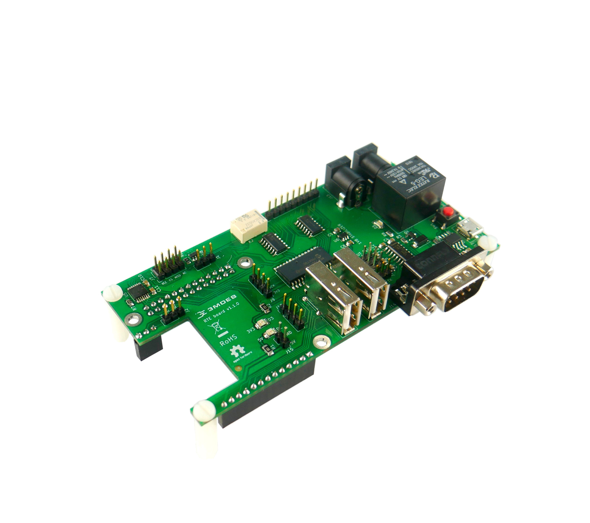

# RTE Introduction

**RTE** is
[certified Open Source Hardware](https://certification.oshwa.org/pl000003.html),
so based on published
[schematics](https://github.com/3mdeb/rte-schematics)
you can build and modify PCB yourself.

**RTE** is a hat designed for Orange Pi Zero board which runs specially crafted
Linux distribution using the Yocto Project. RTE boards are used for controlling
**Device Under Test** fully remotely through the network interface. Most common
applications are:

* debugging tasks,
* flashing firmware,
* controlling GPIOs
* power management for **Device Under Test**.

## Where to buy?

**RTE** can be also bought in our [3mdeb shop](https://shop.3mdeb.com/shop/open-source-hardware/open-source-hardware-3mdeb/rte/).

Full Remote Testing Environment set includes:

| Category     | Description                                                     | Quantity |
|:-------------|:----------------------------------------------------------------|:---------|
| shield       | Remote Testing Environment v1.1.0                               | 1        |
| control unit | Orange Pi Zero 256MB RAM version                                | 1        |
| power supply | MicroUSB 5V/2A                                                  | 1        |
| storage      | SanDisk 16GB microSD card (with preinstalled compatible system) | 1        |
| clip         | Pomona 8-pin SOIC clip for Device Under Test SPI interface      | 1        |
| cables       | standard female-female connection wire 2.56mm raster            | 8        |
| cables       | IDC 8-pin wires for Device Under Test SPI interface             | 1        |
| cables       | DC Jack - DC Jack power cable for Device Under Test             | 1        |
| cables       | RS232 D-Sub 9P/9P cable for serial communication                | 1        |
| jumpers      | jumper for UART OUTPUT SELECT header                            | 2        |
| spacers      | Polyamide M3 spacers and bolts                                  | 4        |

## Why choose 3mdeb RTE?

* high accessibility and flexibility
> _test your device from any location._

* efficiency
> _simplify validation: write one script and run it on unlimited platforms.
  Don’t repeat yourself!_

* independent development
> _open hardware license: modify, upgrade and set it as you like. All blueprints
  are at your disposal._

* instant setup
> _intuitive connection: you do not need to be a certified engineer._

* automation
> _time is money: let the machine do all the work for you_
