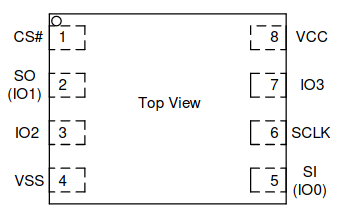

# Flashing guide

This document describes how to set up external flashing on some devices using
RTE.

## NS50/70PU

## Prerequisites

* [Prepared RTE](../v1.1.0/quick-start-guide.md)
* WSON8 probe - can be bought from China on Aliexpress or eBay. 

## Flashing

1. Unscrew the bottom cover of the laptop.
1. Disconnect the battery

    > All power must be removed from the laptop during flashing.

1. Localize the flash chip.
1. Place the WSON probe on the flash chip, and then connect the cables coming
    out of it to the [SPI header](../v1.1.0/specification.md/#spi-header)
    according to the picture and table below.

    

    | RTE SPI header | Flash Chip |
    |:--------------:|:----------:|
    | Vcc            | VCC        |
    | CS             | CS#        |
    | MISO (SO)      | SO (IO1)   |
    | ISP            | IO2        |
    | GND            | VSS        |
    | SCLK           | SCLK       |
    | MOSI (SI)      | SI         |
    | NC             | IO3        |

1. Place script on RTE - TBD
1. Connect and hold the WSON probe to the flash chip.
1. Read the flash chip by executing the following command:

    ```bash
    ./flash.sh read dump.rom
    ```

1. If the reading was successful, the output from the command above should
    contain the phrase `Verifying flash... VERIFIED.`. Only after the entire
    script has been executed, the WSON probe can be disconnected.
1. Connect and hold again the WSON probe to the flash chip.
1. Write the flash chip by executing the following command:

    ```bash
    ./flash.sh write coreboot.rom
    ```

1. If the writing was successful, the output from the command above should
    contain the phrase `Verifying flash... VERIFIED.`. Only after the entire
    script has been executed, the WSON probe can be disconnected.
1. Reconnect the battery and screw in the bottom cover.
1. Power on the device. If the platform is booting up and basic functionalities
    are working, the entire procedure was successful.

TBD - add images